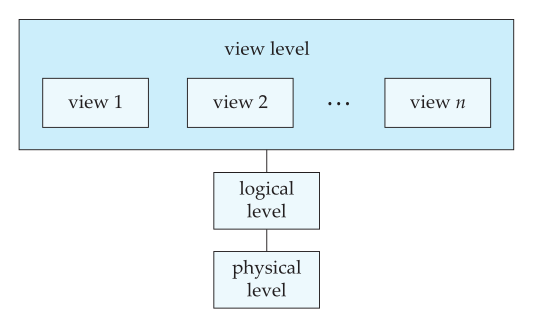
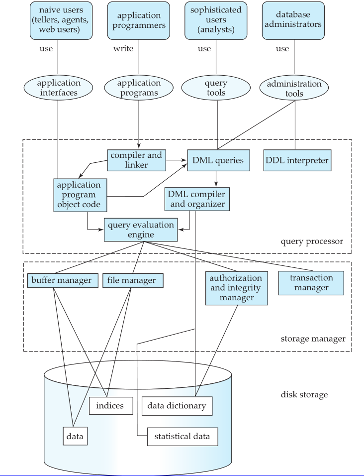

# chapter 1

**数据库管理系统**：由一组互相关联的数据的集合和一组用于访问数据的程序组成。

数据集合即**数据库**；

## 数据视图

数据库系统的的一个主要目的是给用户提供数据的抽象视图；

### 数据抽象

层次：

1. 物理层：数据实际的存储方式
2. 逻辑层：数据库中数据的结构和数据间的关系
3. 视图层：使用户与系统的交互更简单

### 实例和模式

实例（instance）：特定时刻存储的信息的结合

模式（schema）：数据库的总体设计

模式的类型：

* 物理模式（physical schema）：在物理层描述数据库的设计
* 逻辑模式（logical schema）：在逻辑层描述数据可的设计

### 数据模型

数据模型：描述数据、数据联系、数据语义以及一致性约束的概念工具的集合。

四类：

1. 关系模型（relational model）：用表来表示数据和数据之间的关系。每个表有多个列，每列有唯一的列名。
2. 实体-联系模型（entity-relationship model）：E-R数据模型基于：现实世界由一组称为实体的基本对象以及这些对象之间的联系构成。
3. 基于对象的数据模型（object-based data model）：可以看作是E-R模型增加了封装、方法和对象标识等概念的拓展。
4. 半结构化数据模型（Semistructured Data Model）：半结构化数据模型允许相同类型的数据项含有不同的属性集的数据定义，XML被广泛用来表示半结构化数据。

## 数据库语言

两种：

* 数据定义语言
* 数据操作语言

### 数据操作语言

data-manipulation language ( DML )：允许用户访问、操作按照某种数据模型组织起来的数据。

访问类型：

* 检索
* 插入
* 删除
* 修改

两种类型：

* 过程化DML：用户指定需要什么数据和获取方法
* 声明式DML：只需指定需要什么数据

### 数据定义语言

data-definitionlanguage( DDL )：定义数据的结构

一致性约束：

* 域约束：可能取的值的域
* 参照完整性：一个关系中给定属性集上的取值也在另外一关系的某个属性集的取值中出现。
* 断言：数据库时刻需要满足的某个条件
* 授权：对于不同的用户在数据库的不同数据值上允许不同的访问类型。

## 数据存储和查询

数据库系统的功能部件：

* 存储管理器
* 查询处理部件

### 存储管理器

负责数据的存储、检索和跟新。

包含：

* 权限及完整性管理器：检测是否满足完整性约束，并检查试图访问数据的用户的权限。
* 事务管理器：保证即时发生故障，数据库系统也保持在一致的状态，并保证并发事务的执行不发生冲突。
* 文件管理器：管理磁盘存储空间的分配，管理用于表示存储信息的数据结构。
* 缓冲区管理器：负责将数据从磁盘取到内存中，并决定那些数据应该被缓存到内存中。

存储管理器实现了几种数据结构，作为系统物理实现的一部分：

* 数据文件：存储数据库自身
* 数据字典：存储关于数据库结构的元数据，尤其使数据库模式
* 索引：提供对数据项的快速访问

### 查询处理器

组件包括：

* DDL解释器
* DML编译器

## 事务管理

**事务**：数据库应用中完成单一逻辑功能的操作集合。每一个事务是一个既具原子性又具一致性的单元。

组件：

* 恢复管理器：原子性和持久性的保证
* 并发控制管理器：控制并发事物之间的相互影响

## 数据库体系结构

