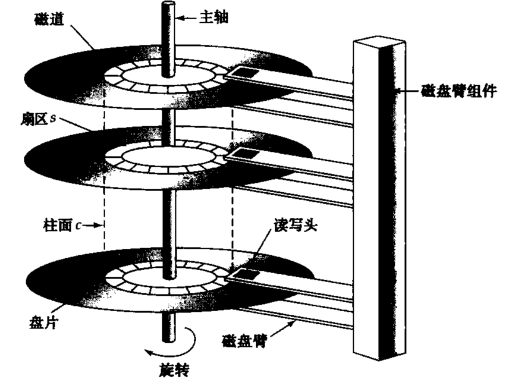

# 存储和文件结构

## 物理存储介质概述

存储设备层次结构：

* 高速缓冲存储器
* 主存储器
* 快闪存储器
* 磁盘
* 光盘
* 磁带

最快的存储介质称为**基本存储**（如高速缓冲存储器、主存储器），基本存储介质下一层为**辅助存储**或**联机存储**（如磁盘），最底层的为**三级存储**或**脱机存储**；

## 磁盘和快闪存储器

磁盘结构：

磁盘的性能指标：

* 访问时间：从发出读写请求到数据开始传输的时间
* 平均寻道时间：平均的磁臂重定位时间
* 旋转等待时间：到达磁道后，等待访问的扇区出现在读写头下所花费的时间
* 数据传输率
* 平均故障时间

### 磁盘块访问的优化

磁盘IO请求的单位是**块**，一个块是一个逻辑单元，包含固定数目的连续扇区，块的大小在512字节到几KB之间；

磁盘的连续请求可归类为两种：

1. 顺序访问
2. 随机访问

优化技术：

* 缓冲：从磁盘读取的块暂时存储在内存缓冲区中
* 预读：当一个磁盘块被访问时，相同磁道的连续块也被预先读入到内存缓冲区中
* 调度：是对许多IO请求，进行调度，减少平均的寻道时间
* 文件组织：可以按照于预期的数据访问方式最接近的方式来组织磁盘上的块
* 非易失性写缓冲区：因为主存储器的内容在发生电源故障时将全部丢失，所以数据库更新的信息必须记录到磁盘上，这样才能在崩溃时得以保存
* 日志磁盘：专门用于写顺序日志的磁盘

### 快闪存储

两种快闪存储器：

1. NOR快闪存储器：允许随机访问闪存中的单个字
2. NAND快闪存储器：读取时需要将整个数据页取到主存储器中

## RAID

独立磁盘冗余阵列RAID：

* 目的：提高性能和可靠性
* 通过冗余提高可靠性：如镜像，即将磁盘进行复制
* 通过并行提高性能：通过在多张磁盘上进行**数据拆分**，有按比特拆分，称为**比特级拆分**，按块拆分，称为**块级拆分**；

RAID级别：

1. RIAD0：块级拆分但是无冗余
2. RAID1：块级拆分、磁盘镜像
3. RAID2：内存风格的纠错码组织结构，使用奇偶校验码；
4. RAID3：位交叉的奇偶校验组织结构
5. RAID4：位交叉的奇偶校验组织结构，使用块级拆分，使用一张独立的磁盘为其他磁盘上对应的块保留一个奇偶校验块
6. RAID5：位交叉的分布奇偶校验位的组织结构
7. RAID6：P+Q冗余方案，存储额外的冗余信息，以对应多张磁盘发生故障的情况

## 文件组织

### 定长记录

一般在文件的开始处，分配一定量的字节作为**文件头**，包含文件的相关信息。

删除时为了记录可用的记录，可用文件头组织成一个**空闲列表**；

### 不定长记录

空位图记录值为空值的属性；

分槽的页结构一般用于在块中组织记录，包含信息：

1. 块头中记录目的个数
2. 块中空闲空间的末尾处
3. 一个由包含记录位置和大小的记录条目组成的数组

## 文件中记录的组织

关系是记录的集合；

记录的组织方式：

* 堆文件组织：一条记录可以放在文件的任何位置，记录无顺序，通常每个关系使用一个单独的文件；
* 顺序文件组织：记录根据“搜索码”的顺序存储
* 散列文件组织：在每条记录的某些属性上计算一个散列函数

通常每个关系的记录用一个单独的文件存储，但是在多表聚簇文件组织中，几个不同关系的记录存储在同一个文件中。

## 数据字典存储

一个关系数据系统需要维护关于关系的数据，如关系的模式等；一般来说，这样的关于数据的数据称为元数据；

关于关系的关系模式和其他元数据存储在称为**数据字典**或**系统目录**的机构中，系统必须存储的信息类型：

* 关系的名字
* 每个关系中属性的名字
* 属性的域和长度
* 在数据库上定义的视图的名字及其定义
* 完整性约束
* 授权用户的名字
* 关于用户的授权和账户信息
* 用于认证用户的密码和或其他信息
* 每个关系中元组的总数

## 数据库缓冲区

目的：减少磁盘访问；

负责缓冲区空间分配的子系统称为**缓冲区管理器**；

### 缓冲区管理器

相关技术：

* 缓冲区替换策略：当缓冲区没有剩余空间时，在新块读入缓冲区之前，必须将一块从缓冲区中移出；多数采用最近最少使用LRU；
* 被钉住的块：为了使数据库系统能够从系统崩溃中恢复，限制一个块写回磁盘的时间是非常必要的；不允许写回磁盘的块，称为被钉住的块；
* 块的强制写出：强制将块写回磁盘，目的是为了在崩溃时保存一些数据；

