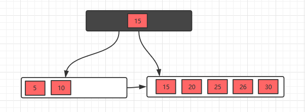
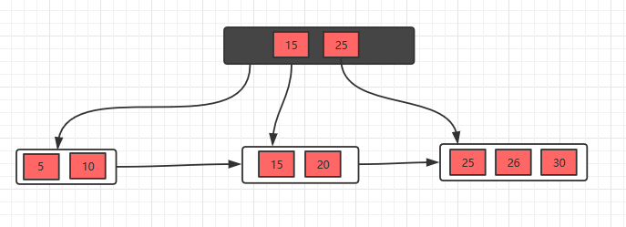
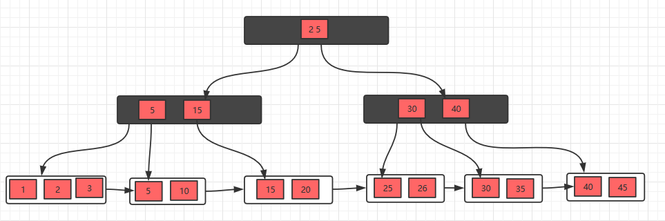
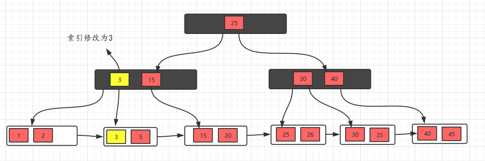
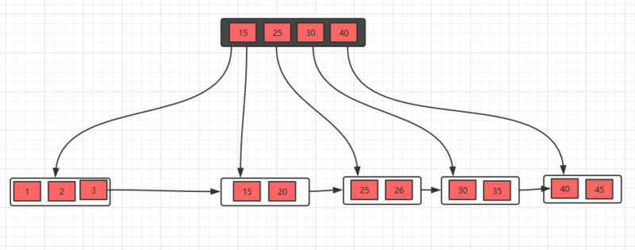

# 索引与散列

## 基本概念

两种基本的索引类型：

* 顺序索引：基于值的索引
* 散列索引：基于将值平均分到若干个散列桶中。一个值所属的散列桶是由一个函数决定的，该函数为**散列函数**；

技术的评估：

* 访问类型：支持的访问类型
* 访问时间：查询一个特定的数据项所用时间
* 插入时间：插入一个新数据项所需时间
* 删除时间：删除一个数据项所需的时间
* 空间开销：索引结构所占额外存储空间

## 顺序索引

为了快速随机访问文件中的记录，可以使用索引结构，每个索引结构与一个特定的搜索码相关联。

* 聚集索引：如果包含记录的文件按照某个搜索码指定的顺序排序的索引
* 非聚集索引：搜索码指定的顺序与文件中记录的物理顺序不同的索引

### 稠密索引和稀疏索引

* 稠密索引：文件中的每个搜索码都有一个索引项
* 稀疏索引：只为搜索码的某些值建立索引项

### 多级索引

嵌套构造索引，以减少索引的时间

### 索引的更新

* 插入：
  * 稠密索引：
    * 如果该搜索码不在索引中，系统就在索引中合适的地方插入具有该搜索码的索引项
    * 否则：
      * 如果索引项存储的是具有相同搜索码值的所有记录的指针，系统就在索引项中增加一个指向新纪录的指针
      * 否则，索引项存储一个仅指向相同搜索码的第一条记录的指针，系统则把待插入的记录放到具有相同搜索码的其他记录之后
  * 稀疏索引：假设索引为每个块保存一个索引项，如果系统新建一个块，则将新块的搜索码插入到索引中；另外，如果这条新插入的记录包含块中的最小搜索码，那么系统就跟新指向该块的索引项；否则，系统就对索引不做任何改动；
* 删除
  * 稠密索引：
    * 如果删除的记录是具有这个特定搜索码的唯一的记录，则系统就从索引中删除相应的索引项；
    * 否则：
      * 如果索引项存储的是具有相同搜索码值的所有记录的指针，系统就从索引项中删除指向被删除记录的指针
      * 否则，索引项存储一个仅指向相同搜索码的第一条记录的指针，且删除的记录是具有该搜索码的第一条记录，系统就跟新索引项，使其指向下一条记录；
  * 稀疏索引：
    * 如果索引不包含具有被删除记录搜索码的索引项，则索引不必做任何修改
    * 否则：
      * 如果被删除的记录是具有该搜索码值的唯一记录，系统用下一个搜索码值的索引记录替换相应的索引记录。如果下一个搜索码已经有一个索引项，则删除而不是替换该索引项
      * 否则，如果该搜索码值的索引记录指向被删除的记录，系统就更新索引项，使其指向具有相同搜索码值的下一条记录

### 辅助索引

辅助索引必须是稠密索引；

辅助索引能够提高使用聚集索引搜索码以外的码的查询性能，但是增加了开销；

### 多码上的索引

一般来说，一个搜索码可以有多个属性，一个包含多个属性的搜索码称为**复合搜索码**；

## B+树索引文件

### B+树的结构

节点的结构：
$$
[P_1|K_1|P_2|...|P_{n-1}|K_{n-1}|P_n]
$$
叶节点的指针$P_i,i=1,2,...,n-1$指向具有搜索码$K_i$的一条文件记录；每个叶节点最多可以有$n-1$个值，最少为$\lceil \frac{n-1}{2} \rceil$个值；各个叶节点中值的范围互不重合，且如果$L_i,L_j(i < j)$，则$L_i$中的搜索码值都小于或等于$L_j$中的所有搜索码值；因此指针$P_n$用于将叶节点按照顺序连接在一起，这种排序可以对文件进行高效的顺序处理；

对于非叶节点来说，最多可以有$n$个值，最少为$\lceil \frac{n}{2} \rceil$，结点的指针数称为该结点的**扇出**；

对于一个包含m个指针的结点，当$i = 2,3,...,m-1$指针$P_i$指向一颗子树，该子树包含的搜索码的值小于$K_i$且大于等于$K_{i-1}$；指针$P_1$指向的子树包含的搜索码的值小于$K_1$，指针$P_m$指向的子树包含的搜索码的值大于等于$K_{m-1}$；

根节点与其他的非叶结点不同，包含的指针数可以小于$\lceil \frac{n}{2} \rceil$，但是除非只有根节点，则根节点必须包含两个指针；

B+树都是平衡的，即根到叶节点的路径长度都一样，因此具有良好的查找、插入和修改的性能；

### B+树的查询

类似于二叉查找树的查找过程，具体略；

若文件中有$N$个搜索码值，则搜索的路径长度不超过$\lceil log_{\lceil n/2\rceil}(N) \rceil$;

### B+树的更新

#### 插入

假设为m阶B+树，当节点元素数量大于m-1的时候，按中间元素分裂成左右两部分，中间元素分裂到父节点当做索引存储，但是，本身中间元素还是分裂右边这一部分的。

#### 删除

如果兄弟节点的数量够（大于一半），则向兄弟借，不够则将当前节点和兄弟节点合并，并且删除父节点中的key；

### 不唯一的搜索码

一个关系拥有多个包含同一搜索码值的记录，则称该搜索码为**不唯一搜索码**；

不唯一搜索码的问题在于记录删除效率方面，解决办法是通过创建包含原始搜索码和其他属性的复合搜索码来保证搜索码唯一；这个额外的属性称为**唯一化属性**；

## B+树拓展

### B+树文件组织

随着文件则增大，增加的索引记录所占百分比和实际记录之间变得不协调，因此通过在文件上使用B+树索引来解决索引查找时性能的下降问题；不仅把B+树作为索引使用，而且把它作为一个文件中的记录的组织者；

### 辅助索引和记录重定位

一些文件组织可能改变记录的位置，即使记录没有更新。因此，所有存储了那些指向重定位过的记录的指针的辅助索引都必须更新，即使记录中的值没有改变，而这个操作代价极大；

解决办法：在哦辅助索引中，不存储指向被索引的记录的指针，而是存储主索引搜索码属性的值。因此由于记录位置改变就不需要改变辅助索引；

### 字符串上的索引

因为字符串是变长的，且可能会非常长；因此会导致节点的扇出降低且增加树的高度；

可以使用前缀压缩技术增加节点的扇出；

### B+树索引的批量加载

将大量项一次插入到索引中称为索引的**批量加载**；

方式：

* 创建一个含有关系索引项的临时文件
* 根据构建好的索引的搜索码来排序文件
* 扫描排序好的文件并且将项插入到索引中

## 静态散列

散列的目的：

* 散列文件组织
* 散列索引组织

### 散列函数

散列函数期望具有的特性：

* 分布是均匀的
* 分布是随机的

### 桶的溢出处理

桶溢出的原因：

* 桶不足：桶数($n_B$)需满足的条件：$n_B > \frac{n_r}{f_r}$，其中$n_r$为存储的记录总数，$f_r$为一个桶中的能存放的记录数；

* 偏斜：某些桶分配到的记录比其他桶多

  原因：

  * 多条记录具有相同的搜索码
  * 所选的散列函数分布不均

为了减少桶溢出的可能性，桶的数目选为$\frac{n_r}{f_r}*(1+d)$，其中$d$为避让因子

桶溢出的解决办法：用溢出桶存储溢出的记录；用过指针连接起来；

这种散列结构为**闭地址**，另外一种方法为**开地址**，数据库采用闭地址实现；

### 散列索引

散列索引将搜索码及其对应的指针组织成散列文件结构；

## SQL中的索引定义

使用`create index <index-name> on <relation-name> (<attribute-list>)`

删除索引`drop index <index-name>`

