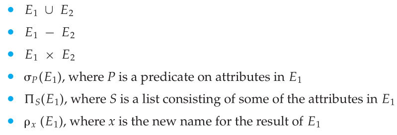
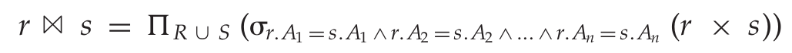

# chapter 6

## 关系代数

### 基本运算

* **选择**：选出满足给定谓词的元组；

  符号：σ，下标为谓词

* **投影**：返回作为参数的关系，但把某些属性排除在外；

  符号：Π，下标为希望结果中出现的属性

* **并运算**：集合相并

  符号：∪

* **集合差运算**：集合的差

  符号：-

*  **笛卡尔积**：集合笛卡尔积

  符号：x

附加的运算：

* 集合交运算

  符号：∩

* 自然连接运算：$ \bowtie $

  形式化定义：

  

* 赋值预算

  符号：←

* 外连接

