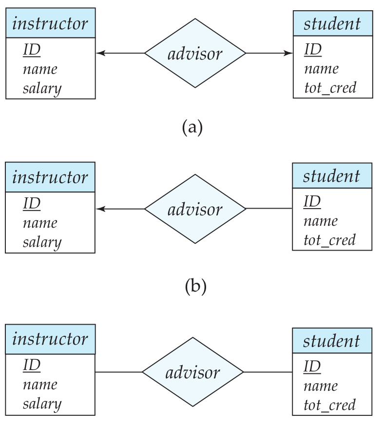
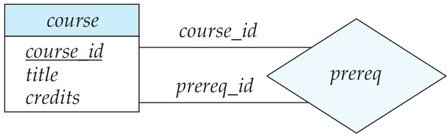
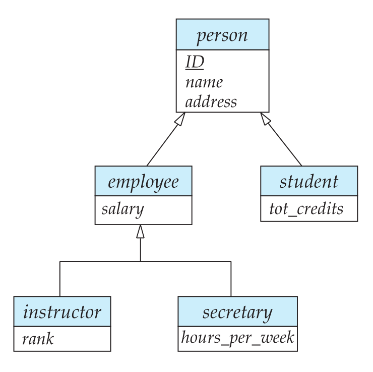

 

# 数据库设计和E-R模型

## 设计过程概述

### 设计阶段

* 数据库的用户需求
* 选择数据模型
* 完善概念模型
* 从抽象数据模型到数据库实现
  * 逻辑设计阶段：将高层概念模型是映射到数据库系统的实现数据模型
  * 物理设计阶段：指明数据库的物理特征，如文件的组织格式和索引结构

## 实体-联系模型

实体-联系模型（entity-relationship，E-R）

### 实体集

实体：现实世界中可区别于所有其他对象的一个“事物”或“对象”。

实体集：相同类型的实体的集合。

### 联系集

联系：多个实体之间的相互关联。

 联系集：相同类型联系的集合。

实体集之间的关联称为参与；E-R模型中一个联系实例表示在所建模的现实世界中命名实体的一个关联；

实体在联系中扮演的功能称为实体的**角色（role）**；

联系也可以具有描述性属性；

### 属性

每个属性都有一个可取值的集合，称为该属性的域（domain）；

实体集的属性是将实体集映射到域的函数；

E-R模型的属性分类：

* 简单（simple）和复合（composite）属性
* 单值和多值属性
* 派生属性：该类的值可以从别的相关属性或实体派生出来。

## 约束

### 映射基数

映射基数：表示一个实体通过一个联系集能关联的实体的个数；

对于实体集A和B之间的二元联系集R来说，映射基数的情况：

* 一对一
* 一对多
* 多对一
* 多对多

### 参与约束

实体集E中的每个实体都参与到联系集R的至少一个联系中，实体集E在联系集R中的参与称为全部的；

实体集E中的每个实体只有参与到联系集R的联系中，实体集E在联系集R中的参与称为部分的；

### 码

设R是一个涉及实体集$E_1, E_2, E_3,...,E_n$的联系集，设主码（$ E_i $)代表构成实体集$E_i$的主码的属性集合。假设所有主码的属性名是互不相同的。联系集主码的构成依赖于同联系集R相关联的属性集合；

如果联系集合R没有属性值相关联，那么属性集合
$$
primary-key(E_1) \cup primary-key(E_2) \cup ...\cup primary-key(E_n)
$$
描述了集合R中的一个联系；

如果联系集R有属性$a_1, a_2, a_3,..., a_n$与之联系，那么属性集合
$$
primary-key(E_1) \cup primary-key(E_2) \cup ...\cup primary-key(E_n) \cup |a_1, a_2, a_3,..., a_n|
$$
构成了联系集的一个超码；

## 从实体集中删除冗余属性

一旦选择好实体和对应的属性，不同实体之间的联系也就建立起来了，这些联系可能会导致不同的实体集的属性冗余，并需要将其从原始的实体集中删除。

例如，假设实体集instructor和department：

* instructor包含属性ID、name、dept_name以及salary，其中ID为主码；
* department包含属性dept_name、building以及budget，其中dept_name为主码；

用关联inst_dept对每个教师都有一个关联的系的情况进行建模；

属性dept_name在两个属性集都出现了，由于它是实体集department的主码，因此在实体集instructor中是冗余的，需要将其移除；

## 实体-联系图

### 基本结构

主要构件：

* 分成两个部分的矩形代表实体集
* 菱形代表联系集
* 未分割的矩形代表联系集的属性，构成的主码用下划线标明
* 线段将实体集连接到联系集
* 虚线将联系集属性联系到联系集
* 双线显示实体在联系集中的参与度
* 双菱形代表连接到弱实体集的标志性联系集

### 映射基数

* 一对一：如下图a
* 一对多：如下图b中的instructor
* 多对一：如下图b中的student
* 多对多：如下图c

对于多对多，其线段上可以有一个最小和最大的映射基数，用$l(min)...h(max)$的形式表示;

### 角色

通过在菱形和矩形之间的连线上进行标注来表示角色；

### 

### 弱实体集

没有足够的属性形成主码的实体集称为**弱实体集**，有主码的实体集称为**强实体集**；

弱实体集必须于另外一个称作标识或属主实体集的实体集关联才能有意义；即弱实体集存在依赖于标识实体集，称标识实体集拥有它所标识的弱实体集；将弱实体集与其标识实体集相关联的联系称为标识性联系；

弱实体集：

* 弱实体集的分辨符以虚下划线标明
* 弱实体集和标识性强实体集的联系集以双菱形表示

## 转换为关系模式

E-R设计转换为关系设计

### 具有简单属性的强实体集的表示

设$E$只是具有简单描述性属性$a_1, a_2, ..., a_n$的强实体集，用具有n个不同属性的模式$E$来表示这个实体集，该模式的关系中的每个元组同实体集中的一个实体对应；

对于从强实体集转换而来的模式，强实体集中的主码就是生成的模式的主码；

### 具有复杂属性的强实体集的表示

多值属性的处理不同于其他属性，E-R图中的属性通常都可以直接映射到相关系模式的属性上，但是多值属性会映射到一个新的关系模式；

派生的属性并不在关系数据模型中显式的表现出来；

对于一个多值属性M，构建关系模式R，该模式包含一个对应M的属性A，以及对应于M所在的实体集或联系集的主码的属性；

### 弱实体集的表示

设A是具有属性$a_1,a_2,...,a_n$的弱实体集，设B是A所依赖的强实体集，设B的主码包括属性$b_1,b_2,...,b_n$。则对应的关系模式A，该模式的每个属性对应以下集合中的一个成员：
$$
|a_1,a_2,...,a_n| \cup |b_1,b_2,...,b_n|
$$
对于从弱实体集转换而来的模式，该模式的主码由其所依赖的强实体集的主码和弱实体集的分辨符组合而成；除了创建主码以外，还要在关系A上建立约束，该约束指明属性$b_1,b_2,...,b_n$参照关系B的主码。外码约束保证表示弱实体的每个元组都有一个表示相应强实体的元组与之对应；

### 联系集的表示

设R是联系集，设$a_1,a_2,...,a_m$表示所有参与R的实体集的主码的并集所构成的属性集合，设R的描述性属性为$b_1,b_2,...,b_n$。则对应的关系模式R，该模式的每个属性对应以下集合的一个属性：
$$
|a_1,a_2,...,a_m| \cup |b_1,b_2,...,b_n|
$$
主码的选择：

* 对于多对多的二元联系，参与实体集的主码属性的并集成为主码；
* 对于一对一的二元联系，任何一个实体集的主码都可以选作主码；
* 对于多对一或一对多的二元联系，联系集中“多”的那一方的实体集的主码构成主码；

## 拓展的E-R特性

### 特化

实体集可能包含一些子集，子集中的实体在某些方面区别于实体集中的其他实体。例如，实体集中的某个实体子集可能具有不该被实体集中所有实体所共享的一些属性。

在E-R图中，特化用特化实体指向另一方实体的空心箭头来表示。称这种关系为**ISA**关系（is a）；

在E-R图中描述特化的方法取决于一个实体集是否可能属于多个特化实体集或者它是否必须属于至多一个特化实体集。前者被称为**重叠特化**，后者称为**不相交特化**；

### 概化

从初始实体集到一系列不同层次的实体子集的细化代表了一个**自顶向下**的设计过程，在这个设计过程中，显式的产生出差别；设计过程也可以是**自底向上**进行，多个实体集根据共同具有的特征综合称一个较高的实体集；

高层和底层的实体集分别称为**超类**和**子类**；

### 属性继承

由特化和概化所产生的高层和底层实体的一个重要特征是**属性继承**，高层实体集的属性被底层实体集继承；

给定的底层实体集只参与到一个ISA联系中，则该实体集只具有**单继承**，若参与到多个ISA联系中，则该实体集具有**多继承**，且产生的结构被称为**格**；

### 

