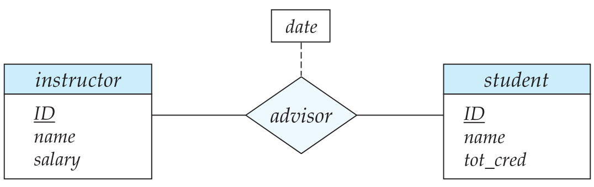

 

# 数据库设计和E-R模型

## 设计过程概述

### 设计阶段

* 数据库的用户需求
* 选择数据模型
* 完善概念模型
* 从抽象数据模型到数据库实现
  * 逻辑设计阶段：将高层概念模型是映射到数据库系统的实现数据模型
  * 物理设计阶段：指明数据库的物理特征，如文件的组织格式和索引结构

## 实体-联系模型

实体-联系模型（entity-relationship，E-R）

### 实体集

实体：现实世界中可区别于所有其他对象的一个“事物”或“对象”。

实体集：相同类型的实体的集合。

### 联系集

联系：多个实体之间的相互关联。

 联系集：相同类型联系的集合。

实体集之间的关联称为参与；E-R模型中一个联系实例表示在所建模的现实世界中命名实体的一个关联；

实体在联系中扮演的功能称为实体的**角色（role）**；

联系也可以具有描述性属性；

### 属性

每个属性都有一个可取值的集合，称为该属性的域（domain）；

实体集的属性是将实体集映射到域的函数；

E-R模型的属性分类：

* 简单（simple）和复合（composite）属性
* 单值和多值属性
* 派生属性：该类的值可以从别的相关属性或实体派生出来。

## 约束

### 映射基数

映射基数：表示一个实体通过一个联系集能关联的实体的个数；

对于实体集A和B之间的二元联系集R来说，映射基数的情况：

* 一对一
* 一对多
* 多对一
* 多对多

### 参与约束

实体集E中的每个实体都参与到联系集R的至少一个联系中，实体集E在联系集R中的参与称为全部的；

实体集E中的每个实体只有参与到联系集R的联系中，实体集E在联系集R中的参与称为部分的；

### 码

设R是一个涉及实体集$E_1, E_2, E_3,...,E_n$的联系集，设主码（$ E_i $)代表构成实体集$E_i$的主码的属性集合。假设所有主码的属性名是互不相同的。联系集主码的构成依赖于同联系集R相关联的属性集合；

如果联系集合R没有属性值相关联，那么属性集合
$$
primary-key(E_1) \cup primary-key(E_2) \cup ...\cup primary-key(E_n)
$$
描述了集合R中的一个联系；

如果联系集R有属性$a_1, a_2, a_3,..., a_n$与之联系，那么属性集合
$$
primary-key(E_1) \cup primary-key(E_2) \cup ...\cup primary-key(E_n) \cup |a_1, a_2, a_3,..., a_n|
$$
构成了联系集的一个超码；

## 从实体集中删除冗余属性

一旦选择好实体和对应的属性，不同实体之间的联系也就建立起来了，这些联系可能会导致不同的实体集的属性冗余，并需要将其从原始的实体集中删除。

例如，假设实体集instructor和department：

* instructor包含属性ID、name、dept_name以及salary，其中ID为主码；
* department包含属性dept_name、building以及budget，其中dept_name为主码；

用关联inst_dept对每个教师都有一个关联的系的情况进行建模；

属性dept_name在两个属性集都出现了，由于它是实体集department的主码，因此在实体集instructor中是冗余的，需要将其移除；

## 实体-联系图

### 基本结构

主要构件：

* 分成两个部分的矩形代表实体集
* 菱形代表联系集
* 未分割的矩形代表联系集的属性，构成的主码用下划线标明
* 线段将实体集连接到联系集
* 虚线将联系集属性联系到联系集
* 双线显示实体在联系集中的参与度
* 双菱形代表连接到弱实体集的标志性联系集

### 映射基数

* 一对一：如下图a
* 一对多：如下图b中的instructor
* 多对一：如下图b中的student
* 多对多：如下图c

对于多对多，其线段上可以有一个最小和最大的映射基数，用$l(min)...h(max)$的形式表示;

### 角色

通过在菱形和矩形之间的连线上进行标注来表示角色；

### 

### 弱实体集

没有足够的属性形成主码的实体集称为**弱实体集**，有主码的实体集称为**强实体集**；

弱实体集必须于另外一个称作标识或属主实体集的实体集关联才能有意义；即弱实体集存在依赖于标识实体集，称标识实体集拥有它所标识的弱实体集；将弱实体集与其标识实体集相关联的联系称为标识性联系；

弱实体集：

* 弱实体集的分辨符以虚下划线标明
* 弱实体集和标识性强实体集的联系集以双菱形表示

