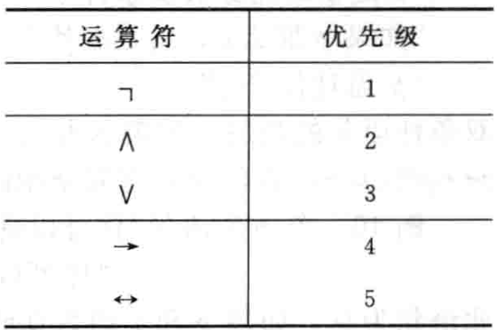
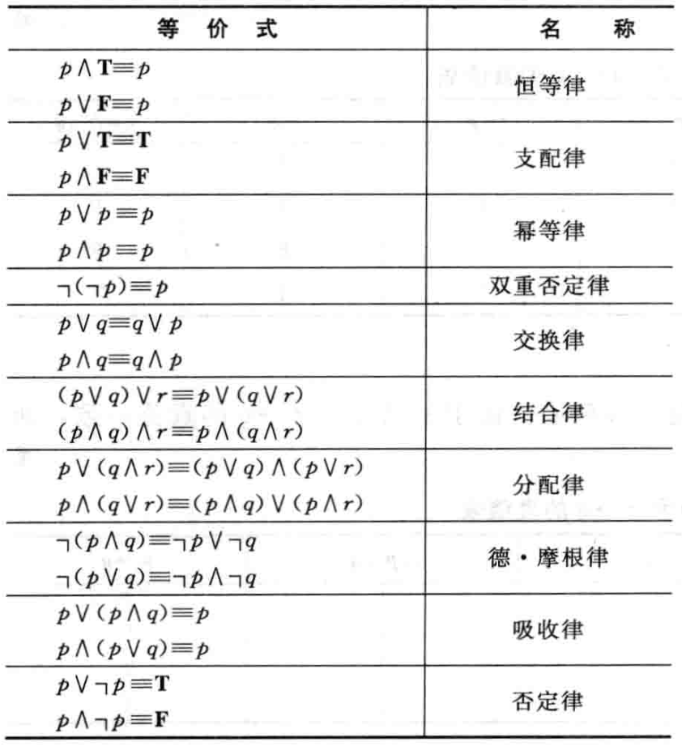

# 基础：逻辑和证明

## 命题逻辑

### 命题

命题是一个称述语句，或真或假，但不能既真又假；

使用字母表示**命题变元**，真值为`T`，假值为`F`；

涉及命题的逻辑领域称为**命题逻辑**；

复合命题是由已知命题用逻辑运算符组合而成；

常见的逻辑运算：

* 否定（not）

* 合取（and）

* 析取（or）

### 条件语句

> 定义：令p和q为命题，条件语句p -> q是命题“如果怕，则q”。当p为真而q为假时，条件语句p -> q为假，否则为真。p为假设，q为结论

条件语句也称为蕴含；

逆命题：`p -> q`的逆命题为  `q -> p`

逆否命题：`p -> q`的逆否命题为  `not q -> not p`

否命题：`p -> q`的否命题为  `not q -> p`

**原命题与逆否命题等价**

双条件语句：`p <--> q`，意为当且仅当；

逻辑运算的优先级：

## 命题等价式

一个真值永远是真的复合命题，称为**永真式**；一个真值永远为假的复合命题，称为**矛盾式**；既不是永真式也不是矛盾式的复合命题为**可能式**；

逻辑等价式：

> 如果 p <-->q是永真式，则复合命题p、q称为是逻辑等价的。

常用等价式：

如果存在一个对其变元的真值赋值使其为真，则称这个复合命题是可满足的，这样的赋值称为解。

## 谓词和量词

一般涉及n个变量的语句可以表示为$P(x_1, x_2, ... , x_n)$，形式为$P(x_1, x_2, ... , x_n)$的语句是命题函数P在n元组的值，P也称为**n元谓词**；

量化表示在何种程度上谓词对于一定范围的个体成立；

全称量词：断言某一性质对于变量在某一特定域内的所有值均为真，这一特定域称为**论域**；

> $P(x)$的全称量化是语句：
>
> ​		“$P(x)$对$x$在其论域的所有值为真；

存在量词：断言有一个个体使得某种性质成立。

> $P(x)$的存在量化是语句：
>
> ​		“论域中存在一个个体$x$满足$P(x)$；

唯一性量词：断言只有唯一一个个体使得某种性质成立。

**量词的优先级高于逻辑运算符！**

## 嵌套量词

嵌套量词的顺序会影响命题的真值；

## 推理规则

有效论证的形式：
$$
\begin{align*}
& p\rightarrow q  \\
& p \\
& \rule[0pt]{2cm}{0.05em} \\ 
& \therefore q
\end{align*}
$$
其他推理规则：

* 假言推理
  $$
  \begin{align*}
  &  p \\
  & p\rightarrow q \\
  & \rule[0pt]{2cm}{0.05em} \\ 
  & \therefore q
  \end{align*}
  $$

* 取据式
  $$
  \begin{align*}
  &  \neg q \\
  & p\rightarrow q \\
  & \rule[0pt]{2cm}{0.05em} \\ 
  & \therefore  \neg p
  \end{align*}
  $$

* 假言三段论
  $$
  \begin{align*}
  &  p\rightarrow q\\
  &  q\rightarrow r\\
  & \rule[0pt]{2cm}{0.05em} \\ 
  & \therefore p\rightarrow r
  \end{align*}
  $$

* 析取三段论
  $$
  \begin{align*}
  &  p\vee q\\
  &  \neg p\\
  & \rule[0pt]{2cm}{0.05em} \\ 
  & \therefore q
  \end{align*}
  $$

* 附加律
  $$
  \begin{align*}
  &  p \\
  & \rule[0pt]{2cm}{0.05em} \\ 
  & \therefore p\vee q
  \end{align*}
  $$

* 化简律
  $$
  \begin{align*}
  &  p\wedge q\\
  & \rule[0pt]{2cm}{0.05em} \\ 
  & \therefore p
  \end{align*}
  $$

* 合取律
  $$
  \begin{align*}
  &  p\\
  &  q\\
  & \rule[0pt]{2cm}{0.05em} \\ 
  & \therefore p \wedge q
  \end{align*}
  $$
  

* 消解律
  $$
  \begin{align*}
  &  p\vee q\\
  &  \neg q\vee r\\
  & \rule[0pt]{2cm}{0.05em} \\ 
  & \therefore q \vee r
  \end{align*}
  $$

谬论：

* 肯定结论的谬误：$(p \rightarrow  q) \wedge q \rightarrow p$
* 否定假设的谬误：$(p \rightarrow q)\wedge \neg p \rightarrow \neg q$

定理：能够被证明式真的语句

证明：建立定理真实性的有效论证

证明定理的方法：

* 直接证明
* 反证法
* 归谬证明法
* 穷举证明法
* 分情况证明法

