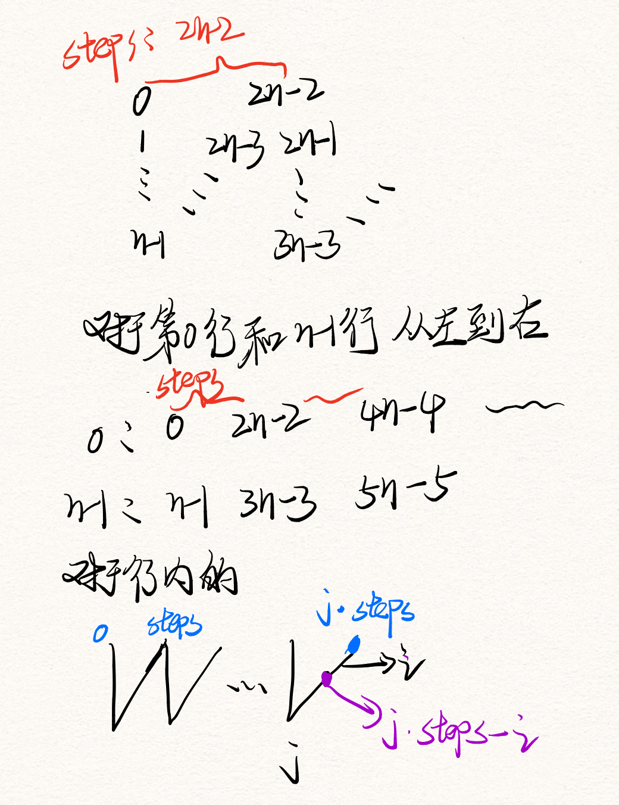

# Leetcode

## [1. 两数之和](https://leetcode-cn.com/problems/two-sum/)

一遍哈希表:

进行一次迭代，检查表中是否存在`target-nums[i]`的元素，如果存在则返回对应解；

```cpp
class Solution {
public:
    vector<int> twoSum(vector<int>& nums, int target) {
        unordered_map<int, int> m; //哈希表，对应<值，下标>
        for(int i = 0; i < nums.size();i ++){ // 遍历
            if(m.count(target-nums[i])) // 检查表中是否存在target-nums[i]
                return {m[target-nums[i]], i};
            else
                m[nums[i]] = i;
        }
        return {0, 0};
    }
};
```

## [2. 两数相加](https://leetcode-cn.com/problems/add-two-numbers/)

类比加法，表头开始模拟逐位相加的过程。因为为逆序存储，直接遍历即可。

增加一个dummyHead可以使头节点为子节点，不需要特殊处理。

```cpp
class Solution
{
public:
    ListNode *addTwoNumbers(ListNode *l1, ListNode *l2)
    {
        ListNode *dummyHead = new ListNode(0); // 虚节点
        ListNode *p = dummyHead;
        int carry = 0; // 进位标志
        while (l1 || l2 || carry != 0)
        {
            int tmp = carry; // 加上进位
            if (l1) // 逐位相加
                tmp += l1->val;
            if (l2)
                tmp += l2->val;
            carry = tmp / 10; // 进位
            tmp = tmp % 10;
            ListNode *node = new ListNode(tmp); // 新建node
            p->next = node; // p指向新的node
            p = node; // p指针移动
            if (l1)
                l1 = l1->next;
            if (l2)
                l2 = l2->next;
        }
        return dummyHead->next;
    }
};
```

## [3. 无重复字符的最长子串](https://leetcode-cn.com/problems/longest-substring-without-repeating-characters/)

思路：用一个数组映射每个字符最后出现的位置，设置一个变量left为当前字符的最后出现的位置，然后遍历整个字符，先将left赋值为当前字符最后出现的位置（默认为-1，便于计算距离），然后更新映射的数组里的值，然后更新无重复字符的子串的长度为max(之前的无重复字符的子串长度，当前位置-当前字符最后出现的位置)；

```cpp
class Solution {
public:
    int lengthOfLongestSubstring(string s) {
        vector<int> m(256,-1); //每个字符与最后出现的位置之间的映射
        int left = -1;// 初始化为-1，便于计算
        int res=0;
        for (int i = 0; i < s.length(); i++)
        {
            left = max(left, m[s[i]]);// left记录当前字符的最后出现的位置
            m[s[i]]=i;//跟新当前字符的最后出现的位置，为下一轮循环准备
            res = max(res, i - left);// 跟新无重复字符的最长子串长度
        }
        return res;
    }
};
```

## [4. 寻找两个有序数组的中位数](https://leetcode-cn.com/problems/median-of-two-sorted-arrays/)

思路：因为为有序数组，且要求的时间复杂度为$O(log(m+n))$，则一般为二分查找；

```cpp
class Solution {
public:
	double findMedianSortedArrays(vector<int>& nums1, vector<int>& nums2) {
		int n = nums1.size();
		int m = nums2.size();

		if (n > m)  
		{
			return findMedianSortedArrays(nums2, nums1);
		}
		int LMax1, LMax2, RMin1, RMin2, c1, c2, lo = 0, hi = 2 * n;  

		while (lo <= hi)   //二分
		{
			c1 = (lo + hi) / 2; 
			c2 = m + n - c1;

			LMax1 = (c1 == 0) ? INT_MIN : nums1[(c1 - 1) / 2];
			RMin1 = (c1 == 2 * n) ? INT_MAX : nums1[c1 / 2];
			LMax2 = (c2 == 0) ? INT_MIN : nums2[(c2 - 1) / 2];
			RMin2 = (c2 == 2 * m) ? INT_MAX : nums2[c2 / 2];

			if (LMax1 > RMin2)
				hi = c1 - 1;
			else if (LMax2 > RMin1)
				lo = c1 + 1;
			else
				break;
		}
		return (max(LMax1, LMax2) + min(RMin1, RMin2)) / 2.0;
	}
};
```

## [5. 最长回文子串](https://leetcode-cn.com/problems/longest-palindromic-substring/)

思路：动态规划

* 令$dp[i][j]$代表字符串从i到j是否为字符串

* 递推关系：
  $$
  dp[i][j]=(dp[i+1][j-1] \&\& S_i == S_j)
  $$

* base case：单个字符为回文串：$dp[i][i] == true$，长度为2的回文字符串：$dp[i][i+1]=(S_i==S_j)$;

```cpp
class Solution {
public:
    string longestPalindrome(string s) {
        int n = s.length();
        if(n == 0 || n == 1)
            return s;
        int start=0;//起始点
        int maxlen=1;//最大的长度
        vector<vector<int>> dp(n,vector<int>(n));
        for (int i = 0; i < n; i++)
        {
            dp[i][i]=1;
            if(i < n-1 && s[i] == s[i+1]){
                dp[i][i+1] = 1;
                maxlen = 2;
                start=i;
            }
        }
        for(int len = 3; len <= n;len++){
            for (int i = 0; i + len -1 < n; i++)
            {
                int j = i + len -1;
                if(s[i] == s[j] && dp[i+1][j-1] ==1){
                    dp[i][j]=1;
                    maxlen=len;
                    start=i;
                }
            }
            
        }
        return s.substr(start, maxlen);
    }
};
```

## [6. Z 字形变换](https://leetcode-cn.com/problems/zigzag-conversion/)

思路：按照行读取，一个小勾为一个单元，规律如下：



```cpp
class Solution
{
public:
    string convert(string s, int numRows)
    {
        if (numRows == 1)
            return s;
        int n = s.size();
        int steps = 2 * (numRows - 1);
        string res;
        for (int i = 0; i < numRows; i++)
        {
            for (int j = 0; j + i < n; j += steps)
            {
                res += s[j + i];
                if (i != 0 && i != numRows - 1 && j + steps - i < n)
                    res += s[j + steps - i];
            }
        }
        return res;
    }
};
```

## [7. 整数反转](https://leetcode-cn.com/problems/reverse-integer/)

思路：注意溢出

```cpp
class Solution {
public:
    int reverse(int x) {
        int res=0;
        while (x != 0)
        {
            int pop = x%10;
            x /= 10;
            if (res > INT_MAX/10 || (res == INT_MAX / 10 && pop > 7))
                return 0;
            if (res < INT_MIN/10 || (res == INT_MIN / 10 && pop < -8)) 
                return 0;
            res = res * 10 + pop;
        }
        return res;
    }
};
```

## [8. 字符串转换整数 (atoi)](https://leetcode-cn.com/problems/string-to-integer-atoi/)

```cpp
class Solution
{
public:
    int myAtoi(string str)
    {
        int flag = 1;
        int res = 0;
        int idx = 0;
        int len = str.length();
        while (str[idx] == ' ')
        {
            idx++;
        }
        if (str[idx] == '-')
            flag = -1;
        if(str[idx] == '-' || str[idx] == '+')
            idx++;
        while (idx < len && isdigit(str[idx]))
        {
            int tmp = str[idx] - '0';
            if (res > INT_MAX / 10 || (res == INT_MAX / 10 && tmp > 7)) { 
                return flag > 0 ? INT_MAX : INT_MIN;
            }
            res = res * 10 + tmp;
            idx++;
        }
        return flag * res;
    }
};
```

## [9. 回文数](https://leetcode-cn.com/problems/palindrome-number/)

思路：

* 小于0的都不是回文数，能被10整除（0除外）都不是回文数，0到9都是回文数
* 计算后半段翻转后的数字，若与前半段相等（数的长度为偶数），或者是前半段的数的10倍（数的长度为奇数），则返回true；

```cpp
class Solution {
public:
    bool isPalindrome(int x) {
        if (x < 0 || (x % 10 == 0 && x != 0))
            return false;
        if( x > 0 && x < 9)
            return true;
        int reversedNum = 0;
        while (x  > reversedNum)
        {
            reversedNum = reversedNum * 10 + x % 10;
            x /= 10;
        }
        return x == reversedNum || x == reversedNum / 10;
    }
};
```

## [10. 正则表达式匹配](https://leetcode-cn.com/problems/regular-expression-matching/)

思路：

* 递归思路
  * 首先当p为空的时候判断s是否为空，为空返回true，否则返回false；
  * 先判断第一位置是否匹配：`(s[0] == p[0]) || (p[0] == '.')`，然后判断第二个位置是否为`*`，因为`*`能匹配零个或多个前面的那一个元素，因此存在两种情况：
    1. `*`前元素被忽略，则递归判断`isMatch(s,p.substr(2))`
    2. 不被忽略，则递归判断`(first_match && isMatch(s.substr(1), p))`
  * 若第二个位置不是`*`则递归判断`first_match && isMatch(s.substr(1), p.substr(1))`;

```cpp
class Solution {
public:
    bool isMatch(string s, string p) {
        if(p.empty())
            return s.empty();
        bool first_match = (s[0] == p[0]) || (p[0] == '.'); 
        if(p.size() >= 2 && p[1] == '*')
        {
            if(s.empty())
                return isMatch(s, p.substr(2));
            else
                return isMatch(s,p.substr(2)) || (first_match && isMatch(s.substr(1), p));
            
        }
        else
        {
            if(s.empty())
                return false;
            else
                return first_match && isMatch(s.substr(1), p.substr(1));
        }
        
    }
};
```

## [11. 盛最多水的容器](https://leetcode-cn.com/problems/container-with-most-water/)

思路：

1. 暴力法：直接找出线段的组合，找出最大值，时间复杂度$O(n^2)$

2. 双指针法：

   * 因为形成的面积总是受限于最短的那个，而且距离越远面积越大，所有设置左右指针，一个放在开始，一个置于末尾，每一步更新最大面积，并且使较短的向较长的线段那端移动；

   ```cpp
   class Solution {
   public:
       int maxArea(vector<int>& height) {
           int maxarea = 0;
           int l = 0, r = height.size() -1;
           while (l < r)
           {
               maxarea = max(maxarea , min(height[l], height[r]) * (r - l));
               if (height[l] < height[r])
                   l++;
               else
                   r--;
           }
           return maxarea;
       }
   };
   ```

## [12. 整数转罗马数字](https://leetcode-cn.com/problems/integer-to-roman/)

思路：

* 直接映射

  ```cpp
  class Solution {
  public:
      const vector<int> val = {1000, 900, 500, 400, 100, 90, 50, 40, 10, 9, 5, 4, 1};
      const vector<string> dic = {"M", "CM", "D", "CD", "C", "XC", "L", "XL", "X", "IX", "V", "IV", "I"};
  
      string intToRoman(int num) {
          string res;
          int i = 0;
          while (num > 0 && i < dic.size())
          {
              if(num >= val[i])
              {
                  res += dic[i];
                  num -= val[i];
              }
              else
                  i++;
          }
          return res;
      }
  };
  ```

## [13. 罗马数字转整数](https://leetcode-cn.com/problems/roman-to-integer/)

```cpp
class Solution {
public:
    unordered_map<string, int> mp = {{"I", 1}, {"IV", 4}, {"V", 5}, {"IX", 9}, {"X", 10}, {"XL", 40}, {"L", 50}, {"XC", 90}, {"C", 100}, {"CD", 400}, {"D", 500}, {"CM", 900}, {"M", 1000}};
    int romanToInt(string s) {
        int res = 0;
        for (int i = 0; i < s.size(); i++)
        {
            if(i < s.size() - 1 && mp.count(s.substr(i,2)))
            {
                res += mp[s.substr(i,2)];
                i++;
            }
            else
            {
                res += mp[s.substr(i,1)];
            }
        }
        return res;
    }
};
```

## [14. 最长公共前缀](https://leetcode-cn.com/problems/longest-common-prefix/)

思路：

* 因为为最长公共前缀，则一定存在于第一个字符内，因此设第一个字符为prefix
* 然后遍历整个字符数组，若当前字符找不到prefix，则prefix循环减少一位，直到当前字符找到prefix；

```cpp
class Solution
{
public:
    string longestCommonPrefix(vector<string> &strs)
    {
        if (strs.size() == 0)
            return "";
        string prefix = strs[0];
        for (int i = 1; i < strs.size(); i++)
        {
            while (strs[i].find(prefix) != 0)
            {
                if (prefix == "")
                    return "";
                prefix = prefix.substr(0, prefix.length() - 1);
            }
        }
        return prefix;
    }
};
```

## [15. 三数之和](https://leetcode-cn.com/problems/3sum/)

思路：

* 将数组排序（方便后面用二分查找）
* 将问题转换为查找$nums[i] + nums[j] = - nums[k]$的问题，按照二数之和完成即可；注意去重；

```cpp
class Solution
{
public:
    vector<vector<int>> threeSum(vector<int> &nums)
    {
        vector<vector<int>> res;
        if (nums.size() < 3)
            return res;
        sort(nums.begin(), nums.end());
        for (vector<int>::iterator it = nums.begin(); it != nums.end() - 2;)
        {
            int tmp = *it;
            if (tmp > 0)
                break;
            int target = 0 - tmp;
            vector<int>::iterator left = it + 1;
            vector<int>::iterator right = nums.end() - 1;
            while (left < right)
            {
                if (*right < 0)
                    break;
                if (*left + *right < target)
                {
                    int v = *left;
                    while (left != right && *left == v)
                        left++;
                }
                else if (*left + *right > target)
                {
                    int v = *right;
                    while (left != right && *right == v)
                        right--;
                }
                else
                {
                    vector<int> tmp_res{tmp, *left, *right};
                    res.push_back(tmp_res);
                    int v = *left;
                    while (left != right && *left == v)
                        left++;
                    v = *right;
                    while (left != right && *right == v)
                        right--;
                }
            }
            while (it != nums.end() - 2 && *it == tmp)
                it++;
        }
        return res;
    }
};
```

## [16. 最接近的三数之和](https://leetcode-cn.com/problems/3sum-closest/)

思路：

* 与三数之和一样先排序，然后利用二分找最接近的

  ```cpp
  class Solution
  {
  public:
      int threeSumClosest(vector<int> &nums, int target)
      {
          if (nums.size() < 3)
              return 0;
          sort(nums.begin(), nums.end());
          int delta = 0x7fffffff, ans, sum;
          for (int i = 0; i < nums.size() - 2; i++)
          {
              int low = i + 1, high = nums.size() - 1;
              while (low < high)
              {
                  sum = nums[i] + nums[low] + nums[high];
                  if (sum == target)
                      return sum;
                  if (sum < target)
                  {
                      if (target - sum < delta)
                      {
                          delta = target - sum;
                          ans = sum;
                      }
                      low++;
                  }
                  if(sum > target)
                  {
                      if(sum - target < delta)
                      {
                          delta = sum -target;
                          ans = sum;
                      }
                      high--;
                  }
              }
          }
          return ans;
      }
  };
  ```

## [17. 电话号码的字母组合](https://leetcode-cn.com/problems/letter-combinations-of-a-phone-number/)

思路：

* 利用隐射将键盘与对应的数字对应

* 利用回溯法获取组合方式

  ```cpp
  class Solution
  {
  public:
      string state;
      vector<string> ans;
      string mp[8] = {"abc", "def", "ghi", "jkl", "mno", "pqrs", "tuv", "wxyz"};
      void dfs(int pos, const string &digits)
      {
          if (pos == state.size())
          {
              ans.push_back(state);
              return;
          }
          int idx = digits[pos] - '2';
          for (auto c : mp[idx])
          {
              state[pos] = c;
              dfs(pos + 1, digits);
          }
      }
      vector<string> letterCombinations(string digits)
      {
          if (digits.empty())
          {
              return {};
          }
          state.resize(digits.size());
          dfs(0, digits);
          return ans;
      }
  };
  ```

## [18. 四数之和](https://leetcode-cn.com/problems/4sum/)

思路：

* 利用二重循环将四数之和降为二数之和，注意去重；

```cpp
class Solution
{
public:
    vector<vector<int>> fourSum(vector<int> &nums, int target)
    {
        sort(nums.begin(), nums.end());
        vector<vector<int>> result;
        int size = nums.size();
        for (int a = 0; a < size - 3; ++a)
        {
            if (a > 0 && nums[a] == nums[a - 1])
                continue;
            for (int b = a + 1; b < size - 2; ++b) 
            {
                if (b > a + 1 && nums[b] == nums[b - 1])
                    continue;
                int c = b + 1, d = size - 1;
                while (c < d)
                {
                    int sum = nums[a] + nums[b] + nums[c] + nums[d];
                    if (sum < target)
                        while (c < d && nums[c] == nums[++c]);
                    else if (sum > target)
                        while (c < d && nums[d] == nums[--d]);
                    else
                    {
                        result.push_back(vector<int>{nums[a], nums[b], nums[c], nums[d]});
                        while (c < d && nums[c] == nums[++c]);
                        while (c < d && nums[d] == nums[--d]);
                    }
                }
            }
        }
        return result;
    }
};
```

## [19. 删除链表的倒数第N个节点](https://leetcode-cn.com/problems/remove-nth-node-from-end-of-list/)

思路：

* 倒数第N个节点可以先让一个快指针走N步，然后指向头部的慢指针与快指针同步移动，直到快指针指向null；此时慢指针指向倒数第N个节点，然后删除即可；

  ```cpp
  class Solution
  {
  public:
      ListNode *removeNthFromEnd(ListNode *head, int n)
      {
          ListNode *dummyHead = new ListNode(0);// 便于处理
          dummyHead->next = head;
          ListNode *p = dummyHead;// 快指针
          ListNode *q = dummyHead;// 慢指针
          for (int i = 0; i < n + 1; i++)
          {
              p = p->next;
          }
          while (p != nullptr)
          {
              p = p->next;
              q = q->next;
          }
          ListNode *delNode = q->next;
          q->next = delNode->next;
          delete delNode;
          ListNode *res = dummyHead->next;
          delete dummyHead;
          return res;
      }
  };
  ```

## [20. 有效的括号](https://leetcode-cn.com/problems/valid-parentheses/)

思路：

* 利用栈，遇到开括号则入栈，闭括号则出栈，看是否匹配，若不能出栈则字符串无效；
* 当遍历完后，判断栈是否为空；

```cpp
class Solution
{
public:
    bool isValid(string s)
    {
        if (s.empty())
            return true;
        if (s.length() % 2 != 0)
            return false;
        stack<char> st;
        map<char, char> mp;
        mp.insert(map<char, char>::value_type(')', '('));
        mp.insert(map<char, char>::value_type(']', '['));
        mp.insert(map<char, char>::value_type('}', '{'));
        for (int i = 0; i < s.length(); i++)
        {
            if (s[i] == '(' || s[i] == '[' || s[i] == '{')
                st.push(s[i]);
            else
            {
                if (st.empty())
                    return false;
                if (mp[s[i]] == st.top())
                {
                    st.pop();
                }
                else
                {
                    return false;
                }
            }
        }
        return st.empty();
    }
};
```

