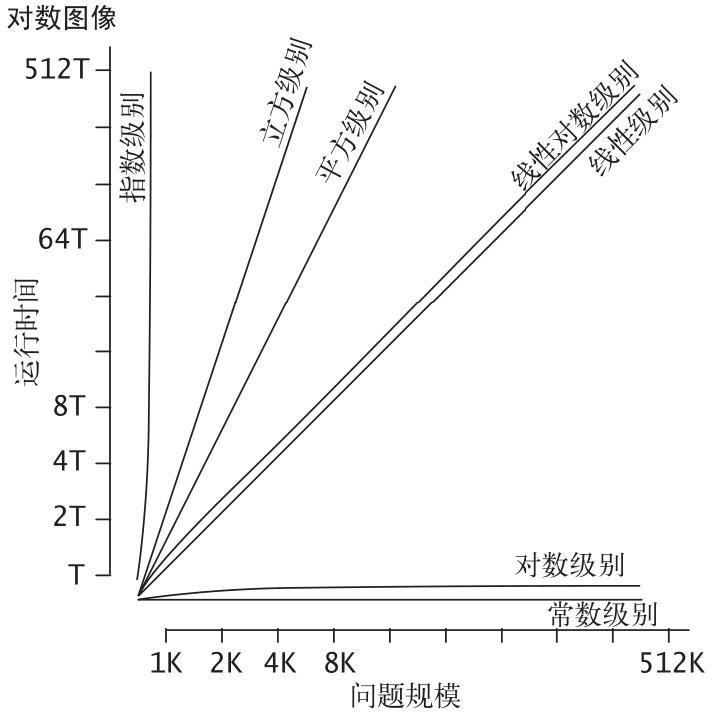

# 基础

## 基础编程模型

一段 Java 程序（类）或者是一个静态方法（函数）库，或者定义了一个数据类型。要创建静态
方法库和定义数据类型，会用到下面七种语法，它们是Java语言的基础，也是大多数现代语言所共有的。

* 原始数据类型：它们在计算机程序中精确地定义整数、浮点数和布尔值等。它们的定义包括
  取值范围和能够对相应的值进行的操作，它们能够被组合为类似于数学公式定义的表达式。
* 语句：语句通过创建变量并对其赋值、控制运行流程或者引发副作用来进行计算。我们会使
  用六种语句：声明、赋值、条件、循环、调用和返回。
*  数组：数组是多个同种数据类型的值的集合。
* 静态方法：静态方法可以封装并重用代码，使我们可以用独立的模块开发程序。
* 字符串：字符串是一连串的字符，Java 内置了对它们的一些操作。
* 标准输入 / 输出：标准输入输出是程序与外界联系的桥梁。
* 数据抽象：数据抽象封装和重用代码，使我们可以定义非原始数据类型，进而支持面向对象编程。

## 数据抽象

抽象数据类型（ADT）是一种能够对使用者隐藏数据表示的数据类型。

## 背包、队列和栈

### 背包

```java
public class Bag<Item> implements Iterable<Item>
	Bag() 创建一个空背包
	void add(Item item) 添加一个元素
	boolean isEmpty() 背包是否为空
	int size() 背包中的元素数量
```

背包是一种不支持从中删除元素的集合数据类型——它的目的就是帮助用例收集元素并迭代遍历所有收集到的元素.

### 队列

```java
public class Queue<Item> implements Iterable<Item>
	Queue() 创建空队列
	void enqueue(Item item) 添加一个元素
	Item dequeue() 删除最早添加的元素
	boolean isEmpty() 队列是否为空
	int size() 队列中的元素数量
```

先进先出队列（或简称队列）是一种基于先进先出（FIFO）策略的集合类型

### 栈

```java
public class Stack<Item> implements Iterable<Item>
	Stack() 创建一个空栈
	void push(Item item) 添加一个元素
	Item pop() 删除最近添加的元素
	boolean isEmpty() 栈是否为空
	int size() 栈中的元素数量
```

下压栈（或简称栈）是一种基于后进先出（LIFO）策略的集合类型

栈的最典型应用：算术表达式求值

```java
public class Evaluate {
    public static void main(String[] args) {
        Stack<String> ops = new Stack<String>();
        Stack<Double> vals = new Stack<Double>();
        while (!StdIn.isEmpty()) { // 读取字符，如果是运算符则压入栈
            String s = StdIn.readString();
            if (s.equals("(")) ;
            else if (s.equals("+")) ops.push(s);
            else if (s.equals("-")) ops.push(s);
            else if (s.equals("*")) ops.push(s);
            else if (s.equals("/")) ops.push(s);
            else if (s.equals("sqrt")) ops.push(s);
            else if (s.equals(")")) { // 如果字符为 ")"，弹出运算符和操作数，计算结果并压入栈
                String op = ops.pop();
                double v = vals.pop();
                if (op.equals("+")) v = vals.pop() + v;
                else if (op.equals("-")) v = vals.pop() - v;
                else if (op.equals("*")) v = vals.pop() * v;
                else if (op.equals("/")) v = vals.pop() / v;
                else if (op.equals("sqrt")) v = Math.sqrt(v);
                vals.push(v);
            } // 如果字符既非运算符也不是括号，将它作为 double 值压入栈
            else vals.push(Double.parseDouble(s));
        }
        StdOut.println(vals.pop());
    }
}
```

## 算法分析

大O：

$O(1)<O(log\ n)<O(n)<O(n^2)<O(n^3)<O(e^n)$



## union-find 算法

UF用于计算网络中的连通性；

相连的性质：

*  自反性： p 和 p 是相连的；
* 对称性：如果 p 和 q 是相连的，那么 q 和 p 也是相连的；
* 传递性：如果 p 和 q 是相连的且 q 和 r 是相连的，那么 p 和 r 也是相连的。

union-find 算法的 API

```java
public class UF
    UF(int N) 以整数标识（0 到 N-1）初始化 N 个触点
    void union(int p, int q) 在 p 和 q 之间添加一条连接
    int find(int p) p （0 到 N-1）所在的分量的标识符
    boolean connected(int p, int q) 如果 p 和 q 存在于同一个分量中则返回 true
    int count() 连通分量的数量
```

实现：

```java

```

