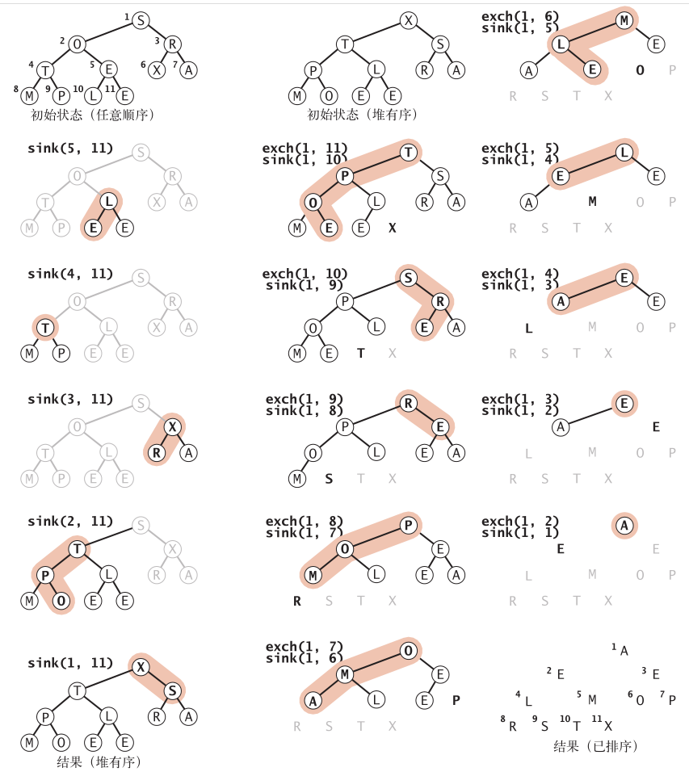

# 排序

排序就是将一组对象按照某种逻辑顺序重新排列的过程。

## 排序算法类模板

```java
public class Example
{
	public static void sort(Comparable[] a)
    { /* 请见算法2.1、算法2.2、算法2.3、算法2.4、算法2.5或算法2.7*/ }
    private static boolean less(Comparable v, Comparable w)
    { return v.compareTo(w) < 0; }
    private static void exch(Comparable[] a, int i, int j)
    { Comparable t = a[i]; a[i] = a[j]; a[j] = t; }
    private static void show(Comparable[] a)
    { // 在单行中打印数组
        for (int i = 0; i < a.length; i++)
            StdOut.print(a[i] + " ");
        StdOut.println();
    }
    public static boolean isSorted(Comparable[] a)
    { // 测试数组元素是否有序
        for (int i = 1; i < a.length; i++)
            if (less(a[i], a[i-1])) return false;
        return true;
    }
}
```


## 初级排序算法

### 选择排序

步骤：

1. 找到最小的数
2. 与数组的第一个元素交换位置
3. 在剩下的数中找最小的数，与数组的第二个元素交换位置，以此类推

```java
public class Selection
{
    public static void sort(Comparable[] a)
    { // 将a[]按升序排列
        int N = a.length; // 数组长度
        for (int i = 0; i < N; i++)
        { // 将a[i]和a[i+1..N]中最小的元素交换
            int min = i; // 最小元素的索引
            for (int j = i+1; j < N; j++)
                if (less(a[j], a[min])) min = j;
            exch(a, i, min);
        }
    }// less()、exch()、isSorted()和main()方法见“排序算法类模板”
}
```

算法时间复杂度：$O(n^2)$

空间复杂度：$O(1)$

### 插入排序

步骤：

* 第一个元素默认排好序
* 将当前的元素插入适当的位置

```java
public class Insertion
{
    public static void sort(Comparable[] a)
	{ // 将a[]按升序排列
		int N = a.length;
		for (int i = 1; i < N; i++)
		{ // 将 a[i] 插入到 a[i-1]、a[i-2]、a[i-3]...之中
			for (int j = i; j > 0 && less(a[j], a[j-1]); j--)
                exch(a, j, j-1);
        }
    }
}
```

算法时间复杂度：$O(n^2)$(最好为$O(n)$)

空间复杂度：$O(1)$

### 希尔排序

希尔排序是基于插入排序的快速的排序算法

希尔排序的思想是使数组中任意间隔为 h 的元素都是有序的。这样的数组被称为 h 有序数组。换句话说，一个 h 有序数组就是 h 个互相独立的有序数组编织在一起组成的一个数组。在进行排序时，如果 h 很大，我们就能将元素移动到很远的地方，为实现更小的 h 有序创造方便。用这种方式，对于任意以 1 结尾的 h 序列，我们都能够将数组排序。这就是希尔排序。

希尔排序更高效的原因是它权衡了子数组的规模和有序性。

```java
public class Shell
{
    public static void sort(Comparable[] a)
    { // 将a[]按升序排列
        int N = a.length;
        int h = 1;
        while (h < N/3) h = 3*h + 1; // 1, 4, 13, 40, 121, 364, 1093, ...
        while (h >= 1)
        { // 将数组变为h有序
            for (int i = h; i < N; i++)
            { // 将a[i]插入到a[i-h], a[i-2*h], a[i-3*h]... 之中
                for (int j = i; j >= h && less(a[j], a[j-h]); j -= h)
                    exch(a, j, j-h);
            }
            h = h/3;
        }
    }// less()、exch()、isSorted()和main()方法见“排序算法类模板”
}
```

算法时间复杂度：平均：$O(n^{1.5})$，最好：$O(n\ log\ n)$，最坏：$O(n^2)$

空间复杂度：$O(1)$

## 归并排序

归并排序基于归并这个操作，原地归并的抽象方法：

```java
public static void merge(Comparable[] a, int lo, int mid, int hi)
{ // 将a[lo..mid] 和 a[mid+1..hi] 归并
    int i = lo, j = mid+1;
    for (int k = lo; k <= hi; k++) // 将a[lo..hi]复制到aux[lo..hi]
        aux[k] = a[k];
    for (int k = lo; k <= hi; k++) // 归并回到a[lo..hi]
        if (i > mid) a[k] = aux[j++];
    else if (j > hi ) a[k] = aux[i++];
    else if (less(aux[j], aux[i])) a[k] = aux[j++];
    else a[k] = aux[i++];
}
```

### 自顶向下的归并排序

```java
public class Merge{
    private static Comparable[] aux; // 归并所需的辅助数组
    public static void sort(Comparable[] a)
    {
        aux = new Comparable[a.length]; // 一次性分配空间
        sort(a, 0, a.length - 1);
    }
    private static void sort(Comparable[] a, int lo, int hi)
    { // 将数组a[lo..hi]排序
        if (hi <= lo) return;
        int mid = lo + (hi - lo)/2;
        sort(a, lo, mid); // 将左半边排序
        sort(a, mid+1, hi); // 将右半边排序
        merge(a, lo, mid, hi); // 归并结果
    }
}
```

归并排序的算法复杂度为$O(nlog\ n)$。

小规模的数据使用插入排序较快，因为小规模数据的递归调用影响时间。较大数据采用归并排序。

### 自底向上的归并排序

```java
public class MergeBU{
    private static Comparable[] aux; // 归并所需的辅助数组
    public static void sort(Comparable[] a){ // 进行lgN次两两归并
        int N = a.length;
        aux = new Comparable[N];
        for (int sz = 1; sz < N; sz = sz+sz) // sz子数组大小
            for (int lo = 0; lo < N-sz; lo += sz+sz) // lo:子数组索引
                merge(a, lo, lo+sz-1, Math.min(lo+sz+sz-1, N-1));
    }
}
```

## 快速排序

快速排序是一种分治的排序算法。它将一个数组分成两个子数组，将两部分独立地排序。快速排序和归并排序是互补的：归并排序将数组分成两个子数组分别排序，并将有序的子数组归并以将整个数组排序；而快速排序将数组排序的方式则是当两个子数组都有序时整个数组也就自然有序了。在第一种情况中，递归调用发生在处理整个数组之前；在第二种情况中，递归调用发生在处理整个数组之后。在归并排序中，一个数组被等分为两半；在快速排序中，切分（partition）的位置取决于数组的内容。

```java
public class Quick
{
    public static void sort(Comparable[] a){
        StdRandom.shuffle(a); // 消除对输入的依赖
        sort(a, 0, a.length - 1);
    }
    private static void sort(Comparable[] a, int lo, int hi){
        if (hi <= lo) return;
        int j = partition(a, lo, hi); // 切分
        sort(a, lo, j-1); // 将左半部分a[lo .. j-1]排序
        sort(a, j+1, hi); // 将右半部分a[j+1 .. hi]排序
    }
}
```

切分的一般策略是先随意地取 a[lo] 作为切分元素，即那个将会被排定的元素，然后从数组的左端开始向右扫描直到找到一个大于等于它的元素，再从数组的右端开始向左扫描直到找到一个小于等于它的元素。这两个元素显然是没有排定的，因此交换它们的位置。如此继续，就可以保证左指针i 的左侧元素都不大于切分元素，右指针 j 的右侧元素都不小于切分元素。当两个指针相遇时，只需要将切分元素 a[lo] 和左子数组最右侧的元素（ a[j] ）交换然后返回 j 即可。

```java
private static int partition(Comparable[] a, int lo, int hi)
{ // 将数组切分为a[lo..i-1], a[i], a[i+1..hi]
    int i = lo, j = hi+1; // 左右扫描指针
    Comparable v = a[lo]; // 切分元素
    while (true){ // 扫描左右，检查扫描是否结束并交换元素
        while (less(a[++i], v)) if (i == hi) break;
        while (less(v, a[--j])) if (j == lo) break;
        if (i >= j) break;
        exch(a, i, j);
    }
    exch(a, lo, j); // 将v = a[j]放入正确的位置
    return j; // a[lo..j-1] <= a[j] <= a[j+1..hi] 达成
}
```

### 算法改进

同样对于小数据来说插入排序更快。因此，在排序小数组时应该切换到插入排序，将`if (hi <= lo) return;`改成`if (hi <= lo + M) { Insertion.sort(a, lo, hi); return; }`

#### 三向切分的快速排序

```java
public class Quick3way
{
    private static void sort(Comparable[] a, int lo, int hi){
        if (hi <= lo) return;
        int lt = lo, i = lo+1, gt = hi;
        Comparable v = a[lo];
        while (i <= gt){
            int cmp = a[i].compareTo(v);
            if (cmp < 0) exch(a, lt++, i++);
            else if (cmp > 0) exch(a, i, gt--);
            else i++;
        } // 现在 a[lo..lt-1] < v = a[lt..gt] < a[gt+1..hi]成立
        sort(a, lo, lt - 1);
        sort(a, gt + 1, hi);
    }
}
```

## 优先队列

优先队列是一种抽象数据类型，支持两种操作：删除最大元素（最小元素）和插入元素。

### 泛型优先队列的 API

| 方法               | 描述                              |
| ------------------ | --------------------------------- |
| MaxPQ()            | 创建一个优先队列                  |
| MaxPQ(int max)     | 创建一个初始容量为 max 的优先队列 |
| MaxPQ(Key[] a)     | 用 a[] 中的元素创建一个优先队列   |
| void insert(Key v) | 向优先队列中插入一个元素          |
| Key max()          | 返回最大元素                      |
| Key delMax()       | 删除并返回最大元素                |
| boolean isEmpty()  | 返回队列是否为空                  |
| int size()         | 返回优先队列中的元素个数          |

### 堆的定义

当一棵二叉树的每个结点都大于等于它的两个子结点时，它被称为堆有序。

二叉堆是一组能够用堆有序的完全二叉树排序的元素，并在数组中按照层级储存（不使用数组的第一个位置）。

一棵大小为 N 的完全二叉树的高度为$\lfloor lg\ N \rfloor$。

### 堆的算法

堆实现的比较和交换方法：

```java
private boolean less(int i, int j){return pq[i].compareTo(pq[j]) < 0; }
private void exch(int i, int j){ Key t = pq[i]; pq[i] = pq[j]; pq[j] = t; }
```

如果堆的有序状态因为某个结点变得比它的父结点更大而被打破，那么我们就需要通过交换它和它的
父结点来修复堆。称之为**上浮**；

```java
private void swim(int k){
    while (k > 1 && less(k/2, k)){
        exch(k/2, k);
        k = k/2;
    }
}
```

如果堆的有序状态因为某个结点变得比它的两个子结点或是其中之一更小了而被打破了，那么可以通过将它和它的两个子结点中的较大者交换来恢复堆。

```java
private void sink(int k){
    while (2*k <= N){
        int j = 2*k;
        if (j < N && less(j, j+1)) j++;
        if (!less(k, j)) break;
        exch(k, j);
        k = j;
    }
}
```

sink() 和 swim() 方法是高效实现优先队列 API 的基础，原因如下:

* 插入元素。将新元素加到数组末尾，增加堆的大小并让这个新元素上浮到合适的位置
* 删除最大元素。从数组顶端删去最大的元素并将数组的最后一个元素放到顶端，减小堆的大小并让这个元素下沉到合适的位置。

```java
public class MaxPQ<Key extends Comparable<Key>>
{
    private Key[] pq; // 基于堆的完全二叉树
    private int N = 0; // 存储于pq[1..N]中，pq[0]没有使用
    public MaxPQ(int maxN){
        pq = (Key[]) new Comparable[maxN+1]; 
    }
    public boolean isEmpty()	{ return N == 0; }
    public int size()	{ return N; }
    public void insert(Key v){
        pq[++N] = v;
        swim(N);
    }
    public Key delMax(){
        Key max = pq[1]; // 从根结点得到最大元素
        exch(1, N--); // 将其和最后一个结点交换
        pq[N+1] = null; // 防止对象游离
        sink(1); // 恢复堆的有序性
        return max;
    }
    private boolean less(int i, int j){};
    private void exch(int i, int j){};
    private void swim(int k){};
    private void sink(int k){};
}
```

### 堆排序

堆排序可以分为两个阶段。在堆的构造阶段中，将原始数组重新组织安排进一个堆中；然后在下沉排序阶段，我们从堆中按递减顺序取出所有元素并得到排序结果。

```java
public static void sort(Comparable[] a){
    int N = a.length;
    for (int k = N/2; k >= 1;k--)
        sink(a, k, N);
    while (N > 1){
        exch(a, 1, N--);
        sink(a, 1, N);
    }
}
```

