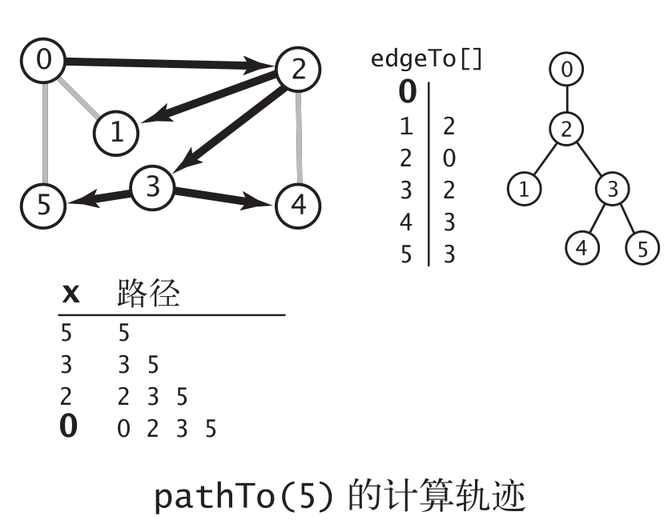
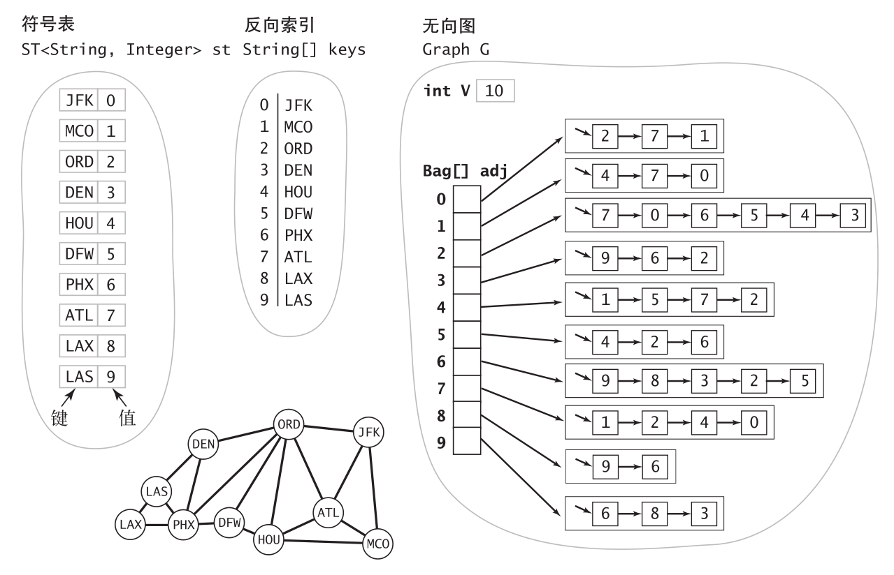

# 图

## 无向图

图：由一组顶点和一组能够将两个顶点相连的边组成的。

边（edge）：两个顶点（vertex）之间的连接。

特殊的图：

* 自环：一条连接一个顶点和其自身的边。
* 平行边：连接同一对顶点的两条边。

路径是由边顺序连接的一系列顶点。简单路径是一条没有重复顶点的路径。环是一条至少含有一条边且起点和终点相同的路径。简单环是一条（除了起点和终点必须相同之外）不含有重复顶点和边的环。路径或者环的长度为其中所包含的边数。

如果从任意一个顶点都存在一条路径到达另一个任意顶点，我们称这幅图是连通图。一幅非连通的图由若干连通的部分组成，它们都是其极大连通子图。

树是一幅无环连通图。互不相连的树组成的集合称为森林。连通图的生成树是它的一幅子图，它含有图中的所有顶点且是一棵树。图的生成树森林是它的所有连通子图的生成树的集合。

当且仅当一幅含有 V 个结点的图 G 满足下列5个条件之一时，它就是一棵树：

* G 有 V-1 条边且不含有环；
* G 有 V-1 条边且是连通的；
* G 是连通的，但删除任意一条边都会使它不再连通；
* G 是无环图，但添加任意一条边都会产生一条环；
* G 中的任意一对顶点之间仅存在一条简单路径。

### 无向图的API

| 名称                         | 含义                                |
| ---------------------------- | ----------------------------------- |
| Graph(int V)                 | 创建一个含有 V 个顶点但不含有边的图 |
| Graph(In in)                 | 从标准输入流 in 读入一幅图          |
| int V()                      | 顶点数                              |
| int E()                      | 边数                                |
| void addEdge(int v, int w)   | 向图中添加一条边 v-w                |
| Iterable<Integer> adj(int v) | 和 v 相邻的所有顶点                 |
| String toString()            | 对象的字符串表示                    |

### 图的几种表示方式

* 邻接矩阵：用$V \cdot V$的布尔矩阵表示，若顶点$v、w$之间有相连的边则$Graph[v][w]=true$。
* 边的数组：一个Edge类的数组。
* 邻接表的数组：使用一个顶点为索引的列表数组，其中每个元素都是和该顶点相邻的顶点列表。

```java
// 邻接表的数组实现
public class Graph{
    private final int V; // 顶点数目
    private int E; // 边的数目
    private Bag<Integer>[] adj; // 邻接表
    public Graph(int V){
        this.V = V; this.E = 0;
        adj = (Bag<Integer>[]) new Bag[V]; // 创建邻接表
        for (int v = 0; v < V; v++) // 将所有链表初始化为空
            adj[v] = new Bag<Integer>();
    }
    public Graph(In in){
        this(in.readInt()); // 读取V并将图初始化
        int E = in.readInt(); // 读取E
        for (int i = 0; i < E; i++){ // 添加一条边
            int v = in.readInt(); // 读取一个顶点
            int w = in.readInt(); // 读取另一个顶点
            addEdge(v, w); // 添加一条连接它们的边
        }
    }
    public int V() { return V; }
	public int E() { return E; }
	public void addEdge(int v, int w){
		adj[v].add(w); // 将w添加到v的链表中
		adj[w].add(v); // 将v添加到w的链表中
		E++;
    }
    public Iterable<Integer> adj(int v){ 
        return adj[v];
    }
}
```

典型的Graph实现的性能复杂度：

| 数据结构 | 所需空间 | 添加一条边 | 检查w和v是否相邻 | 遍历v的所有相邻顶点 |
| -------- | -------- | ---------- | ---------------- | ------------------- |
| 边的列表 | E        | 1          | E                | E                   |
| 邻接矩阵 | $V^2$    | 1          | 1                | V                   |
| 邻接表   | E+V      | 1          | degree(v)        | degree(v)           |
| 邻接集   | E+V      | log V      | log V            | log V + degree(v)   |

### 深度优先搜索

深度优先搜索是单点路径问题的经典解决办法。

深度优先搜索，即当访问其中一个顶点时：

* 将它标记为已访问；
* 递归的访问它的所没有被标记的邻居结点；

```java
public class DepthFirstSearch{
    private boolean[] marked;
    private int count;
    public DepthFirstSearch(Graph G, int s){
		marked = new boolean[G.V()];
		dfs(G, s);
	}
	private void dfs(Graph G, int v){
		marked[v] = true;
		count++;
        for (int w : G.adj(v))
            if (!marked[w]) dfs(G, w);
    }
    public boolean marked(int w)	{ return marked[w]; }
    public int count()	{ return count; }
}
```

单点路径问题在图的处理领域中十分重要。根据标准设计模式，将使用如下 API：

| 名称                            | 含义                                 |
| ------------------------------- | ------------------------------------ |
| Paths(Graph G, int s)           | 在 G 中找出所有起点为 s 的路径       |
| boolean hasPathTo(int v)        | 是否存在从 s 到 v 的路径             |
| Iterable<Integer> pathTo(int v) | s 到 v 的路径，如果不存在则返回 null |

使用深度优先搜索查找图中的路径：

```java
public class DepthFirstPaths{
	private boolean[] marked; // 这个顶点上调用过dfs()了吗？
	private int[] edgeTo; // 从起点到一个顶点的已知路径上的最后一个顶点
	private final int s; // 起点
	public DepthFirstPaths(Graph G, int s){
		marked = new boolean[G.V()];
        edgeTo = new int[G.V()];
        this.s = s;
        dfs(G, s);
    }
    private void dfs(Graph G, int v){
        marked[v] = true;
        for (int w : G.adj(v))
            if (!marked[w]){
                edgeTo[w] = v;
                dfs(G, w);
            }
    }
    public boolean hasPathTo(int v)	{ return marked[v]; }
    public Iterable<Integer> pathTo(int v){
		if (!hasPathTo(v)) return null;
        Stack<Integer> path = new Stack<Integer>();
        for (int x = v; x != s; x = edgeTo[x])
            path.push(x);
        path.push(s);
        return path;
    }
}
```



### 广度优先搜索

单点最短路径的解决办法的经典方法叫做**广度优先搜索**；

广度优先搜索算法：使用一个队列来保存所有已经被标记过但其邻接表还未被检查过的顶点。先将起点加入队列，然后重复以下步骤直到队列为空：

* 取队列中的下一个顶点 v 并标记它；
* 将与 v 相邻的所有未被标记过的顶点加入队列。

```java
public class BreadthFirstPaths{
    private boolean[] marked; // 到达该顶点的最短路径已知吗？
    private int[] edgeTo; // 到达该顶点的已知路径上的最后一个顶点
    private final int s; // 起点
    public BreadthFirstPaths(Graph G, int s){
        marked = new boolean[G.V()];
        edgeTo = new int[G.V()];
        this.s = s;
        bfs(G, s);
    }
    private void bfs(Graph G, int s){
        Queue<Integer> queue = new Queue<Integer>();
        marked[s] = true; // 标记起点
        queue.enqueue(s); // 将它加入队列
        while (!queue.isEmpty()){
            int v = queue.dequeue(); // 从队列中删去下一顶点
            for (int w : G.adj(v))
                if (!marked[w]) // 对于每个未被标记的相邻顶点
                {
                    edgeTo[w] = v; // 保存最短路径的最后一条边
                    marked[w] = true; // 标记它，因为最短路径已知
                    queue.enqueue(w); // 并将它添加到队列中
                }
        }
    }
    public boolean hasPathTo(int v)	{ return marked[v]; }
    public Iterable<Integer> pathTo(int v)
        // 和深度优先搜索中的实现相同
}
```

### 连通分量

深度优先搜索的同样可以应用于查找所有的连通分量；

| 名称                            | 含义                    |
| ------------------------------- | ----------------------- |
| CC(Graph G)                     | 预处理构造函数          |
| boolean connected(int v, int w) | 判断v和w是否连通        |
| int count()                     | 连通分量数量            |
| int id(int v)                   | v所在的连通分量的标识符 |

使用深度优先搜索找出图中的所有连通分量：

```java
public class CC{
    private boolean[] marked;
    private int[] id;
    private int count;
    public CC(Graph G){
        marked = new boolean[G.V()];
        id = new int[G.V()];
        for (int s = 0; s < G.V(); s++)
            if (!marked[s])
            {
                dfs(G, s);
                count++;
            }
    }
    private void dfs(Graph G, int v)
    {
        marked[v] = true;
        id[v] = count;
        for (int w : G.adj(v))
            if (!marked[w])
                dfs(G, w);
    }
    public boolean connected(int v, int w)	{ return id[v] == id[w]; }
    public int id(int v)	{ return id[v]; }
    public int count()	{ return count; }
}
```

在实际应用中Union Find比DFS更快，因为UF不需要完整的构造一幅图，而DFS必须对图进行预处理。

### 符号图

有时候顶点不一定是整数，而是其他符号。因此符号图的实现：

```java
public class SymbolGraph{
	private ST<String, Integer> st; // 符号名 → 索引
	private String[] keys; // 索引 → 符号名
	private Graph G; // 图
	public SymbolGraph(String stream, String sp){
		st = new ST<String, Integer>();
        In in = new In(stream); // 第一遍
        while (in.hasNextLine()) // 构造索引
        {
            String[] a = in.readLine().split(sp); // 读取字符串
            for (int i = 0; i < a.length; i++) // 为每个不同的字符串关联一个索引
                if (!st.contains(a[i]))
                    st.put(a[i], st.size());
        }
        keys = new String[st.size()]; // 用来获得顶点名的反向索引是一个数组
        for (String name : st.keys())
            keys[st.get(name)] = name;
        G = new Graph(st.size());
        in = new In(stream); // 第二遍
        while (in.hasNextLine()) // 构造图
        {
            String[] a = in.readLine().split(sp); // 将每一行的第一个顶点和该行的其他顶点相连
            int v = st.get(a[0]);
            for (int i = 1; i < a.length; i++)
                G.addEdge(v, st.get(a[i]));
        }
    }
	public boolean contains(String s) { return st.contains(s); }
	public int index(String s) { return st.get(s); }
	public String name(int v) { return keys[v]; }
	public Graph G() { return G; }
}
```



## 有向图

一幅有方向性的图（或有向图）是由一组顶点和一组有方向的边组成的，每条有方向的边都连接着有序的一对顶点。

在一幅有向图中，有向路径由一系列顶点组成，对于其中的每个顶点都存在一条有向边从它指向序列中的下一个顶点。有向环为一条至少含有一条边且起点和终点相同的有向路径。简单有向环是一条（除了起点和终点必须相同之外）不含有重复的顶点和边的环。路径或者环的长度即为其中所包含的边数。

| 名称                       | 含义                                  |
| -------------------------- | ------------------------------------- |
| Digraph(int V)             | 创建一幅含有 V 个顶点但没有边的有向图 |
| Digraph(In in)             | 从输入流 in 中读取一幅有向图          |
| int V()                    | 顶点总数                              |
| int E()                    | 边的总数                              |
| void addEdge(int v, int w) | 向有向图中添加一条边 v → w            |
| Digraph reverse()          | 该图的反向图                          |

```java
public class Digraph{
	private final int V;
	private int E;
	private Bag<Integer>[] adj;
	public Digraph(int V){
        this.V = V;
        this.E = 0;
        adj = (Bag<Integer>[]) new Bag[V];
        for (int v = 0; v < V; v++)
            adj[v] = new Bag<Integer>();
    }
	public int V() { return V; }
	public int E() { return E; }
	public void addEdge(int v, int w){
        adj[v].add(w);
        E++;
    }
    public Iterable<Integer> adj(int v){ return adj[v]; }
    public Digraph reverse(){
		Digraph R = new Digraph(V);
        for (int v = 0; v < V; v++)
            for (int w : adj(v))
                R.addEdge(w, v);
        return R;
    }
}
```

### 有向图中的可达性

```java
public class DirectedDFS{
    private boolean[] marked;
	public DirectedDFS(Digraph G, int s){
        marked = new boolean[G.V()];
        dfs(G, s);
    }
    public DirectedDFS(Digraph G, Iterable<Integer> sources){
        marked = new boolean[G.V()];
        for (int s : sources)
            if (!marked[s]) dfs(G, s);
    }
    private void dfs(Digraph G, int v){
        marked[v] = true;
        for (int w : G.adj(v))
            if (!marked[w]) 
                dfs(G, w);
    }
    public boolean marked(int v)	{ return marked[v]; }
}
```

### 环和有向无环图

有向无环图（DAG）就是一幅不含有向环的有向图。

有向环检测：

```java
public class DirectedCycle{
    private boolean[] marked;
    private int[] edgeTo;
    private Stack<Integer> cycle; // 有向环中的所有顶点（如果存在）
    private boolean[] onStack; // 递归调用的栈上的所有顶点
    public DirectedCycle (Digraph G){
		onStack = new boolean[G.V()];
		edgeTo = new int[G.V()];
		marked = new boolean[G.V()];
		for (int v = 0; v < G.V(); v++)
            if (!marked[v]) 
                dfs(G, v);
    }
    private void dfs(Digraph G, int v){
        onStack[v] = true;
        marked[v] = true;
        for (int w : G.adj(v))
            if (this.hasCycle()) return;
        	else if (!marked[w])
        	{ edgeTo[w] = v; dfs(G, w); }
        	else if (onStack[w]){
                cycle = new Stack<Integer>();
                for (int x = v; x != w; x = edgeTo[x])
                    cycle.push(x);
                cycle.push(w);
                cycle.push(v);
            }
        onStack[v] = false;
    }
    public boolean hasCycle()	{ return cycle != null; }
    public Iterable<Integer> cycle()	{ return cycle; }
}
```

拓扑排序：给定一幅有向图，将所有的顶点排序，使得所有的有向边均从排在前面的元素指向排在后面的元素。

```java
// 有向图中基于深度优先搜索的顶点排序
public class DepthFirstOrder{
    private boolean[] marked;
	private Queue<Integer> pre; // 所有顶点的前序排列
	private Queue<Integer> post; // 所有顶点的后序排列
	private Stack<Integer> reversePost; // 所有顶点的逆后序排列
    public DepthFirstOrder(Digraph G){
		pre = new Queue<Integer>();
        post = new Queue<Integer>();
        reversePost = new Stack<Integer>();
        marked = new boolean[G.V()];
        for (int v = 0; v < G.V(); v++)
            if (!marked[v]) dfs(G, v);
    }
    private void dfs(Digraph G, int v){
        pre.enqueue(v);
        marked[v] = true;
        for (int w : G.adj(v))
            if (!marked[w])
                dfs(G, w);
        post.enqueue(v);
        reversePost.push(v);
    }
	public Iterable<Integer> pre()	{ return pre; }
	public Iterable<Integer> post()	{ return post; }
	public Iterable<Integer> reversePost()	{ return reversePost; }
}
// 拓扑排序
public class Topological{
	private Iterable<Integer> order; // 顶点的拓扑顺序
	public Topological(Digraph G){
		DirectedCycle cyclefinder = new DirectedCycle(G);
		if (!cyclefinder.hasCycle()){
			DepthFirstOrder dfs = new DepthFirstOrder(G);
            order = dfs.reversePost();
        }
    }
	public Iterable<Integer> order()	{ return order; }
	public boolean isDAG()	{ return order != null; }
}
```

拓扑排序的应用：

| 应用     | 顶点   | 边           |
| -------- | ------ | ------------ |
| 任务调度 | 任务   | 优先级限制   |
| 课程安排 | 课程   | 先导课程限制 |
| 继承     | Java类 | extends关系  |
| 电子表格 | 单元格 | 公式         |
| 符号链接 | 文件名 | 链接         |

### 有向图中的强连通性

如果两个顶点 v 和 w 是互相可达的，则称它们为强连通的。也就是说，既存在一条从 v到 w 的有向路径，也存在一条从 w 到 v 的有向路径。如果一幅有向图中的任意两个顶点都是强连通的，则称这幅有向图也是强连通的。

有向图中的强连通性也是一种顶点之间等价关系，因为它有着以下性质。

* 自反性：任意顶点 v 和自己都是强连通的。
* 对称性：如果 v 和 w 是强连通的，那么 w 和 v 也是强连通的。
* 传递性：如果 v 和 w 是强连通的且 w 和 x 也是强连通的，那么 v 和 x 也是强连通的。

强连通分量的应用：

| 应用   | 顶点 | 边       |
| ------ | ---- | -------- |
| 网络   | 网页 | 超链接   |
| 教科书 | 话题 | 引用     |
| 软件   | 模块 | 调用     |
| 食物链 | 物种 | 捕食关系 |

 Kosaraju 算法：计算强连通分量

```java
public class KosarajuSCC{
	private boolean[] marked; // 已访问过的顶点
	private int[] id; // 强连通分量的标识符
	private int count; // 强连通分量的数量
	public KosarajuSCC(Digraph G){
        marked = new boolean[G.V()];
        id = new int[G.V()];
        DepthFirstOrder order = new DepthFirstOrder(G.reverse());
        for (int s : order.reversePost())
            if (!marked[s]){
                dfs(G, s); 
                count++; 
            }
    }
    private void dfs(Digraph G, int v){
        marked[v] = true;
        id[v] = count;
        for (int w : G.adj(v))
            if (!marked[w])
                dfs(G, w);
    }
	public boolean stronglyConnected(int v, int w)	{ return id[v] == id[w]; }
    public int id(int v){ return id[v]; }
    public int count(){ return count; }
}
```

顶点对的可达性：有向图 G 的传递闭包是由相同的一组顶点组成的另一幅有向图，在传递闭包中存在一条从 v 指向 w 的边当且仅当在 G 中 w 是从 v 可达的。

```java
public class TransitiveClosure{
	private DirectedDFS[] all;
	TransitiveClosure(Digraph G){
		all = new DirectedDFS[G.V()];
        for (int v = 0; v < G.V(); v++)
            all[v] = new DirectedDFS(G, v);
    }
	boolean reachable(int v, int w)	{ return all[v].marked(w); }
}
```

## 最小生成树

图的生成树是它的一棵含有其所有顶点的无环连通子图。一幅加权图的最小生成树（MST）
是它的一棵权值（树中所有边的权值之和）最小的生成树。

最小生成树的典型应用：

| 应用领域 | 顶点     | 边       |
| -------- | -------- | -------- |
| 电路     | 元器件   | 导线     |
| 航空     | 机场     | 航线     |
| 电力分配 | 电站     | 输电线   |
| 图像分析 | 面部容貌 | 相似关系 |

### 原理

树有两个重要的定理：

* 用一条边连接树中的任意两个顶点都会产生一个新的环
* 从树中删去一条边将会得到两颗独立的树

图的一种切分是将图的所有顶点分为两个非空且不重叠的两个集合。横切边是一条连接两个属于不同集合的顶点的边。

切分定理：在一幅加权图中，给定任意的切分，它的横切边中的权重最小者必然属于图的最小生成树。

最小生成树的贪心算法：下面这种方法会将含有$V$个顶点的任意加权连通图中属于最小生成树的边标记为黑色：初始状态下所有边均为灰色，找到一种切分，它产生的横切边均不为黑色。将它权重最小的横切边标记为黑色。反复，直到标记了$V-1$条黑色边为止。

加权无向图的数据类型：

```java
// 带权重的边
public class Edge implements Comparable<Edge>{
    private final int v; // 顶点之一
	private final int w; // 另一个顶点
	private final double weight; // 边的权重
	public Edge(int v, int w, double weight){
        this.v = v;
    	this.w = w;
        this.weight = weight;
    }
    public double weight()	{ return weight; }
    public int either()	{ return v; }
    public int other(int vertex){
		if (vertex == v) return w;
        else if (vertex == w) return v;
        else throw new RuntimeException("Inconsistent edge");
    }
    public int compareTo(Edge that){
        if (this.weight() < that.weight()) return -1;
        else if (this.weight() > that.weight()) return +1;
        else return 0;
    }
    public String toString()
    { return String.format("%d-%d %.2f", v, w, weight); }
}
public class EdgeWeightedGraph{
    private final int V; // 顶点总数
    private int E; // 边的总数
    private Bag<Edge>[] adj; // 邻接表
    public EdgeWeightedGraph(int V){
        this.V = V;
        this.E = 0;
        adj = (Bag<Edge>[]) new Bag[V];
        for (int v = 0; v < V; v++)
            adj[v] = new Bag<Edge>();
    }
    public int V() { return V; }
    public int E() { return E; }
    public void addEdge(Edge e){
		int v = e.either(), w = e.other(v);
    	adj[v].add(e);
        adj[w].add(e);
        E++;
    }
    public Iterable<Edge> adj(int v)	{ return adj[v]; }
	public Iterable<Edge> edges(){
        Bag<Edge> b = new Bag<Edge>();
        for (int v = 0; v < V; v++)
            for (Edge e : adj[v])
                if (e.other(v) > v) b.add(e);
        return b;
    }
}
```

### Prim算法

每一步都会为一棵生长中的树添加一条边。一开始这棵树只有一个顶点，然后会向它添加 V-1 条边，每次总是将下一条连接树中的顶点与不在树中的顶点且权重最小的边（黑色表示）加入树中（即由树中的顶点所定义的切分中的一条横切边）。

Prim算法的延时实现，这种延时实现会在优先队列中保留失效的边。

```java
public class LazyPrimMST{
	private boolean[] marked; // 最小生成树的顶点
	private Queue<Edge> mst; // 最小生成树的边
	private MinPQ<Edge> pq; // 横切边（包括失效的边）
	public LazyPrimMST(EdgeWeightedGraph G){
        pq = new MinPQ<Edge>();
		marked = new boolean[G.V()];
		mst = new Queue<Edge>();
		visit(G, 0); // 假设G是连通的
		while (!pq.isEmpty()){
            Edge e = pq.delMin(); // 从pq中得到权重最小的边
            int v = e.either(), w = e.other(v);
            if (marked[v] && marked[w]) continue; // 跳过失效的边
            mst.enqueue(e); // 将边添加到树中
            if (!marked[v]) visit(G, v); // 将顶点（v或w）添加到树中
            if (!marked[w]) visit(G, w);
        }
}
     // 标记顶点v并将所有连接v和未被标记顶点的边加入pq
    private void visit(EdgeWeightedGraph G, int v){
        marked[v] = true;
        for (Edge e : G.adj(v))
            if (!marked[e.other(v)]) pq.insert(e);
}
    public Iterable<Edge> edges()	{ return mst; }
}
```

Prim算法的即时实现：

```java
public class PrimMST{
    private Edge[] edgeTo; // 距离树最近的边
    private double[] distTo; // distTo[w]=edgeTo[w].weight()
    private boolean[] marked; // 如果v在树中则为true
    private IndexMinPQ<Double> pq; // 有效的横切边
    public PrimMST(EdgeWeightedGraph G){
        edgeTo = new Edge[G.V()];
		distTo = new double[G.V()];
		marked = new boolean[G.V()];
		for (int v = 0; v < G.V(); v++)
            distTo[v] = Double.POSITIVE_INFINITY;
        pq = new IndexMinPQ<Double>(G.V());
        distTo[0] = 0.0;
        pq.insert(0, 0.0); // 用顶点0和权重0初始化pq
        while (!pq.isEmpty())
            visit(G, pq.delMin()); // 将最近的顶点添加到树中
    }
	private void visit(EdgeWeightedGraph G, int v){ // 将顶点v添加到树中，更新数据
        marked[v] = true;
        for (Edge e : G.adj(v)){
            int w = e.other(v);
            if (marked[w]) continue; // v-w失效
            if (e.weight() < distTo[w]){ // 连接w和树的最佳边Edge变为e
                edgeTo[w] = e;
                distTo[w] = e.weight();
                if (pq.contains(w)) pq.change(w, distTo[w]);
                else pq.insert(w, distTo[w]);
            }
        }
    }
}
```

时间复杂度：$O(E\ log \ V)$，空间复杂度$O(V)$；

### Kruskal算法

```java
public class KruskalMST{
	private Queue<Edge> mst;
    public KruskalMST(EdgeWeightedGraph G){
		mst = new Queue<Edge>();
        MinPQ<Edge> pq = new MinPQ<Edge>();
        for(Edge e:G.edges())pq.insert(e);
        UF uf = new UF(G.V());
        while (!pq.isEmpty() && mst.size() < G.V()-1){
            Edge e = pq.delMin(); // 从pq得到权重最小的边和它的顶点
            int v = e.either(), w = e.other(v);
            if (uf.connected(v, w)) continue; // 忽略失效的边
            uf.union(v, w); // 合并分量
            mst.enqueue(e); // 将边添加到最小生成树中
        }
}
	public Iterable<Edge> edges()	{ return mst; }
}
```

## 最短路径

最短路径问题：找到从一个顶点到达另一个顶点的成本最小的路径。在一幅加权有向图中，从顶点s到顶点t的最短路径是所有从s到t的路径中的权重最小者。

最短路径的典型应用：

| 应用     | 顶点     | 边         |
| -------- | -------- | ---------- |
| 地图     | 交叉路口 | 公路       |
| 网络     | 路由器   | 网络连接   |
| 任务调度 | 任务     | 优先级限制 |
| 套汇     | 货币     | 汇率       |

加权有向边的数据类型：

```java
public class DirectedEdge{
    private final int v; // 边的起点
    private final int w; // 边的终点
    private final double weight; // 边的权重
    public DirectedEdge(int v, int w, double weight){
        this.v = v;
        this.w = w;
        this.weight = weight;
    }
    public double weight()	{ return weight; }
    public int from()	{ return v; }
    public int to()	{ return w; }
    public String toString()
	{ return String.format("%d->%d %.2f", v, w, weight); }
}
```

加权有向图的数据类型：

```java
public class EdgeWeightedDigraph{
    private final int V; // 顶点总数
    private int E; // 边的总数
    private Bag<DirectedEdge>[] adj; // 邻接表
    public EdgeWeightedDigraph(int V)
    {
        this.V = V;
        this.E = 0;
        adj = (Bag<DirectedEdge>[]) new Bag[V];
        for (int v = 0; v < V; v++)
            adj[v] = new Bag<DirectedEdge>();
    }
    public int V() { return V; }
    public int E() { return E; }
    public void addEdge(DirectedEdge e){
        adj[e.from()].add(e);
        E++;
    }
    public Iterable<DirectedEdge> adj(int v)	{ return adj[v]; }
	public Iterable<DirectedEdge> edges(){
        Bag<DirectedEdge> bag = new Bag<DirectedEdge>();
        for (int v = 0; v < V; v++)
            for (DirectedEdge e : adj[v])
                bag.add(e);
        return bag
    }
}
```

### Dijkstra 算法

```java
public class DijkstraSP{
    private DirectedEdge[] edgeTo;
    private double[] distTo;
    private IndexMinPQ<Double> pq;
    public DijkstraSP(EdgeWeightedDigraph G, int s){
        edgeTo = new DirectedEdge[G.V()];
        distTo = new double[G.V()];
        pq = new IndexMinPQ<Double>(G.V());
        for (int v = 0; v < G.V(); v++)
            distTo[v] = Double.POSITIVE_INFINITY;
        distTo[s] = 0.0;
        pq.insert(s, 0.0);
        while (!pq.isEmpty())
            relax(G, pq.delMin())
    }
    private void relax(EdgeWeightedDigraph G, int v){
        for(DirectedEdge e : G.adj(v)){
            int w = e.to();
            if (distTo[w] > distTo[v] + e.weight()){
                distTo[w] = distTo[v] + e.weight();
                edgeTo[w] = e;
                if (pq.contains(w)) pq.change(w, distTo[w]);
                else pq.insert(w, distTo[w]);
            }
        }
    }
    public double distTo(int v) // 最短路径树实现中的标准查询算法
	public boolean hasPathTo(int v) 
	public Iterable<DirectedEdge> pathTo(int v) // API中的查询方法）
}
```

任意顶点之间的最短路径：

```java
public class DijkstraAllPairsSP{
    private DijkstraSP[] all;
    DijkstraAllPairsSP(EdgeWeightedDigraph G){
        all = new DijkstraSP[G.V()];
        for (int v = 0; v < G.V(); v++)
            all[v] = new DijkstraSP(G, v);
    }
    Iterable<DirectedEdge> path(int s, int t)	{ return all[s].pathTo(t); }
    double dist(int s, int t)	{ return all[s].distTo(t); }
}
```

### Bellman-Ford 算法

```java
public class BellmanFordSP{
	private double[] distTo; // 从起点到某个顶点的路径长度
	private DirectedEdge[] edgeTo; // 从起点到某个顶点的最后一条边
	private boolean[] onQ; // 该顶点是否存在于队列中
	private Queue<Integer> queue; // 正在被放松的顶点
	private int cost; // relax()的调用次数
	private Iterable<DirectedEdge> cycle; // edgeTo[]中的是否有负权重环
	public BellmanFordSP(EdgeWeightedDigraph G, int s){
		distTo = new double[G.V()];
		edgeTo = new DirectedEdge[G.V()];
		onQ = new boolean[G.V()];
		queue = new Queue<Integer>();
		for (int v = 0; v < G.V(); v++)
            distTo[v] = Double.POSITIVE_INFINITY;
        distTo[s] = 0.0;
        queue.enqueue(s);
        onQ[s] = true;
        while (!queue.isEmpty() && !hasNegativeCycle()){
            int v = queue.dequeue();
            onQ[v] = false;
            relax(G, v);
        }
    }
    private void relax(EdgeWeightedDigraph G,v){
        for (DirectedEdge e : G.adj(v){
            int w = e.to();
            if (distTo[w] > distTo[v] + e.weight()){
                distTo[w] = distTo[v] + e.weight();
                edgeTo[w] = e;
                if (!onQ[w]){
                    queue.enqueue(w);
                    onQ[w] = true;
                }
            }
            if (cost++ % G.V() == 0)
                findNegativeCycle();
        }
    }
	public double distTo(int v) // 最短路径树实现中的标准查询算法
	public boolean hasPathTo(int v) 
	public Iterable<DirectedEdge> pathTo(int v) // API的查询方法”
	private void findNegativeCycle()
	public boolean hasNegativeCycle();
	private void findNegativeCycle(){
        int V = edgeTo.length;
        EdgeWeightedDigraph spt;
        spt = new EdgeWeightedDigraph(V);
        for (int v = 0; v < V; v++)
            if (edgeTo[v] != null)
                spt.addEdge(edgeTo[v]);
        EdgeWeightedCycleFinder cf;
        cf = new EdgeWeightedCycleFinder(spt);
        cycle = cf.cycle();
    }
	public boolean hasNegativeCycle()	{ return cycle != null; }
	public Iterable<DirectedEdge> negativeCycle()	{ return cycle; }
}
```

