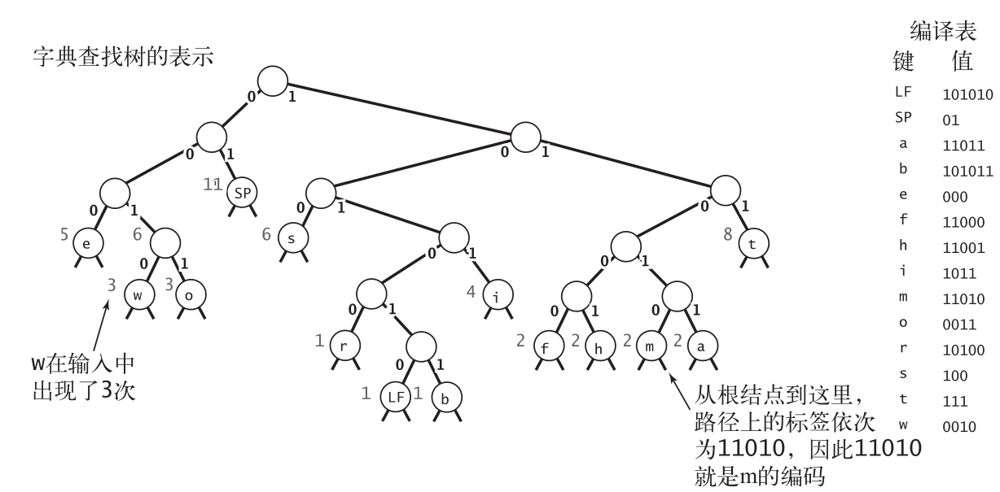

# 字符串

## 字符串排序

### 键索引计数法

```java
int N = a.length;
String[] aux = new String[N];
int[] count = new int[R+1];
// 计算出现频率
for (int i = 0; i < N; i++)
	count[a[i].key() + 1]++;
// 将频率转换为索引
for (int r = 0; r < R; r++)
	count[r+1] += count[r];
// 将元素分类
for (int i = 0; i < N; i++)
    aux[count[a[i].key()]++] = a[i];
// 回写
for (int i = 0; i < N; i++)
    a[i] = aux[i];
```

键索引计数法是一种对于小整数键排序非常有效却常常被忽略的排序方法。

### 低位优先的字符串排序

```java
public class LSD{
	public static void sort(String[] a, int W){ // 通过前W个字符将a[]排序
        int N = a.length;
        int R = 256;
        String[] aux = new String[N];
        for (int d = W-1; d >= 0; d--){ // 根据第d个字符用键索引计数法排序
            int[] count = new int[R+1]; // 计算出现频率
            for (int i = 0; i < N; i++)
                count[a[i].charAt(d) + 1]++;
            for (int r = 0; r < R; r++) // 将频率转换为索引
                count[r+1] += count[r];
            for (int i = 0; i < N; i++) // 将元素分类
                aux[count[a[i].charAt(d)]++] = a[i];
            for (int i = 0; i < N; i++) // 回写
                a[i] = aux[i];
        }
    }
}
```

### 高位优先的字符串排序

```java
public class MSD{
    private static int R = 256; // 基数
    private static final int M = 15; // 小数组的切换阈值
    private static String[] aux; // 数据分类的辅助数组
    private static int charAt(String s, int d)
    { if (d < s.length()) return s.charAt(d); else return -1; }
    public static void sort(String[] a){
        int N = a.length;
        aux = new String[N];
        sort(a, 0, N-1, 0);
    }
    private static void sort(String[] a, int lo, int hi, int d)
    { // 以第d个字符为键将a[lo]至a[hi]排序
        if (hi <= lo + M)
        { Insertion.sort(a, lo, hi, d); return; }
        int[] count = new int[R+2]; // 计算频率
        for (int i = lo; i <= hi; i++)
            count[charAt(a[i], d) + 2]++;
        for (int r = 0; r < R+1; r++) // 将频率转换为索引
            count[r+1] += count[r];
        for (int i = lo; i <= hi; i++) // 数据分类
            aux[count[charAt(a[i], d) + 1]++] = a[i];
        for (int i = lo; i <= hi; i++) // 回写
            a[i] = aux[i - lo];
        // 递归的以每个字符为键进行排序
        for (int r = 0; r < R; r++)
            sort(a, lo + count[r], lo + count[r+1] - 1, d+1);
    }
}
```

### 三向字符串快速排序

```java
public class Quick3string{
    private static int charAt(String s, int d)
    { if (d < s.length()) return s.charAt(d); else return -1; }
    public static void sort(String[] a)
    { sort(a, 0, a.length - 1, 0); }
    private static void sort(String[] a, int lo, int hi, int d){
        if (hi <= lo) return;
        int lt = lo, gt = hi;
        int v = charAt(a[lo], d);
        int i = lo + 1;
        while (i <= gt){
            int t = charAt(a[i], d);
            if (t < v) exch(a, lt++, i++);
            else if (t > v) exch(a, i, gt--);
            else i++;
        }
        sort(a, lo, lt-1, d);
        if (v >= 0) sort(a, lt, gt, d+1);
        sort(a, gt+1, hi, d);
    }
}
```

## 单词查找树

单词查找树由字符串键中的所有字符构造而成，允许使用被查找键中的字符进行查找。

```java
public class TrieST<Value>{
	private static int R = 256; // 基数
	private Node root; // 单词查找树的根结点
	private static class Node{
		private Object val;
		private Node[] next = new Node[R];
    }
	public Value get(String key){
        Node x = get(root, key, 0);
        if (x == null) return null;
        return (Value) x.val;
    }
    private Node get(Node x, String key, int d){ 
        if (x == null) return null;
        if (d == key.length()) return x;
        char c = key.charAt(d); // 找到第d个字符所对应的子单词查找树
        return get(x.next[c], key, d+1);
    }
    public void put(String key, Value val)
    { root = put(root, key, val, 0); }
    private Node put(Node x, String key, Value val, int d){
        if (x == null) x = new Node();
        if (d == key.length()) { x.val = val; return x; }
        char c = key.charAt(d); // 找到第d个字符所对应的子单词查找树
        x.next[c] = put(x.next[c], key, val, d+1);
        return x;
    }
    public Iterable<String> keys()
    { return keysWithPrefix(""); }
    public Iterable<String> keysWithPrefix(String pre){
        Queue<String> q = new Queue<String>();
        collect(get(root, pre, 0), pre, q);
        return q;
    }
    private void collect(Node x, String pre, Queue<String> q){
        if (x == null) return;
        if (x.val != null) q.enqueue(pre);
        for (char c = 0; c < R; c++)
            collect(x.next[c], pre + c, q);
    }
    public Iterable<String> keysThatMatch(String pat){
        Queue<String> q = new Queue<String>();
        collect(root, "", pat, q);
        return q;
    }
    private void collect(Node x, String pre, String pat, Queue<String> q)
    {
        int d = pre.length();
        if (x == null) return;
        if (d == pat.length() && x.val != null) q.enqueue(pre);
        if (d == pat.length()) return;
        char next = pat.charAt(d);
        for (char c = 0; c < R; c++)
            if (next == '.' || next == c)
                collect(x.next[c], pre + c, pat, q);
    }
    public String longestPrefixOf(String s){
        int length = search(root, s, 0, 0);
        return s.substring(0, length);
    }
    private int search(Node x, String s, int d, int length)
    {
        if (x == null) return length;
        if (x.val != null) length = d;
        if (d == s.length()) return length;
        char c = s.charAt(d);
        return search(x.next[c], s, d+1, length);
    }
    public void delete(String key)
    { root = delete(root, key, 0); }
    private Node delete(Node x, String key, int d){
        if (x == null) return null;
        if (d == key.length())
            x.val = null;
        else{
            char c = key.charAt(d);
            x.next[c] = delete(x.next[c], key, d+1);
        }
        if (x.val != null) return x;
        for (char c = 0; c < R; c++)
            if (x.next[c] != null) return x;
        return null;
    }
}
```

### 单词查找树的性质

* 单词查找树的链表结构（形状）和键的插入或删除顺序无关：对于任意给定的一组键，其单词查找树都是唯一的。
* 在单词查找树中查找一个键或是插入一个键时，访问数组的次数最多为键的长度加 1。
* 字母表的大小为 R，在一棵由 N 个随机键构造的单词查找树中，未命中查找平均所需检查的结点数量约为$log_R(N)$。
* 一棵单词查找树中的链接总数在$RN$到$RNw$之间，其中$w$为键的平均长度。

## 子字符串查找

### 暴力子字符串查找算法

```java
public static int search(String pat, String txt){
    int M = pat.length();
    int N = txt.length();
    for (int i = 0; i <= N - M; i++){
        int j;
        for (j = 0; j < M; j++)
            if (txt.charAt(i+j) != pat.charAt(j))
                break;
        if (j == M) return i; // 找到匹配
    }
    return N; // 未找到匹配
}
```

在最坏情况下，暴力子字符串查找算法在长度为N的文本中查找长度为M的模式需要大约$NM$次字符比较。

另外一种实现：

```java
public static int search(String pat, String txt){
    int j, M = pat.length();
    int i, N = txt.length();
    for (i = 0, j = 0; i < N && j < M; i++){
        if (txt.charAt(i) == pat.charAt(j)) j++;
        else { i -= j; j = 0; }
    }
    if (j == M) return i - M; // 找到匹配
    else return N; // 未找到匹配
}
```

### Knuth-Morris-Pratt 子字符串查找算法

```java
public class KMP{
    private String pat;
    private int[][] dfa;
    public KMP(String pat){ // 由模式字符串构造DFA
        this.pat = pat;
        int M = pat.length();
        int R = 256;
        dfa = new int[R][M];
        dfa[pat.charAt(0)][0] = 1;
        for (int X = 0, j = 1; j < M; j++){ // 计算dfa[][j]
            for (int c = 0; c < R; c++)
                dfa[c][j] = dfa[c][X]; // 复制匹配失败情况下的
            dfa[pat.charAt(j)][j] = j+1; // 设置匹配成功情况下的值
            X = dfa[pat.charAt(j)][X]; // 更新重启状态
        }
    }
    public int search(String txt){ // 在txt上模拟DFA的运行
        int i, j, N = txt.length(), M = pat.length();
        for (i = 0, j = 0; i < N && j < M; i++)
            j = dfa[txt.charAt(i)][j];
        if (j == M) return i - M; // 找到匹配（到达模式字符串的结尾）
        else return N; // 未找到匹配（到达文本字符串的结尾）
    }
}
```

### Boyer-Moore 字符串查找算法

```java
public class BoyerMoore{
    private int[] right;
    private String pat;
    BoyerMoore(String pat){ // 计算跳跃表
        this.pat = pat;
        int M = pat.length();
        int R = 256;
        right = new int[R];
        for (int c = 0; c < R; c++)
            right[c] = -1; // 不包含在模式字符串中的字符的值为-1
        for (int j = 0; j < M; j++) // 包含在模式字符串中的字符的值为
            right[pat.charAt(j)] = j; // 它在其中出现的最右位置
    }
    public int search(String txt){ // 在txt中查找模式字符串
        int N = txt.length();
        int M = pat.length();
        int skip;
        for (int i = 0; i <= N-M; i += skip){ // 模式字符串和文本在位置i匹配吗？
            skip = 0;
            for (int j = M-1; j >= 0; j--)
                if (pat.charAt(j) != txt.charAt(i+j)){
                    skip = j - right[txt.charAt(i+j)];
                    if (skip < 1) skip = 1;
                    break;
                }
            if (skip == 0) return i; // 找到匹配
        }
        return N; // 未找到匹配
    }
}
```

### Rabin-Karp 指纹字符串查找算法

```java
public class RabinKarp{
    private String pat; // 模式字符串（仅拉斯维加斯算法需要）
    private long patHash; // 模式字符串的散列值
    private int M; // 模式字符串的长度
    private long Q; // 一个很大的素数
    private int R = 256; // 字母表的大小
    private long RM; // R^(M-1) % Q
    public RabinKarp(String pat){
        this.pat = pat; // 保存模式字符串（仅拉斯维加斯算法需要）
        this.M = pat.length();
        Q = longRandomPrime(); 
        RM = 1;
        for (int i = 1; i <= M-1; i++) // 计算R^(M-1) % Q
            RM = (R * RM) % Q; // 用于减去第一个数字时的计算
        patHash = hash(pat, M);
    }
    private int search(String txt){ // 在文本中查找相等的散列值
        int N = txt.length();
        long txtHash = hash(txt, M);
        if (patHash == txtHash && ckeck(0)) return 0; // 一开始就匹配成功
        for (int i = M; i < N; i++){ // 减去第一个数字，加上最后一个数字，再次检查匹配
            txtHash = (txtHash + Q - RM*txt.charAt(i-M) % Q) % Q;
            txtHash = (txtHash*R + txt.charAt(i)) % Q;
            if (patHash == txtHash)
                if (check(i - M + 1)) return i - M + 1; // 找到匹配
        }
        return N; // 未找到匹配
    }
}
```

| 算法                   | 版本                     | 最坏 | 一般 | 在文本中回退 | 额外的空间需求 |
| ---------------------- | ------------------------ | ---- | ---- | ------------ | -------------- |
| 暴力算法               |                          | MN   | 1.1N | 是           | 1              |
| Knuth-Morris-Pratt算法 | 完整的DFA                | 2N   | 1.1N | 否           | MR             |
| Knuth-Morris-Pratt算法 | 仅构造不匹配的状态转换   | 3N   | 1.1N | 否           | M              |
| Knuth-Morris-Pratt算法 | 完整版本                 | 3N   | N/M  | 是           | R              |
| Boyer-Moore 算法       | 启发式的查找不匹配的字符 | MN   | N/M  | 是           | R              |
| Rabin-Karp 算法        | 蒙特卡洛算法             | 7N   | 7N   | 否           | 1              |
| Rabin-Karp 算法        | 拉斯维加斯算法           | 7N   | 7N   | 是           | 1              |

## 正则表达式

```java
public class NFA{
    private char[] re; // 匹配转换
    private Digraph G; // epsilon转换
    private int M; // 状态数量
    public NFA(String regexp){ // 根据给定的正则表达式构造NFA
        Stack<Integer> ops = new Stack<Integer>();
        re = regexp.toCharArray();
        M = re.length;
        G = new Digraph(M+1);
        for (int i = 0; i < M; i++){
            int lp = i;
            if (re[i] == '(' || re[i] == '|')
                ops.push(i);
            else if (re[i] == ')'){
                int or = ops.pop();
                if (re[or] == '|'){
                    lp = ops.pop();
                    G.addEdge(lp, or+1);
                    G.addEdge(or, i);
                }
                else lp = or;
            }
            if (i < M-1 && re[i+1] == '*') {// 查看下一个字符
                G.addEdge(lp, i+1);
                G.addEdge(i+1, lp);
            }
            if (re[i] == '(' || re[i] == '*' || re[i] == ')')
                G.addEdge(i, i+1);
        }
    }
    public boolean recognizes(String txt){ // NFA是否能够识别文本txt？
        Bag<Integer> pc = new Bag<Integer>();
        DirectedDFS dfs = new DirectedDFS(G, 0);
        for (int v = 0; v < G.V(); v++)
            if (dfs.marked(v)) pc.add(v);
        for (int i = 0; i < txt.length(); i++){ // 计算txt[i+1]可能到达的所有NFA状态
            Bag<Integer> match = new Bag<Integer>();
            for (int v : pc)
                if (v < M)
                    if (re[v] == txt.charAt(i) || re[v] == '.')
                        match.add(v+1);
            pc = new Bag<Integer>();
            dfs = new DirectedDFS(G, match);
            for (int v = 0; v < G.V(); v++)
                if (dfs.marked(v)) pc.add(v);
        }
        for (int v : pc) 
            if (v == M) 
                return true;
        return false;
    }
}
```

## 数据压缩

### 游程编码

例如`0000000000000001111111000000011111111111`该字符串含有15个0，然后是7个1，然后是7个0，然后是11个1，因此我们可以将该比特字符串编码为15，7，7，11。如果用4位表示长度并以连续的0作为开头，那么就可以得到一个16位长的字符串（15=1111，7=0111，7=0111，11=1011）:`1111011101111011`

### 霍夫曼压缩

```java
public class Huffman{
    private static int R = 256; // ASCII字母表
    public static void compress(){
        String s = BinaryStdIn.readString();
        char[] input = s.toCharArray();
        // 统计频率
        int[] freq = new int[R];
        for (int i = 0; i < input.length; i++)
            freq[input[i]]++;
        // 构造霍夫曼编码树
        Node root = buildTrie(freq);
        // （递归地）构造编译表
        String[] st = new String[R];
        buildCode(st, root, "");
        // （递归地）打印解码用的单词查找树
        writeTrie(root);
        // 打印字符总数
        BinaryStdOut.write(input.length);
        // 使用霍夫曼编码处理输入
        for (int i = 0; i < input.length; i++){
            String code = st[input[i]];
            for (int j = 0; j < code.length(); j++)
                if (code.charAt(j) == "1")
                    BinaryStdOut.write(true);
            else BinaryStdOut.write(false);
        }
        BinaryStdOut.close();
    }
    
    private static Node buildTrie(int[] freq){
        // 使用多棵单结点树初始化优先队列
        MinPQ<Node> pq = new MinPQ<Node>();
        for (char c = 0; c < R; c++)
            if (freq[c] > 0)
                pq.insert(new Node(c, freq[c], null, null));
        while (pq.size() > 1){ // 合并两棵频率最小的树
            Node x = pq.delMin();
            Node y = pq.delMin();
            Node parent = new Node('\0', x.freq + y.freq, x, y);
            pq.insert(parent);
        }
        return pq.delMin();
    }
    private static void writeTrie(Node x){ // 输出单词查找树的比特字符串
        if (x.isLeaf()){
            BinaryStdOut.write(true);
            BinaryStdOut.write(x.ch);
            return;
        }
        BinaryStdOut.write(false);
        writeTrie(x.left);
        writeTrie(x.right);
    }
    private static String[] buildCode(Node root){ // 使用单词查找树构造编译表
        String[] st = new String[R];
        buildCode(st, root, "");
        return st;
    }
    private static void buildCode(String[] st, Node x, String s){ // 使用单词查找树构造编译表（递归）
        if (x.isLeaf())
        { st[x.ch] = s; return; }
        buildCode(st, x.left, s + '0');
        buildCode(st, x.right, s + '1');
    }
}
```



### LZW 压缩算法

```java
public class LZW{
    private static final int R = 256; // 输入字符数
    private static final int L = 4096; // 编码总数=2^12
    private static final int W = 12; // 编码宽度
    public static void compress(){
        String input = BinaryStdIn.readString();
        TST<Integer> st = new TST<Integer>();
        for (int i = 0; i < R; i++)
            st.put("" + (char) i, i);
        int code = R+1; // R为文件结束(EOF)的编码
        while (input.length() > 0){
            String s = st.longestPrefixOf(input); // 找到匹配的最长前缀
            BinaryStdOut.write(st.get(s), W); // 打印出s的编码
            int t = s.length();
            if (t < input.length() && code < L) // 将s加入符号表
                st.put(input.substring(0, t + 1), code++);
            input = input.substring(t); // 从输入中读取s
        }
        BinaryStdOut.write(R, W); // 写入文件结束标记
        BinaryStdOut.close();
    }
    public static void expand(){
        String[] st = new String[L];
        int i; // 下一个待补全的编码值
        for (i = 0; i < R; i++) // 用字符初始化编译表
            st[i] = "" + (char) i;
        st[i++] = " "; // （未使用）文件结束标记(EOF)的前瞻字符
        int codeword = BinaryStdIn.readInt(W);
        String val = st[codeword];
        while (true){
            BinaryStdOut.write(val); // 输出当前子字符串
            codeword = BinaryStdIn.readInt(W);
            if (codeword == R) break;
            String s = st[codeword]; // 获取下一个编码
            if (i == codeword) // 如果前瞻字符不可用
                s = val + val.charAt(0); // 根据上一个字符串的首字母得到编码的字符串
            if (i < L)
                st[i++] = val + s.charAt(0); // 为编译表添加新的条目
            val = s; // 更新当前编码
        }
        BinaryStdOut.close();
    }
}
```

