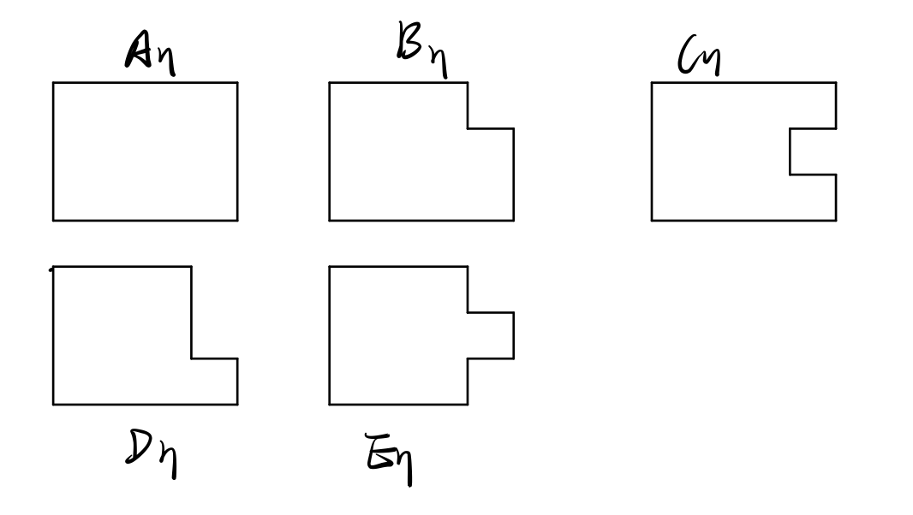
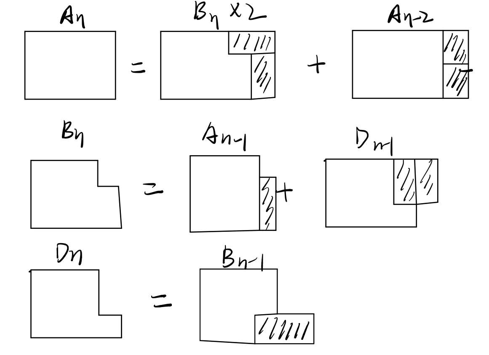

# Dynamic Programming

动态规划（DP)：将问题分解成更加简单的子问题。

解决DP问题的步骤：

* 定义子问题
* 原问题与子问题之间的递归关系
* 最基本的子问题求解

## 1-dimensional DP

> Problem: given n, find the number of different ways to write n as the sum of 1, 3, 4
>
> Example: for n = 5, the answer is 6
>
> 5 = 1 + 1 + 1 + 1 + 1
> = 1 + 1 + 3
> = 1 + 3 + 1
> = 3 + 1 + 1
> = 1 + 4
> = 4 + 1

* 定义子问题：令$D_{n}$为n写成1，3，4的和的不同种类数；
* 递归关系：$D_{n}=D_{n-1}+D_{n-3}+D_{n-4}$
* 最基本的子问题：$D_{0}=D_{1}=D_{2}=1,D_{3}=2$

```c
D[0] = D[1] = D[2] = 1; D[3] = 2;
for(i = 4; i <= n; i++)
    D[i] = D[i-1] + D[i-3] + D[i-4];
```


> Given n, find the number of ways to fill a 3 × n board with dominoes

* 定义子问题

  

* 递归关系

  

  

  由此可得递推关系$A[n] = 4 \times A[n-2] - A[n-4]$ 

* 最基本的子问题：A[0]=1、A[2]=3

## 2-dimensional DP

> Problem: given two strings x and y, find the longest common subsequence (LCS) and print its length.
> Example:
> – x: ABCBDAB
> – y: BDCABC
> – “BCAB” is the longest subsequence found in both sequences, so
> the answer is 4

最典型的LCS问题；

* 定义子问题：设$D_{ij}$是$x_{1...i}$和$y_{1...j}$的最长公共子串（LCS）
* 递归关系：
  * 如果$x_i == y_i$，则$D_{ij} = D_{i-1,j-1} + 1$
  * 否则，$D_{ij} = max(D_{i-1,j} , D_{i,j-1})$
* 边界条件（基本的子问题）：$D_{i0} = D_{0j} = 0$

```c++
for(i = 0; i <= n; i++) D[i][0] = 0;
for(j = 0; j <= m; j++) D[0][j] = 0;
for(i = 1; i <= n; i++) {
    for(j = 1; j <= m; j++) {
        if(x[i] == y[j])
            D[i][j] = D[i-1][j-1] + 1;
        else
            D[i][j] = max(D[i-1][j], D[i][j-1]);
    }
}
```

## Interval DP

> Problem: given a string x = x 1...n , find the minimum number of characters that need to be inserted to make it a palindrome
> Example:
> – x: Ab3bd
> – Can get “dAb3bAd” or “Adb3bdA” by inserting 2 characters
> (one ‘d’, one ‘A’)

* 定义子问题：设$D_{i,j}$是所要插入的最少的字符，从而使字符串$x_{i...j}$为回文字符串
* 递归条件：
  * 假如$x_i = x_j$，则只需计算构成$x_{i-1,j-1}$的最少字符数，则$D_{ij} = D_{i+1,j-1}$
  * 假如$x_{i} \neq x_{j}$，则$D_{ij} = 1 + min \left\{ D_{i+1,j} , D_{i,j-1} \right\}$
* 最基本的子问题：$D_{ii} = D_{i,i-1} = 0$

```c++
// fill in base cases here
for(t = 2; t <= n; t++)
    for(i = 1, j = t; j <= n; i++, j++)
        if(x[i] == x[j])
            D[i][j] = D[i+1][j-1];
		else
            D[i][j] = 1 + min(D[i-1][j],D[i][j-1]);
```

## Tree DP

> Problem: given a tree, color nodes black as many as possible without coloring two adjacent nodes

* 定义子问题：

  * 首先我们需要决定根节点root的颜色
  * 设$B_v$为当$v$标记为黑色时，以$v$为根节点做多可标记为黑色的节点数
  * 设$W_v$为当$v$不标记为黑色时，以$v$为根节点做多可标记为黑色的节点数
  * 答案：$max(B_{root},W_{root})$

* 递归条件：

  * 当根节点为黑色时，其孩子节点必须为白色

    $B_{v} = 1 + \sum_{u\ \epsilon \ children(v)} W_{u}$

  * 当根节点为白色时，其孩子节点可以为黑色或白色

    $W_v = 1 + \sum_{u\ \epsilon \ children(v)} max(B_u, W_u)$

* Base case：叶节点为返回1即可；

## Subset DP

> Problem: given a weighted graph with n nodes, find the shortest path that visits every node exactly once (Traveling Salesman Problem)

NP问题；

* 定义子问题：
  * $D_{S,v}$是遍历S的所有节点，且结束于v；
  * 答案：$min_{v\ \epsilon \ V} D_{V,v}$,V是给定的节点
* 先解决Base case：对于每个节点$D_{(v),v} = 0$
* 递归条件：
  * 考虑这样一条路径，访问了所有节点，且结束于v；
  * 当到达v时，路径来自子问题S-{v};
  * 因此$D_{S,v} = \underset{u \epsilon S-v} {min} (D_{S-v,u} + cost(u,v))$


DP问题三步骤：

1. 定义子问题
2. 递归条件
3. 最基本的子问题的解决

