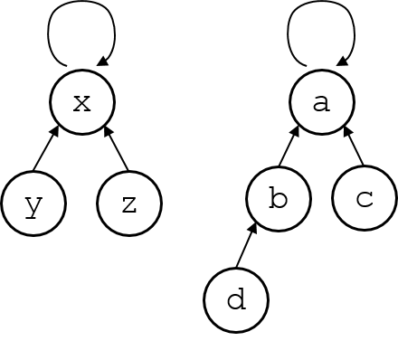
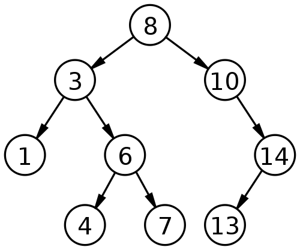

# Data Structures

## Stack

后入先出LIFO：

* push(x)：x入栈
* pop()：出栈
* top()：返回栈顶

## Queue

先入先出FIFO:

- enqueue(x)：x队列
- dequeue()：出队
- front()：返回队首

## Priority Queue

*  Insert(x, p): 插入x，权重为p
* RemoveTop()：移除最高优先级的元素
* Top(): 返回最高优先级的元素

## Heap

其结构为二叉树，其特点：根的值大于它的儿子节点的值，根节点为最大的值。（最大堆，另外的最小堆相反）；

插入和删除的时间复杂度为：$O(log n)$

适用于插入和删除比较频繁的场景；

## Union-Find Structure

并查集（Union-find Sets）主要用于处理一些*不相交集合*的合并问题。一些常见的用途有求连通子图、求最小生成树的 Kruskal 算法和求最近公共祖先（Least Common Ancestors, LCA）等。

每个元素指向父亲节点（根节点指向自己）；根节点代表这个集合；



两种方法：

* find(x)：找x的根节点

  ```c++
  int find(int x){
      return x == L[x] ? x : L[x] = find(L[x]);//同时进行了路径压缩，即在每次查找时，令查找路径上的每个节点都直接指向根节点
  }
  ```

* union

  ```c++
  void Union(int x,int y){
      L[find(x)] = find(y)
  }
  ```

## Binary Search Tree (BST)

二叉搜索树特点：

* 左子树的节点都小于根节点
* 右子树的节点都大于根节点



常见方法：

* Insert(x)
* Delete(x)
* Find(x)

## Fenwick Tree

特点：

* 树状数组中的每个元素是原数组中一个或者多个连续元素的和。
* 在进行连续求和操作a[1]+…+a[n]时，只需要将树状数组中某几个元素的和即可。时间复杂度为**O(lgn)**


e[i]中的元素：如果数字 i 的二进制表示中末尾有**k个连续的0，则e[i]是a数组中2^k个元素的和**。因此**e[i]中每一个元素管理着a[]中若干个元素的和，并且各个元素管理的区间没有重叠。**

计算方法：

* 父节点：`lowbit(i) = ( (i-1) ^ i) & i ; //或者(i & (-i)) ，节点e[i]的父节点为 e[ i - lowbit(i) ]`
* 子节点：`lowbit(i) = ( (i-1) ^ i) & i ; //或者(i & (-i)) ，节点e[i]的子节点为 e[ i + lowbit(i) ]`

两种方法：

* sum

  ```c++
  int sum(int idx){//1...idx的和
      int sum = 0;
      while (idx > 0){
          sum += tree[idx];
          idx -= (idx & -idx);
      }
      return sum;
  }
  ```

* set

  ```c++
  void update(int idx ,int val){//将tree的idx位置更新
      while (idx <= MaxVal){
          tree[idx] += val;
          idx += (idx & -idx);
      }
  }
  ```

  