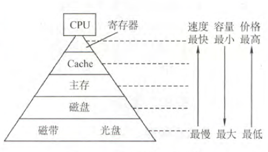
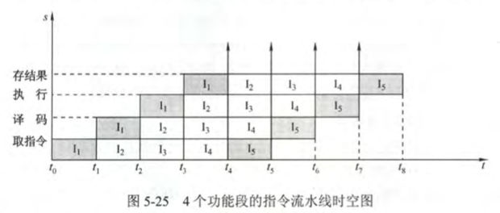
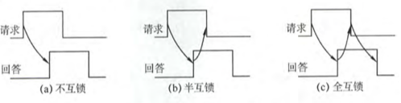

# 计算机组成原理

## 第一章

发展：

1. 第一代：电子管
2. 第二代：晶体管
3. 第三代：中小规模集成电路
4. 第四代：超大规模集成电路

摩尔定律：18个月集成电路上的晶体管翻倍；

通用计算机：巨型机、大型机、中型机、小型机、微型机、单片机

按照指令分类：

* 单指令流单数据流SISD：传统冯诺依曼结构
* 单指令流多数据流SIMD：阵列处理器
* 多指令流单数据流MISD：不存在
* 多指令流多数据流MIMD

### 层次结构

计算机 = 硬件系统 + 软件系统

硬件的基本组成：

* 冯诺依曼机：

  1. 计算机由运算器、存储器、控制器、I/O组成
  2. 指令和数据无区别，均为二进制数据
  3. 指令 = 操作码 + 地址码
  4. 顺序执行

* 功能部件：

  * I/O：键盘、鼠标等；

  * 存储器：存储数据和指令，分为内存和外存；

    地址寄存器MAR：存放有效地址，用于寻址

    数据寄存器MDR：暂存读写的数据

  * 运算器：用于处理数据，核心为算术逻辑单元ALU；

  * 控制器：控制数据、指令的执行，包含PC、IR；

  

软件的分类：

* 系统软件
* 应用软件

三种级别的语言：（由低到高）

* 机器语言
* 汇编语言
* 高级语言

工作流程：

1. 将数据和指令装入主存
2. 从起始地址开始运行
3. 取指、译码、执行

### 性能指标

吞吐量：单位时间内处理请求的数量；

响应时间：从请求到响应的时间；

时钟周期：CPU的最小时间单位；

主频：时钟的频率，越大性能越好；$f = \frac{1}{T}$

CPI：执行一条指令所需的时钟周期数；

$CPU的执行时间 = \frac{CPI \cdot 指令数}{主频}$

MIPS：每秒执行多少百万指令；$MIPS = \frac{主频}{CPI}$

MFLOPS：每秒执行多少百万次浮点运算；

GFLOPS：每秒执行多少十亿次浮点运算；

## 第二章

r进制数：$(k_{n}k_{n-1}...k_{1})_r = \sum_{i=1}^{n}k_{i} \cdot r^i$

常用进制：十进制、二进制、十六进制

进制转换：

小端模式：由低到高存储各个比特；

大端模式：由高到低存储各个比特；

### 校验码

1. 奇偶校验码：码距为2，可检测出一位错误；

2. 海明码：

   $L-1 = D + C  \ (D \geq C)$，其中（L为最小码距，D为检错位数，C为纠错位数）

   步骤：以有效信息为1010，校验位数为3为例

   1. 检验：$n + k \leq 2^k - 1$

   2. 确定校验位分布：

      $p_i$在海明位号位$2^{i-1}$位置上
      $$
      H_7H_6H_5H_4H_3H_2H_1 \\
      D_4D_3D_2P_3D_1P_2P_1
      $$

   3. 分组，形成校验关系

      $D_1$在$H_3$上，$3 = 1 + 2  \ H_1(P_1) \ H_2(P_2)$，所以由$P_2P_1$校验

      $D_2$在$H_5$上，$5 = 1 + 4 \ H_1(P_1) \ H_4(P_3)$，所以由$P_3P_1$校验

      下面的同理；

   4. 校验位取值：由上面分组的

      $P_1 = D_1 \oplus D_2 \oplus D_3$

      依次类推

   5. 校验：

      $S_1 = P_1 \oplus D_1 \oplus D_2 \oplus D_3$

      依此类推

      若$S_3 S_2 S_1 = 000$，则无错，反之$S_3 S_2 S_1$就是错误位的位号；

3. CRC校验码：

   信息位 + 校验位 （K位 + R位）：

   步骤：令生成函数$G(R) = x^3 + x^2 + 1$，信息码为$101001$

   

   检错和纠错：将收到的CRC码➗G(R)，余数为0，则无错，反之，则余数为错误位的位号；

### 定点数

定点数：小数点位置固定

浮点数：小数点位置不固定

符号数：带符号位的数

定点小数：$x_0.x_1\sim x_n$，数值范围$(-1)^{x_0}(1-2^{-n})$

定点整数：$x_0.x_1\sim x_n$，数值范围$(-1)^{x_0}(2^{n}-1)$

原码：符号位 + 数的绝对值

反码：正数的反码是其本身，负数的反码是在原码的基础上，符号位不变，其他各个位取反；

补码：正数的补码是其本身，负数的补码是在原码的基础上，符号位不变，其他各个位取反后加一；

移码：$[X]_{原码} + 2^n$

运算：

1. 移位：

   * 对于正数：直接添加0
   * 负数：原码添加0，反码直接添加1，补码左移添加0，右移添加1；

2. 逻辑移位：直接添加0

3. 循环移位

4. 原码加减法：

   $[X]_{原码} = X_s.X_1 \sim X_n, \ [Y]_{原码}=Y_s.Y_1 \sim Y_n$

   * 加法：如果$X_s == Y_s$，则直接$X_1 \sim X_n + Y_1 \sim Y_n$，反之则做减法
   * 减法：如果$X_s == Y_s$，则直接相减，反之相加

5. 补码加减法：

   $[X]_{补码} = X_s.X_1 \sim X_n, \ [Y]_{补码}=Y_s.Y_1 \sim Y_n$

   * 加法：$[X+Y]_{补码} = ([X]_{补码} + [Y]_{补码}) \ mod \ 2^{n+1}$
   * 减法：$[X-Y]_{补码} = ([X]_{补码} + [-Y]_{补码}) \ mod \ 2^{n+1}$

6. 溢出：超出表示范围

   判断方法：

   * $[A]_{补码}=A_S A_1 \sim A_n,[B]_{补码}=B_s B_1 \sim B_n$

     $V = A_s B_s \overline{S} + \overline{A}\overline{B}S$，S为结果

     若$V = 0$，则无溢出，反之则溢出；

   * 双符号位

     * $S_{s1}S_{s2} = 00$，表示结果为正数，无溢出；
     * $S_{s1}S_{s2} = 01$，表示结果正溢出
     * $S_{s1}S_{s2} = 10$，表示结果负溢出
     * $S_{s1}S_{s2} = 11$，表示结果为负数，无溢出；

   * 符号位进位$C_s$与最高数位进位$C_1$

     $V = C_s \oplus C_1$，若$V = 0$，则无溢出，反之则溢出；

7. 乘法

   原码乘法：

   

   补码乘法：

   ​	

### 浮点数

$N = r^{E} \cdot M$（E是阶码，M是尾数）

结构：$J_rJ_1\sim J_mS_rS_1\sim S_n，J_r为阶符，J_1\sim J_m为阶码，S_r为数符，S_1\sim S_n为尾数$；

规格化是将浮点数的小数点前只有一个1；

IEE754：关于浮点数的标准

$(-1)^S\cdot 1.M\cdot 2^{E-偏置值}$

| 类型       | 数符 | 阶码 | 尾数数值 | 总位数 | 偏置值 |
| ---------- | ---- | ---- | -------- | ------ | ------ |
| 短浮点数   | 1    | 8    | 23       | 32     | 127    |
| 长浮点数   | 1    | 11   | 52       | 64     | 1023   |
| 临时浮点数 | 1    | 15   | 64       | 80     | 16383  |

### ALU

一位全加器：

$S_i = A_i \oplus B_i \oplus C_{i-1},\ C_i = A_iB_i+(A_i \oplus B_i)C_{i-1} \ 其中C_{i-1}为上一位进位$

串行加法器：数据串行通过一个一位加法器；

并行加法器：数据并行通过多个一位加法器；

## 第三章

存储器的作用：作为主存、辅村、高速缓存器

介质：磁表面、磁芯等

存取方式：随机存储器RAM、只读存储器ROM、串行访问存储器

可保存性：易失性存储器、非易失性存储器

性能指标：

* 容量 = $字数 \cdot 字长$

* 存储速度

  

### 层次化结构

三级存储结构：

半导体随机存储器：

SRAM：非破坏性读出、易失性存储器；速度快、集成度低、功耗大；一般用于cache；

DRAM：集成度高、功耗低、容量大；一般用于主存；由于DRAM上的电荷只能维持1-2ms，因此需要刷新：

* 集中刷新：所有**行**进行刷新，其间不能进行访问，为访存死区；
* 分散刷新：每一行单独刷新，分散到各个周期；
* 异步刷新：结合集中刷新和分散刷新；

读写周期：

|            | SRAM     | DRAM     |
| ---------- | -------- | -------- |
| 存储信息   | 触发器   | 电容     |
| 破坏性读出 | 非       | 是       |
| 需要刷新   | 不要     | 需要     |
| 送行列地址 | 同时送   | 分两次送 |
| 运行速度   | 快       | 慢       |
| 集成度     | 低       | 高       |
| 功耗       | 大       | 小       |
| 存储成本   | 高       | 低       |
| 主要用途   | 高速缓存 | 主机内存 |

只读存储器：结构简单、非易失性

类型：

* 掩膜式ROM：无法改变内容
* 一次可编程ROM：一次性编程
* 可擦除可编程ROM：可重复读写
* 闪存：长期保存，可读写；
* SSD：Flash芯片

主存拓展：

* 位拓展：特点是地址、片选信号合在一起，数据总线分开
* 字拓展：地址线进行片选
* 字位同时拓展

### 双口RAM、多模块存储器

双口RAM：允许两个CPU异步访问；

多模块存储器：单体多字存储器、多体低位交叉存储器

* 单体多字存储器：一个存储体，每个单元m个字，总线宽度也为m个字，一次性读取m个字；

  优点：快

  缺点：指令、数据必须连续，否则效果不好；

* 多体并行存储器：高位交叉编址、低位交叉编址

  高位交叉编址：

  

  低位交叉编址：

  

  低位交叉编址可采用流水线并行存取，存取周期T，总线传送周期r，则$模块数 \ge m = \frac{T}{r}$，连续m个字的存取时间$t_1 = T + (m-1)r$，$编号 = 地址 \% 模块数$；

### 高速缓冲存储器

局部性原理：访问过的可能会再次访问；

高速缓冲存储器：通常由SRAM构成，分成若干个cache块；

流程：

$cache命中率 H= \frac{总命中次数N_c}{N_c + 访问总次数N_m}$

平均访问时间 $T = Ht_c+(1-H)t_m$，$t_c$为cache访问时间，$t_m$未命中访问时间；

主存到cache的映射：

* 直接映射：$j = i\mod{2^c}$，$j$为cache块号，$i$为主存块号，$c$为cache总块数；

  地址结构：主存子块标记 + cache子块地址 + 子块内地址

  缺点：冲突概率高，利用率低；

* 全相联映射：主存可装入任何位置

  地址结构：主存子块标记 + 子块内地址

  优点：灵活、冲突概率低、命中率高

  缺点：成本高，地址变换速率慢；

* 组相联映射：cache分成多组，组内可以装入任何内存；即组外直接映射，组内全相联；

  $j = i\mod{Q}$，$j$为组号，$i$为块号，$Q$为组数；

cache中主存块的替换算法：

1. 随机算法：效率低
2. FIFO：先进先出，效率一般
3. LRU：最近最少使用
4. LFU：最不经常使用

cache写策略：使cache与主存内容保持一致：

* 命中：
  * 全写法：当cache写命中时，同时写入cache和主存；替换时，直接覆盖cache块；
  * 写回法：写命中时，只修改cache，只有换出时才写回主存；
* 不命中：
  * 写分配法：加载主存中的块到cache中
  * 非写分配法：只写入主存，不进行调块

### 虚拟存储器

虚地址：用户编程涉及的为虚地址，即逻辑地址；

实地址：实际的主存单元地址，即物理地址；

本质上虚拟存储器是为了缓解内存压力；

1. 页式虚拟存储器
2. 段式虚拟存储器
3. 段页式虚拟存储器

TLB：转换检测缓冲区，快表，由相联存储器构成，存储常用的页表项；

访问顺序：TLB、页表、cache、主存

## 第四章

### 指令格式

格式：操作码 + 地址码

分类：

* 零地址指令：只有操作码

  常见指令：空操作、停机、关中断、出栈等；

* 一地址指令：$OP + A_1$

  单操作，如加一、减一、求反等；或者为隐含约定目的地址的双操作数指令；

* 二地址指令：$OP + A_1 + A_2$

  $A_1$为源地址，$A_2$为目的地址；

* 三地址指令：$OP + A_1 + A_2 + A_3$

  $A_1、A_2$为源地址，$A_3$为目的地址；

* 四地址指令：$OP + A_1 + A_2 +A_3 + A_4$

  $A_1、A_2$为源地址，$A_3$为目的地址，$A_4$为下条指令的地址；

### 指令寻址方式

指令寻址：

1. 顺序寻址：PC = PC + 1
2. 跳跃寻址：jmp（本质为修改PC为跳跃的地址）

数据寻址：

​		操作码 + 寻址特征 + 形式地址

* 隐含寻址：不明显给出操作数地址，指令中隐含地址；
* 立即数寻址：$OP \  A$，$A$就为操作数
* 直接寻址：$OP \ A$，$A$为操作数的地址
* 间接寻址：$OP \ A$，$A$为操作数的地址的地址
* 寄存器寻址：$OP \ A$，$A$为寄存器，寄存器内的值为操作数
* 寄存器间接寻址：$OP \ A$，$A$为寄存器，寄存器内的值为操作数的地址
* 相对寻址：$OP \ A$，$PC + A$为操作数的地址
* 基址寻址：$OP \ A$，$基址寄存器 BR + A$为操作数的地址
* 变址寻址：$OP \ A$，$变址寄存器IX + A$
* 堆栈寻址：利用堆栈指针$SP$

| 寻址方式           | 有效地址      | 访存次数 |
| ------------------ | ------------- | -------- |
| 隐含寻址           | 程序指定      | 0        |
| 立即寻址           | A即是操作数   | 0        |
| 直接寻址           | EA = A        | 1        |
| 一次间接寻址       | EA = (A)      | 2        |
| 寄存器寻址         | EA = $R_i$    | 0        |
| 寄存器间接一次寻址 | EA = ($R_i$)  | 1        |
| 相对寻址           | EA = (PC) + A | 1        |
| 基址寻址           | EA = (BR) + A | 1        |
| 变址寻址           | EA = (IX) + A | 1        |

CISC：复杂指令系统

* 指令系统复杂庞大
* 指令的长度不固定，指令格式多，寻址方式多
* 可以访存的指令不受限制
* 各种指令使用频度相差大
* 各种指令执行时间相差大，大多数指令需多个时钟周期才能完成
* 控制器大多数采用微程序控制
* 难以用优化编译生成高效的目标代码程序

RISC：精简指令系统

* 选取使用频率最高的一些简单指令，复杂指令由简单指令的组合完成
* 指令长度固定，指令格式少，寻址方式种类少
* 只有Load/Store指令访存，其余指令的操作都在寄存器中进行
* CPU中通用寄存器数量多
* RISC一定采用指令流水线技术，大部分指令在一个时钟周期内完成
* 以硬布线控制为主，不用或少用微程序控制
* 重视编译优化工作

## 第五章

### CPU

CPU = 运算器 + 控制器

CPU的具体功能：指令控制、操作控制、时间控制、数据加工、中断处理；

运算器：处理数据，接收控制器命令并执行相应的动作；

* 组成：
  * 算术逻辑单元ALU：进行算数运算、逻辑运算
  * 暂存寄存器：暂存主存数据
  * 累加寄存器：暂存ALU运算结果
  * 通用寄存器：存放操作数
  * 状态字寄存器：保留ALU运算的各种状态信息，如溢出位、符号位等
  * 计数器：控制乘除法运算的操作步数；

控制器：取指、译指、执行，分为硬布线控制器、微程序控制器；

* 组成：
  * 程序计数器PC：下一条指令的地址
  * 指令寄存器IR：保存当前的指令
  * 指令译码器：仅对操作码进行译码
  * 存储器地址寄存器MAR：存放要访问的主存地址
  * 存储器数据寄存器MDR：存放向主存读写的信息
  * 时序系统：产生各种时钟信号
  * 微操作信号发生器

### 指令的执行过程

指令周期：取出并执行一条指令的全部时间；

指令周期的数据流：

1. 取值周期
   1. PC$\rightarrow$MAR$\rightarrow$地址总线$\rightarrow$主存
   2. CU发出控制信号$\rightarrow$控制总线$\rightarrow$主存
   3. 主存$\rightarrow$数据总线$\rightarrow$MDR$\rightarrow$IR
   4. CU发出控制信号$\rightarrow$PC+1
2. 间址周期
   1. 取IR中有效地址$\rightarrow$MAR$\rightarrow$地址总线$\rightarrow$主存
   2. CU发出控制信号$\rightarrow$控制总线$\rightarrow$主存
   3. 主存$\rightarrow$数据总线$\rightarrow$MDR
3. 执行周期：无固定的流向，看指令而定；
4. 中断周期
   1. CU控制SP-1$\rightarrow$MAR$\rightarrow$地址总线$\rightarrow$主存
   2. CU发出写命令$\rightarrow$控制总线$\rightarrow$主存
   3. PC$\rightarrow$MDR$\rightarrow$数据总线$\rightarrow$主存（程序断点存入主存）
   4. CU（中断服务入口地址）$\rightarrow$PC

### 数据通路

功能：部件之间传送数据；

基本结构：

* 单总线
* 三总线
* 专用数据通路方式

### 硬布线控制器

根据指令、当前时序以及内外状态，按时间的顺序发送一系列微操作控制信号，由组合逻辑门、触发器等构成；

时钟周期：用时钟信号，产生节拍，每个节拍宽度对应一个时钟周期，每个节拍可以完成一个或多个操作；

机器周期：指令执行过程中的基准时间；

指令周期：指令从读取到执行完成的时间；

微操作命令：

1. 取值：
   $$
   pc \rightarrow MAR \\
   1 \rightarrow R \\
   M(MAR)\rightarrow MDR \\
   MDR \rightarrow IR \\
   OP(IR) \rightarrow CU \\
   PC + 1 \rightarrow PC
   $$

2. 间址
   $$
   Ad(IR) \rightarrow MAR \\
   1 \rightarrow R \\
   M(MAR) \rightarrow MDR
   $$

3. 执行：

   1. 非访存指令
      $$
      CLA(清ACC) \ 0 \rightarrow ACC \\
      COM(取反) \ \overline{ACC} \rightarrow ACC \\
      SHR(算数右移) \ L(ACC) \rightarrow R(ACC),ACC_0 \rightarrow ACC_0 \\
      CSL(循环左移) \ R(ACC)\rightarrow L(ACC),ACC_0\rightarrow ACC_n \\
      STP(停机) 0 \rightarrow G
      $$

   2. 访存指令

      * 加法指令$ADD \ X$
        $$
        Ad(IR) \rightarrow MAR \\
        1 \rightarrow R \\
        M(MAR)\rightarrow MDR \\
        ACC + MDR \rightarrow ACC
        $$

      * 存数指令$STA \ X$
        $$
        Ad(IR) \rightarrow MAR \\
        1 \rightarrow W \\
        MDR \rightarrow M(MAR)
        $$

      * 取数指令$LDA \ X$
        $$
        Ad(IR) \rightarrow MAR \\
        1 \rightarrow R \\
        M(MAR) \rightarrow MDR \\
        MDR \rightarrow ACC
        $$

   3. 转移指令

      * 无条件跳转指令$JMP \ X$

        $AD(IR) \rightarrow PC$

      * 条件跳转指令$BAN \ X$

        $A_0 \cdot Ad(IR) + \overline{A_0} \cdot PC \rightarrow PC$

控制方式：

* 同步控制方式
* 异步控制方式
* 联合控制方式

### 微程序控制器

采用存储逻辑实现，即微操作信号代码话，使每条指令转化为一段微程序并存入一个专门的存储器中；

微命令：微命令是一条机器指令，对应一个微操作序列，微操作是计算机中最基本的，不可再分割的操作；

微指令：若干微命令的集合，存放的地址称为微地址；

微程序：微指令的有序集合，用于完成一条指令；

微周期：从控制存储器读取并执行完一条微指令的时间；

主存储器：用于存放程序和数据，在CPU外，RAM实现；

控制存储器：用于存放微程序，在CPU外，ROM实现；

CMAR：微地址寄存器

CMDR：微指令寄存器

组成：

1. 控制存储器：核心部件，用于存放微程序；
2. CMDR：存放微指令
3. 微地址形成部件
4. CMAR：存放地址

编码方式：

* 直接编码：控制信号+下地址（下一条微指令的地址）
* 字段直接编码：几个字段的控制信号+下地址。一个字段内的微命令互斥；
* 字段间接编码：一个字段内的某个微命令，需要另外一个字段的微命令解释；

后继微地址：

1. 微指令的下地址字段指出
2. 由操作码形成
3. CMAR + 1 $\rightarrow$ CMAR

微指令格式：

1. 水平型：效率高、灵活

   

2. 垂直型：易于理解

   

3. 混合型

### 指令流水线

三种方式：

1. 顺序执行：按照取指、译码、执行三个步骤依次进行；

   $T = 3\cdot n \cdot t$，其中$n$为指令数；

2. 一次重叠：上一条的执行，与下一条的取指重叠；

   $T = (1 + 2n)t$

3. 二次重叠：上一条的译码、执行与下一条的取指、译码重叠；

   $T = ( 2 + n) t$

表示方式：时空图

流水线方式的特点：

* 任务可以分为子任务，子任务由专门的部件完成
* 每个功能部件后有缓冲器，为下一流水线使用
* 各个子任务时间尽量一致
* 连续不断的同一任务才能发挥流水线的效果
* 需装入和排空时间

分类：

1. 部件功能级：处理机级、处理机间级
2. 单功能级、多功能级
3. 动态功能级、静态功能级
4. 线性功能级、非线性功能级

影响因素：

1. 结构相关：多条指令同一时刻争用同一资源

   解决办法：后一条指令及其相关指令往后暂停一个周期、重复配置资源

2. 数据相关：必须等待前一条指令执行完才能执行后一条指令

   解决办法：后续指令等待、设置相关数据通路、指令优化

3. 控制相关：遇到转移指令或修改PC值的指令而造成断流

   解决办法：分支预测、预先取转移成功和不成功的目标指令、加快和提前生成条件码、提高转移方向的猜准率

性能指标：

* 吞吐率：$TP = \frac{n}{T_k} = \frac{n}{(k+n-1) \Delta t}$
* 加速比：$S = \frac{T_0}{T_k} = \frac{kn\Delta t}{(k+n-1)\Delta t} = \frac{kn}{k+n-1}$
* 效率：$E = \frac{T_0}{kT_k}$

超标量流水线：每个时钟周期并发多条独立指令；

超流水线：一个时钟周期内再分段；

超长指令字：指令间的并行，多条指令合并；

## 第六章

### 总线

总线：一组能够为多个功能部件分时共享的公共信息传送线路；

总线设备：

* 主设备：获得总线控制权的设备
* 从设备：被主设备访问的设备

特点：机械特性、电气特性、功能特性、时间特性

猝发传送：一个总线周期内传送多个数据字；

分类：

* 片内总线
* 系统总线：数据总线、地址总线、控制总线
* 通信总线

总线结构：

1. 单总线：一条总线，全部连在一条总线上

   优点：结构简单、成本低

   缺点：带宽低、不能并发

2. 双总线：

   

   优点：I/O与总线分离

   缺点：增加通道等设备

3. 三总线：

   

   优点：提高了IO设备的性能、吞吐量

   缺点：系统工作效率低

性能指标：

1. 传输周期：一次总线操作所需的时间
2. 时钟周期：PC的时钟周期
3. 工作频率：一秒内传送几次数据
4. 总线宽度：传送的数据的位数
5. 总线带宽：单位时间内总线上可以传送的数据量
6. 总线复用：不同时刻可传输不同的数据
7. 信号线数：总线数

### 总线仲裁

解决多个主设备竞争总线控制权；

集中仲裁方式：将所有总线请求集中起来，利用算法进行裁决；

1. 链式查询：

   

2. 计数器定时查询

   

3. 独立请求

   

|          | 链式查询                       | 计数器定时查询                           | 独立请求               |
| -------- | ------------------------------ | ---------------------------------------- | ---------------------- |
| 控制线数 | 3                              | $\left \lceil log_2 n \right \rceil + 2$ | $2n+1$                 |
| 优点     | 优先级固定，结构简单，扩充容易 | 优先级灵活                               | 响应速度快，优先级灵活 |
| 缺点     | 对电路故障敏感，优先级不灵活   | 控制线多，控制复杂                       | 控制线多，控制复杂     |

### 总线操作和定时

总线定时：双方交换数据的过程中需要时间上的配合，主要有同步、异步；

总线传输的四个阶段：

1. 申请分配：传输请求和总线仲裁；
2. 寻址
3. 传输
4. 结束：让出总线使用权

同步定时：采取统一的时钟信号，优点在于传输速度快，控制逻辑简单；缺点在于不能及时检验，可靠性差；适用于总线较短的系统；

异步定时：依靠双方相互制约的信号；

三种锁：

### 总线标准

* ISA：早期微型计算机
* EISA：扩展ISA
* VESA：32位，局部总线，用于视频
* PCI：外部设备互联
* PCI-Express：最新的总线和接口标准
* AGP：加速图形接口
* RS-232C：串行接口
* USB：设备总线，串行
* PCMCIA：用于PC
* IDE：集成设备电路
* SCSI：小型计算机系统接口
* SATA：串行高级技术附件

## 第七章

### IO系统

外部设备：IO设备以及通过IO接口才能访问的外存储设备；

接口：外设与主机之间进行协调的逻辑部件；

输入设备：键盘、鼠标等；

输出设备：显式器、打印机等；

外存设备：除内存、CPU缓存等以外的存储器；

IO系统：

1. IO软件：驱动程序、实现CPU与IO的信息交换
2. IO硬件：外部设备，IO总线等；

IO控制方式：

* 程序查询方式：通过程序不断查询IO状态
* 中断方式：IO就绪就向CPU发生中断请求
* DMA方式：主存与IO之间有一条直接的数据通路
* 通道方式：系统中设有通道控制部件，每个通道都挂接若干外设

### 外部设备

输入设备：

* 键盘：与ASCII码一一对应
* 鼠标：机械式、光电式

输出设备：

* 显式器
* 打印机

外存设备：

* 磁盘设备：
  * 存储区域：磁面
  * 组成：磁盘驱动器、磁盘控制器
  * 记录原理：通过电磁转换
  * 性能指标：容量、记录密度、平均存取时间、数据传输速率
  * 磁盘地址：驱动器号+磁道号+盘面号+扇区号
  * 工作过程：寻址、读盘、写盘
* 磁盘阵列：多个独立的物理盘组成一个盘
* 光盘：CD-ROM：只读，CD-R：只可写一次，CD-RN：可读写，DVD-ROM；
* 固体硬盘：读写速度快

#### IO接口

功能：

1. 实现主机与外设的通信联络控制
2. 进行地址译码和设备的选择
3. 数据缓冲，因为CPU与外设速度不匹配
4. 信号格式的转换
5. 传送控制命令和状态信息

结构：

IO接口类型：

* 并行接口、串行接口
* 程序查询接口、中断接口、DMA接口
* 可编程、不可编程接口

IO端口：接口电路中可以被CPU访问到的寄存器，若干个端口组成接口；

编址方式：

* 统一编址：当成存储器的单元进行地址分配
* 独立编址：设置专门的IO指令