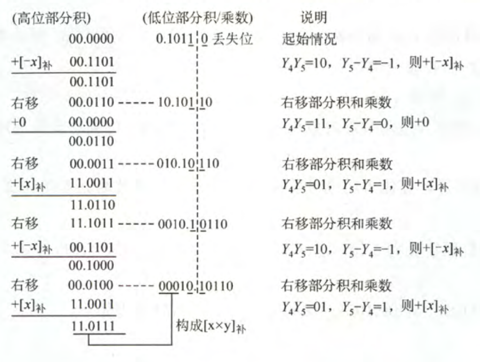

# 计算机组成原理

## 第一章

发展：

1. 第一代：电子管
2. 第二代：晶体管
3. 第三代：中小规模集成电路
4. 第四代：超大规模集成电路

摩尔定律：18个月集成电路上的晶体管翻倍；

通用计算机：巨型机、大型机、中型机、小型机、微型机、单片机

按照指令分类：

* 单指令流单数据流SISD：传统冯诺依曼结构
* 单指令流多数据流SIMD：阵列处理器
* 多指令流单数据流MISD：不存在
* 多指令流多数据流MIMD

### 层次结构

计算机 = 硬件系统 + 软件系统

硬件的基本组成：

* 冯诺依曼机：

  1. 计算机由运算器、存储器、控制器、I/O组成
  2. 指令和数据无区别，均为二进制数据
  3. 指令 = 操作码 + 地址码
  4. 顺序执行

* 功能部件：

  * I/O：键盘、鼠标等；

  * 存储器：存储数据和指令，分为内存和外存；

    地址寄存器MAR：存放有效地址，用于寻址

    数据寄存器MDR：暂存读写的数据

  * 运算器：用于处理数据，核心为算术逻辑单元ALU；

  * 控制器：控制数据、指令的执行，包含PC、IR；

  

软件的分类：

* 系统软件
* 应用软件

三种级别的语言：（由低到高）

* 机器语言
* 汇编语言
* 高级语言

工作流程：

1. 将数据和指令装入主存
2. 从起始地址开始运行
3. 取指、译码、执行

### 性能指标

吞吐量：单位时间内处理请求的数量；

响应时间：从请求到响应的时间；

时钟周期：CPU的最小时间单位；

主频：时钟的频率，越大性能越好；$f = \frac{1}{T}$

CPI：执行一条指令所需的时钟周期数；

$CPU的执行时间 = \frac{CPI \cdot 指令数}{主频}$

MIPS：每秒执行多少百万指令；$MIPS = \frac{主频}{CPI}$

MFLOPS：每秒执行多少百万次浮点运算；

GFLOPS：每秒执行多少十亿次浮点运算；

## 第二章

r进制数：$(k_{n}k_{n-1}...k_{1})_r = \sum_{i=1}^{n}k_{i} \cdot r^i$

常用进制：十进制、二进制、十六进制

进制转换：

小端模式：由低到高存储各个比特；

大端模式：由高到低存储各个比特；

### 校验码

1. 奇偶校验码：码距为2，可检测出一位错误；

2. 海明码：

   $L-1 = D + C  \ (D \geq C)$，其中（L为最小码距，D为检错位数，C为纠错位数）

   步骤：以有效信息为1010，校验位数为3为例

   1. 检验：$n + k \leq 2^k - 1$

   2. 确定校验位分布：

      $p_i$在海明位号位$2^{i-1}$位置上
      $$
      H_7H_6H_5H_4H_3H_2H_1 \\
      D_4D_3D_2P_3D_1P_2P_1
      $$

   3. 分组，形成校验关系

      $D_1$在$H_3$上，$3 = 1 + 2  \ H_1(P_1) \ H_2(P_2)$，所以由$P_2P_1$校验

      $D_2$在$H_5$上，$5 = 1 + 4 \ H_1(P_1) \ H_4(P_3)$，所以由$P_3P_1$校验

      下面的同理；

   4. 校验位取值：由上面分组的

      $P_1 = D_1 \oplus D_2 \oplus D_3$

      依次类推

   5. 校验：

      $S_1 = P_1 \oplus D_1 \oplus D_2 \oplus D_3$

      依此类推

      若$S_3 S_2 S_1 = 000$，则无错，反之$S_3 S_2 S_1$就是错误位的位号；

3. CRC校验码：

   信息位 + 校验位 （K位 + R位）：

   步骤：令生成函数$G(R) = x^3 + x^2 + 1$，信息码为$101001$

   

   检错和纠错：将收到的CRC码➗G(R)，余数为0，则无错，反之，则余数为错误位的位号；

### 定点数

定点数：小数点位置固定

浮点数：小数点位置不固定

符号数：带符号位的数

定点小数：$x_0.x_1\sim x_n$，数值范围$(-1)^{x_0}(1-2^{-n})$

定点整数：$x_0.x_1\sim x_n$，数值范围$(-1)^{x_0}(2^{n}-1)$

原码：符号位 + 数的绝对值

反码：正数的反码是其本身，负数的反码是在原码的基础上，符号位不变，其他各个位取反；

补码：正数的补码是其本身，负数的补码是在原码的基础上，符号位不变，其他各个位取反后加一；

移码：$[X]_{原码} + 2^n$

运算：

1. 移位：

   * 对于正数：直接添加0
   * 负数：原码添加0，反码直接添加1，补码左移添加0，右移添加1；

2. 逻辑移位：直接添加0

3. 循环移位

4. 原码加减法：

   $[X]_{原码} = X_s.X_1 \sim X_n, \ [Y]_{原码}=Y_s.Y_1 \sim Y_n$

   * 加法：如果$X_s == Y_s$，则直接$X_1 \sim X_n + Y_1 \sim Y_n$，反之则做减法
   * 减法：如果$X_s == Y_s$，则直接相减，反之相加

5. 补码加减法：

   $[X]_{补码} = X_s.X_1 \sim X_n, \ [Y]_{补码}=Y_s.Y_1 \sim Y_n$

   * 加法：$[X+Y]_{补码} = ([X]_{补码} + [Y]_{补码}) \ mod \ 2^{n+1}$
   * 减法：$[X-Y]_{补码} = ([X]_{补码} + [-Y]_{补码}) \ mod \ 2^{n+1}$

6. 溢出：超出表示范围

   判断方法：

   * $[A]_{补码}=A_S A_1 \sim A_n,[B]_{补码}=B_s B_1 \sim B_n$

     $V = A_s B_s \overline{S} + \overline{A}\overline{B}S$，S为结果

     若$V = 0$，则无溢出，反之则溢出；

   * 双符号位

     * $S_{s1}S_{s2} = 00$，表示结果为正数，无溢出；
     * $S_{s1}S_{s2} = 01$，表示结果正溢出
     * $S_{s1}S_{s2} = 10$，表示结果负溢出
     * $S_{s1}S_{s2} = 11$，表示结果为负数，无溢出；

   * 符号位进位$C_s$与最高数位进位$C_1$

     $V = C_s \oplus C_1$，若$V = 0$，则无溢出，反之则溢出；

7. 乘法

   原码乘法：

   

   补码乘法：

   ​	

### 浮点数

$N = r^{E} \cdot M$（E是阶码，M是尾数）

结构：$J_rJ_1\sim J_mS_rS_1\sim S_n，J_r为阶符，J_1\sim J_m为阶码，S_r为数符，S_1\sim S_n为尾数$；

规格化是将浮点数的小数点前只有一个1；

IEE754：关于浮点数的标准

$(-1)^S\cdot 1.M\cdot 2^{E-偏置值}$

| 类型       | 数符 | 阶码 | 尾数数值 | 总位数 | 偏置值 |
| ---------- | ---- | ---- | -------- | ------ | ------ |
| 短浮点数   | 1    | 8    | 23       | 32     | 127    |
| 长浮点数   | 1    | 11   | 52       | 64     | 1023   |
| 临时浮点数 | 1    | 15   | 64       | 80     | 16383  |

### ALU

一位全加器：

$S_i = A_i \oplus B_i \oplus C_{i-1},\ C_i = A_iB_i+(A_i \oplus B_i)C_{i-1} \ 其中C_{i-1}为上一位进位$

串行加法器：数据串行通过一个一位加法器；

并行加法器：数据并行通过多个一位加法器；

## 第三章

存储器的作用：作为主存、辅村、高速缓存器

介质：磁表面、磁芯等

存取方式：随机存储器RAM、只读存储器ROM、串行访问存储器

可保存性：易失性存储器、非易失性存储器

性能指标：

* 容量 = $字数 \cdot 字长$

* 存储速度

  

### 层次化结构

三级存储结构：

半导体随机存储器：

SRAM：非破坏性读出、易失性存储器；速度快、集成度低、功耗大；一般用于cache；

DRAM：集成度高、功耗低、容量大；一般用于主存；由于DRAM上的电荷只能维持1-2ms，因此需要刷新：

* 集中刷新：所有**行**进行刷新，其间不能进行访问，为访存死区；
* 分散刷新：每一行单独刷新，分散到各个周期；
* 异步刷新：结合集中刷新和分散刷新；

读写周期：

|            | SRAM     | DRAM     |
| ---------- | -------- | -------- |
| 存储信息   | 触发器   | 电容     |
| 破坏性读出 | 非       | 是       |
| 需要刷新   | 不要     | 需要     |
| 送行列地址 | 同时送   | 分两次送 |
| 运行速度   | 快       | 慢       |
| 集成度     | 低       | 高       |
| 功耗       | 大       | 小       |
| 存储成本   | 高       | 低       |
| 主要用途   | 高速缓存 | 主机内存 |

只读存储器：结构简单、非易失性

类型：

* 掩膜式ROM：无法改变内容
* 一次可编程ROM：一次性编程
* 可擦除可编程ROM：可重复读写
* 闪存：长期保存，可读写；
* SSD：Flash芯片

主存拓展：

* 位拓展：特点是地址、片选信号合在一起，数据总线分开
* 字拓展：地址线进行片选
* 字位同时拓展

### 双口RAM、多模块存储器

双口RAM：允许两个CPU异步访问；

多模块存储器：单体多字存储器、多体低位交叉存储器

* 单体多字存储器：一个存储体，每个单元m个字，总线宽度也为m个字，一次性读取m个字；

  优点：快

  缺点：指令、数据必须连续，否则效果不好；

* 多体并行存储器：高位交叉编址、低位交叉编址

  高位交叉编址：

  

  低位交叉编址：

  

  低位交叉编址可采用流水线并行存取，存取周期T，总线传送周期r，则$模块数 \ge m = \frac{T}{r}$，连续m个字的存取时间$t_1 = T + (m-1)r$，$编号 = 地址 \% 模块数$；

### 高速缓冲存储器

局部性原理：访问过的可能会再次访问；

高速缓冲存储器：通常由SRAM构成，分成若干个cache块；

流程：

$cache命中率 H= \frac{总命中次数N_c}{N_c + 访问总次数N_m}$

平均访问时间 $T = Ht_c+(1-H)t_m$，$t_c$为cache访问时间，$t_m$未命中访问时间；

主存到cache的映射：

* 直接映射：$j = i\mod{2^c}$，$j$为cache块号，$i$为主存块号，$c$为cache总块数；

  地址结构：主存子块标记 + cache子块地址 + 子块内地址

  缺点：冲突概率高，利用率低；

* 全相联映射：主存可装入任何位置

  地址结构：主存子块标记 + 子块内地址

  优点：灵活、冲突概率低、命中率高

  缺点：成本高，地址变换速率慢；

* 组相联映射：cache分成多组，组内可以装入任何内存；即组外直接映射，组内全相联；

  $j = i\mod{Q}$，$j$为组号，$i$为块号，$Q$为组数；

cache中主存块的替换算法：

1. 随机算法：效率低
2. FIFO：先进先出，效率一般
3. LRU：最近最少使用
4. LFU：最不经常使用

cache写策略：使cache与主存内容保持一致：

* 命中：
  * 全写法：当cache写命中时，同时写入cache和主存；替换时，直接覆盖cache块；
  * 写回法：写命中时，只修改cache，只有换出时才写回主存；
* 不命中：
  * 写分配法：加载主存中的块到cache中
  * 非写分配法：只写入主存，不进行调块

### 虚拟存储器

虚地址：用户编程涉及的为虚地址，即逻辑地址；

实地址：实际的主存单元地址，即物理地址；

本质上虚拟存储器是为了缓解内存压力；

1. 页式虚拟存储器
2. 段式虚拟存储器
3. 段页式虚拟存储器

TLB：转换检测缓冲区，快表，由相联存储器构成，存储常用的页表项；

访问顺序：TLB、页表、cache、主存

## 第四章

### 指令格式

格式：操作码 + 地址码

分类：

* 零地址指令：只有操作码

  常见指令：空操作、停机、关中断、出栈等；

* 一地址指令：$OP + A_1$

  单操作，如加一、减一、求反等；或者为隐含约定目的地址的双操作数指令；

* 二地址指令：$OP + A_1 + A_2$

  $A_1$为源地址，$A_2$为目的地址；

* 三地址指令：$OP + A_1 + A_2 + A_3$

  $A_1、A_2$为源地址，$A_3$为目的地址；

* 四地址指令：$OP + A_1 + A_2 +A_3 + A_4$

  $A_1、A_2$为源地址，$A_3$为目的地址，$A_4$为下条指令的地址；

### 指令寻址方式

指令寻址：

1. 顺序寻址：PC = PC + 1
2. 跳跃寻址：jmp（本质为修改PC为跳跃的地址）

数据寻址：

​		操作码 + 寻址特征 + 形式地址

* 隐含寻址：不明显给出操作数地址，指令中隐含地址；
* 立即数寻址：$OP \  A$，$A$就为操作数
* 直接寻址：$OP \ A$，$A$为操作数的地址
* 间接寻址：$OP \ A$，$A$为操作数的地址的地址
* 寄存器寻址：$OP \ A$，$A$为寄存器，寄存器内的值为操作数
* 寄存器间接寻址：$OP \ A$，$A$为寄存器，寄存器内的值为操作数的地址
* 相对寻址：$OP \ A$，$PC + A$为操作数的地址
* 基址寻址：$OP \ A$，$基址寄存器 BR + A$为操作数的地址
* 变址寻址：$OP \ A$，$变址寄存器IX + A$
* 堆栈寻址：利用堆栈指针$SP$

| 寻址方式           | 有效地址      | 访存次数 |
| ------------------ | ------------- | -------- |
| 隐含寻址           | 程序指定      | 0        |
| 立即寻址           | A即是操作数   | 0        |
| 直接寻址           | EA = A        | 1        |
| 一次间接寻址       | EA = (A)      | 2        |
| 寄存器寻址         | EA = $R_i$    | 0        |
| 寄存器间接一次寻址 | EA = ($R_i$)  | 1        |
| 相对寻址           | EA = (PC) + A | 1        |
| 基址寻址           | EA = (BR) + A | 1        |
| 变址寻址           | EA = (IX) + A | 1        |

CISC：复杂指令系统

* 指令系统复杂庞大
* 指令的长度不固定，指令格式多，寻址方式多
* 可以访存的指令不受限制
* 各种指令使用频度相差大
* 各种指令执行时间相差大，大多数指令需多个时钟周期才能完成
* 控制器大多数采用微程序控制
* 难以用优化编译生成高效的目标代码程序

RISC：精简指令系统

* 选取使用频率最高的一些简单指令，复杂指令由简单指令的组合完成
* 指令长度固定，指令格式少，寻址方式种类少
* 只有Load/Store指令访存，其余指令的操作都在寄存器中进行
* CPU中通用寄存器数量多
* RISC一定采用指令流水线技术，大部分指令在一个时钟周期内完成
* 以硬布线控制为主，不用或少用微程序控制
* 重视编译优化工作

