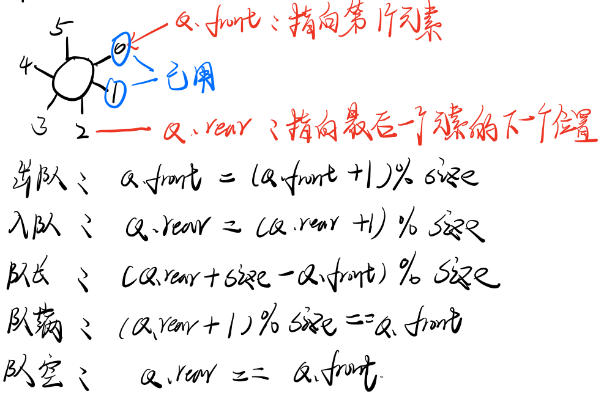
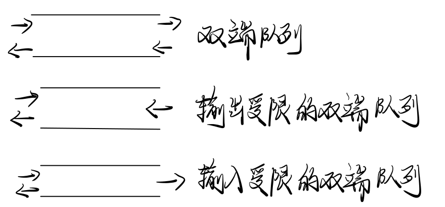
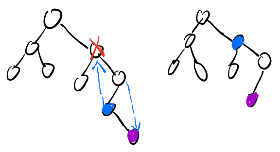
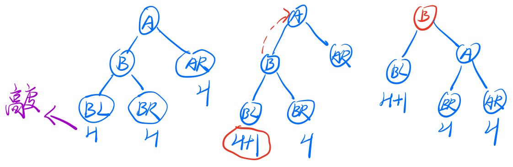
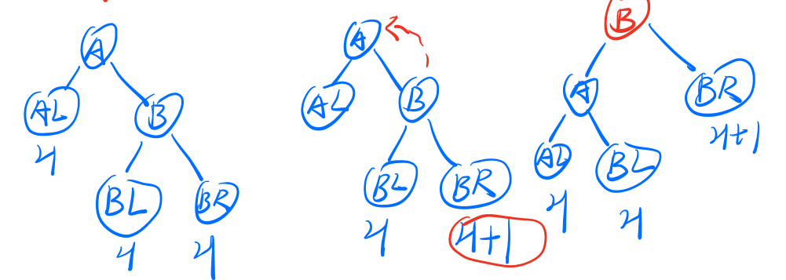
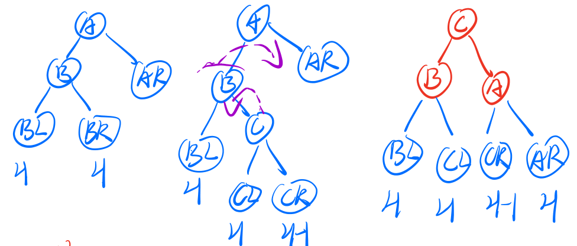
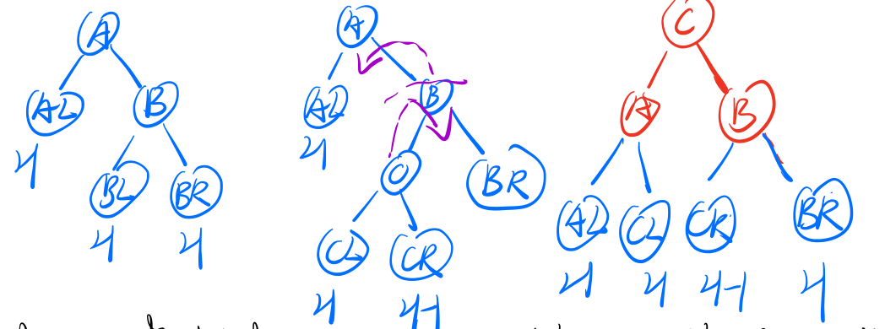
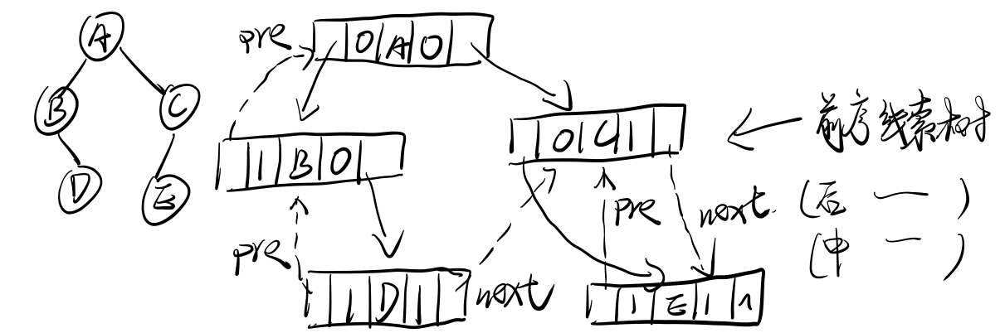
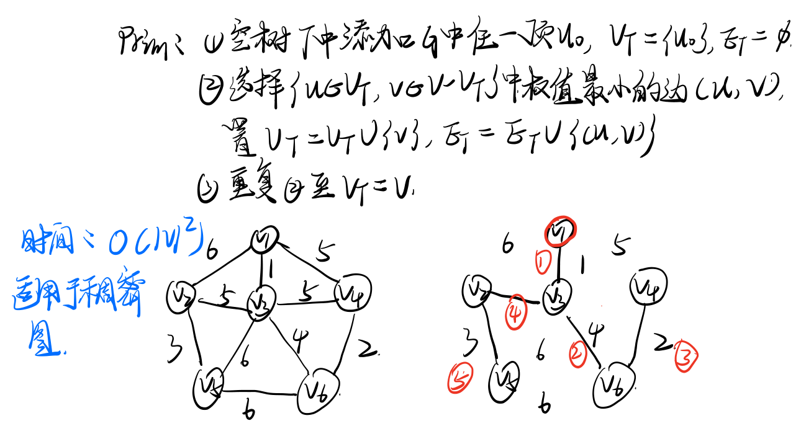
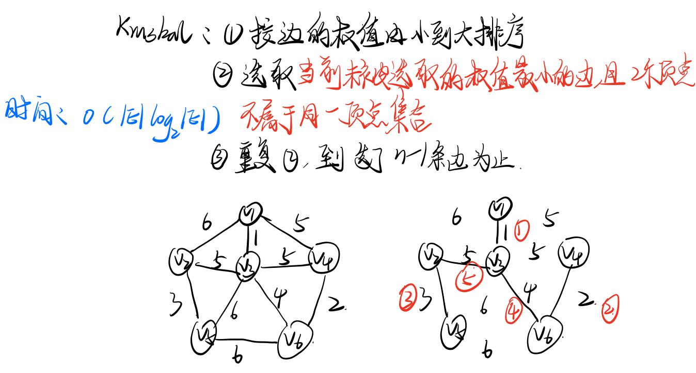

# 数据结构

## 基础

时间复杂度：算法中所有语句执行的次数

两种规则：

1. 加法：$T(n)=T_{1}(n)+T_{2}(n)=O(f(n))+O(g(n))=O(max(f(n),g(n)))$
2. 乘法：$T(n)=T_{1}(n)\cdot T_{2}(n)=O(f(n))\cdot O(g(n))=O(f(n)\cdot g(n))$

递归的时间复杂度取决于递归深度；

空间复杂度：运行时所用的辅助空间的大小；

## 线性表

线性表：

* 顺序表：类比数组
* 链表

### 顺序表

顺序表：一组**连续的**存储单元，一次存储，因此**逻辑上、物理上都相邻**，因此可以实现**随机存取**；

缺点：

* 插入、删除需移动大量元素
* 分配需要一段连续的空间

插入：

```cpp
// 位置i 插入 e
for(int j = L.length(); j >= i; j--)
    L.data[j] = L.data[j-1];
L.data[i-1] = e;
L.length++;
// 时间复杂度为O(n)
```

删除：

```cpp
// 删除位置i元素
for(int j = i;j < L.length(); j++)
    L.data[j-1] = L.data[j];
L.length--;
// 时间复杂度为O(n)
```

查找：

* 按下标查找：时间复杂度为O(1)；
* 按值查找：时间复杂度为O(n)；

### 链表

定义：

```cpp
struct node{
    elemtype data;
    node* next;
}
```

建立：

* 头插法：新节点插入表头

  ```cpp
  newNode->next = L->next;//L为表头
  L->next = newNode;
  ```

* 尾插法：新节点插入表尾

  ```cpp
  r->next = newNode;// r为尾指针
  r = newNode;
  ```

插入：

```cpp
// 在i插入新节点
node* p = get(i-1); // 获取前驱节点
newNode->next = p->next;
p->next = newNode;
```

删除：

```cpp
// 删除节点i
node* p = get(i-1); // 获取前驱节点
node* delNode = p->next;
p->next = delNode->next;
free(delNode);
```

求表长：

```cpp
int length(node* head){
    if(head == nullptr) return 0;
    int lens = 0;
    while(head != nullptr){
        head = head->next;
        lens++;
    }
    retrun lens;
}
```

### 栈和队列

操作受限的线性表；

栈：只允许一端进行插入、删除

队列：只允许一端插入，另一端删除

循环队列：



双端队列：



应用

队列：层次遍历、缓冲区、内存管理的就绪队列

栈：数制转换、括号匹配、表达式求值

### 特殊矩阵压缩存储

二维数组：

* 行优先
* 列优先

对称矩阵：$A[n][n]$可以存入$B[\frac{n(n+1)}{2}]$中

三角矩阵：

* $\left[\begin{array}{}a_{11}\\ \vdots & \ddots &\\ a_{n1} & \cdots & a_{nn}\end{array}\right]$

  

* $\left[\begin{array}{}a_{11} & \dots & a_{1 n} \\ & \ddots & \vdots \\ & & a_{n n}\end{array}\right]$

## 树与二叉树

节点的度：树中一个节点的子节点的数量

树的度：树中节点的最大度数

分支节点：度大于0的节点

叶子节点：度为0的节点

节点的深度：从上到下的层数

树的高度或深度：树中节点的最大层数

路径：两个节点之间所经过的节点序列

路径长度：路径上所经过的边的条数

性质：`节点总数 = 总度数 + 1`

### 二叉树

* 度为2

* 满二叉树：每一层都充满了

  完全二叉树：编号与节点次序一一对应

完全二叉树的性质：

1. $i \leq \left \lfloor \frac{n}{2} \right \rfloor$，则节点i为分支节点
2. $i > \left \lfloor \frac{n}{2} \right \rfloor$，则节点i为叶子节点
3. 叶子节点只可能出现在最后一层
4. 若存在度为1的节点，则只存在一个，且只存在左孩子，不存在右孩子；
5. 编号后，若节点i为叶子节点，则j>i的节点i均为节点；
6. 若n为奇数，则每个分支节点都有左右子节点；若n为偶数，则编号最大的分支节点为$\frac{n}{2}$，且只有左节点，其他均有左右子节点；
7. 节点i所在层数：$\left \lfloor log_{2} i \right \rfloor + 1$
8. n个节点的树的高度$h = \left \lceil log_{2}(n+1) \right \rceil$或$h = \left \lfloor log_{2} n \right \rfloor + 1$

遍历：

* 先序：根左右

  ```cpp
  void preorder(node* root){
      if(root == nullptr)	return;
      // 处理根
      preorder(root->left);
      preorder(root->right);
  }
  ```

* 中序：左右根

  ```cpp
  void inorder(node* root){
      if(root == nullptr)	return;
      inorder(roo->left);
      //处理根
      inorder(root->right);
  }
  ```

* 后序：左右根

  ```cpp
  void postorder(node* root){
      if(root == nullptr) return;
      postorder(root->left);
      postorder(root->right);
      // 处理根
  }
  ```

* 层次遍历

  ```cpp
  void levelorder(node* root){
      if(root == nullptr) return;
      queue<node*> q;
      q.push(root);
      while(!q.empty()){
          int size = q.size();
          for(int i = 0; i < size; i++){
              node* tmp = q.front();
              q.pop();
              // 处理tmp
              if(tmp->left) q.push(tmp->left);
              if(tmp->right) q.push(tmp->right);
          }
      }
  }
  ```

只有`中序+先序、中序+后序、中序+层次`才可以唯一确定一棵树；

### 二叉排序树

定义：左子树节点 < 根节点，右子树节点 > 根节点（或全相反）

**中序遍历可得到递增有序序列！**

查找：

```cpp
bool find(node* root,elemtype key){
    if(root == nullptr)	return false;
    if(key == root)	return true;
    if(key > root->data)	return find(p->right, key);
    if(key < root->data)	return find(p->left, key);
}
```

平均时间：$O(log_{2}n)$

最坏时间：$O(n)$

插入：

```cpp
void insert(node* root,elemtype key){
    if(root == nullptr)	root = new node(key);
    else if(key == root->data)	return;
    else if(key < root->data) insert(root->left, key);
    else	insert(root->right, key);
}
```

删除：

* 若为叶节点，则直接删除

* 若左空，则用右填；若右空，则用左填；

* 若左右非空，则令X的中序的后继节点代替X，从二叉树中删除X；

  

### 平衡二叉树

平衡因子：左右子树的高度差

平衡二叉树：任意节点的平衡因子小于等于1；

插入：

1. 像二叉树一样先插入节点

2. 不平衡则进行旋转

   **LL旋转：**

   

   **RR旋转：**

   

   **LR旋转**：先RR旋转，然后LL旋转

   **RL旋转**：先LL旋转，然后RR旋转

   

树转换为二叉树：森林中每个节点，左指针指向第一个孩子节点，右节点指向相邻的兄弟节点；

森林转换为二叉树：每棵树转换为二叉树，然后根部相连；

### 线索二叉树

二叉树线索化，便于直接查找节点的前驱和后继；

结构：

```cpp
// 前驱、后继由遍历方式决定，如前序、中序、后序线索二叉树
struct node{
    int ltag;// 为0时，lchild指向左孩子；为1时，lchild指向前驱
    node* lchild;
    int rtag;// 为0时，rchild指向右孩子；为1时，rchild指向后继
    node* rchild;
}
```



### Huffman树

$WPL = \sum_{i=1}^{n} w_{i}l_{i}$

Huffman树：WPL最小的二叉树（不唯一）；

构造方式：

1. N个节点作为N个二叉树
2. 每次选择根节点权值最小的2个二叉树合并，一直重复到只有一个二叉树

## 图

* 边：顶点的无序对$(v,w)$

* 弧：顶点的有序对$<v,w>$

* 无向图：边的集合

* 有向图：弧的集合

* 度：以该顶点为一个端点的边的数目

  无向图的顶点v的度记为TD(v)

  有向图：

  * 入度：以顶点v为终点的边的数目，记为ID(v)
  * 出度：以顶点v为起点的边的数目，记为OD(v)
  * TD(v) = ID(v) + OD(v)

* 连通：从v到w有路径，则称v，w是连通的

* 连通图：任意2个节点之间是连通的

* 连通分量：无向图的极大连通子图

* 强连通：有向图中从v到w，从w到v都有路径，则称v、w强连通；

* 强连通图：任意2个节点是强连通的

* 强连通分量：有向图的极大强连通子图

* 完全图：

  * 无向图：任意2个点之间存在边，边数：$\frac{n(n-1)}{2}$
  * 有向图：任意2个顶点之间存在方向相反的2条边，边数：$n(n-1)$

* 子图：$G=(V,E),G^{'}=(V^{'},E^{'})$，若$V^{'}$是$V$的子集，$E^{'}$是$E$的子集，则$G^{'}$为$G$的子图；

* 生成树：连通图的生成树是包含图中全部顶点的极小连通子图；

* 生成森林：非连通图中连通分量的生成树组成的生成森林；

* 路径：顶点p到q的顶点序列

* 路径长度：顶点p到q的顶点序列的长度

* 简单路径：路径序列中顶点不重复出现

* 稠密图：边数较多（一般判断准则：$|E| < |V|log|V|$

* 稀疏图：变数较少

### 图的存储

1. 邻接矩阵：存储在二维矩阵$A[n][n]$中

   $A[i][j] = \left\{\begin{matrix}
   & 1, \ i,j相连\\ 
   & 0, \ i,j不相连
   \end{matrix}\right.$

   适用于稠密图

   优点：判断相连快

   缺点：统计边数代价大

2. 邻接表法：适用于稀疏图

   

### 图的遍历

BFS（广度优先）：

1. 访问起始点v
2. 依次访问未访问过的邻接顶点$w_i$
3. 从访问过的顶点出发，再访问它们所有未被访问过的邻接顶点
4. 另选一个未被访问过的顶点，重复上述步骤；

时间复杂度：

* 采用邻接矩阵：$O(|V|^2)$
* 采用邻接表：$O(|E|+|V|)$

空间复杂度：$O(|V|)$

DFS（深度优先）：

1. 访问起始点v
2. 从v出发，访问v的邻接顶点中未被访问过的顶点$w_1$，再访问$w_1$的邻接顶点中未被访问的顶点，依次类推
3. 不能继续向下访问时，退回到最近被访问的点，若有未访问的邻接顶点，则从该顶点重复上面的步骤，直到全部访问过；

时间复杂度：

* 采用邻接矩阵：$O(|V|^2)$
* 采用邻接表：$O(|E|+|V|)$

空间复杂度：$O(|V|)$

### 最小生成树

所有生成树中边的权值之和最小的那颗生成树；

性质：

* 不唯一
* 各边权值不相同，则生成树唯一
* 权值唯一

方法：

* prim

  

* kruskal：

  

### 最短路径

