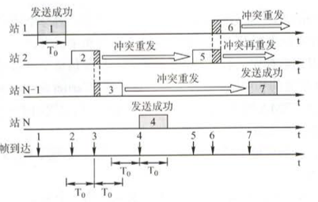

# 计算机网络

## 第一章

计算机网络：一个互联、自治的计算系统的集合。

定义：

* 广义：实现远程信息处理或资源共享

资源共享：

* 目的：资源共享
* 组成单元：不同的计算机
* 统一规则：网络协议

用户透明性：为用户自动管理资源的网络操作系统（分布式系统）；

计算机网络的组成：

* 组成部分：
  * 硬件：网卡、交换机、路由器
  * 软件：OS、FTP
  * 协议：网络传输的的规范！(核心)
* 工作方式：边缘部分、核心部分
* 功能组成：通信子网和资源子网

计算机网络的功能：

1. 数据通信：最基本和最重要的功能
2. 资源共享
3. 分布式处理
4. 提高可靠性
5. 负载均衡

计算机网络分类：

* 分布范围：广域网WAN、城域网MAN、局域网LAN、个域网PAN
* 传输技术：广播式网络、点对点网络
* 拓扑结构：星形网络、总线形网络、环形网络、网状网络
* 使用者：公用网、专用网
* 交换技术：电路交换网、报文交换网、分组交换网
* 传输介质：有线网、无线网

### 计算机网络的性能指标

* 带宽：传输数据能力（单位bps）

* 时延：`总时延= 发送时延 + 传播时延 + 处理时延 + 排队时延`

  * 发送时延：分组所有比特传输到链路上的时延

    $T = \frac{分组长度}{带宽}$

  * 传播时延：分组从一端到另外一端

    $T = \frac{信道长度}{传播速度}$

  * 处理时延：为*存储转发*而处理花费的时间

  * 排队时延：排队等待的时延

* 时延带宽乘积：时延 \* 带宽，相当于信道可容纳的比特数

* 往返时延(RTT)：发送到接收的时间

* 吞吐量：单位时间的数据量

### 计算机网络的体系结构

各层及其协议的集合

* 原则：相对独立

* 实体：任何可以发送或接收信息的硬件或软件进程，通常是一个特定的软件模块

* 对等实体：不同机器上的同一层的实体

* 服务数据单元（SDU）：用户要求传送的数据

* 协议控制单元（PCI）：控制协议操作的信息

* 协议数据单元（PDU）：对等层次之间传输的数据单元

* 协议：规则的集合，对等实体进行通信的规则

  * 语法：传输数据的格式
  * 语义：要完成的功能
  * 同步：各种操作的先后顺序

* 接口：同一结点**相邻两层**间交换信息的连接点（服务访问点SAP）

* 服务：下层为相邻的上层提供的功能调用

  服务原语：

  * 请求：由服务用户发往服务提供者，请求完成某项工作
  * 指示：有服务提供者发往服务用户，指示用户做某件事
  * 响应：由服务用户发往服务提供者，作为对指示的响应
  * 证实：由服务提供者发往服务用户，作为对请求的证实

  本层的服务用户无法看见下面的协议，即下层协议对上层服务透明。

* 分类：

  * 面向连接服务：必须先建立起连接，分配相应的资源以保证通信，结束后释放资源；无连接的服务：无需先建立起连接，发送时直接发送；
  * 可靠服务、不可靠服务
  * 有应答服务、无应答服务

### OSI（开放标准互联）

1. 应用层：为特定类型的应用程序提供访问OSI环境的手段
2. 表示层：处理信息的表示方式
3. 会话层：允许不同主机各进程间的会话
4. 传输层：负责主机之间两个进程间的通信协议（TCP、UDP）
5. 网络层：路由选择，实现**流量控制、拥塞控制**（IP、ICMP）
6. 数据链路层：将IP数据报**组装成帧、差错控制、流量控制**（SDLC、HDLC）
7. 物理层：传输比特流，定义物理层接口标准

TCP/IP：

1. 应用层：为特定类型的应用程序提供访问TCP/IP环境的手段
2. 传输层：使对等实体进行会话
3. 网际层：网络层将分组发往任何网络
4. 网络接口层：物理层+数据链路层

## 第二章

数据：传送消息的实体

信号：数据的电气或电磁表现

码元：一个固定时长的信号波形

```
信 源 +----->编 码 +------>信  道 +------->译 码 +------>信 宿
                         	^
                         	|
                        	+
                       	 噪  声
```

单工：只有一个方向能进行通信

半双工：双方都能进行通信，但不能同时进行

双工：能双向通信

奈奎斯特定理：$R_B = 2Wlog_2 V$(W为带宽，V为码元种类数)

香农定理：$R_b = Wlog_2(1+\frac{S}{N})$(W为带宽，$\frac{S}{N}$为信噪比)

调制：

* 归零编码
* 非归零编码
* 曼彻斯特编码
* 差分曼彻斯特编码

数模转化：2ASK、2FSK、2PSK

模数转化：PCM


|            | 数据报服务                     | 虚电路服务                                   |
| ---------- | ------------------------------ | -------------------------------------------- |
| 连接的建立 | 不要                           | 要                                           |
| 目的地址   | 每个分组都有完整的目的地址     | 仅在建立连接时使用，之后每个分组使用虚电路号 |
| 路由选择   | 每个分组独立进行路由选择和转发 | 属于同一条虚电路的分组按照同一路由转发       |
| 分组顺序   | 不保证有序到达                 | 保证分组有序到达                             |
| 可靠性     | 不保证可靠通信                 | 保证可靠通信                                 |

传输介质：

* 双绞线：常用于局域网和电话网，通信距离几到几十公里
* 同轴电缆（传输速率高）：
  * 50Ω：传输基带信号，用于LAN
  * 75Ω：传输宽带信号，用于有线电视
* 光纤：带宽范围极大，使用远距离传输
* 无线：无线电波、微波、红外线

物理层接口特性：

* 机械特性：形状、引脚等
* 电气特性：电压高低
* 功能特性
* 规程特性

物理层设备：

* 中继器：信号**整形再生**！！（不能连接两个不同速率的两端，且协议需一致）

  **5-4-3规则**：4个中继器串联的5段介质只有3个可以接PC

* 集线器：多端口中继器，用于组装共享网络

## 第三章

数据链路层功能：为网络层提供服务；提供的服务

* 无确认的无连接服务
* 有确认的无连接服务
* 有确认的面向连接服务

链路管理：数据链路层连接的建立、维持和释放过程；

帧定界：用于确定帧的界限

透明传输：内容中出现标识符F而提前结束，因而要解决此问题。

流量控制：发送方速率可能大于接收方，因此需要流量控制。

差错控制：

* 位错：帧中某些位出错，可以用CRC来发现错误。
* 帧错：帧的丢失、重复或失序，可以用定时器和编号解决。

组帧：目的是提高传输效率，帧是最小的传输单元。

组帧的技术：

1. 字符计数：在头部使用一个计数字段标明帧长

   缺点：一旦出错，则后面全错。

2. 字符填充的首尾定界符法：用特定字符标识开始和结束，用转义字符区分信息中的特殊字符。

3. 比特填充的首尾标志法：用`01111110`标识开始和结束，内容内5个连续的1后插入一个0；

差错控制：

* 自动重传
* 前向纠错
  * 检错：奇偶校验码、循环冗余码（CRC）
  * 纠错码：海明编码

流量控制：对链路上的帧的发送速率的控制。

* 停等式：发送方必须等待接收方的应答信号
* 滑动窗口：发送方维持一组连续的允许发送的帧，称为发送窗口
  * 停等式：发送窗口大小=1，接收窗口大小=1
  * go back n：发送窗口大小=1，接收窗口大小=1
  * 选择重传：发送窗口大小>1，接收窗口大小>1

### 可靠的传输机制

* 确认
* 超时重传

停等式：


$$
t_{out} \ge 2t_{pr} + t_{p}+t_{a} \\
t_{out}:设置的重传时间，t_{pr}：处理时间，t_{p}:传播时延，t_{a}:发送时延
$$
Go Back N：


窗口大小：$1 \le N_r \le 2^n -1$

选择重传：

 
$$
W_R + W_T \le 2^{n-1} \\
W_R 为接收窗口，W_T为发送窗口
$$
### 介质访问控制层（MAC）

隔离同一信道上的其他节点的信号。

* 信道划分介质访问控制

  * 频分多路复用（FDM）
  * 时分多路复用（TDM）
  * 波分多路复用
  * 码分多路复用

* 随机访问介质访问控制

  核心思想：胜利者获得信道

  本质：将广播信道转化为点对点信道

  * ALOHA协议：

    * 纯ALOHA

      

      通过量：$S=Ge^{-2G}$，G为网络负载

    * 时隙ALOHA：将时间划分成时隙，只有时隙开始才可以发送

      

      通过量：$S = Ge^{-G}$，G是网络负载

  * CSMA协议：

    * 1-坚持CSMA：当一个节点要发送数据是首先侦听信道，如果信道空闲则立即发送数据；如果信道忙，则等待，同时继续侦听信道直至信道空闲；如果发生冲突，则随机等待一段时间后，再重新开始侦听信道。
    * 非坚持CSMA：当一个节点要发送数据是首先侦听信道，如果信道空闲则立即发送数据；如果信道忙，则放弃侦听，等待一个随机的时间后再重复上述过程。
    * p-坚持CSMA：用于时分信道，当一个节点要发送数据是首先侦听信道，如果信道空闲则以概率P发送数据；如果信道忙，则等待下一个时隙再侦听；

  * CSMA/CD协议：载波侦听多路访问/碰撞检测协议，适用于总线型网络或半双工网络环境。**载波侦听**就是发送前先侦听，若有其他站点发送，则等待至信道空闲。**碰撞检测**是边发送边侦听。简单概括：`先发后听，边发边听，冲突停发，随机重发`

    

  * CSMA/CA：CSMA/CA采用二进制指数退避算法。信道从忙态变为空闲时，任何一个站要发送数据帧时，不仅都必须等待一个时间间隔，而且还要进入争用窗口，并计算随机退避时间以便再次重新试图接入到信道。这样做就减少了发送碰撞的概率。当检测到信道是空闲的，并且这个数据帧是要发送的第一个数据帧时，才不使用退避算法。

    CSMA/CA还使用预约信道、ACK帧、RTS。CTS等机制来避免碰撞。

* 轮循访问介质访问控制：令牌传递协议

局域网：小范围通过双绞线和同轴电缆连接起来的网络

* 常见结构：星形、环形、总线型

广域网：范围很广的长距离网络

局域网+广域网 = 互联网

### 数据链路层控制协议

1. ppp协议：使用串行线路通信的**面向字节**的协议

   三个组成部分：

   * 链路控制协议LCP：一种拓展链路控制协议用于建立、配置

   * 网络控制协议NCP：ppp允许采用不同的网络层协议，用相应的NCP配置

   * 将数据报封装到串行链路的方法

   * 帧格式：

     

   * 流程：

     

     PPP不纠错，只检错，只支持点对点，只支持全双工，可运行不同网络层协议

2. HDLC：高级数据链路层控制协议（面向比特）

   特点：不依赖于任何一种字符编码集，透明传输，采用“0比特插入法”，CRC校验。

   站：

   * 主站：负责控制链路的操作
   * 从站：受控于从站
   * 复合站：即为主站，也为从站

   配置方法：

   * 非平衡：一个主站
   * 平衡：都为复合站

   数据操作方式：

   * 正常响应模式：非平衡结构的操作方式，即主站向从站传输数据，从站进行响应传输，但是从站只有在接收到主站的许可后，才可以进行响应。
   * 异步平衡模式：平衡结构的操作方式，每一个复合站都可以进行对另外一个站的数据传输。
   * 异步响应模式：非平衡结构的操作方式，从站在没有接收到主站的运行下就可以进行传输。

   帧格式：

   

PPP与HDLC的异同：

* PPP面向字节，HDLC面向比特
* PPP帧比HDLC帧多一个2字节的协议字段，当协议字段为`0x0021`时，表示信息字段是IP数据报。
* PPP不使用序号和确认机制，只保证无差错接收，而端到端由高层协议负责。HDLC使用了编号和确认机制，能够提供可靠传输。

数据链路层设备：

* 网桥：处理帧，将网络分割成小的冲突域

  * 具有寻址和路径选择的能力
  * 协议转换

* 交换机：将网络分割成小的冲突域，两种交换模式：直通式、存储转发式。

  处理原理：检测从以太端口来的数据帧的源和目的地的MAC地址，然后与系统内部的动态查找表进行比较，若数据帧的MAC地址不在查找表中，则将该地址加入查找表中，并将数据帧发送给相应的端口。

## 第四章

### 网络层功能

1. 异构网络互联

   将两个以上的网络，利用中间设备，相互连接起来；

   中间设备：

   * 物理层：中继器、集线器
   * 数据链路层：网桥、交换机
   * 网络层：路由器
   * 网络层以上：网关

2. 路由和转发

   路由选择：按照一定的算法，根据从相邻路由器获取的关于网络拓扑的变化，动态的选择路由；

   分组转发：根据转发表将数据报从合适的端口转发；

3. 拥塞控制

   流量控制与拥塞控制的区别：流量控制是指发送端和接收端之间的点对点的控制，流量控制所要做的就是抑制发送端发送数据的速率，以便接收端来得及接收；而拥塞控制必须保证通信子网能够传送等待传送的数据，是一个全局性的问题；

   拥塞控制的方法：

   * 开环控制：在设计网络时事先将发送拥塞的原因考虑进去，是一种静态的预防方法；
   * 闭环控制：采用监控网络系统，即时检测到哪里发生拥塞，是一种基于反馈环路的动态的方法；

### 路由算法

* 静态路由算法：非自适应路由算法，不会根据网络拓扑变化而变化；

* 动态路由算法：自适应路由算法；

  * 距离矢量算法（RIP）：

    表项结构：`路径目的地+代价`

    与相邻路由交换表

  * 链路状态路由算法（OSPF）：

    表项结构：`路径目的地+代价`

    每个节点拥有完整的拓扑结构，根据Dijkstra等算法选择最优路径。

### 层次路由

两大类路由选择协议：

1. 内部网关协议IGP：如RIP、OSPF
2. 外部网关协议EGP：如BGP

### IPv4


IP数据报分片：原因在于数据链路层存在最大传输单元MTU；以太网的MTU=1500字节，广域网的MTU=576字节；

网络层的路由器执行的分组准发算法：

1. 从数据报中提取目的主机的IP，得出目的地址的网络地址N；
2. 若网络N直接与此路由器相连，则直接把数据报交付给目的主机，这就叫**直接交付**；反之则为间接交付；
3. 若路由表中有目的地址为D的特定主机路由，则把数据报转发给下一跳路由器；否则，执行4；
4. 若路由表中有到达网络N的路由，则把数据报传送给路由表指明的下一跳路由器；否则，执行5；
5. 若路由器表中有一个默认路由，则把数据报传送给默认路由器，否则，执行6；
6. 报告转发分组出错；

IPv4地址：32位 = 网络号 + 主机号

分类：

```
	1 2 3     8          16          24          32|
———————————————————————————————————————————————————|
A:	0|网络号   |主机号							   |
B:	1 0|网络号 			|主机号				   |
C:	1 1 0|网络号						|主机号	   |
D:	1 1 1 0|多播地址                                |
E:	1 1 1 1|保留地址								|
```

特殊IP地址：

* 主机号全为0表示网络本身
* 主机号全为1表示网络的广播地址
* 127.0.0.0网络保留为环路自检地址，此地址表示任意主机本身，目的地址为环回地址的IP数据报不会出现在任何网络上；
* 32位全为0，即0.0.0.0表示本网络上的本主机；
* 32位全为1，即255.255.255.255表示整个网络的广播地址，又称受限广播地址

### 网络地址转换NAT

将内部网络地址转换为公用地址；A、B类地址为公用地址，C类为私有地址，因特网不转发私有地址的数据报；

### 子网划分

IP = 网络号 + 子网号 + 主机号

子网掩码：32位，与IP相与得到子网号

无分类域间路由CIDR：

```
128.14.32.5/20 -> 掩码为20个1和12个0
```

匹配规则：最长前缀匹配

IP地址：网络层；硬件地址：数据链路层；

地址解析协议ARP：

* 工作在网络层，总用是查找P地址对应的MAC地址；
* 工作原理：当主机A向本局域网的主机B发送IP数据报时，就先在器ARP高速缓存中查看有无主机B的IP地址，如果有，则查出对应的MAC地址，再将此A硬件的MAC地址写入缓存；如果没有，则使用MAC地址为`FF-FF-FF-FF-FF-FF`的帧来封装并广播ARP请求分组，主机B接收到后，向主机A发送响应ARP分组，分组中包含主机B的IP地址与MAC地址的映射关系，主机A收到后将映射写入缓存。

动态主机配置协议DHCP：

* 应用层，基于UDP
* 工作原理：使用C/S方式，需要IP地址的主机在启动时就向DHCP服务器广播发送发现报文，这时该主机就成为DHCP客户，本地网络上的所有主机都能收到该广播报文，但只有DHCP服务器才回答此广播报文，DHCP服务器首先在其数据库中查找该计算器的配置信息，若找到，则返回找到的信息；反之，则从IP地址池里取一个地址分配给该计算机，DHCP服务器返回的回答报文称提供报文；

网际控制报文协议ICMP：

* IP层，用于报告差错控制和异常
* 例如：PING指令，tracert

