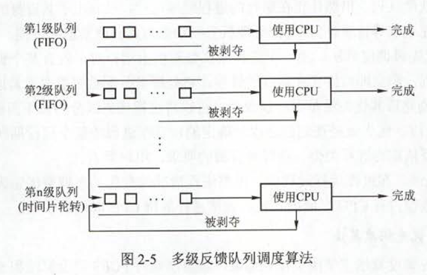

# 操作系统

## 概述

操作系统管理硬件，即控制和管理整个计算机硬件资源，并合理地组织和调度，并为应用程序提供接口API；

操作系统的特征：

1. 并发：两个或多个事件再同一时间间隔发生。
2. 共享：资源共享
   1. 互斥共享
   2. 同时共享
3. 虚拟：虚拟是指把一个物理上的实体变为若干个逻辑上的对应物。物理实体是实在的，而后者是虚拟的，用于实现虚拟的技术，称为虚拟技术；
4. 异步：异步处理不需要阻塞当前线程来等待处理完成，而是允许后续操作，直到其他线程将处理完成；

### 操作系统的目标

目标：

* 处理机管理：进程、线程的管理，进程控制、同步、通信、死锁等
* 存储管理：内存分配、地址映射、内存保护、共享内存
* 文件管理：所有信息都抽象为文件，具有文件和目录管理
* 设备管理：完成I/O请求，设备管理，缓冲管理等

### 发展史

1. 手工操作
2. 批处理：
   * 单道处理：自动性、顺序性、单道性，但是CPU利用率低
   * 多道处理：多道程序设计：多道宏观上并行，微观上串行；提高了CPU的利用效率，但存在调度问题，缺点在于缺少交互；
3. 分时OS：将时间分成时间片
4. 实时OS：及时性、可靠性

程序允许的两种状态：

1. 用户态
2. 内核态


## 进程与线程

进程：一个正在运行的过程，OS进行资源调度的单位；

PCB：进程控制块（Process control block），用于管理进程的数据结构；

进程映像：

* PCB
* 程序段
* 相关数据

进程的特征：

* 动态性：有创建、暂停、终止等状态，是最基本的特征；
* 并发性：为提高效率
* 独立性：相互之间独立
* 异步性
* 结构性

### 进程的状态


进程的创建：

1. 为新进程分配一个唯一进程标号，并申请一个空白的PCB
2. 为进程分配资源
3. 初始化PCB
4. 插入就绪队列

进程的终止：

1. 根据进程的标识符，检索PCB
2. 终止其子进程、该进程
3. 回收其全部资源
4. 将该PCB从队列删除

进程的阻塞：

1. 找到将要被阻塞进程的标识号对应的PCB
2. 若该进程为运行态，则保护现场，将其状态转为阻塞态，停止运行
3. 把该PCB插入到相应的事件的等待队列

进程的唤醒：

1. 在该事件的等待队列中找到相应进程的PCB
2. 将其总等待队列中移出，并设置其状态为就绪态
3. 把该PCB插入就绪队列中，等待调度程序调度

### 进程的切换

1. 保存处理机上下文，包括程序计数器和其他寄存器
2. 更新PCB信息
3. 把进程的PCB移入相应的队列，如就绪、在某个事件的等待队列等
4. 选择另外一个进程执行，更新其PCB
5. 更新内存管理的数据结构
6. 恢复处理机上下文

PCB是进程实体的一部分，是进程的唯一标识；

PCB结构：

| 进程描述信息      | 进程控制和管理信息 | 资源分配清单 | 处理机相关信息 |
| ----------------- | ------------------ | ------------ | -------------- |
| 进程标识符（PID） | 进程当前状态       | 代码段指针   | 通用寄存器值   |
| 用户表示符（UID） | 进程优先级         | 数据段指针   | 地址寄存器值   |
|                   | 代码运行入口地址   | 堆栈指针     | 控制寄存器值   |
|                   | 程序的外存地址     | 文件描述符   | 标志寄存器值   |
|                   | 进入内存时间       | 键盘         | 状态字         |
|                   | 处理机占用时间     | 鼠标         |                |
|                   | 信号量使用         |              |                |

进程间通信

1. 共享存储
2. 消息传递
3. 管道通信

### 线程

线程：“轻量级”线程，CPU的执行单元；

线程与进程的比较：

* 线程是独立调度的单元，而进程是资源分配的单元
* 线程之间共享其进程的数据，而进程之间相互独立
* 线程切换代价小，进程切换开销大

线程的实现方式：用户级、内核级、组合方式


### 调度

调度：按照一定的算法，公平、高效地选择一个进程来运行；

三级调度：

1. 作业调度：获取竞争的权利；
2. 内存调度：为提高内存利用率和系统吞吐量，将某些进程挂起；
3. 进程调度：按照某种规则，从就绪队列选取一个进程运行


不能进行进程切换的情况：

1. 处理中断中
2. 进程在内核态中
3. 其他需要完全屏蔽中断的原子性操作过程中

进程调度的方式：

1. 非抢占式：即使有某个进程迫切需要运行，仍会等待至当前进程执行完成，所以不适用于分时、实时OS；
2. 抢占式：不等待，直接进行切换；

$CPU利用率 = \frac{忙状态}{全部时间}$

系统吞吐量：单位时间CPU完成的作业数量

周转时间：$作业完成时间-作业提交时间$

平均周转时间：$\frac{作业1的周转时间 + ... + 作业n的周转时间}{n}$

带权周转时间：$\frac{作业周转时间}{作业实际运行时间}$

平均带权周转时间：$\frac{作业1的带权周转时间+...+作业n的带权周转时间}{n}$

等待时间：进程处于等待时间之和。**调度算法不影响执行时间，只影响等待时间**

响应时间：从提交到初次响应的时间

### 调度算法

1. FCFS：先来先服务，属于不可剥夺算法，对长作业有利，短作业不利，利于CPU密集型

2. SJF：短作业优先，选取运行时间最短的先运行，对长作业不利，可能会导致“饥饿”；SJF平均等待时间、平均周转时间最少；

3. 优先级调度：按照优先级调度；

4. 高响应比优先：

   $响应比R_p=\frac{等待时间 + 要求服务时间}{要求服务时间}$

   * 当作业的等待时间相同时，则要求服务时间越短，其响应比越高，有利于短作业；
   * 当要求服务时间相同时，作业的响应比由其等待时间决定，等待时间越长，其响应比越高，因此可实现先到先服务；
   * 对于长作业，作业的响应比可以随等待时间的增加而提高，当其等待的时间足够长，其响应比可以升到很高，从而获得处理机，克服了饥饿状态，兼顾了长作业；

5. 时间片轮转法：适用于分时系统，每个作业分配时间片，未完成则放到就绪队列队尾；

6. 多级反馈队列：

   

### 进程同步

协调进程之间相互制约的关系；

临界资源：一次仅允许一个进程使用的资源；必须互斥使用；

```c
while(true){
    // 进入临界区：检查是否可以进入临界区
    // 临界区：进程中访问的临界资源
    // 退出区：清除标志
    // 剩余区
}
```

同步：进程之间的制约关系；（直接制约）

```c
A(){//写入缓冲
};
B(){//读取缓冲
};
// A,B就必须要进行同步
```

互斥：为禁止2个进程同时进入临界区；（间接制约）

实现方法：

1. 单标志法：

   ```c
   pi(){
       while(turn != 0);
       critical section;
       turn = 1;
       remainder section;
   }
   pj(){
       while(turn != 1);
       critical section;
       turn = 0;
       remainder section;
   }
   ```

2. 双标志法

   ```c
   pi(){
       while(flag[j]); // ①
       flag[i] = true;// ③
       critical section;
       flag[i] = false;
       remainder section;
   }
   pj(){
       while(flag[i]);// ②
       flag[j] = true;// ④
       critical section;
       flag[j] = false;
       remainder section;}
   ```

   若以$①\rightarrow ②\rightarrow ③\rightarrow ④$的顺序执行，则会导致两个进程同时进入；

3. 双标志法后检查

   ```c
   pi(){
       flag[i] = true;
       while(flag[j]);
       critical section;
       flag[i] = false;
       remainder section;
   }
   pj(){
       flag[j] = true;
       while(flag[i]);
       critical section;
       flag[j] = false;
       remainder section;
   }
   ```

   若几乎同时进入，则会导致饥饿；

4. Peterson法

   ```c
   pi(){
       flag[i]=true;turn=j;
       while(flag[j]&&turn==j);
       critical section;
       flag[i]=false;
       remainder section;   
   }
   pj(){
       flag[j]=true;turn=i;
       while(flag[i]&&turn==i);
       critical section;
       flag[j]=false;
       remainder section;   
   }
   ```

硬件实现方法：

1. 中断屏蔽：在临界区时禁止一切中断的发生；

   ```c
   p(){
       // 关中断
       // 临界区
       // 开中断
   }
   ```

2. TestAndSet指令（原子操作，不允许被中断）

   ```c
   while TestAndSet(&lock);
   // 临界区
   lock = false;
   // 剩余区
   ```

3. Swap指令(原子操作)

   ```c
   key = true;
   while(key != false) Swap(&lock,&key);
   // 临界区
   lock = false;
   // 剩余区
   ```

### 信号量

2个原语：

1. wait(S)：P操作
2. signal(S)：V操作

```c
typedef struct{
    int value;
    struct process *L;
} semaphore;

void wait(semaphore S){ // 相当于申请资源
    S.value--;
    if(S.value < 0){
        add this process to S.L;
        block(S.L);
    }
}

void signal(semaphore S){// 相当于释放资源
    S.value++;
    if(S.value >= 0){
        remove a process P from S.L;
        wakeup(P);
    }
}
```

利用信号量实现同步：

```c
semaphore S = 0;
p1(){
    X; // 语句X
    signal(S); // 告诉p2，x已完成
}
p2(){
    wait(S);// 检查X是否已经完成
    Y; // 执行语句Y
}
```

利用信号量实现互斥：

```c
semaphore S = 1;// 可运行的进程为1个
p1(){
    wait(S);// 加锁
    // 临界区
    signal(S); // 释放锁
}
p2(){
    wait(S);// 加锁
    // 临界区
    signal(S); // 释放锁
}
```

利用信号量实现前驱关系：


```c
semaphore a1=a2=b1=b2=c=d=e;
s1(){ xxx; V(a1); V(a2);}
s2(){P(a1); xxx; V(b1); V(b2);}
s3(){P(a2); xxx; V(c);}
s4(){P(b1); xxx; V(d);}
s5(){P(b2); xxx; V(e);}
s6(){P(c); P(d); P(e); xxx;}
```

### 管程

由一组数据及定义在数据上的操作组成的软件模块；

1. 局部于管程的数据只能别局部于管程内的过程所访问
2. 一个进程只有通过调用管程内的过程才能进入管程访问共享数据
3. 每次仅允许一个进程在管程内执行某个内部过程

### 死锁

多个进程因竞争一个资源而互相等待；

原因：

1. 资源有限（根本原因）
2. 请求、释放顺序不当
3. 必要条件：
   * 互斥
   * 不可剥夺
   * 请求和保持
   * 循环等待

死锁预防：破坏四个必要条件之一；

死锁避免：

1. 系统安全状态：系统能按照某种进程的推进顺序，为每个进程分配其所需资源，直到满足每个进程的需求，使每个进程都可以顺利推进；
2. 银行家算法：
   * 可用资源为：$1\cdot m$的数组Available
   * 最大需求矩阵：$n\cdot m$的矩阵Max
   * 分配矩阵：$n\cdot m$的矩阵Allocation
   * 需求矩阵：$n\cdot m$的矩阵need
   * 关系：$need = Max - Allocation$

### 死锁检测和解除

资源分配图


死锁定理：将既不阻塞也不是孤点的进程的边消去，若释放的资源可以唤醒其他的进程，则不会死锁；

死锁解除：

1. 资源剥夺法
2. 撤销进程法
3. 进程回退法

## 内存

### 内存管理

空间的分配与回收、地址转换、内存空间的扩充、内存保护；

程序的三步骤：

1. 编译：编译程序产生目标模块
2. 链接：
   * 动态链接
   * 静态链接
3. 装入：
   * 绝对装入
   * 可重定位装入
   * 动态可重定位装入

逻辑地址：程序中开始编址的地址

物理地址：内存中程序实际的地址

内存保护：保护操作系统不受应用程序的影响

* 设置上下限寄存器
* 设置重定位寄存器

### 覆盖与交换

覆盖：把用户分成一个固定区和若干个覆盖区，将经常活跃的部分放在固定区，其余部分按照调用关系分段，首先将那些即将要访问的段放入覆盖区，其他段放在外存中，在需要调用前，系统再将其调入覆盖区，替换覆盖区中原有的段；

交换：把处于等待状态的程序从内存中移到外存，把内存空间腾出来，这一过程叫换出；把准备好竞争CPU的程序从外存移到内存，这一过程叫换入；

### 分配方式

连续分配方式：

* 单一连续分配

* 固定分区分配：容易产生内部碎片

* 动态分区分配：会产生外部碎片

  由于不预先划分分区，动态建立分区，因此需要寻找足够大的空闲块：

  * 首次适应：找第一块足够大的空闲块（最佳）
  * 最佳适应：找最接近的空闲块
  * 最坏适应：找最大的空闲块
  * 邻近适应：从上一次找到的地方使用首次适应

非连续分配方式：

* 分页

  进程中的块称为页，内存中的块称为页框；

  地址结构：

  ```
  31...12 |11...0
  页号     |偏移量
  ```

  偏移量：12位，所以页面大小为$2^{12}B=4KB$(字节为单位)

  页号：20位，所以页面的数量为$2^{20}$页

  页表：页号和块号的映射的表

  转化过程：

  

  $P=\frac{A}{L},W=A\%L$(P为页号，A为逻辑地址，L为页面大小，W为偏移量)；

  $E = b \cdot L + W$（E为物理地址，b为块号）；

  为了加快转化过程，因此加入了快表（TLB）：

  

* 分段存储

  段表项：

  ```
  段号 | 段长 | 基址
  ```

  

* 段页式管理

  

### 虚拟内存

局部性原理：

* 时间局部性：如果程序中某个条指令被访问或执行过，则再次访问执行的概率较大；
* 空间局部性：如果某个存储单元被访问过，则可能再次访问；

根据局部性原理，可以将一部分暂时不用的程序放在外存中，从而腾出了空间；

* 请求分页存储管理：

  页表项：

  ```
  页号 | 物理块号 | 状态位P | 访问字段A | 修改位M | 外存地址
  ```

  中断机制：

  1. 缺页中断：请求将缺页调入内存
  2. 判断是否有足够空闲块；若有，则调入，反之，则利用页面置换算法淘汰某页；

  页面置换算法：

  * 最佳置换算法OPT：淘汰以后不使用的或最长时间不使用的页面；（无法实现，因为不可预测）

  * 先进先出FIFO：最先进入内存的页面最先淘汰，但可能经常访问，因此效率不好；存在当分配的物理块大而缺页中断不减反增的异常现象，称为Belady现象；

  * 最近最久未使用LRU：淘汰最近最长时间内未访问过的页面，需寄存器和栈的硬件支持；性能好，不会出现Belady现象；

  * 时钟算法CLOCK

    增加使用位U，访问过则修改为1；

    所以共四种状态：

    1. 最近未被访问，也未被修改（u = 0， m = 0）
    2. 最近未被访问，但未被修改（u = 1， m = 0）
    3. 最近未被访问，但被修改（u = 0， m = 1）
    4. 最近被访问，被修改（u = 1， m = 1）

    步骤：

    1. 扫描查找（u = 0， m = 0）的页面
    2. 扫描一遍后，若未找到则找（u = 0， m = 1）的页面
    3. 若再找不到，则将u全部置为0

* 页面分配：

  决定给给某个进程分配多少页；

  三种策略：

  1. 固定分配局部置换：分配固定的物理块，缺页时调入；
  2. 可变分配全局置换：分配一定的块，OS维护一个空闲块队列，缺页时再分配调入；
  3. 可变分配局部置换：分配一定的块，OS维护一个空闲块队列，缺页率到达一定程度后才分配调入；

* 页面调入的时机：

  * 预调页策略
  * 请求调页策略

抖动：频繁的换入、换出

工作集：某段时间间隔内，进程要访问的页面集合；

## 文件系统

### 文件

文件：存储在计算机中信息的集合；是用户的输入、输出的单位；

文件管理系统：文件的创建、修改、保护、删除等；

文件的属性：名称、标识符、类型、位置、大小、保护、时间；

文件的操作：创建、读/写、重定位、删除、截断等；

文件的逻辑结构：

1. 无结构文件：流式文件

2. 有结构文件：记录式文件

   组织形式：

   * 顺序文件：类比磁带，单元大小不变；
   * 索引文件：适用于不定长文件；
   * 索引顺序文件：为顺序文件建立索引表；
   * 散列文件：通过hash函数决定物理地址，但存在冲突；

### 目录

目录结构：目录包括文件的信息，包括文件属性、大小、所有权、权限等；

文件控制块FCB：文件控制块的有序集合称为文件目录；文件控制块包含着基本信息、存取控制信息、使用信息；

索引结点：文件名映射到索引结点编号，索引结点里包含文件物理地址；

目录结构：

* 单级目录结构
* 两级目录结构
* 多级目录结构
* 无环目录结构

### 文件共享

1. 基于索引结点：索引结点里的计数器为链接的个数

   

2. 基于符号链

   

### 文件保护

1. 访问类型：读、写、添加、删除、执行；
2. 访问控制：访问控制列表：规定访问用户和对应的访问类型；

### 文件系统的实现

层次结构（由上到下）：

* 用户接口：提供系统调用

* 文件目录系统：管理文件目录

* 存取控制模块：实现文件保护

* 逻辑文件系统与文件信息缓冲区：根据文件逻辑解构获取对应的块号

* 物理文件系统：转换为物理地址

* 辅助分配模块：管理辅存

  设备管理模块：分配设备、缓冲区等

目录的实现：

1. 线性列表：利用线性表，利于删除，不利于查找；
2. 哈希表：利用哈希表，查找迅速，删除方便；

文件实现：

* 分配方式：

  * 连续分配：文件在磁盘上占一连续的块，因此存在外部碎片；

  * 链接分配：利用离散分配消除了外部碎片；

    隐式链接：每个块都有指向下一个块的指针，不支持直接访问；

    显式链接：将每个块的地址取出，放在文件分配表中，支持直接访问；

  * 索引分配：将文件的所有盘块号集中在一块上，构成索引表；

    索引方案：单索引、多层索引、混合索引

  * 比较：

    |          | 访问第n个记录      | 优点                                                         | 缺点                                                         |
    | -------- | ------------------ | ------------------------------------------------------------ | ------------------------------------------------------------ |
    | 顺序分配 | 需访问磁盘1次      | 顺序存取时速度快，当文件时定长时可以根据文件起始地址及记录长度进行随机访问； | 文件存储要求连续的存储空间，会产生碎片，也不利于文件的动态扩充； |
    | 链接分配 | 需访问磁盘n次      | 可以解决外存的碎片问题，提高了外存空间的利用率，动态增长方便； | 只能按照文件的指针链顺序访问，查找效率低，指针信息存放消耗外存空间； |
    | 索引分配 | m级需访问磁盘m+1次 | 可以随机访问，易于文件的增删；                               | 索引表增加存储空间的开销，索引表的查找策略对文件系统效率影响较大； |

* 文件存储空间管理：

  文件卷：存储FCB和文件内容；

  空间管理：对空闲块的组织和管理

  1. 空闲表：把空闲块组织成表
  2. 空闲链表：把空闲块组织成链表
  3. 位图：利用二进制的每位记录空闲块
  4. 成组链接：空闲表+空闲链表，适用于大文件系统

* 磁盘组织与管理：

  磁盘结构：

  

  

  磁盘性能指标：

  * 寻找时间：$T_s = m \cdot n + s$(n：磁道数，S：启动磁头臂数，m：系数)
  * 延迟系数：$T_r = \frac{1}{2r}$(r：旋转速度)
  * 传输时间：$T_t=\frac{b}{rN}$(b：字节数，r：每秒转数，N：一个磁道上的字节数)

  磁盘调度算法：

  * FCFS：先到先服务

  * 最短寻找时间SSTF：寻找请求中最近的磁道，性能好但是会导致饥饿

  * 扫描算法SCAN：电梯算法，从小到大扫描，然后从大到小扫描，找移动方向最近的

  * 循环扫描C-SCAN：从小到大扫描，然后继续从小到大扫描，找移动方向最近的

  * 比较：

    |        | 优点                         | 缺点                                      |
    | ------ | ---------------------------- | ----------------------------------------- |
    | FCFS   | 公平、简单                   | 平均寻道距离大，仅应用在磁盘I/O较少的场合 |
    | SSTF   | 性能比FCFS好                 | 不能保证平均寻道时间最短，可能会导致饥饿  |
    | SCAN   | 寻道性能好，可避免饥饿现象   | 不利于远离磁头一端的访问请求              |
    | C-SCAN | 消除了对两端磁道请求的不公平 |                                           |

    上述调度算法减少的时寻找时间$T_s$，减少延迟时间$T_r$可以扇区交替编号，盘面错位命名；

## I/O管理

类型：人机交互类、存储设备、网络通信设备

速率：

* 低：几个到几百字节每秒，如鼠标、键盘等
* 中：几千到几万个字节每秒，如打印机等
* 高：几万以上字节每秒，如磁盘等

信息交换单位：

* 块设备：以数据块为单位，如磁盘等；特征：传输速率高，可寻址；
* 字符设备：以字符为单位，如打印机等；特征：传输速率低，不可寻址；

### I/O控制方式

1. 程序控制：读取数据时，CPU一直等待至寄存器内有数据才继续，由于CPU速率远远大于I/O速率，因此CPU利用率低；

2. 中断控制：程序需要读取I/O时，产生中断，CPU可以干其他的事情，直到中断结束，但数据传输都需要经过CPU；

3. DMA：在IO设备与内存空间之间开辟直接的数据通路；

   

   CR：命令/状态寄存器，接收CPU的控制信息或设备状态；

   MAR：内存地址寄存器，存放内存地址；

   DR：数据寄存器，暂存设备、内存之间的数据；

   DC：数据计数器，存放要传输的字节数；

   特点：

   1. 数据传输单位：数据块
   2. 数据直接送入内存
   3. 只有开始和结束才有CPU的干预

   流程：

   

4. 通道：DMA的发展，将基本单位修改为一组数据块；

### I/O层次

* 用户层I/O软件：应用接口，提供系统调用；
* 设备独立性软件：用于实现用户程序与驱动之间统一的接口；
* 设备驱动程序：负责驱动硬件；
* 中断处理程序
* 硬件

### I/O核心子系统

提供的服务：I/O调度、缓冲与高速缓存、设备回收与分配、假脱机、设备保护等；

I/O调度：磁盘调度等；

缓冲区：

* 单缓冲：

  

* 双缓冲：

  

* 循环缓冲：

  

* 缓冲池：

  由多个公用的缓冲区组成，有三个队列：空闲、输入、输出

设备的使用方式：

* 独占式
* 分时共享
* 假脱机

设备分配：

* 设备控制表DCT：类型+状态+标识符等
* 控制器控制表COCT：解析命令并控制物理设备运作，与DCT一一对应
* 通道控制表CHCT：COCT中的一项
* 系统设备表SDT：只有一张，记录已接设备

设备分配策略：

* 原则：公平、效率、避免死锁
* 方式：静态、动态
* 算法：先请求先分配、优先级高者优先

SPOOLing假脱机：


优点：提高了I/O速度，将独占设备改成了共享设备，实现了虚拟设备；