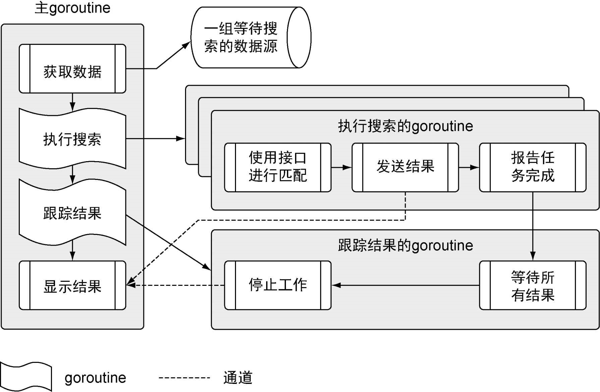

# 快速开始一个Go程序

实现一个读取文本文件，进行网络调用，解码XML、JSON成为结构化类型数据。

## 架构



项目结构：

```reStructuredText
-sample
	-data
		data.json //数据源
	-matchers
		rss.go //搜索rss源的匹配器
	-search
		default.go//搜索数据用的默认匹配器
		feed.go//读取json
		match.go////用于支持不同匹配器的接口
		search.go//执行搜索的主控制器
	main.go//程序入口
```

## 获取数据

因为要读取数据data.json，又因为json内容为：

```json
{
        "site" : "npr",
        "link" : "http://www.npr.org/rss/rss.php?id=1001",
        "type" : "rss"
}
```

所以定义输入的Feed类型：

```go
type Feed struct {
	Name string `json:"site"`
	URI  string `json:"link"`
	Type string `json:"type"`
}
```

函数RetrieveFeeds读取并反序列化源数据文件：

```go
func RetrieveFeeds() ([]*Feed, error) {
	file, err := os.Open(dataFile) // 打开文件
	if err != nil {
		return nil, err
	}
	defer file.Close() // 关闭文件
	var feeds []*Feed
	err = json.NewDecoder(file).Decode(&feeds)
	return feeds, err
}
```

## 匹配器

定义匹配器接口

```go
// Matcher定义了要实现的新搜索类型的行为
type Matcher interface {
	Search(feed *Feed, searchTerm string) ([]*Result, error)
}
```

以及对特定的匹配器执行搜索：

```go
// Result保存搜索的结果
type Result struct {
	Field   string
	Content string
}

func Match(matcher Matcher, feed *Feed, searchTerm string, results chan<- *Result) {
	// 对特定的匹配器执行搜索
	searchResults, err := matcher.Search(feed, searchTerm)
	if err != nil {
		log.Println(err)
		return
	}
	// 将结果写入通道
	for _, result := range searchResults {
		results <- result
	}
}
```

设定默认的匹配器：

```go
// defaultMatcher实现了默认匹配器
type defaultMatcher struct{}

// init函数将默认匹配器注册到程序里
func init() {
	var matcher defaultMatcher
	Register("default", matcher)
}

func (m defaultMatcher) Search(feed *Feed, searchTerm string) ([]*Result, error) {
	return nil, nil
}
```

## 搜索模块

```go
//用于搜索的匹配器的映射
var matchers = make(map[string]Matcher)

func Run(searchTerm string) {
	// 获取搜索的数据源列表
	feeds, err := RetrieveFeeds()
	if err != nil {
		log.Fatal(err) //未获取到
	}
	// 创建无缓冲通道，用于接收匹配后的结果
	results := make(chan *Result)
	// 构造一个waitGroup,以便处理所有的数据源
	var waitGroup sync.WaitGroup
	//设置其等待的个数，即为feeds的数量
	waitGroup.Add(len(feeds))

	for _, feed := range feeds {
		matcher, exists := matchers[feed.Type]
		if !exists {
			matcher = matchers["default"]
		}
		// 这个goroutine执行搜索
		go func(matcher Matcher, feed *Feed) {
			Match(matcher, feed, searchTerm, results)
			waitGroup.Done()
		}(matcher, feed)
	}
	//这个goroutine用来监控是否全部完成
	go func() {
		waitGroup.Wait() // 等待全部完成
		close(results)   // 关闭通道
	}()

	Display(results)
}

// Register调用时，会注册一个匹配器，提供给后面的程序使用
func Register(feedType string, matcher Matcher) {
	if _, exists := matchers[feedType]; exists {
		log.Fatalln(feedType, "Matcher already registered")
	}
	log.Println("Register", feedType, "matcher")
	matchers[feedType] = matcher
}
```

## RSS匹配器

根据期望的RSS文档建模：

```go
type (
	// item根据item字段的标签，将定义的字段
	// 与rss文档的字段关联起来
	item struct {
		XMLName     xml.Name `xml:"item"`
		PubDate     string   `xml:"pubDate"`
		Title       string   `xml:"title"`
		Description string   `xml:"description"`
		Link        string   `xml:"link"`
		GUID        string   `xml:"guid"`
		GeoRssPoint string   `xml:"georss:point"`
	}

	// image根据image字段的标签，将定义的字段
	// 与rss文档的字段关联起来
	image struct {
		XMLName xml.Name `xml:"image"`
		URL     string   `xml:"url"`
		Title   string   `xml:"title"`
		Link    string   `xml:"link"`
	}

	// channel根据channel字段的标签，将定义的字段
	// 与rss文档的字段关联起来
	channel struct {
		XMLName        xml.Name `xml:"channel"`
		Title          string   `xml:"title"`
		Description    string   `xml:"description"`
		Link           string   `xml:"link"`
		PubDate        string   `xml:"pubDate"`
		LastBuildDate  string   `xml:"lastBuildDate"`
		TTL            string   `xml:"ttl"`
		Language       string   `xml:"language"`
		ManagingEditor string   `xml:"managingEditor"`
		WebMaster      string   `xml:"webMaster"`
		Image          image    `xml:"image"`
		Item           []item   `xml:"item"`
	}

	// rssDocument定义了与rss文档关联的字段
	rssDocument struct {
		XMLName xml.Name `xml:"rss"`
		Channel channel  `xml:"channel"`
	}
)
```

然后实现相应的接口方法：

```go
func (m rssMatcher) Search(feed *search.Feed, searchTerm string) ([]*search.Result, error){
	var results []*search.Result
	log.Printf("Search Feed Type[%s] Site[%s] For URI[%s]\n", feed.Type, feed.Name, feed.URI)
	document, err := m.retrieve(feed)
	if err != nil {
		return nil, err
	}
	for _, channelItem := range document.Channel.Item{
		matched, err := regexp.MatchString(searchTerm, channelItem.Title)
		if err != nil {
			return nil, err
		}
		if matched {
			results = append(results, &search.Result{
				Field:   "Title",
				Content: channelItem.Title,
			})
		}
		matched, err = regexp.MatchString(searchTerm, channelItem.Description)
		if err != nil {
			return nil, err
		}
		if matched {
			results = append(results, &search.Result{
				Field:   "Description",
				Content: channelItem.Description,
			})
		}
	}
	return results, nil
}

func (m rssMatcher) retrieve(feed *search.Feed) (*rssDocument, error){
	if feed.URI == "" {
		return nil, errors.New("No rss feed uri provided")
	}
	resp, err := http.Get(feed.URI)
	if err != nil {
		return nil, err
	}
	defer resp.Body.Close()
	if resp.StatusCode != 200 {
		return nil, fmt.Errorf("HTTP Response Error %d\n", resp.StatusCode)
	}
	var document rssDocument
	err = xml.NewDecoder(resp.Body).Decode(&document)
	return &document, err
}
```

因为在使用rss匹配器时要注册到全局，因此利用init方法，程序里所有的`init`方法都会在`main`函数启动前被调用。

```go
func init()  {
	var matcher rssMatcher
	search.Register("rss",matcher)
}
```

## 源码

[源码](https://github.com/chun98/learn-go/tree/master/src/goinaction/chapter2)

