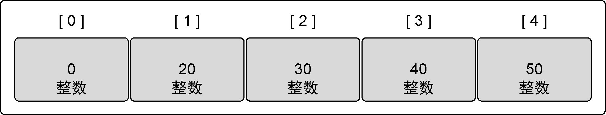
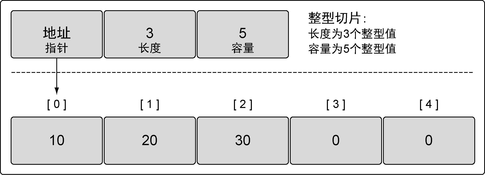
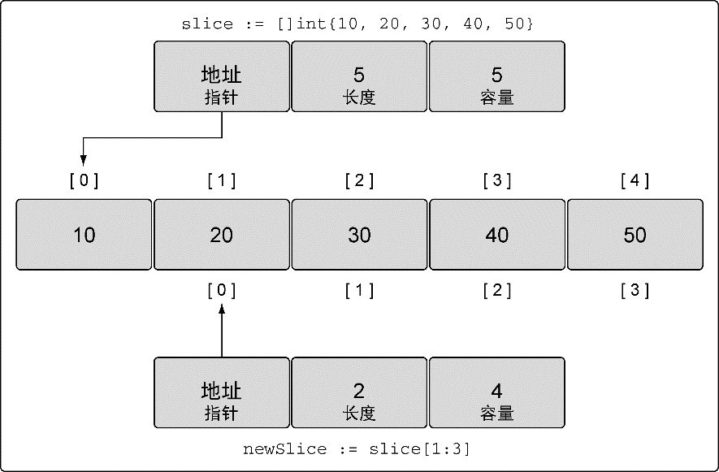
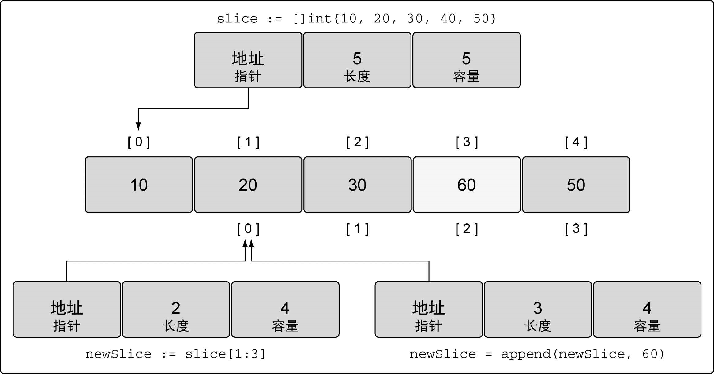
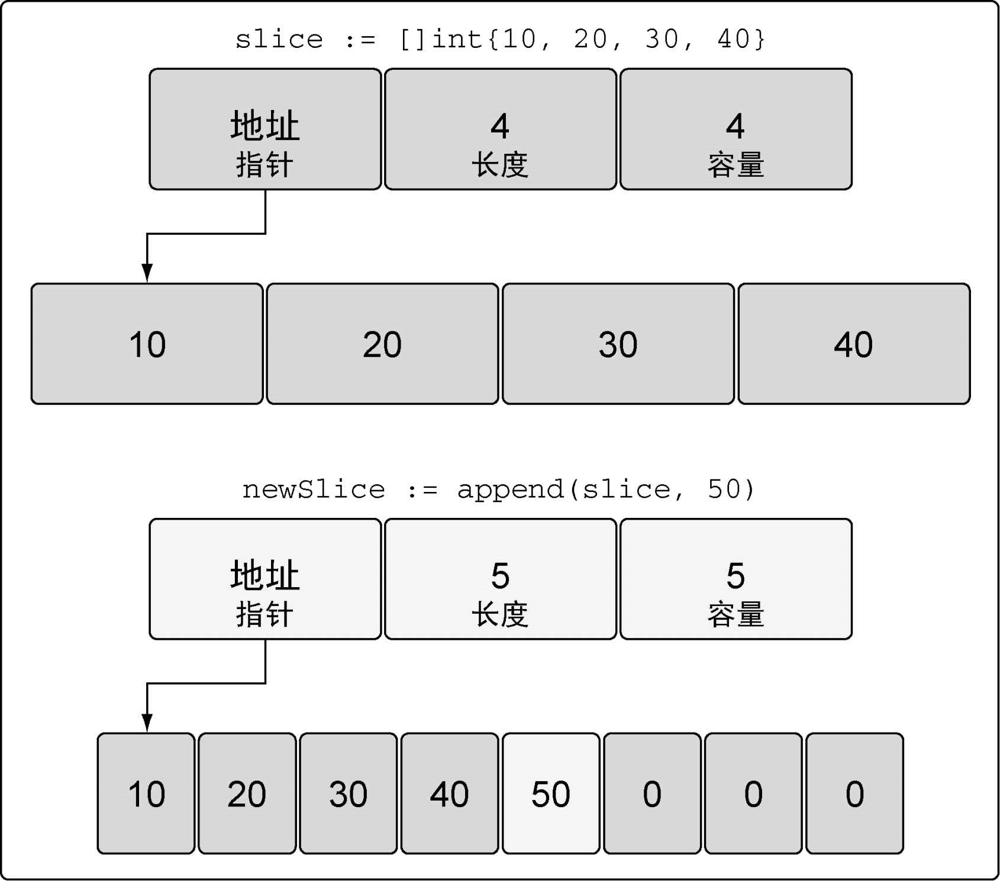
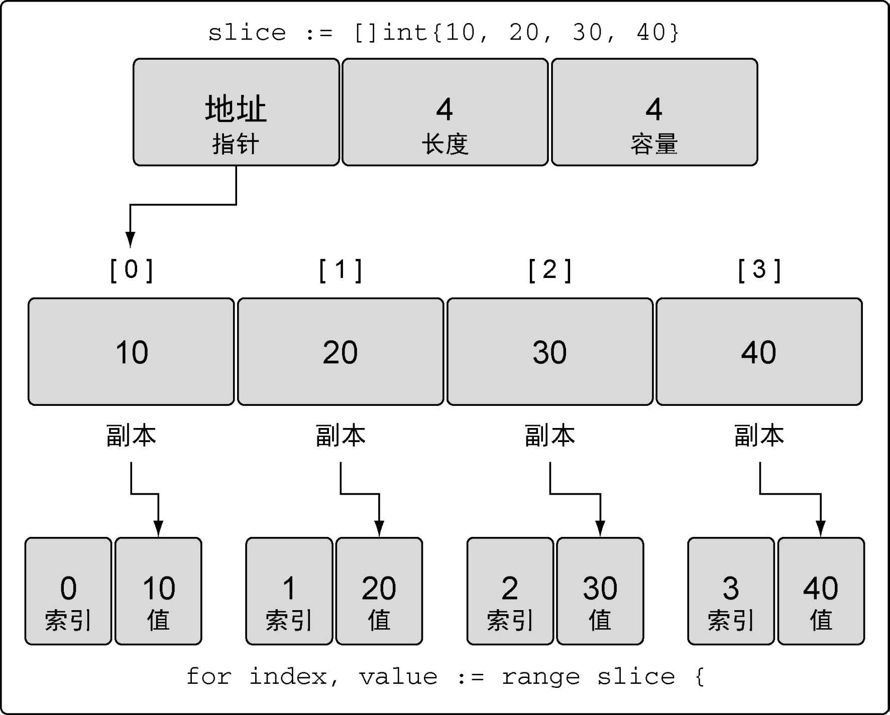
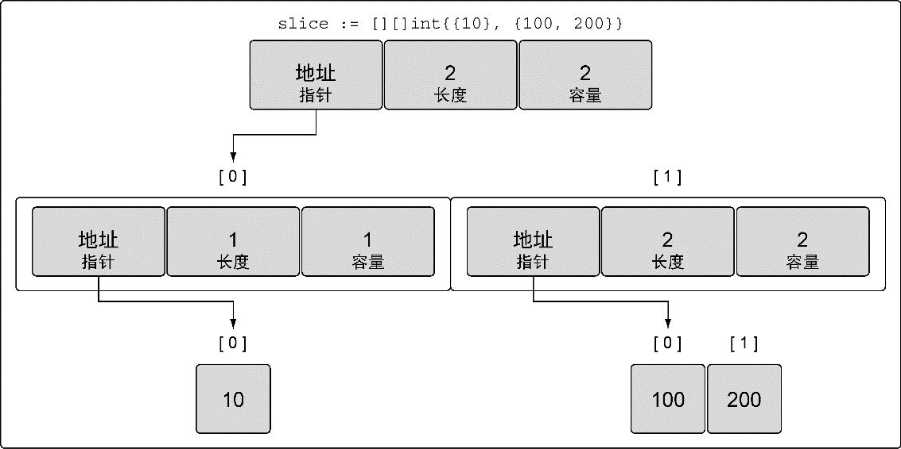
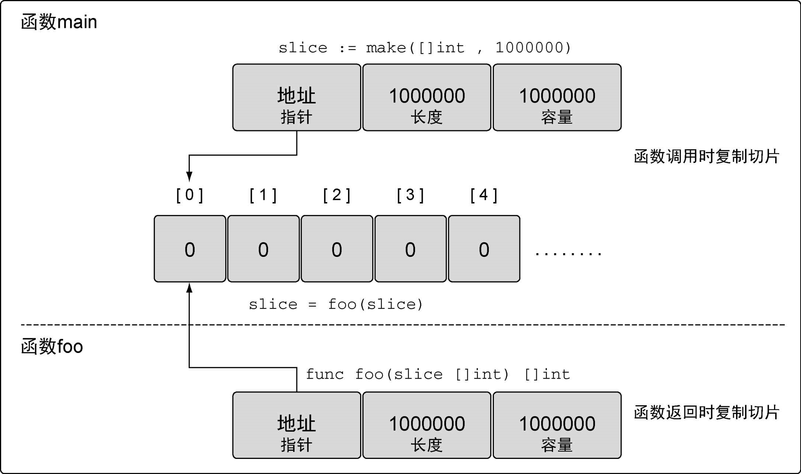
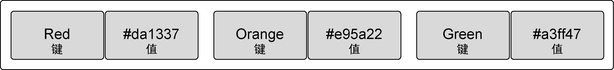
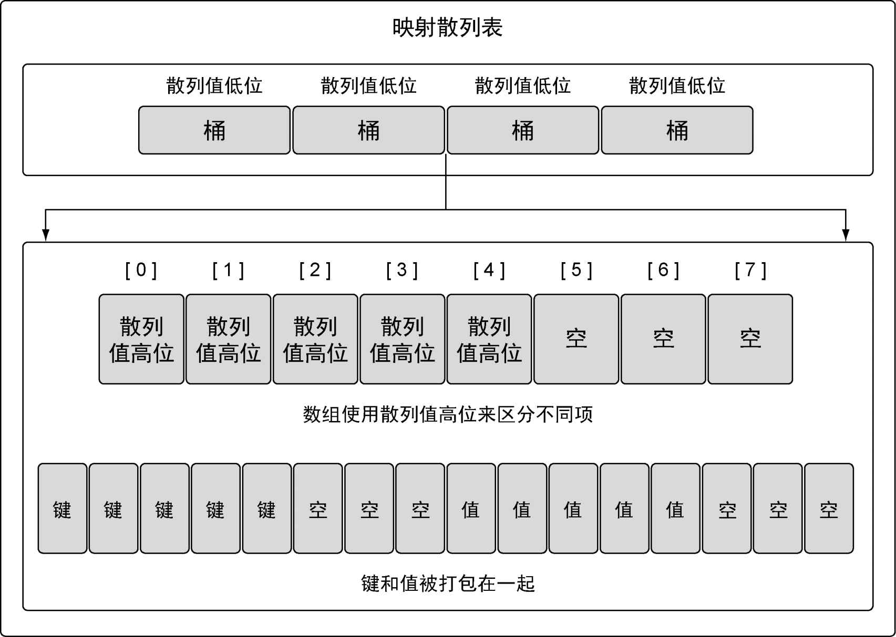

# 数组、切片和映射

## 数组

### 内部实现



数组的初始化：

```go
array := [5]int{10, 20, 30, 40, 50}
// ... 可以代替数组长度
array := [...]int{10, 20, 30, 40, 50}
// 用具体值初始化索引为1和2的元素，其余元素保持零值
array := [5]int{1: 10, 2: 20}
```

### 数组的使用

直接使用`[ ]`运算符访问；

GO里数组是一个值，数组可以直接用在赋值操作中：

```go
var array1 [5]string
// 声明第二个包含5个元素的字符串数组
// 用颜色初始化数组
array2 := [5]string{"Red", "Blue", "Green", "
Yellow", "Pink"}
// 把array2的值复制到array1
array1 = array2
//只有这两部分都相同的数组，才是类型相同的数组，才能互相赋值，
```

多维数组：

```go
var array [4][2]int//二维数组，大小4x2
```

函数间传递数组方式：

* 值传递：对于大数组来说开销很大
* 指针传递：传递数组指针

## 切片

**切片**是一种数据结构，便于使用和管理数据集合。

### 内部实现



创建切片的方法：make

```go
// 创建一个整型切片
// 其长度为3个元素，容量为5个元素
slice := make([]int, 3, 5)
```

另外一种方法：使用切片字面量

```go
// 创建字符串切片
// 其长度和容量都是5个元素
slice := []string{"Red", "Blue", "Green", "Yellow", "Pink"}

// 创建一个整型切片
// 其长度和容量都是3个元素
slice := []int{10, 20, 30}
```

如果在`[]`运算符里指定了一个值，那么创建的就是数组而不是切片。只有不指定值的时候，才会创建切片

`nil`切片:

```go
// 创建nil整型切片
var slice []int
```

`nil`切片可以用于很多标准库和内置函数。在需要描述一个不存在的切片时，`nil`切片会很好用。

### 切片的使用

1. 赋值和切片

   ```go
   // 创建一个整型切片
   // 其容量和长度都是5个元素
   slice := []int{10, 20, 30, 40, 50}
   
   // 改变索引为1的元素的值
   slice[1] = 25
   
   // 创建一个整型切片
   // 其长度和容量都是5个元素
   slice := []int{10, 20, 30, 40, 50}
   
   // 创建一个新切片
   // 其长度为2个元素，容量为4个元素
   newSlice := slice[1:3]
   
   // 将第三个元素切片，并限制容量
   // 其长度为1个元素，容量为2个元素
   newSlice := slice[2:3:4]
   ```

   

2. 切片增长

   当`append`调用返回时，会返回一个包含修改结果的新切片。

   ```go
   // 创建一个整型切片
   // 其长度和容量都是5个元素
   slice := []int{10, 20, 30, 40, 50}
   
   // 创建一个新切片
   // 其长度为2个元素，容量为4个元素
   newSlice := slice[1:3]
   
   // 使用原有的容量来分配一个新元素
   // 将新元素赋值为60
   newSlice = append(newSlice, 60)
   ```

   

   如果切片的底层数组没有足够的可用容量，`append`函数会创建一个新的底层数组，将被引用的现有的值复制到新数组里，再追加新的值。

   

3. 迭代切片

   使用`for range`迭代切片：

   ```go
   // 创建一个整型切片
   // 其长度和容量都是4个元素
   slice := []int{10, 20, 30, 40}
   
   // 迭代每一个元素，并显示其值
   for index, value := range slice {
   　fmt.Printf("Index: %d　Value: %d\n", index, value)
   }
   ```

   当迭代切片时，关键字`range`会返回两个值。第一个值是当前迭代到的索引位置，第二个值是该位置对应元素值的一份副本

   

   `range`创建了每个元素的副本，而不是直接返回对该元素的引用。

   如果不需要索引值，可以使用占位字符来忽略这个值。

### 多维切片

```go
// 创建一个整型切片的切片
slice := [][]int{{10}, {100, 200}}
```



### 在函数间传递切片

由于切片的尺寸很小，在函数间复制和传递切片成本也很低。



## 映射

映射是一种数据结构，用于存储一系列无序的键值对。



### 内部实现

映射的实现使用了散列表



初始化：

```go
// 创建一个映射，键的类型是string，值的类型是int
dict := make(map[string]int)

// 创建一个映射，键和值的类型都是string
// 使用两个键值对初始化映射
dict := map[string]string{"Red": "#da1337", "Orange": "#e95a22"}
```

映射的键可以是任何值。这个值的类型可以是内置的类型，也可以是结构类型，只要这个值可以使用`==`运算符做比较。切片、函数以及包含切片的结构类型这些类型由于具有引用语义，不能作为映射的键，使用这些类型会造成编译错误

键值对赋值给映射，是通过指定适当类型的键并给这个键赋一个值来完成的:

```go
// 创建一个空映射，用来存储颜色以及颜色对应的十六进制代码
colors := map[string]string{}

// 将Red的代码加入到映射
colors["Red"] = "#da1337"
```

可以通过声明一个未初始化的映射来创建一个值为`nil`的映射（称为`nil`映射）。`nil`映射不能用于存储键值对

```go
// 通过声明映射创建一个nil映射
var colors map[string]string
```

从映射取值时有两个选择。第一个选择是，可以同时获得值，以及一个表示这个键是否存在的标志

```go
// 获取键Blue对应的值
value, exists := colors["Blue"]

// 这个键存在吗？
if exists {
　　fmt.Println(value)

```

在Go语言里，通过键来索引映射时，即便这个键不存在也总会返回一个值。

```go
// 获取键Blue对应的值
value := colors["Blue"]

// 这个键存在吗？
if value != "" {
　　fmt.Println(value)
}
```

如果想把一个键值对从映射里删除，就使用内置的`delete`函数

在函数间传递映射并不会制造出该映射的一个副本。实际上，当传递映射给一个函数，并对这个映射做了修改时，所有对这个映射的引用都会察觉到这个修改

