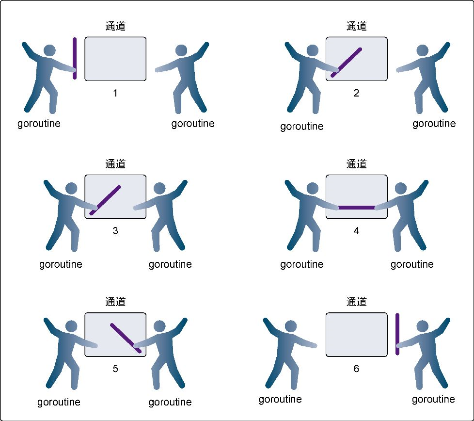
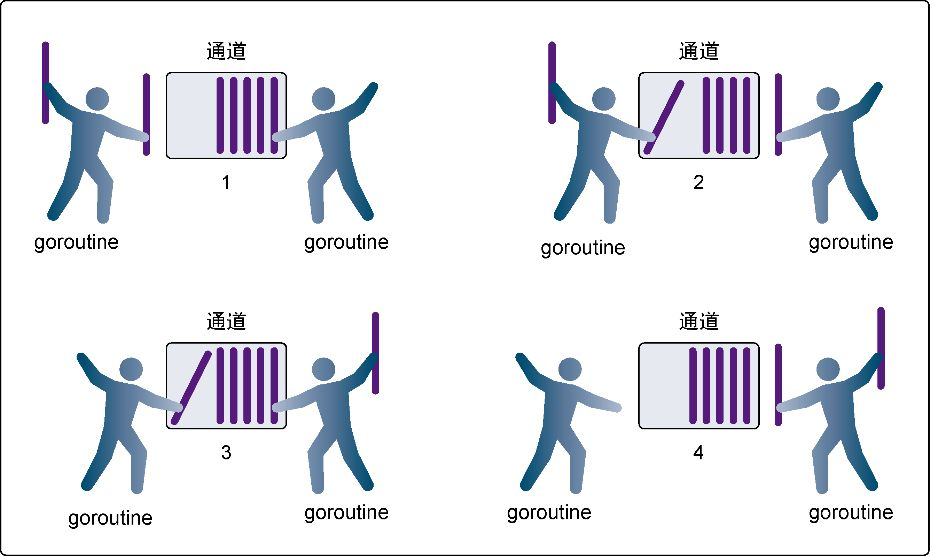

# 并发

并发指的是能让某个函数独立于其他函数运行的能力。

Go语言的并发同步模型来自一个叫作**通信顺序进程**（Communicating Sequential Processes，CSP）的范型（paradigm）。CSP是一种消息传递模型，通过在goroutine之间传递数据来传递消息，而不是对数据进行加锁来实现同步访问。用于在goroutine之间同步和传递数据的关键数据类型叫作**通道**（channel）。

## 并发与并行

进程是操作系统分配资源的单位。

一个**线程**是一个执行空间，这个空间会被操作系统调度来运行函数中所写的代码。每个进程至少包含一个线程，每个进程的初始线程被称作**主线程**。

操作系统线程、逻辑处理器和本地运行队列之间的关系：

并发（concurrency）是一段时间内交错发生，而并行（parallelism）是让不同的代码片段同时在不同的物理处理器上执行。

## goroutine

```go
package main

import (
	"fmt"
	"runtime"
	"sync"
)

func main() {
	//分配一个逻辑处理器给调度器用
	runtime.GOMAXPROCS(3)
	//wg用来等待程序完成
	var wg sync.WaitGroup
	wg.Add(2) // 计数加2，表示要等待两个goroutine

	fmt.Println("Start Goroutines")

	go func() {
		// 在函数退出时调用Done来通知main函数工作已经完成
		defer wg.Done()
		for cnt := 0; cnt < 3; cnt++ {
			for char := 'a'; char < 'a'+26; char++ {
				fmt.Printf("%c ", char)
			}
		}
	}()
	go func() {
		defer wg.Done()
		for cnt := 0; cnt < 3; cnt++ {
			for char := 'A'; char < 'A'+26; char++ {
				fmt.Printf("%c ", char)
			}
		}
	}()

	fmt.Println("Waiting To Finish")
	wg.Wait()
	fmt.Println("\nTerminating Program")
}
```

## 竞争状态

如果两个或者多个goroutine在没有互相同步的情况下，访问某个共享的资源，并试图同时读和写这个资源，就处于相互竞争的状态，这种情况被称作**竞争状态**（race candition）。竞争状态的存在是让并发程序变得复杂的地方，十分容易引起潜在问题。对一个共享资源的读和写操作必须是原子化的。

## 锁住共享资源

Go语言提供了传统的同步goroutine的机制，就是对共享资源加锁。如果需要顺序访问一个整型变量或者一段代码，`atomic`和`sync`包里的函数提供了很好的解决方案。

atomic里提供了对变量的原子操作，保证其调用互相同步，不会进入竞争状态。

另一种同步访问共享资源的方式是使用互斥锁（`mutex`）。互斥锁这个名字来自互斥（mutual exclusion）的概念。互斥锁用于在代码上创建一个临界区，保证同一时间只有一个goroutine可以执行这个临界区代码。

## 通道

不仅可以使用原子函数和互斥锁来保证对共享资源的安全访问以及消除竞争状态，还可以使用通道，通过发送和接收需要共享的资源，在goroutine之间做同步。

在Go语言中需要使用内置函数`make`来创建一个通道

```go
// 无缓冲的整型通道
unbuffered := make(chan int)
// 有缓冲的字符串通道
buffered := make(chan string, 10)
```

向通道发送值或者指针需要用到`<-`操作符

从通道接收值或者指针也用`<-`操作符。

**无缓冲的通道**（unbuffered channel）是指在接收前没有能力保存任何值的通道。这种类型的通道要求发送goroutine和接收goroutine同时准备好，才能完成发送和接收操作。如果两个goroutine没有同时准备好，通道会导致先执行发送或接收操作的goroutine阻塞等待。这种对通道进行发送和接收的交互行为本身就是同步的。其中任意一个操作都无法离开另一个操作单独存在。



**有缓冲的通道**（buffered channel）是一种在被接收前能存储一个或者多个值的通道。这种类型的通道并不强制要求goroutine之间必须同时完成发送和接收。通道会阻塞发送和接收动作的条件也会不同。只有在通道中没有要接收的值时，接收动作才会阻塞。只有在通道没有可用缓冲区容纳被发送的值时，发送动作才会阻塞。这导致有缓冲的通道和无缓冲的通道之间的一个很大的不同：无缓冲的通道保证进行发送和接收的goroutine会在同一时间进行数据交换；有缓冲的通道没有这种保证。



