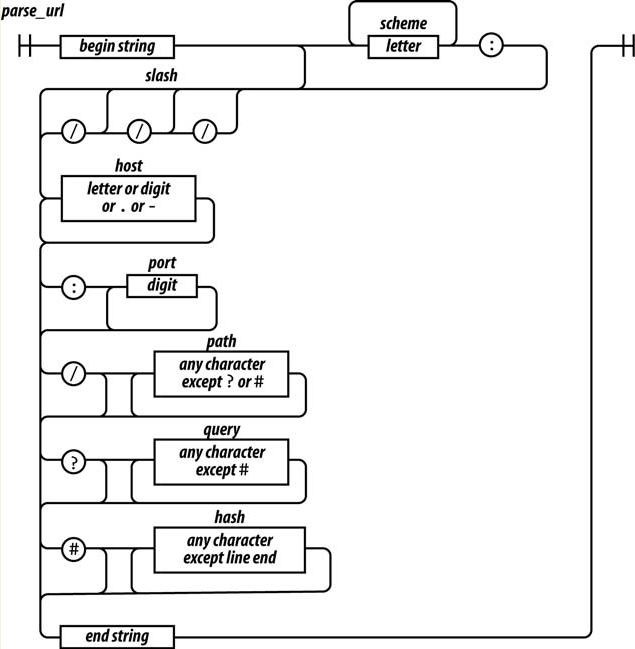

# 正则表达式

## 一个例子

匹配url的正则表达式：

```javascript
var parse_url = /^(?:([A-Za-z]+):)?(\/{0,3})([0-9.\-A-za-z]+)(?::(\d+))?(?:\/([^?#]*))?(?:\?([^#]*))?(?:#(.*))?$/;

var url = "http://www.ora.com:80/goodparts?q#fragement";
var result = parse_url.exec(url);
```



`^(?:([A-Za-z]+):)?`

* ^字符表示字符串的开始
* (?: ...)表示是一个非捕获型分组
* 后缀？表示这个分组是可选的，表示重复1次或0次
* (...)表示一个捕获型分组
* [...]表示一个字符类
* A-Za-z表示字符类包含26个大小写字母
* 后缀+表示字符会被匹配一次或多次

`(\/{0,3})`

* \/表示匹配斜杠（/），用反斜杠进行转义
* {0, 3}表示斜杠会被匹配0次或者1-3次

`([0-9.\-A-za-z]+)`

* 匹配的是主机号，有一个或多个字符以及.或者-字符组成

`(?::(\d+))?`

* 匹配的是端口号，\d+表示一个数字字符

`(?:\/([^?#]*))?`

* 表示可选分组，以一个/开始
* 字符类`[^?#]`表示这个类包含除？和#之外的所有字符。
* *表示这个字符会被匹配0次或多次

`(?:\?([^#]*))?`

* \?表示？字符，这个分组包含0个或多个非#字符

`(?:#(.*))?`

* 最后一个可选分组是以#开始的。.会匹配除行结束符以外的所有字符

`$`

* `$`表示字符串的结束

匹配数字的正则表达式：

```javascript
var parse_number = /^-?\d+(?:\.\d*)?(?:e[+\-]?\d+)?$i;
```

## 结构

两种方式使用正则表达式：

1. 正则表达式字面量：`var parse_number = /^-?\d+(?:\.\d*)?(?:e[+\-]?\d+)?$i;`
2. 使用RegExp构造器：`var parse_number = new RegExp()`