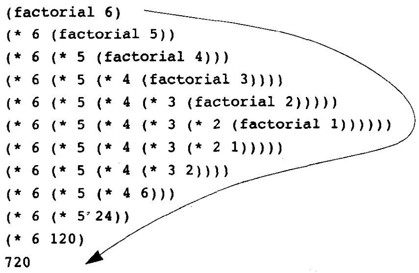
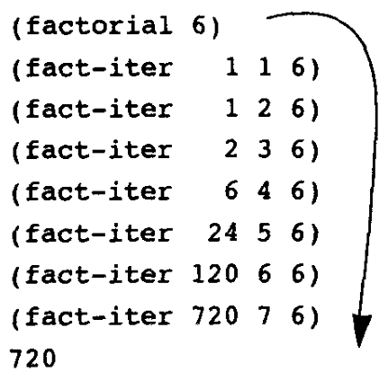

# 构造过程抽象

## 程序设计的基本元素

三种机制：

* 基本的表达形式
* 组合的方法：从简答的元素组合成复杂的元素
* 抽象的方法：为复合的对象命名，并当成单元去操作

### 命名与环境

scheme的命名：

```scheme
(define size 2)
```

命名的目的：

* 允许用一个简单的引用一个组合计算的结果，避免了重复
* 方便逐步去构造一个复杂程序

构造的值可以存入变量供以后使用，说明 Scheme 解释器有存储能力。这种存储称为“环境”；

### 组合式的求值

解释器的工作方式：

* 求值该组合式的各个子表达式
* 将最左子表达式的值作用于相应的实际参数

一般性求值规则的这种例外称为**特殊形式**；

### 复合过程

过程定义：

```scheme
(define (square x) (* x x))
; 过程名 形式参数 过程定义
; (define (<name> <formal parameters) <body>)
```

过程定义是分解和控制程序复杂性的最重要技术之一；

### 过程应用的代换模型

运算符是一个复合过程的名字；

组合式和复合过程确定的计算过程是（代换模型）：

1. 求出各参数表达式（子表达式）的值
2. 找到要调用的过程的定义
3. 用求出的实际参数代换过程体里的形式参数
4. 求值过程体

先求值参数后应用运算符：应用序求值；（scheme采用）

完全展开后归约：正则序求值；

### 条件表达式和谓词

复杂计算的描述中总需要描述条件和选择；

条件表达式：

```scheme
(cond (<p1> <e1>)
      (<p2> <e2>)
      ...
      (<pn> <en>)
      )
```

简化的条件表达式：

```scheme
(if <predicate> <consequent> <alternative>)
```

逻辑组合运算符：

```scheme
(and <e1> ... <en>)
(or <e1> ... <en>)
(not <e>)
```

求出真假值的过程称为 谓词。各种关系运算符是基本谓词，可以用 。各种关系运算符是基本谓词，可以用 and、or、not组合出各种复杂逻辑条件，可以用过程定义谓词；

### 过程定义实例：牛顿法求平方根

过程很像数学函数，但它必须了描述一种有效的计算方法

```scheme
(define (improve guess x)
  (average guess (/ x guess)))
(define (good-enough? guess x)
  (< (abs (- (square guess) x)) 0.001))
(define (sqrt-iter guess x)
  (if (good-enough? guess x)
      guess
      (sqrt-iter (improve guess x) x)))
(define (sqrt x)
  (sqrt-iter 1.0 x))
```

### 过程作为黑箱抽象

应该把被用的过程看作黑箱，只关注其功能，不关心其实现

过程抽象的本质是一种功能分解：

* 定义过程时，关注计算的 过程式描述（怎样做），使用时只关注其说明式描述（功能，做什么）
* 一个过程总（应该）隐藏一些实现细节，使用者不需要知道它如何工作。所用过程可以是其他人开发，或由程序库提供
* 过程抽象是控制和分解程序复杂性的一种重要手段，也是记录和重用已有开发成果的单位

过程隐藏的最简单细节是局部的名字。

过程定义里使用的形参只是占位符：

*  从程序的语义看，具体采用的名字并不重要（对程序的可读性有意义），重要的是哪些地方用了同一个形参
* 形参是过程体的约束变量（概念来自数理逻辑），作用域是整个过程体，对约束变量统一换名不改变过程意义

对一个结构局部的东西应该定义在这个结构内部；

在一个过程内部 在一个过程内部 define 的东西（过程或变量）只能在该过程内使用。过程之外看不到这些名字。

## 过程与其产生的计算

一个过程（是一个文本描述）可以看作一种计算模式：

* 描述了一种特定计算的演化进程和方式
* 对一组适当的参数，确定了一个具体计算

### 线性的递归和迭代

n的阶乘：$n! = n * (n-1)!$

```scheme
# 递归
(define (factorial n)
  (if = n 1
      1
      (* n (factorial (- n 1)))))
# 迭代
(define (factorial n)
  (fact-iter 1 1 n))
(define (facr-iter product conuter max-count)
  (if (> counter max-count)
      product
      (fact-iter (* counter profuct)
                 (+ counter 1)
                 max-count)))
```

递归计算$6!$：



先展开后收缩，解释器要维护待执行计算的轨迹，轨迹长度与后续计算的次数成正比，积累长度为线性的，计算序列的长度也为线性的，称为线性递归进程；



没有展开/收缩，直接计算，计算轨迹中的信息量为常量，只要维护几个变量的当前值，计算序列的长度为线性的，具有这种性态的计算进程称为线性迭代进程；

### 树形递归

Fibonacci序列：
$$
Fib(n)=\left\{\begin{matrix}
 0&  &n=0 \\ 
 1&  &n=1 \\
 Fib(n-1)+Fib(n-2) 
\end{matrix}\right.
$$
相对应的过程定义：

```scheme
(define (fib n)
  (cond ((= n 0) 0)
        ((= n 1) 1)
        (else (+ (fib (- n 1))
                 (fib (- n 2))))))
```

Fib(n)的计算与n的增长成指数关系；

树形递归最经典的应用：换硬币的不同方式

```scheme
(define (count-change amount) (cc amount 6))
(define (cc amount kinds-of-coins)
  (cond ((= amount 0) 1)
        ((or (< amount 0) (= kinds-of-coins 0)) 0)
        (else (+ (cc amount (- kinds-of-coins 1))
                 (cc (- amount
                        (coin-value kinds-of-coins))
                     kinds-of-coins)))))
(define (coin-value kinds-of-coins)
  (cond ((= kinds-of-coins 1) 1)
        ((= kinds-of-coins 2) 2)
        ((= kinds-of-coins 3) 5)
        ((= kinds-of-coins 4) 10)
        ((= kinds-of-coins 5) 50)
        ((= kinds-of-coins 6) 100)))
```

### 增长的阶

不同的计算过程在消耗计算资源的速率上的存在巨大的差异，描述这种差异的方式之一就是**增长的阶**；

$\theta(f(n))$代表$f(n)$增长的阶，$O(f(n))$代表上界；

$O(1)<O(log\ n)<O(n)<O(nlog\ n)<O(n^2)<O(n^3)<O(2^n)$

求幂：

```scheme
# 递归
(define (expt b n)
  (if (= n 0)
      1
      (* b (expt b (- n 1)))))
# 迭代
(define (expt b n) (expt-iter b n 1))
(define (expt-iter b counter product)
  (if (= counter 0)
      product
      (expt-iter b
                 (- counter 1)
                 (* b product))))
# 快速幂
(define (fast-expt b n)
  (cond ((= n 0) 1)
        ((even? n) (square (fast-expt b (/ n 2))))
        (else (* b (fast-expt b (- n 1))))))
(define (even? n) (= (remainder n 2) 0))
```

递归的时间复杂度、空间复杂度均为$O(n)$；迭代的时间复杂度为$O(n)$，空间复杂度为$O(1)$；快速幂的时间复杂度为$O(log\ n)$；

最大公约数：$GCD(a,b)=GCD(b,a\%b)$

```scheme
(define (gcd a b)
  (if (= b 0)
      a
      (gcd b (remainder a b))))
```

算法的时间复杂度为$\theta(log\ n)$；

素数检查：

* 暴力法：

  ```scheme
  (define (smallest-divisor n) (find-divisor n 2))
  (define (find-divisor n test-divisor)
    (cond ((> (square test-divisor) n) n)
          ((divides? test-divisor n) test-divisor)
          (else (find-divisor n (+ test-divisor 1)))))
  (define (divides? a b) (= (remainder b a) 0))
  ```

* 费马检查（概率算法）

  ```scheme
  (define (expmod base exp m)
    (cond ((= exp 0) 1)
          ((even? exp)
           (remainder (square (expmod base (/ exp 2) m)) m))
          (else
           (remainder (* base (expmod base (- exp 1) m))
                      m))))
  (define (fermat-test n)
    (define (try-it a) (= (expmod a n n) a))
    (try-it (+ 1 (random (- n 1)))))
  (define (fast-prime? n times)
    (cond ((= times 0) true)
          ((fermat-test n) (fast-prime? n (- times 1)))
          (else false)))
  ```

  过程 过程 expmod 利用了一个数学关系：$(a*b) \mod c =((a \mod c) * (b \mod c)) \mod c$；

  上述算法只有概率意义上的正确性：随着检查次数增加，通过检查的数是素数的概率越来越大。

## 用高阶函数做抽象

过程是抽象，一个过程描述了一种对数据的复合操作；

高阶过程：以过程为参数或返回值，操作过程的过程；

### 以过程为参数

考虑以下几个过程：

* $a+...+b$：

  ```scheme
  (define (sum-integers a b)
    (if (> a b)
        0
        (+ a (sum-integers (+ a 1) b))))
  ```

* $a^3+...+b^3$：

  ```scheme
  (define (sum-cubes a b)
    (if (> a b)
        0
        (+ (cube a) (sum-cubes (+ a 1) b))))
  ```

* $\frac{1}{1*3}+\frac{1}{5*7}+...$

  ```scheme
  (define (pi-sum a b)
    (if (> a b)
        0
        (+ (/ 1.0 (* a (+ a 2))) (pi-sum (+ a 4) b))))
  ```

把公共部分抽象出来：

```scheme
(define (<pname> a b)
  (if (> a b)
      0
      (+ (<term> a)
         (<pname> (<next> a) b))))
```

用scheme实现：

```scheme
(define (sum term a next b)
  (if (> a b)
      0
      (+ (term a)
         (sum term (next a) next b))))
```

### 用lambda构造过程

Scheme通过lambda特殊形式处理这个问题，求值lambda表达式得到一个匿名过程；

lambda表达式把一段计算参数化，抽象为一个匿名过程；

Scheme中lambda的一般形式：

```scheme
(lambda (<formal-parameters>) <body>)
```

lambda 是特殊形式，其参数不求值;

一般来说：

```scheme
(define (<name> <formals>) <body>) 
# 等同于
(define <name> (lambda (<formals>) <body>))
```

let是lambda表达式的一种应用形式加上语法外衣，一般形式：

```scheme
(let ((<var 1 > <exp 1 >)
      ……
      (<var n > <exp n >))
  <body>)
```

等价于：

```scheme
((lambda (<var 1 > ...<var n >)
   <body>)
 <exp 1 >
 ……
 <exp n >)
```

### 过程作为一般性的方法

高阶过程功能很强大：

* 表示高级的计算模式，把一些操作参数化
* 解决一类问题：
  * 用一组适当过程实例化，得到一个具体的过程
  * 把具体的计算过程用于适当的数据，得到一个具体计算
* 可以同时做过程参数的实例化和提供被操作数
* 也可以分步提供，为程序的分解和设计提供了自由度

例子：

* 函数零点的解决办法之一——折半法：

  * 取区间中点$x$计算$f(x)$
  * 如果$f(x)$是根（在一定误差的意义下），计算结束
  * 否则根据$f(x)$的正负将区间缩短一半
  * 在缩短的区间里继续使用折半法

  ```scheme
  (define (search f neg-point pos-point)
    (let ((midpoint (average neg-point pos-point)))
      (if (close-enough? neg-point pos-point)
          midpoint
          (let ((test-value (f midpoint)))
            (cond ((positive? test-value)
                   (search f neg-point midpoint))
                  ((negative? test-value)
                   (search f midpoint pos-point))
                  (else midpoint))))))
  (define (close-enough? x y)
    (< (abs (- x y)) 0.001))
  (define (half-interval-method f a b)
    (let ((a-value (f a))
          (b-value (f b)) )
      (cond ((and (negative? a-value) (positive? b-value))
             (search f a b))
            ((and (negative? b-value) (positive? a-value))
             (search f b a))
            (else (error "Values are not of opposite sign" a b)) ) ))
  ```

* 函数的不动点：

  * 反复应用$f$即可：$f(x),f(f(x)),f(f(f(x))),...$

  ```scheme
  (define tolerance 0.00001)
  (define (fixed-point f first-guess)
    (define (close-enough? v1 v2) (< (abs (- v1 v2)) tolerance))
    (define (try guess)
      (let ((next (f guess)))
        (if (close-enough? guess next)
            next
            (try next))))
    (try first-guess) )
  ```

### 过程作为返回值

在 Scheme 里很容易构造新的过程对象并将其返回，只需要用lambda表达式模数过程的返回值即可。

最简单的模式：

```scheme
(define (g f ...) (lambda (...) ...))
```

牛顿法求平方根：

$g(x)=0$的解是下面函数的不动点：
$$
f(x)=x-\frac{g(x)}{Dg(x)}\\
Dg(x)=\frac{g(x+\Delta x)-g(x)}{\Delta x}
$$
首先定义$\Delta x$：

```scheme
(define dx 0.00001)
```

导数：

```scheme
(define (deriv g)
  (lambda (x)
    (/ (- (g (+ x dx)) (g x))
       dx)))
```

把牛顿法定义为一个求不动点的函数：

```scheme
(define (newton-transform g)
  (lambda (x) (- x (/ (g x) ((deriv g) x)))))
(define (newton-method g guess)
  (fixed-point (newton-transform g) guess))
```

$x$的平方根可以看作是函数`(lambda (y) (- (* y y) x))`的零点，因此定义求根过程：

```scheme
(define (sqrt x)
  (newton-method (lambda (y) (- (* y y) x))
                 1.0))
```

基于以上分析，将其抽象成过程：

1. 作为一种不动点搜索过程
2. 采用牛顿法

```scheme
(define (fixed-point-of-transform g transform guess)
  (fixed-point (transform g) guess))
```

基于前面高阶过程，可以写出平方根函数的另外两个定义：

* $y \rarr x/y$

  ```scheme
  (define (sqrt x)
    (fixed-point-of-transform (lambda (y) (/ x y))
                              average-damp
                              1.0))
  ```

* $y\rarr y^2-x$

  ```scheme
  (define (sqrt x)
    (fixed-point-of-transform (lambda (y) (- (square y) x))
                              newton-transform
                              1.0))
  ```

