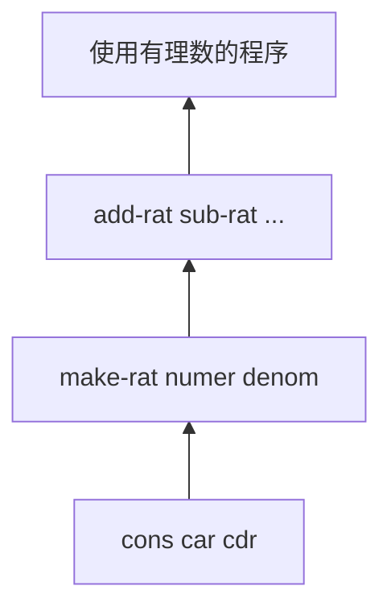

# 构造数据抽象

复合数据的意义：

* 提升设计程序时所位于的层次概念
* 提高设计的模块性
* 增强语言的表达能力

实现数据抽象，编程语言需要提供：

* 粘合机制，支持把一组数据对象组合成一个整体
* 操作定义机制，定义针对组合数据的操作
* 抽象机制，屏蔽实现细节，使组合数据能像简单数据一样使用

## 数据抽象导引

假设实现有理数的算术运算，先假定有关构造函数和选择函数都可以作为过程使用：

* `(make-rat <n> <d>)`：返回一个有理数，分子为`<n>`，分母为`<d>`
* `(numer <x>)`：返回有理数`<x>`的分子
* `(denom <x>)`：返回有理数`<x>`的分母

根据上述构造函数和选择函数实现算数运算：

```scheme
(define (add-rat x y)
  (make-rat (+ (* (numer x) (denom y))
               (* (numer y) (denom x)))
            (* (denom x) (denom y))))
(define (sub-rat x y)
  (make-rat (- (* (numer x) (denom y))
               (* (numer y) (denom x)))
            (* (denom x) (denom y))))
(define (mul-rat x y)
  (make-rat (* (numer x) (numer y))
            (* (denom x) (denom y))))
(define (div-rat x y)
  (make-rat (* (numer x) (denom y))
            (* (denom x) (numer y))))
(define (equal-rat? x y)
  (= (* (numer x) (denom y))
     (* (numer y) (denom x))))
```

Scheme的基本复合结构称为**序对**，过程cons将两个参数结合起来构造一个序对，过程car和cdr取出序对的两个成分：

```scheme
(define x (cons 1 2))
(car x) ; 1
(cdr x) ; 2
```

因此有理数的实现：

```scheme
(define (make-rat n d)
  (let ((g (gcd n d)))
    (cons (/ n g) (/ d g))))
```

### 抽象屏障

* 运算都基于基本过程
* 实现数据抽象首先要确定一组基本过程，其余操作都基于它们实现，不直接访问基础数据表示



建立层次性抽象屏障的价值：

* 数据表示和使用隔离，两部分可以独立演化，容易维护和修改
* 实现好的数据抽象可以用于其他程序和系统，可能做成库
* 一些设计决策可以推迟，直到有了更多实际信息后再处理

### 数据是什么

过程和数据之间没有绝对界限，完全可以用过程表示数据，用数据表示过程。

## 层次性数据和闭包性质

序对常用图示：`(cons 1 2)`


称为盒子指针模型；

cons可以组合复合数据，任何序对结构都可以作为cons的参数（闭包性质）；

用序对构造的最常用的结构是**序列**：一批数据的有序集合；

包含元素1、2、3、4的序列结构：

```scheme
(cons 1 (cons 2 (cons 3 (cons 4 nil))))
; 等同于
(list 1 2 3 4)
```

对于list同样可以使用car和cdr，car取出表是第一项，cdr取得去掉第一项后其余项的表。

**表操作**

定义过程**list-ref**返回表中的第n项元素：

* n = 0，则返回表的car
* 否则，返回表的cdr的第n-1项

```scheme
(define (list-ref items n)
  (if (= n 0)
      (car items)
      (list-ref (cdr items) (- n 1))))
```

定义求表长的过程：

```scheme
(define (length items)
  (if (null? items)
      0
      (+ 1 (length (cdr items)))))
```

定义表的拼接：

```scheme
(define (append list1 list2)
  (if (null? list1)
      list2
      (cons (car list1) (append (cdr list1) list2))))
```

对于任意多个参数的过程，可以使用带点尾部记法的参数表：

```scheme
(define (f x y . z) <body>)
; 圆点之前可以根据需要写多个形参，它们将一一与实参匹配。
; 圆点后写一个形参，应用时关联于其余实参的表
```

任意多个数的平方和的过程:

```scheme
(define (square-sum x . y)
  (define (ssum s vlist)
    (if (null? vlist)
        s
        (ssum (+ s (square (car vlist))) (cdr vlist))))
  (ssum (square x) y) )
```

**表的映射**

把某过程统一应用于表元素，得到所有结果构成的表;

如对表进行缩放：

```scheme
(define (scale-list items factor)
  (if (null? items)
      nil
      (cons (* (car items) factor)
            (scale-list (cdr items) factor))))
```

总结这一计算模式，抽象出一个高阶过程：

```scheme
(define (map proc items)
  (if (null? items)
      nil
      (cons (proc (car items))
            (map proc (cdr items)))))
```

用 用 map 给出 scale-list 的定义：

```scheme
(define (scale-list items factor)
  (map (lambda (x) (* x factor))
       items))
```

### 层次性结构

`(list (list 1 2) 3 4)`可以看作是树：


其中子表是子树，基本数据是树叶；

统计树叶个数的过程：

```scheme
(define (count-leaves x)
  (cond ((null? x) 0)
        ((not (pair? x)) 1)
        (else ((+ count-leaves (car x))
               (+ count-leaves (cdr x)))))
```

树的映射：

```scheme
;count-leaves的方式
(define (scale-tree tree factor)
  (cond ((null? tree) nil)
        ((not (pair? tree)) (* tree factor))
        (else (cons (scale-tree (car tree) factor)
                    (scale-tree (cdr tree) factor)))))
;map的方式
(define (scale-tree tree factor)
  (map (lambda (sub-tree)
         (if (pair? sub-tree)
             (scale-tree sub-tree factor)
             (* sub-tree factor)))
       tree))
```

数据抽象在复合数据处理中起着重要作用：

* 屏蔽数据的表示细节
* 具体实现可以采用不同的具体表示

下面两个程序：

```scheme
; 求一棵树里值为奇数的树叶的平方和
(define (sum-odd-squares tree)
  (cond ((null? tree) 0)
        ((not (pair? tree))
         (if (odd? tree) (square tree) 0))
        (else (+ (sum-odd-squares (car tree))
                 (sum-odd-squares (cdr tree))))))
; 构造 Fib(k) 的表,其中 Fib(k) 是偶数且 k <= n
(define (even-fibs n)
  (define (next k)
    (if (> k n)
        nil
        (let ((f (fib k)))
          (if (even? f)
              (cons f (next (+ k 1)))
              (next (+ k 1))))))
  (next 0))
```

两过程实现的处理都可以看作串联起的一些步骤，每步完成一项具体工作，信息在步骤之间流动：


map上面已经实现；

filter的实现：

```scheme
(define (filter predicate sequence)
  (cond ((null? sequence) nil)
        ((predicate (car sequence))
         (cons (car sequence)
               (filter predicate (cdr sequence))))
        (else (filter predicate (cdr sequence)))))
```

accumulate的实现：

```scheme
(define (accumulate op initial sequence)
  (if (null? sequence)
      initial
      (op (car sequence)
          (accumulate op initial (cdr sequence)))))
```

枚举一个区间的整数： 

```scheme
(define (enumerate-interval low high)
  (if (> low high)
      nil
      (cons low (enumerate-interval (+ low 1) high))))
```

枚举一棵树的所有树叶：

```scheme
(define (enumerate-tree tree)
  (cond ((null? tree) nil)
        ((not (pair? tree)) (list tree))
        (else (append (enumerate-tree (car tree))
                      (enumerate-tree (cdr tree))))))
```

基于这组基础过程，很容易重新构造前面两个过程：

```scheme
(define (sum-odd-squares tree)
  (accumulate +
              0
              (map suqare
                   (filter odd? (enumerate-tree tree)))))
(define (even-fibs n)
  (accumulate cons
              nil
              (filter even?
                      (map fib (enumerate-interval 0 n)))))
```

把程序表示为针对序列的一系列操作，得到的模块更规范。模块化设计还能支持重用，用模块拼装的方式可以构造出许多程序。

### 一个图形语言

