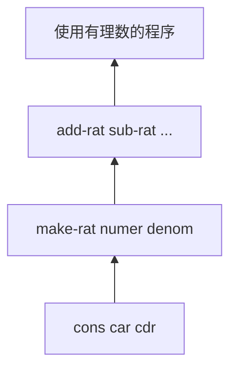
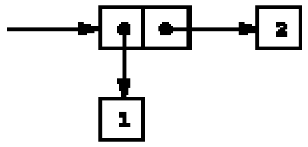
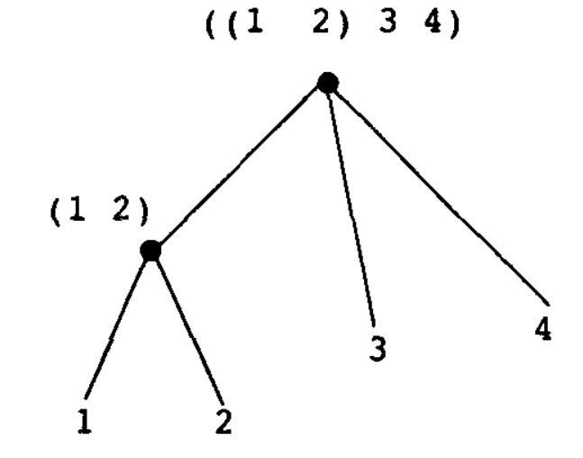
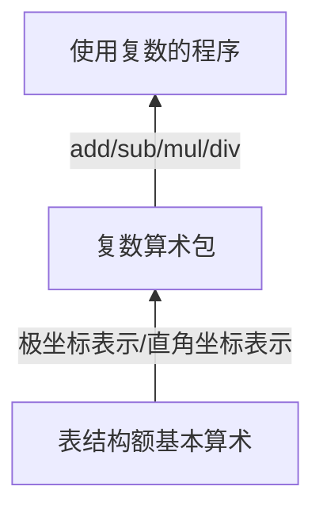
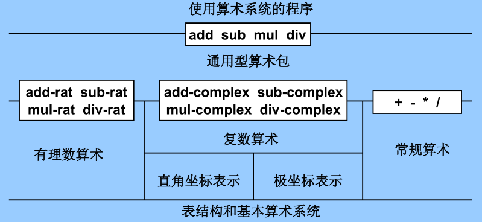
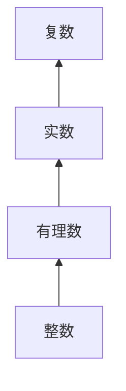

# 构造数据抽象

复合数据的意义：

* 提升设计程序时所位于的层次概念
* 提高设计的模块性
* 增强语言的表达能力

实现数据抽象，编程语言需要提供：

* 粘合机制，支持把一组数据对象组合成一个整体
* 操作定义机制，定义针对组合数据的操作
* 抽象机制，屏蔽实现细节，使组合数据能像简单数据一样使用

## 数据抽象导引

假设实现有理数的算术运算，先假定有关构造函数和选择函数都可以作为过程使用：

* `(make-rat <n> <d>)`：返回一个有理数，分子为`<n>`，分母为`<d>`
* `(numer <x>)`：返回有理数`<x>`的分子
* `(denom <x>)`：返回有理数`<x>`的分母

根据上述构造函数和选择函数实现算数运算：

```scheme
(define (add-rat x y)
  (make-rat (+ (* (numer x) (denom y))
               (* (numer y) (denom x)))
            (* (denom x) (denom y))))
(define (sub-rat x y)
  (make-rat (- (* (numer x) (denom y))
               (* (numer y) (denom x)))
            (* (denom x) (denom y))))
(define (mul-rat x y)
  (make-rat (* (numer x) (numer y))
            (* (denom x) (denom y))))
(define (div-rat x y)
  (make-rat (* (numer x) (denom y))
            (* (denom x) (numer y))))
(define (equal-rat? x y)
  (= (* (numer x) (denom y))
     (* (numer y) (denom x))))
```

Scheme的基本复合结构称为**序对**，过程cons将两个参数结合起来构造一个序对，过程car和cdr取出序对的两个成分：

```scheme
(define x (cons 1 2))
(car x) ; 1
(cdr x) ; 2
```

因此有理数的实现：

```scheme
(define (make-rat n d)
  (let ((g (gcd n d)))
    (cons (/ n g) (/ d g))))
```

### 抽象屏障

* 运算都基于基本过程
* 实现数据抽象首先要确定一组基本过程，其余操作都基于它们实现，不直接访问基础数据表示



建立层次性抽象屏障的价值：

* 数据表示和使用隔离，两部分可以独立演化，容易维护和修改
* 实现好的数据抽象可以用于其他程序和系统，可能做成库
* 一些设计决策可以推迟，直到有了更多实际信息后再处理

### 数据是什么

过程和数据之间没有绝对界限，完全可以用过程表示数据，用数据表示过程。

## 层次性数据和闭包性质

序对常用图示：`(cons 1 2)`



称为盒子指针模型；

cons可以组合复合数据，任何序对结构都可以作为cons的参数（闭包性质）；

用序对构造的最常用的结构是**序列**：一批数据的有序集合；

包含元素1、2、3、4的序列结构：

```scheme
(cons 1 (cons 2 (cons 3 (cons 4 nil))))
; 等同于
(list 1 2 3 4)
```

对于list同样可以使用car和cdr，car取出表是第一项，cdr取得去掉第一项后其余项的表。

**表操作**

定义过程**list-ref**返回表中的第n项元素：

* n = 0，则返回表的car
* 否则，返回表的cdr的第n-1项

```scheme
(define (list-ref items n)
  (if (= n 0)
      (car items)
      (list-ref (cdr items) (- n 1))))
```

定义求表长的过程：

```scheme
(define (length items)
  (if (null? items)
      0
      (+ 1 (length (cdr items)))))
```

定义表的拼接：

```scheme
(define (append list1 list2)
  (if (null? list1)
      list2
      (cons (car list1) (append (cdr list1) list2))))
```

对于任意多个参数的过程，可以使用带点尾部记法的参数表：

```scheme
(define (f x y . z) <body>)
; 圆点之前可以根据需要写多个形参，它们将一一与实参匹配。
; 圆点后写一个形参，应用时关联于其余实参的表
```

任意多个数的平方和的过程:

```scheme
(define (square-sum x . y)
  (define (ssum s vlist)
    (if (null? vlist)
        s
        (ssum (+ s (square (car vlist))) (cdr vlist))))
  (ssum (square x) y) )
```

**表的映射**

把某过程统一应用于表元素，得到所有结果构成的表;

如对表进行缩放：

```scheme
(define (scale-list items factor)
  (if (null? items)
      nil
      (cons (* (car items) factor)
            (scale-list (cdr items) factor))))
```

总结这一计算模式，抽象出一个高阶过程：

```scheme
(define (map proc items)
  (if (null? items)
      nil
      (cons (proc (car items))
            (map proc (cdr items)))))
```

用 用 map 给出 scale-list 的定义：

```scheme
(define (scale-list items factor)
  (map (lambda (x) (* x factor))
       items))
```

### 层次性结构

`(list (list 1 2) 3 4)`可以看作是树：



其中子表是子树，基本数据是树叶；

统计树叶个数的过程：

```scheme
(define (count-leaves x)
  (cond ((null? x) 0)
        ((not (pair? x)) 1)
        (else ((+ count-leaves (car x))
               (+ count-leaves (cdr x)))))
```

树的映射：

```scheme
;count-leaves的方式
(define (scale-tree tree factor)
  (cond ((null? tree) nil)
        ((not (pair? tree)) (* tree factor))
        (else (cons (scale-tree (car tree) factor)
                    (scale-tree (cdr tree) factor)))))
;map的方式
(define (scale-tree tree factor)
  (map (lambda (sub-tree)
         (if (pair? sub-tree)
             (scale-tree sub-tree factor)
             (* sub-tree factor)))
       tree))
```

数据抽象在复合数据处理中起着重要作用：

* 屏蔽数据的表示细节
* 具体实现可以采用不同的具体表示

下面两个程序：

```scheme
; 求一棵树里值为奇数的树叶的平方和
(define (sum-odd-squares tree)
  (cond ((null? tree) 0)
        ((not (pair? tree))
         (if (odd? tree) (square tree) 0))
        (else (+ (sum-odd-squares (car tree))
                 (sum-odd-squares (cdr tree))))))
; 构造 Fib(k) 的表,其中 Fib(k) 是偶数且 k <= n
(define (even-fibs n)
  (define (next k)
    (if (> k n)
        nil
        (let ((f (fib k)))
          (if (even? f)
              (cons f (next (+ k 1)))
              (next (+ k 1))))))
  (next 0))
```

两过程实现的处理都可以看作串联起的一些步骤，每步完成一项具体工作，信息在步骤之间流动：


map上面已经实现；

filter的实现：

```scheme
(define (filter predicate sequence)
  (cond ((null? sequence) nil)
        ((predicate (car sequence))
         (cons (car sequence)
               (filter predicate (cdr sequence))))
        (else (filter predicate (cdr sequence)))))
```

accumulate的实现：

```scheme
(define (accumulate op initial sequence)
  (if (null? sequence)
      initial
      (op (car sequence)
          (accumulate op initial (cdr sequence)))))
```

枚举一个区间的整数： 

```scheme
(define (enumerate-interval low high)
  (if (> low high)
      nil
      (cons low (enumerate-interval (+ low 1) high))))
```

枚举一棵树的所有树叶：

```scheme
(define (enumerate-tree tree)
  (cond ((null? tree) nil)
        ((not (pair? tree)) (list tree))
        (else (append (enumerate-tree (car tree))
                      (enumerate-tree (cdr tree))))))
```

基于这组基础过程，很容易重新构造前面两个过程：

```scheme
(define (sum-odd-squares tree)
  (accumulate +
              0
              (map suqare
                   (filter odd? (enumerate-tree tree)))))
(define (even-fibs n)
  (accumulate cons
              nil
              (filter even?
                      (map fib (enumerate-interval 0 n)))))
```

把程序表示为针对序列的一系列操作，得到的模块更规范。模块化设计还能支持重用，用模块拼装的方式可以构造出许多程序。

## 符号数据

### 引号

Scheme用类似形式描述符号对：表达式之前加单引号，表示这个表达式自身；

```scheme
(car '(a b c)) ; a
(cdr '(a b c)) ; (b c)
(define a 1)
(define b 2)
(list a b) ; (1 2)
(list 'a 'b) ; (a b)
(list 'a b) ; (a 2)
```

基本谓词**eq？**判断给它的两个参数是否为同一个符号：

```scheme
(define (memq item x)
  (cond ((null? x) false)
        ((eq? item (car x)) x)
        (else (memq (item (cdr x))))))
```

### 符号求导

$$
\frac{dc}{dx}=c \\
\frac{dx}{dx}=0\\
\frac{d(u+v)}{dx}=\frac{du}{dx}+\frac{dv}{dx}\\
\frac{d(uv)}{dx}=u\frac{dv}{dx}+v\frac{du}{dx}
$$

假定有如下构造函数、选择函数和谓词：

```scheme
(variable? e) ; e 是个变量?
(same-variable? v1 v2) ; v1 和 和 v2 是同一个变量?
(sum? e) ; e 是和式?
(addend e) ; 和式 e 的被加数.
(augend e) ; 和式 e 的加数.
(make-sum a1 a2) ; 构造 a1 和 和 a2 的和式.
(product? e) ; e 是乘式?
(multiplier e) ; 乘式 e 的被乘数.
(multiplicand e) ; 乘式 e 的乘数.
(make-product m1 m2) ; 构造 m1 和 和 m2 的乘式.
```

基于这些过程，求导的过程：

```scheme
(define (deriv exp var)
  (cond ((number? exp) 0)
        ((variable? exp)
         (if (same-variable? exp var) 1 0))
        ((sum? exp)
         (make-sum (deriv (addend exp) var)
                   (deriv (augend exp) var)))
        ((prodcut? exp)
         (make-sum (make-product (multiplier exp)
                                 (deriv (multiplicand exp) var))
                   (make-product (multiplicand exp)
                                 (deriv (multiplier exp) var))))
        (else (error "unkonwn expression type -- DERIV" exp))))
```

实现构造函数、选择函数和谓词：

```scheme
(define (variable? x)(symbol? x))
(define (same-variable? v1 v2)
  (and (variable? v1) (variable? v2)(eq? v1 v2)))
(define (make-sum a1 a2) (list '+ a1 a2))
(define (make-product m1 m2) (list '* m1 m2))
(define (sum? x)(and (pair? x) (eq? (car x) '+)))
(define (product? x)(and (pair? x) (eq? (car x) '*)))
(define (addend s)(cadr s))
(define (augend s)(caddr s))
(define (multiplier x)(cadr x))
(define (multiplicand x)(caddr x))
```

测试：

```scheme
(deriv '(* (* x y) (+ x 3)) 'x)
; (+ (* (* x y) (+ 1 0)) (* (+ x 3) (+ (* x 0) (* y 1))))
```

实现化简功能，只需修改和式和乘式的构造函数：

```scheme
(define (=number? x y)
  (and (number? x) (= x y))) 
(define (make-sum a1 a2)
  (cond ((=number? a1 0) a2)
        ((=number? a2 0) a1)
        ((and (number? a1) (number? a2) (+ a1 a2)))
        (else (list '+ a1 a2))))
(define (make-product m1 m2)
  (cond ((or (=number? m1 0) (=number? m2 0)) 0)
        ((=number? m1 1) m2)
        ((=number? m2 1) m1)
        ((and (number? m1) (number? m2)) (* m1 m2))
        (else (list '* m1 m2))))
```

### 集合

集合是一组对象的无序汇集；

判断元素是否在集合中：

```scheme
(define (element-of-set? x set)
  (cond ((null? set) false)
        ((equal? x (car set)) true)
        (else (element-of-set? x (cdr set)))))
```

时间复杂度为$O(n)$；

加入元素：

```scheme
(define (adjoin-set x set)
  (if (element-of-set? x set) set (cons x set)))
```

时间复杂度为$O(n)$；

求交集：

```scheme
(define (intersection-set set1 set2)
  (cond ((or (null? set1) (null? set2)) '())
        ((element-of-set? (car set1) set2)
         (cons (car set1) (intersection-set (cdr set1) set2)))
        (else (intersection-set (cdr set1) set2))))
```

时间复杂度为$O(m * n)$；

提高效率的一种可能是改变表示：考虑用排序的表表示集合，元素按上升序排列；

```scheme
(define (element-of-set? x set)
  (cond ((null? set) false)
        ((= x (car set)) true)
        ((< x (car set)) false)
        (else (element-of-set? x (cdr set)))))

(define (intersection-set set1 set2)
  (if (or (null? set1) (null? set2))
      '()
      (let ((x1 (car set1)) (x2 (car set2)))
        (cond ((= x1 x2)
               (cons x1 (intersection-set (cdr set1) (cdr set2))))
              ((< x1 x2) (intersection-set (cdr set1) set2))
              ((< x2 x1) (intersection-set set1 (cdr set2)))))))
```

## 数据抽象的多重表示

数据抽象可以使程序中的大部分描述与数据对象的具体表示无关;

实现数据抽象的基本方法:

* 用一组基本操作构筑起抽象屏障(构造函数，选择函数等)
* 在屏障之外只通过这组基本操作使用数据抽象
* 通过数据抽象可把大系统分解为一组更容易处理的较小的任务

数据不一定有明确的表示方式，许多数据对象有多种合理的表示形式；

数据导向的程序设计，是一种可用于实现通用型操作的威力强大而且方便易用的技术；

### 复数的表示



复数有两种基本表示方式：

* 直角坐标
  * 加法：$re(z_1+z_2)=re(z_1)+re(z_2)\ im(z_1+z_2) = im(z_1)+im(z_2)$
* 极坐标
  * 乘法：$mg(z_1\cdot z_2)=mg(z_1)\cdot mg(z_2) \ an(z_1\cdot z_2)=an(z_1)+an(z_2)$

实现复数包时，用 实现复数包时，用4 个选择函数和2个构造函数屏蔽复数的具体表示：

* 选择函数：**real-part, imag-part, magnitude, angle**
* 构造函数：**make-from-real-imag ，make-from-mag-ang**

所有运算都基于基本过程实现，其中的加减运算基于实部和虚部，乘除运算基于模和幅角：

```scheme
(define (add-complex z1 z2)
  (make-from-real-imag (+ (real-part z1) (real-part z2))
                       (+ (imag-part z1) (imag-part z2))))
(define (sub-complex z1 z2)
  (make-from-real-imag (- (real-part z1) (real-part z2))
                       (- (imag-part z1) (imag-part z2))))
(define (mul-complex z1 z2)
  (make-from-mag-ang (* (magnitude z1) (magnitude z2))
                     (+ (angle z1) (angle z2))))
(define (div-complex z1 z2)
  (make-from-mag-ang (/ (magnitude z1) (magnitude z2))
                     (- (angle z1) (angle z2))))
```

 用序对表示复数，car和cdr分别表示其实部和虚部。基本过程：

```scheme
(define (real-part z) (car z))
(define (imag-part z) (cdr z))
(define (magnitude z)
  (sqrt (+ (square (real-part z)) (square (imag-part z)))))
(define (angle z) (atan (imag-part z) (real-part z)))
(define (make-from-real-imag x y) (cons x y))
(define (make-from-mag-ang r a) (cons (* r (cos a)) (* r (sin a))))
```

用序对表示复数，car 和 和 cdr 分别表示其模和幅角。基本过程：

```scheme
(define (real-part z) (* (magnitude z) (cos (angle z))))
(define (imag-part z) (* (magnitude z) (sin (angle z))))
(define (magnitude z) (car z))
(define (angle z) (cdr z))
(define (make-from-real-imag x y)
  (cons (sqrt (+ (square x) (square y)))
        (atan y x)))
(define (make-from-mag-ang r a) (cons r a))
```

### 带标志数据

数据抽象支持“最小允诺原则”：

* 由于抽象屏障，实际表示形式的选择可以尽量延后
* 系统设计具有最大的灵活性

如果实际中有需要，在设计好构造函数和选择函数之后，还可决定同时使用多种不同表示方式，将表示方式的不确定性延续到运行时。

现在考虑如何让一个复数系统里同时允许两种表示形式，为支持这种功能，选择过程要有办法识别不同表示，解决方法是为数据加标签：

```scheme
(define (attach-tag type-tag contents) (cons type-tag contents))
(define (type-tag datum)
  (if (pair? datum) (car datum)
      (error "Bad tagged datum -- TYPE-TAG" datum)))
(define (contents datum)
  (if (pair? datum) (cdr datum)
      (error "Bad tagged datum -- CONTENTS" datum)))
```

定义判断谓词：

```scheme
(define (rectangular? z) (eq? (type-tag z) 'rectangular))
(define (polar? z) (eq? (type-tag z) 'polar))
```

 直角坐标表示的复数的构造函数和选择函数：

```scheme
(define (real-part-rectangular z) (car z))
(define (imag-part-rectangular z) (cdr z))
(define (magnitude-rectangular z)
  (sqrt (+ (square (real-part-rectangular z))
           (square (imag-part-rectangular z)))))
(define (angle-rectangular z)
  (atan (imag-part-rectangular z)
        (real-part-rectangular z)))
(define (make-from-real-imag-rectangular x y)
  (attach-tag 'rectangular (cons x y)))
(define (make-from-mag-ang-rectangular r a)
  (attach-tag 'rectangular
              (cons (* r (cos a)) (* r (sin a)))))
```

极坐标表示的复数的构造函数和选择函数：

```scheme
(define (real-part-polar z)
  (* (magnitude-polar z) (cos (angle-polar z))))
(define (imag-part-polar z)
  (* (magnitude-polar z) (sin (angle-polar z))))
(define (magnitude-polar z) (car z))
(define (angle-polar z) (cdr z))
(define (make-from-real-imag-polar x y)
  (attach-tag 'polar
              (cons (sqrt (+ (square x) (square y)))
                    (atan y x))))
(define (make-from-mag-ang-polar r a)
  (attach-tag 'polar (cons r a)))
```

通用型选择函数：

```scheme
(define (real-part z)
  (cond ((rectangular? z) (real-part-rectangular (contents z)))
        ((polar? z) (real-part-polar (contents z)))
        (else (error "Unknown type -- REAL-PART" z))))
(define (imag-part z)
  (cond ((rectangular? z) (imag-part-rectangular (contents z)))
        ((polar? z) (imag-part-polar (contents z)))
        (else (error "Unknown type -- IMAG-PART" z))))
(define (magnitude z)
  (cond ((rectangular? z) (magnitude-rectangular (contents z)))
        ((polar? z) (magnitude-polar (contents z)))
        (else (error "Unknown type -- MAGNITUDE" z))))
(define (angle z)
  (cond ((rectangular? z) (angle-rectangular (contents z)))
        ((polar? z) (angle-polar (contents z)))
        (else (error "Unknown type -- ANGLE" z))))
```

构造函数：

```scheme
(define (make-from-real-imag x y)
  (make-from-real-imag-rectangular x y))
(define (make-from-mag-ang r a)
  (make-from-mag-ang-polar r a))
```

### 数据导向的程序设计和可加性

检查数据的类型，根据类型调用过程,称为基于类型的指派，这种技术在增强系统模块性方面很有用。本质就是根据数据的类型划分安排处理过程，分解系统功能。

基于类型的指派有两个重要弱点：

1. 每个通用型过程（如复数的选择函数）必须知道所有类型
2. 不同类型的表示相互独立，通常分别独立定义

这两个弱点说明该技术不具有可加性；

针对不同类型的一批通用操作，有关信息可以用一个二维表格表示。

对基于类型的指派技术，表格隐藏在通用型过程的代码里。数据导向的程序设计里显式表示和处理这种二维表格。

假定有一个内部表格，其基本操作是put和get：

* `put <op> <type>  <item>`：把一个项 **item**加入表格，使之与**op**和**type** 关联；
* `(get <op> <type>)` ：取出表格中与**op**和**type**关联的项；

```scheme
; 直角坐标
(define (install-rectangular-package)
  ;; internal procedures
  (define (real-part z) (car z))
  (define (imag-part z) (cdr z))
  (define (make-from-real-imag x y) (cons x y))
  (define (magnitude z)
    (sqrt (+ (square (real-part z)) (square (imag-part z)))))
  (define (angle z) (atan (imag-part z) (real-part z)))
  (define (make-from-mag-ang r a) (cons (* r (cos a)) (* r (sin a))))
  (define (tag x) (attach-tag 'rectangular x))
  (put 'real-part '(rectangular) real-part)
  (put 'imag-part '(rectangular) imag-part)
  (put 'magnitude '(rectangular) magnitude)
  (put 'angle '(rectangular) angle)
  (put 'make-from-real-imag 'rectangular
       (lambda (x y) (tag (make-from-real-imag x y))))
  (put 'make-from-mag-ang 'rectangular
       (lambda (r a) (tag (make-from-mag-ang r a))))
  'done)

; 极坐标
(define (install-polar-package)
  ;; internal procedures
  (define (magnitude z) (car z))
  (define (angle z) (cdr z))
  (define (make-from-mag-ang r a) (cons r a))
  (define (real-part z) (* (magnitude z) (cos (angle z))))
  (define (imag-part z) (* (magnitude z) (sin (angle z))))
  (define (make-from-real-imag x y)
    (cons (sqrt (+ (square x) (square y))) (atan y x)) )
  (define (tag x) (attach-tag 'polar x))
  (put 'real-part '(polar) real-part)
  (put 'imag-part '(polar) imag-part)
  (put 'magnitude '(polar) magnitude)
  (put 'angle '(polar) angle)
  (put 'make-from-real-imag 'polar
       (lambda (x y) (tag (make-from-real-imag x y))))
  (put 'make-from-mag-ang 'polar
       (lambda (r a) (tag (make-from-mag-ang r a))))
  'done)
```

把两类复数的过程都安装到表格里，就可以通过表格检索和使用了。

复数算术运算的实现基础是一个通用选择过程，它基于参数得到操作名和类型标签，到表格里查找具体操作。

```scheme
(define (apply-generic op . args) ;; 任意多个参数 任意多个参数
  (let ((type-tags (map type-tag args)))
    (let ((proc (get op type-tags)))
      (if proc
          (apply proc (map contents args)) ; 将 将 proc 应用于... (apply)
          (error "No method for these types -- APPLY-GENERIC"
                 (list op type-tags))))))
```

所有选择函数都基于上面的通用选择过程定义：

```scheme
(define (real-part z) (apply-generic 'real-part z))
(define (imag-part z) (apply-generic 'imag-part z))
(define (magnitude z) (apply-generic 'magnitude z))
(define (angle z) (apply-generic 'angle z))
```

构造函数：

```scheme
(define (make-from-real-imag x y)
  ((get 'make-from-real-imag 'rectangular) x y) )
(define (make-from-mag-ang r a)
  ((get 'make-from-mag-ang 'polar) r a) )
```

### 消息传递

数据导向的程序设计，关键想法就是显式处理“ 类型- 操作”表格，在表格里存储程序里的所有通用操作。

处理这个问题的另外两种方式：

* 把操作定义得足够强大（是能理解类型的智能操作），它们能根据被处理的数据的类型决定采用的具体操作。
* 定义足够聪明的“ 智能数据对象”，这种对象能根据送来的操作名决定自己要做的工作。

下面介绍在 下面介绍在 Scheme 里应用后一技术，方法：用过程表示对象，这种过程接受操作名并完成所需的工作。

```scheme
(define (make-from-real-imag x y)
  (lambda (op)
    (cond ((eq? op 'real-part) x)
          ((eq? op 'imag-part) y)
          ((eq? op 'magnitude) (sqrt (+ (square x) (square y))))
          ((eq? op 'angle) (atan y x))
          (else
           (error "Unknown op--MAKE-FROM-REAL-IMAG" op)))))
```

重新定义 apply-generic：

```scheme
; 把操作名送给相应数据对象 
(define (apply-generic op arg) (arg op))
```

对象创建操作返回的过程就是apply-generic 调用的过程加入一种新类型时，需要定义生成该类数据对象的过程，这个新过程必须能接受与已有类型同样的操作。

这种风格的程序设计称为消息传递；

## 带有通用型操作的系统



```scheme
(define (add x y) (apply-generic 'add x y))
(define (sub x y) (apply-generic 'sub x y))
(define (mul x y) (apply-generic 'mul x y))
(define (div x y) (apply-generic 'div x y))
```

常规Scheme 数加上标签 scheme-number。每个算术运算都有两个参数，检索关键码用(scheme-number scheme-number)：

```scheme
(define (install-scheme-number-package)
  (define (tag x) (attach-tag 'scheme-number x))
  (put 'add '(scheme-number scheme-number)
       (lambda (x y) (tag (+ x y))))
  (put 'sub '(scheme-number scheme-number)
       (lambda (x y) (tag (- x y))))
  (put 'mul '(scheme-number scheme-number)
       (lambda (x y) (tag (* x y))))
  (put 'div '(scheme-number scheme-number)
       (lambda (x y) (tag (/ x y))))
  (put 'make 'scheme-number (lambda (x) (tag x)))
  'done)
```

创建带标志的常规数：

```scheme
(define (make-scheme-number n)
  ((get 'make 'scheme-number) n))
```

有理数：

```scheme
(define (install-rational-package)
  ;; internal procedures
  (define (numer x) (car x))
  (define (denom x) (cdr x))
  (define (make-rat n d) (let ((g (gcd n d))) (cons (/ n g) (/ d g))))
  (define (add-rat x y)
    (make-rat (+ (* (numer x) (denom y))
                 (* (numer y) (denom x)))
              (* (denom x) (denom y))))
  (define (sub-rat x y)
    (make-rat (- (* (numer x) (denom y))
                 (* (numer y) (denom x)))
              (* (denom x) (denom y))))
  (define (mul-rat x y)
    (make-rat (* (numer x) (numer y))
              (* (denom x) (denom y))))
  (define (div-rat x y)
    (make-rat (* (numer x) (denom y))
              (* (denom x) (numer y))))
  (define (tag x) (attach-tag 'rational x))
  (put 'add '(rational rational)
       (lambda (x y) (tag (add-rat x y))))
  (put 'sub '(rational rational)
       (lambda (x y) (tag (sub-rat x y))))
  (put 'mul '(rational rational)
       (lambda (x y) (tag (mul-rat x y))))
  (put 'div '(rational rational)
       (lambda (x y) (tag (div-rat x y))))
  (put 'make 'rational (lambda (n d) (tag (make-rat n d))))
  'done)
(define (make-rational n d) ((get 'make 'rational) n d))
```

复数：

```scheme
(define (install-complex-package)
  ;; imported procedures from rectangular and polar packages
  (define (make-from-real-imag x y)
    ((get 'make-from-real-imag 'rectangular) x y))
  (define (make-from-mag-ang r a)
    ((get 'make-from-mag-ang 'polar) r a))
  (define (add-complex z1 z2)
    (make-from-real-imag (+ (real-part z1) (real-part z2))
                         (+ (imag-part z1) (imag-part z2))))
  (define (sub-complex z1 z2)
    (make-from-real-imag (- (real-part z1) (real-part z2))
                         (- (imag-part z1) (imag-part z2))))
  (define (mul-complex z1 z2)
    (make-from-mag-ang (* (magnitude z1) (magnitude z2))
                         (+ (angle z1) (angle z2))))
  (define (div-complex z1 z2)
    (make-from-mag-ang (/ (magnitude z1) (magnitude z2))
                       (- (angle z1) (angle z2))))
  (define (tag z) (attach-tag 'complex z))
  (put 'add '(complex complex)
       (lambda (z1 z2) (tag (add-complex z1 z2))))
  (put 'sub '(complex complex)
       (lambda (z1 z2) (tag (sub-complex z1 z2))))
   (put 'mul '(complex complex)
       (lambda (z1 z2) (tag (mul-complex z1 z2))))
   (put 'make-from-real-imag 'complex
       (lambda (x y) (tag (make-from-real-imag x y))))
    (put 'make-from-mag-ang 'complex
       (lambda (r a) (tag (make-from-mag-ang r a))))
  'done)

(define (make-complex-from-real-imag x y)
  ((get 'make-from-real-imag 'complex) x y))
(define (make-complex-from-mag-ang r a)
  ((get 'make-from-mag-ang 'complex) r a))
```

### 不同类型数据的组合

复杂的系统可能划分为许多不同抽象层次，对应的数据表示也可能包含多个层次。 系统的不同层次之间通过一组通用操作相互联系。这些通用操作基于数据的标签区分不同数据类别。为支持一个层次上通用操作，可以用一组数据标签。这使系统的层次性表现为数据的层次性。

但是存在一个缺点：不同类型的数之间不能互操作。实际系统中的常见情况：一组类型相互之间有关系，需要做不同类型的数据之间的操作。

要考虑实现跨类型操作，必须同时考虑两方面问题：

* 扩充后的系统支持跨类型操作
* 不能严重损害原有的模块分隔

如要在算术系统里增加求复数与常规数之和的操作，可以用标签(complex scheme-number) 在表格里加一个过程：

```scheme
;; to be included in the complex package
(define (add-complex-to-schemenum z x)
  (make-from-real-imag (+ (real-part z) x)
                       (imag-part z)))
(put 'add '(complex scheme-number)
     (lambda (z x) (tag (add-complex-to-schemenum z x))))
```

但是这样做很麻烦：n种类型m种操作就需要$m*n*(n-1)$个混合操作。

**强制**：将一种类型的对象可看作另外一种类型的对象。

例：常规 Scheme 数可以看成虚部为 0 的复数，它们与复数之间的运算可以转化为复数运算

```scheme
(define (scheme-number->complex n)
  (make-complex-from-real-imag (contents n) 0))
; 把这个操作安装到一个特殊的强制表格里（设对这个表格的操作过程是 put-coercion 和 和 get-coercion）
(put-coercion 'scheme-number 'complex scheme-number->complex)
```

安装强制过程后，还需要修改 apply-generic，统一处理强制问题:

```scheme
(define (apply-generic op . args)
  (let ((type-tags (map type-tag args)))
    (let ((proc (get op type-tags)))
      (if proc
          (apply proc (map contents args))
          (if (= (length args) 2)
              (let ((type1 (car type-tags)) (type2 (cadr type-tags))
                    (a1 (car args)) (a2 (cadr args)))
                (let ((t1->t2 (get-coercion type1 type2))
                      (t2->t1 (get-coercion type2 type1)))
                  (cond (t1->t2 (apply-generic op (t1->t2 a1) a2))
                        (t2->t1 (apply-generic op a1 (t2->t1 a2)))
                        (else (error "No method for these types"
                                     (list op type-tags))))))
              (error "No method for these types"
                     (list op type-tags)))))))
```

通过强制实现类型间互操作，每对类型只需要一个过程。简单强制模型要求各对类型之间有某种简单关系。

算数系统：



类型直接的关系可能很复杂，塔式结构可能不足以表达。

### 实例：符号代数

多项式是基于一个或多个未定元（变量），通过乘法/加法构造出的代数式。

首先用名为 首先用名为 poly 的数据结构表示多项式，其成分是一个变量和一组项：

* 构造函数make-poly：从变量和项表构造多项式
* 选择函数variable和term-list提取表达式的两个部分

项表：

* empty-termlist？：判断项表是否为空
* first-term：提取最高次项
* rest-term：取除最高次项之外的其余项的表
* 构造函数make-term
* 选择函数order和coeff取次数和系数

定义加法和乘法：

```scheme
(define (add-poly p1 p2)
  (if (same-variable? (variable p1) (variable p2))
      (make-poly (variable p1)
                 (add-terms (term-list p1) (term-list p2)))
      (error "Polys not in same var -- ADD-POLY" (list p1 p2))))
(define (mul-poly p1 p2)
  (if (same-variable? (variable p1) (variable p2))
      (make-poly (variable p1)
                 (mul-terms (term-list p1) (term-list p2)))
      (error "Polys not in same var -- MUL-POLY" (list p1 p2))))
```

定义相关操作：

```scheme
(define (install-polynomial-package)
  ;; internal procedures. First, representation of poly
  (define (make-poly variable term-list) (cons variable term-list))
  (define (variable p) (car p))
  (define (term-list p) (cdr p))
  (define (add-poly p1 p2) ...) 
  (define (mul-poly p1 p2) ...)
  ;; interface to rest of the system
  (define (tag p) (attach-tag 'polynomial p))
  (put 'add '(polynomial polynomial)
       (lambda (p1 p2) (tag (add-poly p1 p2))))
  (put 'mul '(polynomial polynomial)
       (lambda (p1 p2) (tag (mul-poly p1 p2))))
  (put 'make 'polynomial
       (lambda (var terms) (tag (make-poly var terms))))
  'done)
```

项表求和过程:

```scheme
(define (add-terms L1 L2)
  (cond ((empty-termlist? L1) L2)
        ((empty-termlist? L2) L1)
        (else
         (let ((t1 (first-term L1)) (t2 (first-term L2)))
           (cond ((> (order t1) (order t2))
                  (adjoin-term t1 (add-terms (rest-terms L1) L2)))
                 ((< (order t1) (order t2))
                  (adjoin-term t2 (add-terms L1 (rest-terms L2))))
                 (else
                  (adjoin-term
                   (make-term (order t1) (add (coeff t1) (coeff t2)))
                   (add-terms (rest-terms L1) (rest-terms L2)))))))))
```

项表之积:

```scheme
(define (mul-terms L1 L2)
  (if (empty-termlist? L1)
      (the-empty-termlist)
      (add-terms (mul-term-by-all-terms (first-term L1) L2)
                 (mul-terms (rest-terms L1) L2))))
(define (mul-term-by-all-terms t1 L)
  (if (empty-termlist? L)
      (the-empty-termlist)
      (let ((t2 (first-term L)))
        (adjoin-term
         (make-term (+ (order t1) (order t2))
                    (mul (coeff t1) (coeff t2)))
         (mul-term-by-all-terms t1 (rest-terms L))))))
```

项表实现：

```scheme
(define (adjoin-term term term-list)
  (if (=zero? (coeff term))
      term-list
      (cons term term-list)))
(define (the-empty-termlist) '())
(define (first-term term-list) (car term-list))
(define (rest-terms term-list) (cdr term-list))
(define (empty-termlist? term-list) (null? term-list))
(define (make-term order coeff) (list order coeff))
(define (order term) (car term))
(define (coeff term) (cadr term))
(define (make-polynomial var terms)
  ((get 'make 'polynomial) var terms))
```

这个系统说明：虽然对象结构可能很复杂，一种对象可能以多个不同类的对象作为组成部分，但定义它们的通用操作并不困难。

* 首先定义针对对象中各种成分的操作，安装适当的通用型过程。
* 数据导向的程序技术完全能处理任意复杂的递归结构的数据对象。

