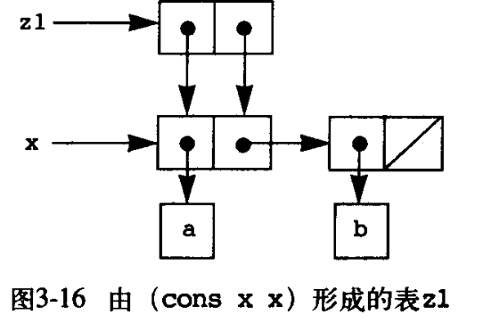

# 模块化、对象和状态

模块化：把复杂系统分解为一些边界清晰、易于理解的部分（解耦合）；

对象：

* 世界由一批对象组成，每个对象有其状态和行为方式
* 对象的状态随时间不断变化，其行为受历史的影响

## 赋值和局部状态

赋值：修改对象的状态变量

```scheme
(set! <name> <new-value>)
```

begin：

```scheme
(begin <exp1> <epx2> ... <expn>)
; 会依次执行exp，返回最后一个表达式expn的值
```

全局变量不安全，任何过程都能访问和控制，因此需要局部变量；

```scheme
; 提款处理器
(define new-withdraw
  (let ((balance 100))
    (lambda (amount)
      (if (>= balance amount)
          (begin (set! balance (- balance amount)) balance)
          "Insufficient funds"))))
```

`set!`和局部变量的结合形成了一种通用编程技术；

例子（银行账号）：

```scheme
(define (make-account balance)
  (define (withdraw amount)
    (if (>= balance amount)
        (begin (set! balance (- balance amount)) balance)
        "Insufficient funds"))
  (define (deposit amount)
    (set! balance (+ balance amount)) balance)
  (define (dispatch m)
    (cond ((eq? m 'withdraw) withdraw)
          ((eq? m 'deposit) deposit)
          (else (error "Unknown req -- MAKE-ACCOUNT" m))))
  dispatch)
; 这个过程返回一个带局部环境的对象（过程）
(define acc (make-account 100))
((acc 'withdraw) 50) ;50
((acc 'withdraw) 60) ;"Insufficient funds"
((acc 'deposit) 40) ;90
((acc 'withdraw) 60) ;30
```

把系统看成一组有内部状态的对象，也是实现模块化设计的强有力技术。

实例：设计随机数生成过程 实例：设计随机数生成过程 rand，希望对它反复调用能生成一系列整数，这些数具有均匀分布的统计性质。
假定已有一个过程 rand-update对一个数调用它将得到下一个（随机）数。
$$
x_2 = (rand-update x_1)\\
x_3 = (rand-update x_2)
$$
可定义一个带局部状态的过程 可定义一个带局部状态的过程 rand，实现一个随机数生成器：

```scheme
(define rand
  (let ((x random-init))
    (lambda ()
      (set! x (rand-update))
      x)))
```

在复杂计算中，从其中一部分观察，其他部分都像在随着时间不断变化，它们通常都隐藏了一些变化的细节（内部状态）。

如果想基于这种认识这样分解系统，最直接的方式就是用计算对象模拟系统随时间变化的行为，用局部变量模拟部分的内部状态，用赋值模拟状态变化。

无赋值的编程称为**函数式编程**。

### 引进赋值的代价

有赋值后变量就不是代表值的简单名字，应该看成是保存值的位置，其值可以保存。

如果一种语言支持 如果一种语言支持“ 同样的东西可以相互替换”，而且这种替换不会改变表达式的值（程序的意义），称这种语言具有**引用透明性**；

纯函数式语言具有引用透明性；

失去引用透明性，“同一个”的概念会变的复杂。赋值会打破语言的引用透明性。

基于赋值的程序设计称为**命令式程序设计**，

## 求值的环境模型

记录变量约束值的结构称为“环境”；没有环境，表达式求值就没有意义；

处理赋值的求值模型需要有**存储**的概念；

新概念：

* 环境：框架的链接结构
* 框架：可空的表格，项表示变量约束。在一个框架里，每个变量至多有一个约束；
* 每个框架都有一个指向外围框架的指针（外围框架指针），全局框架在最上层，没有外围框架；
* 一个变量在一个环境里的值，就是在该环境里的第一个有其约束的框架里的值；

### 求值规则

* 求出组合式的各个子表达式的值
* 将运算符表达式的值作用于运算对象表达式的值
* 赋值`set!`的执行可能改变当前环境里已有的约束，define的执行可能导致环境新增约束
* 过程定义、调用和退出导致环境变化是最需要关注的事项

```scheme
(define (square x) (* x x))
; 等同于
(define square (lambda (x) (* x x)))
```

求值效果是在全局环境增加了square的约束，它约束于新建的过程对象；


在全局环境中求值组合表达式时，第一个参数的值是一个过程对象：

1. 建立新环境
   * 用过程对象的参数表和实参创建一个新框架
   * 建立以新框架为当前框架，以环境指针为外围框架的新环境
2. 在新环境里求值过程体

求值`(square 5))`：

* 求值时先创建新环境$E1$，建立一个新框架为当前框架，其中x约束到5
* 在$E1$中求值过程体`(* x x)`得到结果25


`define`和`set!`的不同：

* define的作用时在当前环境的当前框架里定义一个符号
  * 在当前框架里建立一个约束，将被定义符号约束到给定值
  * 如果当前框架已有这个符号，则改变其约束
* `(set! <变量> <value>`的作用：
  * 在当前环境里查找 在当前环境里查找`<变量>`的约束。如果当前框架里有，约束就确定了；否则到外围框架去找。查找可以沿外围环境指针前进多步
  * 找到的约束中变量的约束值修改为由 把找到的约束中变量的约束值修改为由` <value>` 算出的值
  * 如果环境中没有`<变量>`的约束（查找到达全局框架但仍未找到），就报告变量无定义错误。

### 简单过程的应用

设有定义：

```scheme
(define (square x) (* x x))
(define (sum-of-squares)
  (+ (square x) (square x)))
(define (f a)
  (sum-of-squarex (+ a 1)
                  (* a 2)))
```

三个定义建立其的环境：


求值`(f 5)`创建的环境：


### 内部定义

考虑带有内部定义的过程：

```scheme
(define (sqrt x)
  (define (good-enough? guess) (< (abs (- (square guess) x)) 0.001))
  (define (improve guess) (average guess (/ x guess)))
  (define (sqrt-iter guess)
    (if (good-enough? guess) guess (sqrt-iter (improve guess))))
  (sqrt-iter 1.0))
```


## 用变动数据做模拟

基于对象的观点构造系统：

* 需要有能随计算而变化状态的复合数据对象
* 需要增加一类修改状态的操作，称为**改变函数**

### 变动的表结构

```scheme
(set-car! x y) ; 把 x 所指序对的 car 修改为 y（的值）
(set-cdr! x y) ; 把 x 所指序对的 cdr 修改为 z（的值）
```

cons通过创建新序对的方式构造新的表，而`set-car!`和`set-cdr!`是破坏性操作，直接修改已有的表结构；

**共享和相对**

`eq?`检查两个表达式的值是否为同一个实体；

```scheme
(define x (list 'a 'b))
(define z1 (cons x x))
(define z2 (cons (list 'a 'b) (list 'a 'b)))
(eq? z1 z2) ; false
```

z1的表结构：



z2的表结构：


**改变也就是赋值**

用过程表示序对：

```scheme
(define (cons x y)
  (define (set-x! v) (set! x v))
  (define (set-y! v) (set! y v))
  (define (dispatch m)
    (cond ((eq? m 'car) x)
          ((eq? m 'cdr) y)
          ((eq? m 'set-car!) set-x!)
          ((eq? m 'set-cdr!) set-y!)
          (else (error "Undefined operation -- CONS" m))))
  dispatch)
(define (car z) (z 'car))
(define (cdr z) (z 'cdr))
(define (set-car! z new-value) ((z 'set-car!) new-value) z)
(define (set-cdr! z new-value) ((z 'set-cdr!) new-value) z)
```

### 队列的表示

利用`set-car!`和`set-cdr!`能构造出一些基于`car/cdr/cons`不能实现的数据结构。其特点是：

* 在执行中，它们一直保持为同一个数据结构
* 但在其内部的状态可以通过操作改变

队列的基本操作：

* 创建
* 选择
* 修改

将队列实现为一个带有首尾指针的表：

```scheme
(define (front-ptr queue) (car queue))
(define (rear-ptr queue) (cdr queue))
(define (set-front-ptr! queue item) (set-car! queue item))
(define (set-rear-ptr! queue item) (set-cdr! queue item))
(define (empty-queue queue) (null? (front-ptr queue)))
(define (make-queue) (cons '() '()))
(define (front-queue queue)
  (if (empty-queue? queue)
      (error "Front-queue called with an empty queue")
      (car (front-ptr queue))))
(define (insert-queue! queue item)
  (let ((new-pair (cons item '())))
    (cond ((empty-queue? queue)
           (set-front-ptr! queue new-pair)
           (set-rear-ptr! queue new-pair)
           queue)
          (else
           (set-cdr! (rear-ptr queue) new-pair)
           (set-rear-ptr! queue new-pair)
           queue))))
(define (delete-queue! queue)
  (cond ((empty-queue? queue)
         (error "Delete-queue! called with an empty queue"))
        (else
         (set-front-ptr! queue (cdr (front-ptr queue)))
         queue)))
```

表格的表示：


```scheme
(define (lookuo key table)
  (let ((record (assoc key (cdr table))))
    (if record
        (cdr record)
        false)))
(define (assoc key records)
  (cond ((null? records) false)
        ((eq? key (caar records)) (car records))
        (else (assoc key (cdr records)))))
(define (insert! key value table)
  (let ((record (assoc key (cdr table))))
    (if record
        (set-cdr! record value)
        (set-cdr! table
                  (cons (cons key value) (cdr table))))))
(define (make-table)
  (list '*table*))
```

二维表格：

```scheme

(define (make-table)
  (let ((local-table (list '*table*)))
    (define (lookup key-1 key-2 table)
      (let ((substable (assoc key-1 (cdr table))))
        (if subtable
            (let ((record (assoc key-2 subtable)))
              (if record (cdr record) false))
            false)))
    (define (insert! key-1 key-2 value table)
      (let ((subtable (assoc key-1 (cdr table))))
        (if subtable
            (let ((record (assoc key-2 (cdr subtable))))
              (if record
                  (set-cdr! record value)
                  (set-cdr! subtable
                            (cons (cons key-2 value)
                                  (cdr subtable)))))
            (set-cdr! table
                      (cons (list key-1 (cons key-2 value))
                            (cdr table)))))
      'ok)
    (define (dispatch m)
      (cond ((eq? m 'lookup-proc) lookup)
            ((eq? m 'insert-proc!) insert!)
            (else (error "Unknown operation -- TABLE" m))))
    dispatch))
```

创建一个操作表格：

```scheme
(define operation-table (make-table))
(define get (operation-table 'lookup-proc))
(define put (operation-table 'insert-proc!))
```

### 数字电路的模拟器

数字电路模拟器代表了一类计算机应用：事件驱动的模拟系统。

事件驱动的模拟的基本想法：

* 被模拟的系统通常由一组对象组成，对象处在不断的活动中，整个系统的活动就是这些对象活动的整体效果
* 系统的活动中将会发生一些事件
* 一个事件的发生又可能引发其他事件

基本功能块：

* `(get-signal <wire>)`返回`<wire>`上的当前信号值
* `(set-signal! <wire> <new value>)`将`<wire>`的信号值设为新值
* `(add-action! <wire> <procedure of no arguments>)`要求在`<wire>`的信号值改变时执行指定过程（过程注册）
* `after-delay`要求在给定时延之后执行指定过程（两个参数）

反门在特定的时间延迟后将输入的逆送给输出

```scheme
(define (invert input output)
  (define (invert-input)
    (let ((new-value (logical-not (get-signal input))))
      (after-delay invert-delay
                   (lambda () (set-signal! output new-value)))))
  (add-action! input invert-input)
  'ok)
(define (logical-not s)
  (cond ((= s 0) 1)
        ((= s 1) 0)
        (else (error "Invalid signal" s))))
```

与门有两个输入，两个输入得到信号时都要执行某种动作:

```scheme
(define (and-gate a1 a2 output)
  (define (and-action-procedure)
    (let ((new-value (logical-and (get-signal a1) (get-signal a2))))
      (after-delay and-gate-delay
                   (lambda () (set-signal! output new-value)))))
  (add-action! a1 and-action-procedure)
  (add-action! a2 and-action-procedure)
  'ok)
(define (logical-and a b)
  (cond ((or (= a 0) (= b 0)) 0)
        ((and (= a 1) (= b 1)) 1)
        (else (error "Invalid signal" a b))))
```

或门：

```scheme
(define (or-gate a1 a2 output)
  (define (or-action-procedure)
    (let ((new-value (logical-or (get-signal a1) (get-signal a2))))
      (after-delay or-gate-delay
                   (lambda () (set-signal! output new-value)))))
  (add-action! a1 or-action-procedure)
  (add-action! a2 or-action-procedure)
  'ok)
(define (logical-or a b)
  (cond ((or (= a 1) (= b 1)) 1)
        ((and (= a 0) (= b 0)) 0)
        (else (error "Invalid signal" a b))))
```

连线是计算对象，有局部的信号值变量 signal-value 和记录一组过程的变量 action-procedures，连线信号值改变时执行这些过程：

```scheme
(define (make-wire)
  (let ((signal-value 0) (action-procedures ‘())) ; 初始值
    (define (set-my-signal! new-value)
      (if (not (= signal-value new-value))
          (begin (set! signal-value new-value)
                 (call-each action-procedures))
          'done))
    (define (accept-action-procedure! proc)
      (set! action-procedures (cons proc action-procedures))
      (proc)) ; 立刻执行无参过程 proc一次
    (define (dispatch m)
      (cond ((eq? m 'get-signal) signal-value)
            ((eq? m 'set-signal!) set-my-signal!)
            ((eq? m 'add-action!) accept-action-procedure!)
            (else (error "Unknown operation -- WIRE" m))))
    dispatch))
```

辅助过程`call-each`逐个调用过程表里的各个过程（都是无参过程）。

```scheme
(define (call-each procedures)
  (if (null? procedures)]
      'done
      (begin
       ((car procedures))
       (call-each (cdr procedures)))))
```

使用连线的几个过程：

```scheme
(define (get-signal wire)
  (wire 'get-signal))
(define (set-signal! wire new-value)
  ((wire 'set-signal!) new-value))
(define (add-action! wire action-procedure)
  ((wire 'add-action!) action-procedure))
```

考虑after-delay的实现：维护一个表，称为待处理表，记录将来需要处理的事项；

待处理表的操作：

* make-agenda：返回新建的空待处理表
* empty-agenda？：判断待处理表是否为空
* first-agenda-item：返回待处理表中第一项
* remove-first-agenda-item！：删除待处理表里的第一项
* add-to-agenda！：向待处理表中加入一项，其意义是要求在给定时间允许的过程
* current-time：返回当前时间

待处理表用the-agenda表示；

after-delay：

```scheme
(define (after-delay delay action)
  (add-to-agenda! (+ delay (current-time the-agenda))
                  action
                  the-agenda))
```

待处理表的具体实现后面考虑；

模拟驱动过程：顺序处理待处理表中的项；

```scheme
(define (propagate) ; 迭代式地处理最早的事件处理
  (if (empty-agenda? the-agenda)
      'done
      (let ((first-item (first-agenda-item the-agenda)))
        (first-item)
        (remove-first-agenda-item! the-agenda)
        (propagate))))
```

为看到所实现的数字电路模拟系统的运行情况，需要实现一个观察接口过程，这种过程称为“监视器”（monitor）。

```scheme
(define (probe name wire)
  (add-action! wire
               (lambda()
                 (newline)
                 (display name)
                 (display ",Time = ")
                 (display (current-time the-agenda))
                 (display " New-Value = ")
                 (display (get-signal wire)))))
```

 模拟实例：模拟一个半加器的运行情况

```scheme
(define the-agenda (make-agenda))
(define inverter-delay 2)
(define and-gate-delay 3)
(define or-gate-delay 5)

(define input-1 (make-wire))
(define input-2 (make-wire))
(define sum (make-wire))
(define carry (make-wire))
(probe 'sum sum)
; sum 0 New-value = 0
(probe 'carry carry)
; carry 0 New-value = 0
(half-adder input-1 input-2 sum carry) ; 把线路连接到半加器上
(set-signal! input-1 1) ; 将input-1置为1
(propagate) ; 允许这个模拟
; sum 8 New-value = 1
; done
```

**待处理表的实现**

待处理表的功能与队列类似，其中记录要运行的过程。元素是时间段，包含一个时间值和一个队列，队列里是在该时间要执行的过程：

```scheme
(define (make-time-segment time queue) (cons time queue))
(define (segment-time s) (car s))
(define (segment-queue s) (cdr s))

(define (make-agenda) (list 0))
(define (current-time agenda) (car agenda))
(define (set-current-time! agenda time) (set-car! agenda time))
(define (set-segments! agenda segments)
  (set-cdr! agenda segments))
(define (first-segment agenda) (car (segments agenda)))
(define (rest-segment agenda) (cdr (sgements agenda)))

(define (add-to-agenda! time action agenda)
  (define (belongs-before? segments)
    (or (null? segments) (< time (segment-time (car segments)))))
  (define (make-new-time-segment time action)
    (let ((q (make-queue)))
      (insert-queue! q action)
      (make-time-segment time q)))
  (define (add-to-segments! segments)
    (if (= (segment-time (car segments)) time)
        (insert-queue! (segment-queue (car segments)) action)
        (let ((rest (cdr segments)))
          (if (belongs-before? rest)
              (set-cdr! segments
                        (cons (make-new-time-segment time action) (cdr segments)))
              (add-to-segments! rest)))))
  (let ((segments (segments agenda)))
    (if (belongs-before? segments)
        (set-segments! agenda
                       (cons (make-new-time-segment time action) segments))
        (add-to-segments! segments))))

(define (remove-first-agenda-item! agenda)
  (let ((q (segment-queue (first-segment agenda))))
    (delete-queue! q)
    (if (empty-queue? q)
        (set-segments! agenda (rest-segments agenda)))))

(define (first-agenda-item agenda)
  (if (empty-agenda? agenda)
      (error "Agenda is empty -- FIRST-AGENDA-ITEM")
      (let ((first-seg (first-segment agenda)))
        (set-current-time! agenda (segment-time first-seg))
        (front-queue (segment-queue first-seg)))))
```

### 约束的传播

常规程序都是单方面的计算；

约束传播语言：一批不同的量之间的关系；

约束传播：

* 一组变量通过某些方式相互约束
* 一旦某变量有了值，其值可以通过相关约束传播到其他变量
* 如果约束足够强，就可以确定某些未定变量的值
* 如果一个变量的值改变，这种改变会通过约束传播出去

约束传播语言的基本概念是“约束”；

提供组合约束的方法：提供一种连接器，用于连接不同的约束；

## 并发

无赋值的程序无并发问题；

有赋值的程序必须考虑时间的影响；

在赋值的情况下：

* 多个并发活动“同时”去操作共享变量会导致问题
* 具体行为依赖操作发生的顺序和操作执行的细节

要保证系统的正确行为，就要对其中并发行为增加一定限制，这就是并发控制；

一种简单想法是串行控制器（serializer），基本思想：通过将程序里的过程分组，禁止不当的并发行为。

* 将与并发执行相关的过程分解为一些集合（称为互斥过程集，或者互斥过程组）
* 任何时候，在每个集合里，只允许至多一个过程执行（注意，这里说的是过程执行，也禁止同一个过程的两个执行）
* 如果某时刻某个集合里已经有了一个过程正在执行
  * 调用同一集合里任何过程的进程都必须“挂起”等待
  *  一个等待进程将一直挂起，直到导致它“挂起”的过程的执行结束，它才有可能开始执行调用的过程
  * 如果有多个进程等待某个过程的执行结束，该过程结束时采用某种策略选出下一个执行进程，其余的进程继续等待

## 流

离散时间的函数可以用无穷长的序列模拟，称之为流；

从表面上看，流就像表，构造函数cons-stream，选择函数stream-car和stream-cdr，the-empty-stream生成一个空流，用steam-null?判断；

基于这些操作可定义各种序列的操作：

```scheme
(define (stream-ref s n)
  (if (= n 0)
      (stream-car s)
      (stream-ref (stream-cdr s) (- n 1))))
(define (stream-map proc s)
  (if (stream-null? s)
      the-empty-stream
      (cons-stream (proc (stream-car s))\
                   (stream-map proc (stream-cdr s)))))
(define (stream-for-each proc s)
  (if (stream-null? s)
      'done
      (begin (proc (stream-car s))
             (stream-for-each proc (stream-cdr s)))))
```

**流的实现**

流和常规表一样，不同就在于元素的求值时间：

* 表的两个成分(car/cdr)都在构造表的时候求值
* 流的cdr部分将推迟到选取该部分时再求值

流的实现基于特殊形式delay：

* 求值`(delay e)`时不求值`e`，而是返回一个延时对象
* 延时对象是对未来计算的一个允诺，如果需要，任何时候都可以对它的操作而计算值

```scheme
(define (cons-stream a b) (cons a (delay b)))
(define (stream-car stream) (car stream))
(define (stream-cdr stream) (force (cdr stream)))
```

流中采用的求值方式称之为**延迟求值**，把求值工作推迟到不得不做的时候；

延迟求值可以看作：

* 按需求值
* 需要驱动的程序

延迟求值可以使过程中事件的实际发生顺序和过程表面结构之间的对应关系变得比较宽松；

delay和force的实现：

```scheme
(delay <exp>)
; 等同于
(lambda () <exp>)
; force 则简单调用delay产生的无参过程
(define (force delay-obj) (delay-obj))
```

