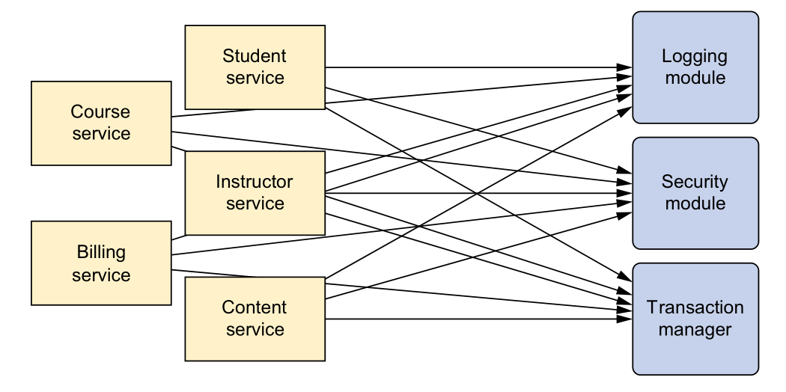
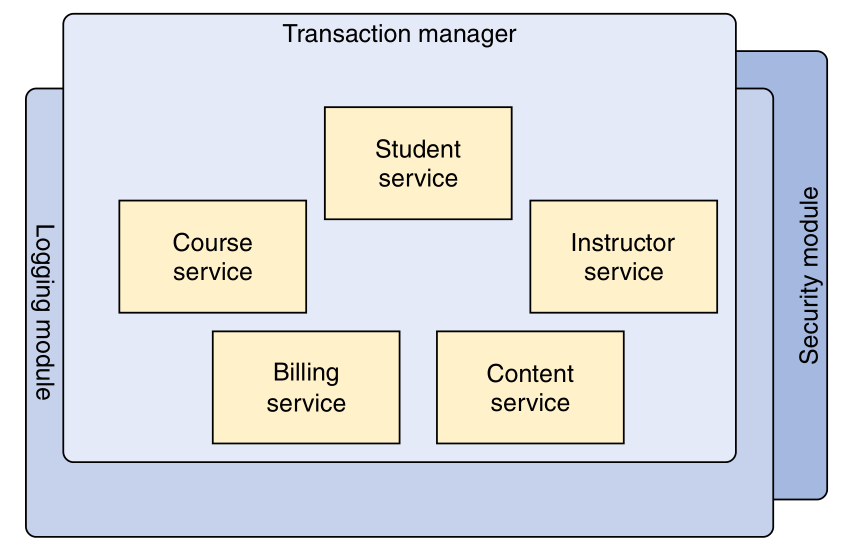
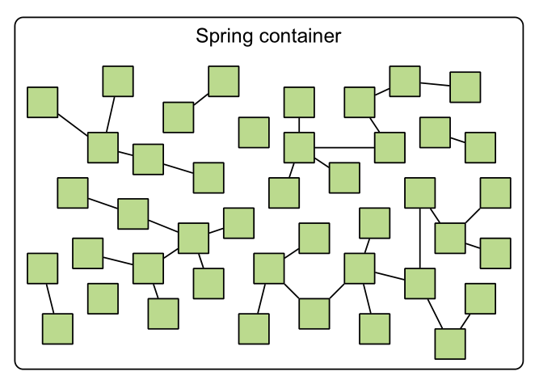
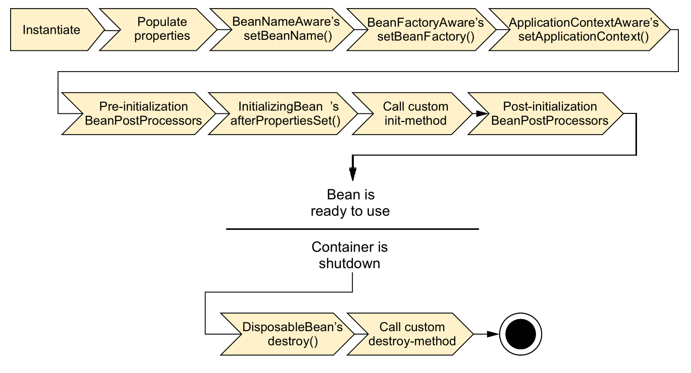
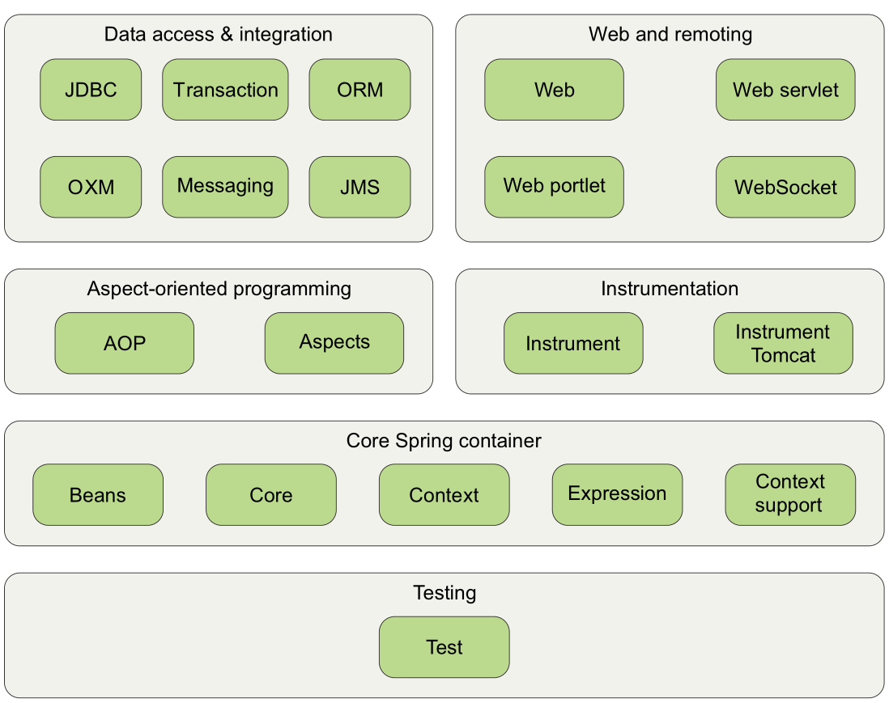

# Spring之旅

spring简化Java开发的关键策略：

* 基于 POJO 的轻量级和最小侵入性编程；
* 通过依赖注入和面向接口实现松耦合；
* 基于切面和惯例进行声明式编程；
* 通过切面和模板减少样板式代码。


## 简化Java开发

### 激发 POJO 的潜能

POJO：“Plain Old Java Object”，意为简单java对象，含义是指那些没有从任何类继承、也没有实现任何接口，更没有被其它框架侵入的java对象。

spring 通过使用DI(dependency injection )来装配POJO。

### 依赖注入

实际的开发过程中需要多个类协同完成任务，按照传统的每个对象负责管理与自己协作的对象的引用，这会导致高耦合度和难以测试的代码；

下面就是一个高耦合度的代码：

```java 
public class DamselRescuingKnight implements Knight {
    private RescueDamselQuest quest;

    public DamselRescuingKnight() {
        this.quest = new RescueDamselQuest(); //紧耦合
    }

    public void embarkOnQuest() {
        quest.embark();
    }
}
```

这个只能完成一个特定的quest，而且难以测试，在测试中，必须保证当embarkOnQuest() 方法被调用的时候， embark() 方法也要被调用。但是没有一个简单明了的方式能够实现这一点。

耦合的两面性：

* 紧密耦合的代码难以测试、难以复用、难以理解
* 一定程度的耦合又是必须的 —— 完全没有耦合的代码什么也做不了

依赖注入会将所依赖的关系自动交给目标对象，而不是让对象自己去获取依赖，

下面为低耦合的代码：

```java 
public class BraveKnight implements Knight {
    private Quest quest;

    public BraveKnight(Quest quest){
        this.quest = quest;
    }

    public void embarkOnQuest() {
        quest.embark();
    }
}
```

这个代码，在构造时把quest作为构造器参数传入，这就是依赖注入的一个方式：**构造器注入**；

假设，希望 BraveKnight 所要进行探险任务是杀死一只怪龙，则SlayDragonQuest ：

```java
public class SlayDragonQuest implements Quest {
    private PrintStream printStream;

    public SlayDragonQuest(PrintStream printStream) {
        this.printStream = printStream;
    }

    public void embark() {
        printStream.println("Embarking on quest to slay the dragon!");
    }
}
```

SlayDragonQuest 需要从注入printStream，而Brave需要注入Quest，注入方法：

1. xml方式

   ```xml
   <?xml version="1.0" encoding="UTF-8"?>
   <beans xmlns="http://www.springframework.org/schema/beans"
          xmlns:xsi="http://www.w3.org/2001/XMLSchema-instance"
          xsi:schemaLocation="http://www.springframework.org/schema/beans http://www.springframework.org/schema/beans/spring-beans.xsd">
       <bean id="knight" class="knight.BraveKnight">
           <constructor-arg ref="quest" />
       </bean>
   
       <bean id="quest" class="knight.RescueDamselQuest">
           <constructor-arg value="#{T(System).out}" />
       </bean>
   </beans>
   ```

   BraveKnight 和 SlayDragonQuest 被声明为 Spring 中的 bean。就 BraveKnight bean 来讲，它在构造时传入了对 SlayDragonQuest bean 的引用，将其作为构造器参数。同时， SlayDragonQuest bean 的声明使用了 Spring 表达式语言（Spring Expression Language），将 System.out（这是一个 PrintStream）传入到了 SlayDragonQuest 的构造器中。

2. Java注解

   ```java
   @Configuration
   public class KnightConfig { // java 装配Bean
       @Bean
       public Knight knight() {
           return new BraveKnight(quest());
       }
   
       @Bean
       public Quest quest() {
           return new SlayDragonQuest(System.out);
       }
   }
   ```


Spring 通过应用上下文（Application Context）装载 bean 的定义并把它们组装起来。Spring 应用上下文全权负责对象的创建和组装。Spring 自带了多种应用上下文的实现，它们之间主要的区别仅仅在于如何加载配置。因为 knights.xml 中的 bean 是使用 XML 文件进行配置的，所以选择  ClassPathXmlApplicationContext 作为应用上下文相对是比较合适的。该类加载位于应用程序类路径下的一个或多个 XML 配置文件。KnightMain.java 加载包含 Knight 的 Spring 上下文，main() 方法调用 ClassPathXmlApplicationContext 加载 knights.xml，并获得 Knight 对象的引用。

```java
public class KnightMain {

    public static void main(String[] args) throws Exception {
        ClassPathXmlApplicationContext context =
                new ClassPathXmlApplicationContext(
                        "META-INF/spring/knight.xml");
        Knight knight = context.getBean(Knight.class);
        knight.embarkOnQuest();
        context.close();
    }
}
```

main() 方法基于 knights.xml 文件创建了 Spring 应用上下文。随后它调用该应用上下文获取一个 ID 为 knight 的 bean。得到 Knight 对象的引用后，只需简单调用 embarkOnQuest() 方法就可以执行所赋予的探险任务了。

### 应用切面

面向切面编程（aspect-oriented programming，AOP）允许把遍布应用各处的功能分离出来形成可重用的组件。

不使用AOP：



使用AOP将服务模块化后：



AOP 能够使这些服务模块化，并以声明的方式将它们应用到它们需要影响的组件中去。所造成的结果就是这些组件会具有更高的内聚性并且会更加关注自身的业务，完全不需要了解涉及系统服务所带来复杂性。总之，AOP 能够确保 POJO 的简单性。

### 使用模板消除样式代码

spring通过模板封装来消除样板式代码。


## 容纳你的 Bean

spring 是个容器，负责对象的创建和装配。



容器是spring的核心，spring使用DI管理构成应用的组件，它会创建相互协作的组件之间的关联。

spring自带多个容器实现，大致分为两类：

* Bean工厂
* 应用上下文（主要使用）

### 使用应用上下文

spring自带的几种应用上下文：

* AnnotationConfigApplicationContext：从一个或多个基于 Java 的配置类中加载 Spring 应用上下文。
* AnnotationConfigWebApplicationContext：从一个或多个基于 Java 的配置类中加载 Spring Web 应用上下文。
* ClassPathXmlApplicationContext：从类路径下的一个或多个 XML 配置文件中加载上下文定义，把应用上下文的定义文件作为类资源。
* FileSystemXmlapplicationcontext：从文件系统下的一 个或多个 XML 配置文件中加载上下文定义。
* XmlWebApplicationContext：从 Web 应用下的一个或多个 XML 配置文件中加载上下文定义。

例子：

```java
ApplicationContext context = new FileSystemXmlApplicationContext("c:/knight.xml");
ApplicationContext context = new ClassPathXmlApplicationContext("knight.xml");
ApplicationContext context = new AnnotationConfigApplicationContext(com.springinaction.knights.config.KnightConfig.class);
```

### Bean 的生命周期

spring中Bean的生命周期：



步骤：

1. Spring 对 bean 进行实例化；
2. Spring 将值和 bean 的引用注入到 bean 对应的属性中；
3. 如果 bean 实现了 BeanNameAware 接口，Spring 将 bean 的 ID 传递给 setBeanName()方法；
4. 如果 bean 实现了 BeanFactoryAware 接口，Spring 将调用  setBeanFactory() 方法，将 BeanFactory 容器实例传入；
5. 如果 bean 实现了 ApplicationContextAware 接口，Spring 将调用 setApplicationContext() 方法，将 bean 所在的应用上下文的引用传入进来；
6. 如果 bean 实现了 BeanPostProcessor 接口，Spring 将调用它们的 postProcessBefore-Initialization() 方法；
7. 如果 bean 实现了 InitializingBean 接口，Spring 将调用它们的 afterPropertiesSet() 方法。类似地，如果 bean 使用 initmethod 声明了初始化方法，该方法也会被调用；
8. 如果 bean 实现了 BeanPostProcessor 接口，Spring 将调用它们的 postProcessAfter-Initialization() 方法；
9. 此时，bean 已经准备就绪，可以被应用程序使用了，它们将一直驻留在应用上下文中，直到该应用上下文被销毁；
10. 如果 bean 实现了 DisposableBean 接口，Spring 将调用它的 destroy() 接口方法。


## 俯瞰 Spring 风景线



