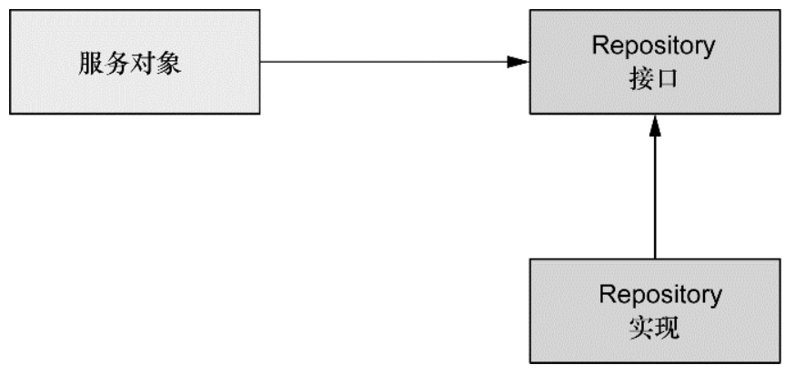

# 通过 Spring 和 JDBC 征服数据库

## Spring 的数据访问哲学

为了避免应用与特定的数据访问策略耦合在一起，编写良好的 Repository 应该以接口的方式暴露功能。



优点：

* 使得服务对象易于测试，因为它们不再与特定的数据访问实现绑定在一起。
* 这可以实现灵活的设计，并且切换持久化框架对应用程序其他部分所带来的影响最小。

## 配置数据源

### 使用 JNDI 数据源

借助 JndiObjectFactoryBean 从 JNDI 中查找 DataSource：

```java
@Bean
public JndiObjectFactoryBean dataSource() {
  JndiObjectFactoryBean jndiObjectFB = new JndiObjectFactoryBean();
  jndiObjectFB.setJndiName("jdbc/SpittrDS");
  jndiObjectFB.setResourceRef(true);
  jndiObjectFB.setProxyInterface(javax.sql.DataSource.class);
  return jndiObjectFB;
}
```


### 使用数据源连接池

Java 配置连接池形式的 DataSource bean 可以声明如下：

```java
@Bean
public BasicDataSource dataSource() {
  BasicDataSource ds = new BasicDataSource();
  ds.setDriverClassName("org.h2.Driver");
  ds.setUrl("jdbc:h2:tcp://localhost/~/spitter");
  ds.setUsername("sa");
  ds.setPassword("");
  ds.setInitialSize(5);
  ds.setMaxActive(10);
  return ds;
}
```

### 基于 JDBC 驱动的数据源

配置 DriverManagerDataSource 的方法：

```java
@Bean
public DataSource dataSource() {
  DriverManagerDataSource ds = new DriverManagerDataSource();
  ds.setDriverClassName("org.h2.Driver");
  ds.setUrl("jdbc:h2:tcp://localhost/~/spitter");
  ds.setUsername("sa");
  ds.setPassword("");
  return ds;
}
```

## 在 Spring 中使用 JDBC

### 使用 JDBC 模板

Spring 为 JDBC 提供了三个模板类供选择：

- JdbcTemplate：最基本的 Spring JDBC 模板，这个模板支持简单的 JDBC 数据库访问功能以及基于索引参数的查询；
- NamedParameterJdbcTemplate：使用该模板类执行查询时可以将值以命名参数的形式绑定到 SQL 中，而不是使用简单的索引参数；
- SimpleJdbcTemplate：该模板类利用 Java 5 的一些特性如自动装箱、泛型以及可变参数列表来简化 JDBC 模板的使用。

**对于大多数的 JDBC 任务来说，JdbcTemplate 就是最好的可选方案**;

