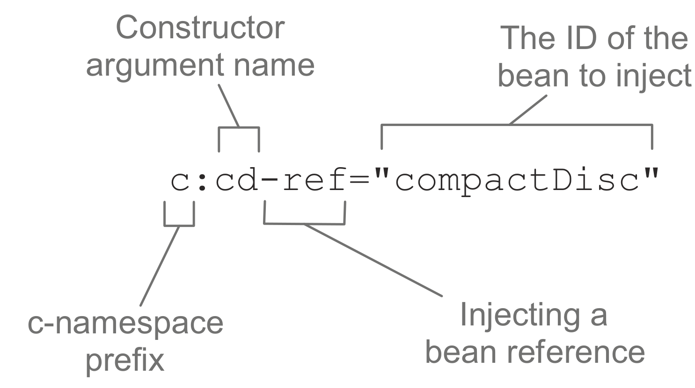
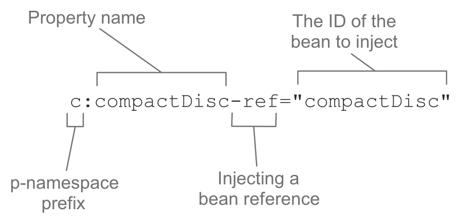

# 装配Bean

## Spring 配置的可选方案

主要有三种：

1. 在 XML 中进行显式配置。
2. 在 Java 中进行显式配置。
3. 隐式的 bean 发现机制和自动装配。

推荐采用第三种，并尽可能的减少显式配置，显式配置也尽可能的采用Java config；

## 自动化装配 bean

spring从两个角度来实现自动化装配：

- 组件扫描（component scanning）：Spring 会自动发现应用上下文中所创建的 bean。
- 自动装配（autowiring）：Spring 自动满足 bean 之间的依赖。

### 创建可被发现的 bean

可以使用@Bean，推荐使用@Component，spring会为其自动配置，然后从再用@ComponentScan 注解启用了组件扫描。

测试时用Spring 的 SpringJUnit4ClassRunner，以便在测试开始的时候自动创建 Spring 的应用上下文。注解 @ContextConfiguration 会告诉需要在哪个Java类中加载配置。

 @Autowired则会在组件扫描出的组件中获取到对象。

### 为组件扫描的 bean 命名

两种方式：

1. @Component("name")
2. @Named("name")（较少用）

### 设置组件扫描的基础包

1. @ComponentScan("包名")
2. @ComponentScan(basePackages="包名")
3. @ComponentScan(basePackages={"包名1", "包名2"})
4. @ComponentScan(basePackageClasses={类名1 ，类名2})

### 通过为 bean 添加注解实现自动装配

为了声明要进行自动装配，可以借助 Spring 的 @Autowired 注解。


## JavaConfig注入

在 JavaConfig 中装配 bean 的最简单方式就是引用创建 bean 的方法。带有 @Bean 注解的方法可以采用任何必要的 Java 功能来产生 bean 实例。构造器和 Setter 方法只是 @Bean 方法的两个简单样例。

## XML装配Bean

Spring XML 配置如下所示：

```XML
<?xml version="1.0" encoding="UTF-8"?>
<beans xmlns="http://www.springframework.org/schema/beans"
  xmlns:xsi="http://www.w3.org/2001/XMLSchema-instance"
  xsi:schemaLocation="http://www.springframework.org/schema/beans 
  http://www.springframework.org/schema/beans/spring-beans.xsd
  http://www.springframework.org/schema/context" >
  
  <!-- 具体配置 />
</beans>
```

### 声明一个简单的bean

```xml
<bean class="soundsystem.SgtPeppers" />
```

这里声明了一个很简单的 bean，创建这个 bean 的类通过 class 属性来指定的，并且要使用全限定的类名。

因为没有明确给定 ID，所以这个 bean 将会根据全限定类名来进行命 名。在本例中，bean 的 ID 将会是 “soundsystem.SgtPeppers#0”。其中，“#0” 是一个计数的形式，用来区分相同类型的其他 bean。如果你声明了另外一个 SgtPeppers，并且没有明确进行标识，那么它自动得到的 ID 将会是 “soundsystem.SgtPeppers#1”。

尽管自动化的 bean 命名方式非常方便，但如果你要稍后引用它的话，那自动产生的名字就没有多大的用处了。因此，通常来讲更好的办法是借助 id 属性，为每个 bean 设置一个你自己选择的名字：

```xml
<bean id="compactDisc" class="soundsystem.SgtPeppers" />
```

### 借助构造器注入初始化 bean

两种基本的配置方案:

1. `<constructor-arg>`元素

   ```xml
   <bean id="cdPlayer" class="soundsystem.CDPlayer">
     <constructor-arg ref="compactDisc">
   </bean>
   ```

   当 Spring 遇到这个bean元素时，它会创建一个 CDPlayer 实例。 Bean元素会告知 Spring 要将一个 ID 为 compactDisc 的 bean 引用传递到 CDPlayer 的构造器中。

2. 使用 Spring 3.0 所引入的 `c-` 命名空间

   使用它的话，必须要在 XML 的顶部声明其模式，如下所示：

   ```xml
   <?xml version="1.0" encoding="UTF-8"?>
   <beans xmlns="http://www.springframework.org/schema/beans"
     xmlns:c="http://www.springframework.org/schema/c"
     xmlns:xsi="http://www.w3.org/2001/XMLSchema-instance"
     xsi:schemaLocation="http://www.springframework.org/schema/beans 
     http://www.springframework.org/schema/beans/spring-beans.xsd" >
     
     ...
     
   </beans>
   ```

   使用方法：

   ```xml
   <bean id="cdPlayer" class="soundsystem.CDPlayer" c:cd-ref="compactDisc" />
   ```

   

### 设置属性

通过setter注入，就需要设置属性：

```xml
<bean id="cdPlayer" class="soundsystem.CDPlayer" >
  <property name="compactDisc" ref="compactDisc" />
</bean>
```

同样，spring提供`p-`作为 `<property>` 元素的替代方案

启用`p-`需要声明：

```xml
<?xml version="1.0" encoding="UTF-8"?>
<beans xmlns="http://www.springframework.org/schema/beans"
  xmlns:xsi="http://www.w3.org/2001/XMLSchema-instance"
  xmlns:p="http://www.springframework.org/schema/p"
  xsi:schemaLocation="http://www.springframework.org/schema/beans
  http://www.springframework.org/schema/beans/spring-beans.xsd">
  ...
</beans>
```



## 导入和混合配置

### 在 JavaConfig 中引用 XML 配置

用@ImportResource 注解注入XML配置

### 在 XML 配置中引用 JavaConfig

可以在 XML 配置文件中使用 `` 元素来引用该文件

