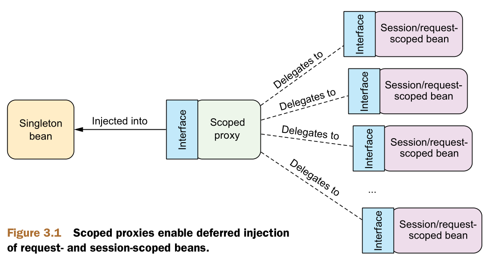

# 高级装配

## 环境与 profile

在不同的环境下，如数据库配置等会随着部署而发生改变，因此需要根据环境的不同而采用不同的方法。

如一般在开发阶段会采用嵌入式的数据库，而QA阶段则会使用其他的数据库，因此需要每次都为每种环境重新构建应用，Spring提供例如一种新的解决方式；

### 配置 profile bean

 Spring 引入了 bean profile 的功能。要使用 profile ，你首先要将所有不同的 bean 定义整理到一个或多个 profile 之中，在将应用部署到每个环境时，要确保对应的 profile 处于激活（ active ）的状态。

spring使用 @Profile 注解指定某个 bean 属于哪一个 profile 。

```java
@Profile("dev") // 只有在 dev profile 激活时才会创建
@Profile("prod") // 只有在 prod profile 激活时才会创建
// 支持类和函数级别的指定
```

同时也可以通过XML配置profile：

```xml
<?xml version="1.0" encoding="UTF-8"?>
<beans xmlns="http://www.springframework.org/schema/beans"
  xmlns:xsi="http://www.w3.org/2001/XMLSchema-instance" xmlns:jdbc="http://www.springframework.org/schema/jdbc"
  xmlns:jee="http://www.springframework.org/schema/jee" xmlns:p="http://www.springframework.org/schema/p"
  xsi:schemaLocation="
    http://www.springframework.org/schema/jee
    http://www.springframework.org/schema/jee/spring-jee.xsd
    http://www.springframework.org/schema/jdbc
    http://www.springframework.org/schema/jdbc/spring-jdbc.xsd
    http://www.springframework.org/schema/beans
    http://www.springframework.org/schema/beans/spring-beans.xsd">

  <beans profile="dev">
    <jdbc:embedded-database id="dataSource" type="H2">
      <jdbc:script location="classpath:schema.sql" />
      <jdbc:script location="classpath:test-data.sql" />
    </jdbc:embedded-database>
  </beans>
  
  <beans profile="prod">
    <jee:jndi-lookup id="dataSource"
      lazy-init="true"
      jndi-name="jdbc/myDatabase"
      resource-ref="true"
      proxy-interface="javax.sql.DataSource" />
  </beans>
</beans>
```

### 激活 profile

Spring 在确定哪个 profile 处于激活状态时，需要依赖两个独立的属性：`spring.profiles.active`  和 `spring.profiles.default`。如果设置了 `spring.profiles.active` 属性的话，那么它的值就会用来确定哪个 profile 是激活的。但如果没有设置 `spring.profiles.active` 属性的话，那 Spring 将会查找 `spring.profiles.default` 的值。如果 `spring.profiles.active` 和 `pring.profiles.default` 均没有设置的话，那就没有激活的 profile，因此只会创建那些没有定义在 profile 中的 bean。

使用XML配置：

```xml
  <context-param>
    <param-name>spring.profiles.default</param-name>
    <param-name>dev</param-name>
  </context-param>
```

使用 profile 进行测试时Spring 提供了 @ActiveProfiles 注解，我们可以使用它来指定运行测试时要激活哪个 profile。

```java
@RunWith(SpringJUnit4ClassRunner.class)
@ContextConfiguration(classes={PersistenceTestConfig.class})
@ActiveProfile("dev")
public class PersistenceTest {
  ...
}
```

## 条件化的 bean

Spring 4 引入了一个新的 @Conditional 注解，它可以用到带有 @Bean 注解的方法上。如果给定的条件计算结果为 true，就会创建这个bean，否则的话，这个bean会被忽略。

```java
@Bean
@Conditioal(MagicExistsCondition.class)
public MagicBean magicBean() {
  return new MagicBean();
}
```

@Conditional 中给定了一个 Class，它指明了条件 —— 在本例中，也就是 MagicExistsCondition。@Conditional 将会通过 Condition 接口进行条件对比：

```java
public interface Condition {
  boolean matches(ConditionContext ctxt, AnnotatedTypeMetadata metadata);
}
```

设置给 @Conditional 的类可以是任意实现了 Condition 接口的类型。可以看出来，这个接口实现起来很简单直接，只需提供 matches() 方法的实现即可。如果 matches() 方法返回 true，那么就会创建带有 @Conditional 注解的 bean。如果 matches() 方法返回 false，将不会创建这些 bean。

在本例中，我们需要创建 Condition 的实现并根据环境中是否存在 magic 属性来做出决策。以下的 MagicExistsCondition 是完成该功能的 Condition 实现 类： 

```java
public class MagicExistsCondition implements Condition {

  @Override
  public boolean matches(ConditionContext context, AnnotatedTypeMetadata metadata) {
    Environment env = context.getEnvironment();
    return env.containsProperty("magic");
  }
  
}
```

## 处理自动装配的歧义性

自动装配可能产生歧义，假设使用 @Autowired 注解标注了 setDessert() 方法：

```java
@Autowired
public void setDessert(Dessert dessert) {
  this.dessert = dessert;
}
```

Dessert 是一个接口，并且有三个类实现了这个接口，分别为 Cake、Cookies 和 IceCream：

```java
@Component
public class Cake implements Dessert { ... }
@Component
public class Cookies implements Dessert { ... }
@Component
public class IceCream implements Dessert { ... }
```

组件扫描时spring无法判断先用那个bean，就会抛出异常。

### 标示首选的 bean

使用@Primary 来设置首选的bean。

```java
@Component
@Primary
public class IceCream implements Dessert { ... }
```

xml配置：

```xml
<bean id="iceCream" class="com.desserteater.IceCream" primary="true" />
```

不允许两个首选的bean。

### 限定自动装配的 bean

@Qualifier 注解是使用限定符的主要方式。它可以与 @Autowired 和 @Inject 协同使用，在注入的时候指定想要注入进去的是哪个 bean。如：

```java
@Autowired
@Qualifier("iceCream") // 确保要将 IceCream 注入到 setDessert() 之中
public void setDessert(Dessert dessert) {
  this.dessert = dessert;
}
```

但是只要重构iceCream导致其类名发生变化，其限定符就会失效。

因此可以为 bean 设置自己的限定符，而不是依赖于将 bean ID 作为限定符：

```java
@Component
@Qualifier("cold") // 创建自定义的限定符
public class IceCream implements Dessert { ... }

@Autowired
@Qualifier("cold")
public void setDessert(Dessert dessert) {
  this.dessert = dessert;
}
```

然而这种方法还是存在问题，最好的办法在于**使用自定义的限定符注解**，由于Java 不允许在同一个条目上重复出现相同类型的多个注解。因此我们可以创建自定义的限定符注解，借助这样的注解来表达 bean 所希望限定的特性。

如：

```java
@Target({ElementType.CONSTRUCTOR, ElementType.FIELD,
         ElementType.METHOD, ElementType.TYPE})
@Retention(RetentionPolicy.RUNTIME)
@Qualifier
public @interface Cold { } // 自定义的 @Cold 注解

@Target({ElementType.CONSTRUCTOR, ElementType.FIELD,
         ElementType.METHOD, ElementType.TYPE})
@Retention(RetentionPolicy.RUNTIME)
@Qualifier
public @interface Creamy { } //自定义的 @Creamy 注解
```

## bean 的作用域

在默认情况下，Spring 应用上下文中所有 bean 都是作为以单例（singleton）的形式创建的。

Spring 定义了多种作用域，可以基于这些作用域创建 bean，包括：

* 单例（Singleton）：在整个应用中，只创建 bean 的一个实例。
* 原型（Prototype）：每次注入或者通过 Spring 应用上下文获取的时候，都会创建一个新的 bean 实例。
* 会话（Session）：在 Web 应用中，为每个会话创建一个 bean 实例。
* 请求（Rquest）：在 Web 应用中，为每个请求创建一个 bean 实例。

使用 @Scope 注解可以设定其作用域。

```java
@Bean
@Scope(ConfigurableBeanFactory.SCOPE_PROTOTYPE)
public Notepad notepad() {
  return new Notepad();
}
```

XML配置：

```xml
<bean id="notepad" class="com.myapp.Notepad" scope="prototype" />
```

### 使用会话和请求作用域

在 Web 应用中，如果能够实例化在会话和请求范围内共享的 bean，那将是非常有价值的事情。例如，在典型的电子商务应用中，可能会有一个 bean 代表用户的购物车。如果购物车是单例的话，那么将会导致所有的用户都会向同一个购物车中添加商品。另一方面，如果购物车是原型作用域的，那么在应用中某一个地方往购物车中添加商品，在应用的另外一个地方可能就不可用了，因为在这里注入的是另外一个原型作用域的购物车。

就购物车 bean 来说，会话作用域是最为合适的，因为它与给定的用户关联性最大。要指定会话作用域，我们可以使用 @Scope 注解，它的使用方式与指定原型作用域是相同的：

```java
@Component
@Scope(value=WebApplicationContext.SCOPE_SESSION,
       proxyMode=ScopedProxyMode.INTERFACES)
public ShoppingCart cart() { ... }
```

将 value 设置成了 WebApplicationContext 中的 SCOPE_SESSION 常量（它的值是 session）。这会告诉 Spring 为 Web 应用中的每个会话创建一个 ShoppingCart。这会创建多个 ShoppingCart bean 的实例，但是对于给定的会话只会创建一个实例，在当前会话相关的操作中，这个 bean 实际上相当于单例的。

要注意的是，@Scope 同时还有一个 proxyMode 属性，它被设置成了  ScopedProxyMode.INTERFACES。这个属性解决了将会话或请求作用域的 bean注入到单例 bean 中所遇到的问题。



### 在 XML 中声明作用域代理

使用 Spring aop 命名空间的一个新元素：

```xml
<bean id="cart" class="com.myapp.ShoppingCart" scope="session">
  <aop:scoped-proxy />
</bean>
```

`<aop:scoped-proxy>` 是与 @Scope 注解的 proxyMode 属性功能相同的 Spring XML 配置元素。它会告诉 Spring 为 bean 创建一个作用域代理。默认情况下，它会使用 CGLib 创建目标类的代理。但是我们也可以将 proxy-target-class 属性设置为 false，进而要求它生成基于接口的代理：

```xml
<bean id="cart" class="com.myapp.ShoppingCart" scope="session">
  <aop:scoped-proxy proxy-target-class="false" />
</bean>
```

## 运行时值注入

为了避免硬编码值，而时运行时注入为了实现这些功能，Spring提供了两种在运行时求值的方式：

* 属性占位符（Property placeholder）
* Spring 表达式语言（SpEL）

### 注入外部的值

Spring 中，处理外部值的最简单方式就是声明属性源并通过 Spring 的 Environment 来检索属性。例如，以下程序展现了一个基本的 Spring 配置类，它使用外部的属性来装配 BlankDisc bean。

```java
package com.soundsystem;

import org.springframework.beans.factory.annotation.Autowired;
import org.springframework.context.annotation.Bean;
import org.springframework.context.annotation.Configuration;
import org.springframework.context.annotation.PropertySource;
import org.springframework.core.env.Environment;

@Configuration
@PropertySource("classpath:/com/soundsystem/app.properties")
public class ExpressiveConfig {
  
  @Autowired
  Environment env;
  
  @Bean
  public BlankDisc disc() {
    return new BlankDisc(
      env.getProperty("disc.title"),
      env.getProperty("disc.artist")
    );
  }
}
```

@PropertySource 引用了类路径中一个名为 app.properties 的文件。如下所示：

```properties
disc.title=Sgt. Peppers Lonely Hearts Club
disc.artisc=The Beatles
```

这个属性文件会加载到 Spring 的 Environment 中，稍后可以从这里检索属性。同时，在 disc() 方法中，会创建一个新的 BlankDisc，它的构造器参数是从属性文件中获取的，而这是通过调用 getProperty() 实现的。

getProperty() 方法有四个重载的变种形式：

```java
String getProperty(String key)
String getProperty(String key, String defualtValue)
T getProperty(String key, Class  type)
T getProperty(String key, Class type, T defaultValue)
```

检查一下某个属性是否存在的话，那么可以调用 Environment 的 containsProperty() 方法：

```java
boolean titleExists = env.containsProperty("disc.title");
```

如果想将属性解析为类的话，可以使用 getPropertyAsClass() 方法：

```java
Class<CompactDisc> cdClass = env.getPropertyAdClass("disc.class", CompactDisc.class);
```

### 使用 Spring 表达式语言进行装配

SpEL 拥有很多特性，包括：

- 使用 bean 的 ID 来引用 bean；
- 调用方法和访问对象的属性；
- 对值进行算术、关系和逻辑运算；
- 正则表达式匹配；
- 集合操作;

SpEL 表达式要放到 `#{ ... }` 之中:

* 表示字面值:`#{3.14159}`
* 引用 bean、属性和方法:`#{artistSelector.selectArtist()}`
* 在表达式中使用类型:`T(java.lang.Math).PI`
* SpEL 运算符:SpEL 提供了多个运算符，这些运算符可以用在 SpEL 表达式的值上。
* 计算正则表达式:`#{admin.email matches '[a-zA-Z0-9._%+-]+@[a-zA-Z0-9.-]+\\.com'}`
* 计算集合:`#{jukebox.songs[4].title}`

