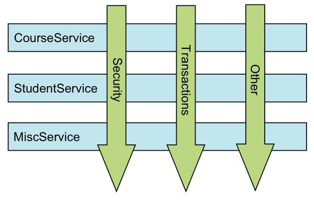
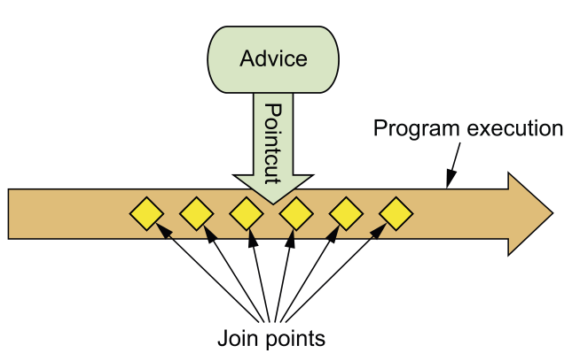
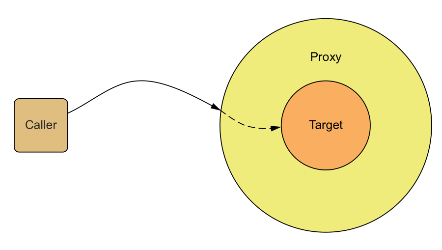
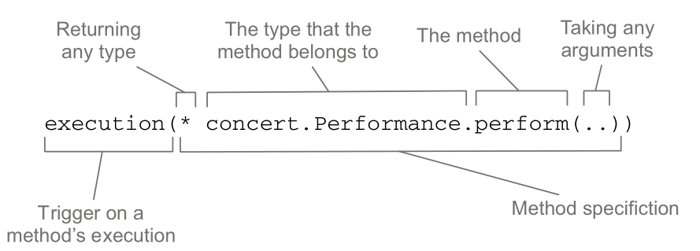
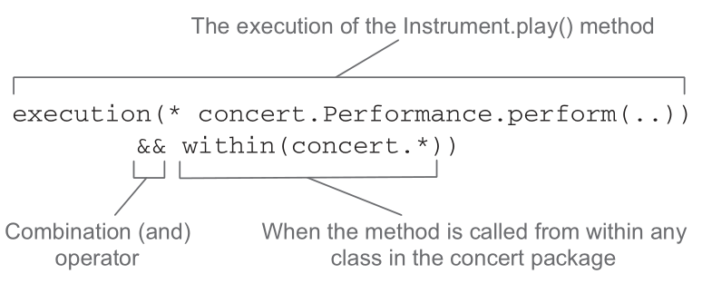
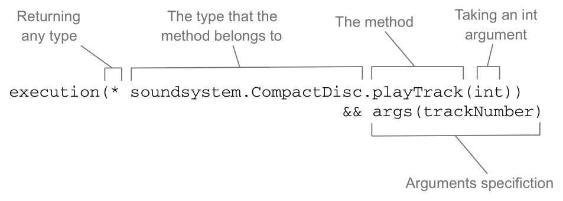
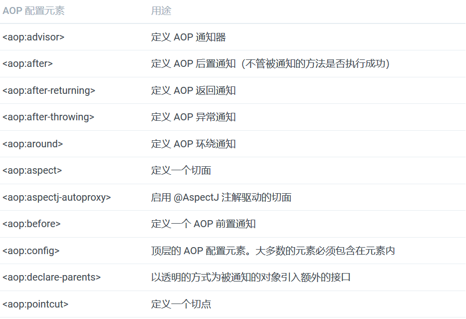

# 面向切面的 Spring

散布于应用中多处的功能被称为横切关注点（crosscutting concern）。

横切关注点从概念上是与应用的业务逻辑相分离的。

DI 有助于应用对象之间的解耦，而 AOP 可以实现横切关注点与它们所影响的对象之间的解耦。

## 什么是面向切面编程



切面能帮助我们模块化横切关注点。横切关注点可以被描述为影响应用多处的功能。每个模块的核心功能都是为特定业务领域提供服务，但是这些模块都需要类似的辅助功能，例如安全和事务管理。

切面提供了取代继承和委托的另一种可选方案，

在使用面向切面编程时，我们仍然在一个地方定义通用功能，但是可以通过声明的方式定义这个功能要以何种方式在何处应用，而无需修改受影响的类。横切关注点可以被模块化为特殊的类，这些类被称为切面（aspect）。

好处：

* 每个关注点都集中于一个地方，而不是分散到多处代码中；
* 服务模块更简洁，因为它们只包含主要关注点（或核心功能）的代码，而次要关注点的代码被转移到切面中了。

### 定义 AOP 术语



1. 通知（Advice）

   切面的工作被称为通知。

   通知定义了切面是什么以及何时使用。除了描述切面要完成的工作，通知还解决了何时执行这个工作的问题。它应该应用在某个方法被调用之前？之后？之前和之后都调用？还是只在方法抛出异常时调用？

   Spring 切面可以应用 5 种类型的通知：

   1. 前置通知（Before）：在目标方法被调用之前调用通知功能；
   2. 后置通知（After）：在目标方法完成之后调用通知，此时不会关心方法的输出是什么；
   3. 返回通知（After-returning）：在目标方法成功执行之后调用通 知；
   4. 异常通知（After-throwing）：在目标方法抛出异常后调用通知；
   5. 环绕通知（Around）：通知包裹了被通知的方法，在被通知的方法调用之前和调用之后执行自定义的行为。

2. 连接点（Join point）

   连接点是在应用执行过程中能够插入切面的一个点。这个点可以是调用方法时、抛出异常时、甚至修改一个字段时。切面代码可以利用这些点插入到应用的正常流程之中，并添加新的行为。

3. 切点（Poincut）

   切点的定义会匹配通知所要织入的一个或多个连接点。我们通常使用明确的类和方法名称，或是利用正则表达式定义所匹配的类和方法名称来指定这些切点。有些 AOP 框架允许我们创建动态的切点，可以根据运行时的决策（比如方法的参数值）来决定是否应用通知。

4. 切面（Aspect）

   切面是通知和切点的结合。通知和切点共同定义了切面的全部内容 —— 它是什么，在何时和何处完成其功能。

5. 引入（Introduction）

   引入允许我们向现有的类添加新方法或属性。

6. 织入（Weaving）

   织入是把切面应用到目标对象并创建新的代理对象的过程。

### Spring 对 AOP 的支持

Spring 提供了 4 种类型的 AOP 支持：

1. 基于代理的经典 Spring AOP；
2. 纯 POJO 切面；
3. @AspectJ 注解驱动的切面；
4. 注入式 AspectJ 切面（适用于 Spring 各版本）。

Spring在运行时通知对象：通过在代理类中包裹切面，Spring 在运行期把切面织入到 Spring 管理的 bean 中。



Spring 只支持方法级别的连接点！

## 通过切点来选择连接点

Spring AOP 所支持的 AspectJ 切点指示器：

1. arg()：限制连接点匹配参数为指定类型的执行方法
2. @args()：限制连接点匹配参数由指定注解标注的执行方法
3. execution()：用于匹配是连接点的执行方法
4. this()：限制连接点匹配AOP代理的bean引用为指定类型的类
5. target：限制连接点匹配目标对象为指定类型的类
6. @target()：限制连接点匹配特定的执行对象，这些对象对应的类要具有指定类 型的注解
7. within()：限制连接点匹配指定的类型
8. @within()：限制连接点匹配指定注解所标注的类型（当使用Spring AOP时，方 法定义在由指定的注解所标注的类里）
9. @annotation：限定匹配带有指定注解的连接点

### 编写切点

定义一个 Performance 接口：

```java
package concert;

public interface Performance {
  public void perform();
}
```

设置一个切点表达式，这个表达式能够设置当 perform() 方法执行时触发通知的调用：



假设需要配置的切点仅匹配 concert 包，可以使用 within() 指示器来限制匹配：



因为 "&" 在 XML 中有特殊含义，在 Spring 的 XML 配置里面描述切点时，可以使用 and 来代替 "&&"。同样，or 和 not 可以分别用来代替 "||" 和 "!"。

### 在切点中选择 bean

Spring 还引入了一个新的 bean() 指示器，它允许我们在切点表达式中使用 bean 的 ID 来标识 bean。bean() 使用 bean ID 或 bean 名称作为参数来限制切点只匹配特定的 bean。

`execution(* concert.Performance.perform()) and bean('woodstock')`

## 使用注解创建切面

### 定义切面

观众类Audience：

```java
package concert;

import org.aspect.lang.annotation.AfterReturning;
import org.aspect.lang.annotation.AfterThrowing;
import org.aspect.lang.annotation.Aspect;
import org.aspect.lang.annotation.Before;

@Aspect
public class Audience {

  @Before("execution(** concert.Performance.perform(..))")
  public void silenceCellPhones() {
    System.out.println("Silencing cell phones");
  }
  
  @Before("execution(** concert.Performance.perform(..))")
  public void takeSeats() {
    System.out.println("Taking seats");
  }
  
  @AfterReturning("execution(** concert.Performance.perform(..))")
  public void applause() {
    System.out.println("CLAP CLAP CLAP!!!");
  }
  
  @AfterThrowing("execution(** concert.Performance.perform(..))")
  public void demandRefund() {
    System.out.println("Demanding a refund");
  }
}
```

AspectJ 提供了五个注解来定义通知:

1. `@After`：通知方法会在目标方法返回或抛出异常后调用
2. `@AfterReturning`：通知方法会在目标方法返回后调用
3. `@AfterThrowing`：通知方法会在目标方法抛出异常后调用
4. `@Around`：通知方法会将目标方法封装起来
5. `@Before`：通知方法会在目标方法调用之前执行

@Pointcut 注解能够在一个 @AspectJ 切面内定义可重用的切点：

```java
package concert;

import org.aspect.lang.annotation.AfterReturning;
import org.aspect.lang.annotation.AfterThrowing;
import org.aspect.lang.annotation.Aspect;
import org.aspect.lang.annotation.Before;
import org.aspect.lang.annotation.Pointcut;

@Aspect
public class Audience {

  @Pointcut("execution(** concert.Performance.perform(..))")
  public void performce() { }

  @Before("performce()")
  public void silenceCellPhones() {
    System.out.println("Silencing cell phones");
  }
  
  @Before("performce()")
  public void takeSeats() {
    System.out.println("Taking seats");
  }
  
  @AfterReturning("performce()")
  public void applause() {
    System.out.println("CLAP CLAP CLAP!!!");
  }
  
  @AfterThrowing("performce()")
  public void demandRefund() {
    System.out.println("Demanding a refund");
  }
}
```

JavaConfig的话，使用 EnableAspectJAutoProxy 注解启用自动代理功能。

```java
package concert;

import org.springframework.context.annotation.Bean;
import org.springframework.context.annotation.Component;
import org.springframework.context.annotation.Configuration;
import org.springframework.context.annotation.EnableAspectJAutoProxy;

@Configuration
@EnableAspectJAutoProxy
@Component
public class ConcertConfig {

  @Bean
  public Audience audience() {
    return new Audience();
  }
}
```

XML需要使用 Spring aop 命名空间中的` <aop:aspectj-autoproxy>` 元素。

```java
<?xml version="1.0" encoding="UTF-8"?>
<beans xmlns="http://www.springframework.org/schema/beans"
  xmlns:xsi="http://www.w3.org/2001/XMLSchema-instance"
  xmlns:context="http://www.springframework.org/schema/context"
  xmlns:context="http://www.springframework.org/schema/aop"
  xsi:schemaLocation="
    http://www.springframework.org/schema/aop
    http://www.springframework.org/schema/aop/spring-aop.xsd
    http://www.springframework.org/schema/beans 
    http://www.springframework.org/schema/beans/spring-beans.xsd
    http://www.springframework.org/schema/context
    http://www.springframework.org/schema/context/spring-context.xsd" >
  
  <context:component-scan base-package="context" />
  
  <aop:aspectj-autoproxy />
  
  <bean class="concert.Audience" />

</beans>
```

### 创建环绕通知

环绕通知是最为强大的通知类型。它能够让你所编写的逻辑将被通知的目标方法完全包装起来。实际上就像在一个通知方法中同时编写前置通知和后置通知。

```java
package concert;

import org.aspect.lang.annotation.ProceedingJoinPoint;
import org.aspect.lang.annotation.Around;
import org.aspect.lang.annotation.Aspect;
import org.aspect.lang.annotation.Pointcut;

@Aspect
public class Audience {

  @Pointcut("execution(** concert.Performance.perform(..))")
  public void performce() { }

  @Around("performce()")
  public void watchPerformance(ProceedingJoinPoint jp) {
    try {
      System.out.println("Silencing cell phones");
      System.out.println("Taking seats");
      jp.procee();
      System.out.println("CLAP CLAP CLAP!!!");
    } catch (Throwable e) {
      System.out.println("Demanding a refund");
    }
  }
}
```

@Around 注解表明 watchPerformance() 方法会作为 performance() 切点的环绕通知。

### 处理通知中的参数

利用BlankDisc 样例，假设你想记录每个磁道被播放的次数。一种方法就是修改 playTrack() 方法，直接在每次调用的时候记录这个数量。但是，记录磁道的播放次数与播放本身是不同的关注点，因此不应该属于 playTrack() 方法。看起来，这应该是切面要完成的任务。

为了记录每个磁道所播放的次数，我们创建了 TrackCounter 类，它是通知 playTrack() 方法的一个切面。下面的程序清单展示了这个切面，使用参数化的通知来记录磁道播放的次数。

```java
package soundsystem;

import java.util.HashMap;
import java.util.Map;
import org.aspect.lang.annotation.Aspect;
import org.aspect.lang.annotation.Before;
import org.aspect.lang.annotation.Pointcut;

@Aspect
public class TrackCounter {

  private Map<Integer, Integer> trackCounts = new HashMap<>();
  
  @Pointcut("execution(* soundsystem.CompactDisc.playTrack(int) " +
            "&& args(trackNumber)")
  public void trackPlayed(int trackNumber) { }

  @Before("trackPlayed(trackNumber)")
  public void countTrack(int trackNumber) {
    int currentCount = getPlayCount(trackNumber);
    trackCounts.put(trackNumber, currentCount + 1);
  }
  
  public int getPlayCount(int trackNumber) {
    return trackCounts.containsKey(trackNumber) ? trackCounts.get(trackNumber) : 0;
  }
}
```



 args(trackNumber) 限定符：它表明传递给 playTrack() 方法的 int 类型参数也会传递到通知中去。

### 通过注解引入新功能

假设为所有的Performance 实现引入下面的 Encoreable 接口：

```java
package concert;

public interface Encoreable {
  void performEncore();
}
```

借助于 AOP 的引入功能，可以不必在设计上妥协或者侵入性地改变现有的实现。为了实现该功能，要创建一个新的切面：

```java
package concert;

import org.aspectj.lang.annotation.Aspect;
import org.aspectj.lang.annotation.DeclareParents;

@Aspect
public class EncodeableIntroducer {

  @DeclareParents(value="concert.Performce+",
                  defaultImpl=DefaultEncoreable.class)
  public static Encoreable encoreable;
}
```

通过 @DeclareParents 注解，将 Encoreable 接口引入到 Performance bean 中.

@DeclareParents 注解由三部分组成：

- value 属性指定了哪种类型的 bean 要引入该接口。
- defaultImpl 属性指定了为引入功能提供实现的类。
- @DeclareParents 注解所标注的静态属性指明了要引入了接口。

和其他的切面一样，需要在 Spring 应用中将 EncoreableIntroducer 声明为一个 bean：

```xml
<bean class="concert.EncoreableIntroducer" />
```

## 在 XML 中声明切面

在 Spring 的 aop 命名空间中，提供了多个元素用来在 XML 中声明切面：



具体配置略；

## 注入 AspectJ 切面

为上面的演出创建一个新切面。具体来讲，以切面的方式创建一个评论员的角色，他会观看演出并且会在演出之后提供一些批评意见。下面的 CriticAspect 就是一个这样的切面：

```java
package concert;

public aspect CriticAspect {
  
  public CriticApect() { }
  
  pointcut performance() : execution(* perform(..));
  
  afterReturning() : performance() {
    System.out.println(criticismEngine.getCriticism());
  }
  
  private CriticismEngine criticismEngine;
  
  public void setCriticismEngine(CritisicismEngine criticismEngine) {
    this.criticismEngine = criticismEngine;
  }
}
```

CriticAspect 的主要职责是在表演结束后为表演发表评论。上述程序中的 performance() 切点匹配 perform() 方法。当它与 afterReturning() 通知一起配合使用时，我们可以让该切面在表演结束时起作用。

CriticismEngine 自身是声明了一个简单 getCriticism() 方法的接口。CriticismEngine 的实现:

```java
package com.springinaction.springidol;

public class CriticiamEngineImpl implements CriticismEngine {

  public CriticismEngine() { }
  
  public String getCriticism() {
    int i = (int) (Math.random() * criticismPool.length);
    return criticismPool[i];
  }
  
  // injected
  private String[] criticismPool;
  
  public void setCriticismPool(String[] criticismPool) {
    this.criticismPool = criticismPool;
  }
}
```

XM配置

```xml
<bean id="criticismEngine" 
      class="com.springination.springidol.CriticismEngineImpl" >
  <property name="criticisms" >
    <list>
      <value>Worst performance ever!</value>
      <value>I laughed, I cried, then I realized I was at the wrong show.</value>
      <value>A must see show!</value>
    </list>
  </property>
</bean>

<bean class="com.springinaction.springidol.CriticAspect"
      factory-method="aspectOf" >
  <property name="criticismEngine" ref="criticismEngine" />
</bean>
```

