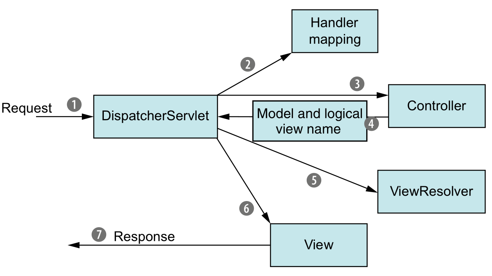

# 构建 Spring Web 应用程序

## Spring MVC 起步

Spring MVC 基于模型-视图-控制器（Model-View-Controller，MVC）模式实现；

### 跟踪 Spring MVC 的请求

流程：



DispatcherServlet的任务是将请求发送给 Spring MVC 控制器 （controller）。控制器是一个用于处理请求的 Spring 组件。在典型的应用程序中可能会有多个控制器，DispatcherServlet 需要知道应该将请求发送给哪个控制器。所以 DispatcherServlet 以会查询一个或多个处理器映射（handler mapping） 来确定请求的下一站在哪里。处理器映射会根据请求所携带的 URL 信息来进行决策。

一旦选择了合适的控制器，DispatcherServlet 会将请求发送给选中的控制器。到了控制器，请求会卸下其负载（用户提交的信息）并耐心等待控制器处理这些信息。

控制器在完成逻辑处理后，通常会产生一些信息，这些信息需要返回给用户并在浏览器上显示。这些信息被称为模型（model）。

### 搭建 Spring MVC

搭建Spring MVC首先需要配置DispatcherServlet，DispatcherServlet 是 Spring MVC 的核心。

DispatcherServlet配置（以[spittr项目](https://github.com/chun98/springinaction/tree/master/chapter05)为例）：

```java
package spittr.config;

import org.springframework.web.servlet.support.AbstractAnnotationConfigDispatcherServletInitializer;

public class SpitterWebInitializer extends AbstractAnnotationConfigDispatcherServletInitializer {

  @Override
  protected String[] getServletMappings() {
    return new String[] { "/" };
  }
  
  @Override
  protected Class<?>[] getRootConfigClasses() {
    return new Class<?>[] { RootConfig.class };
  }

  @Override
  protected Class<?>[] getServletConfigClasses() {
    return new Class<?>[] { WebConfig.class };
  }

}
```

扩展 AbstractAnnotationConfigDispatcherServletInitializer 的任意类都会自动地配置 DispatcherServlet 和 Spring 应用上下文，Spring 的应用上下文会位于应用程序的 Servlet 上下文之中。

**启用 Spring MVC**

```java
package spittr.web;

@Configuration
@EnableWebMvc
@ComponentScan("spittr.web")
public class WebConfig extends WebMvcConfigurerAdapter {

  @Bean
  public ViewResolver viewResolver() {
    InternalResourceViewResolver resolver = new InternalResourceViewResolver();
    resolver.setPrefix("/WEB-INF/views/");
    resolver.setSuffix(".jsp");
    return resolver;
  }
  
  @Override
  public void configureDefaultServletHandling(DefaultServletHandlerConfigurer configurer) {
    configurer.enable();
  }
}
```

@ComponentScan 注解会扫描 spitter.web 包来查找组件。spitter.web里面包含所编写的控制器；

添加的 ViewResolver bean会在查找JSP 文件等资源文件时，会在视图名称上加一个特定的前缀和后缀

 **RootConfig**：

```java
package spittr.config;

@Configuration
@ComponentScan(basePackages={"spittr"}, 
    excludeFilters={
        @Filter(type=FilterType.ANNOTATION, value=EnableWebMvc.class)
    })
public class RootConfig {
}
```

## 编写基本的控制器

控制器只是方法上添加了 **@RequestMapping** 注解的类，这个注解声明了它们所要处理的请求。 value 属性指定了这个方法所要处理的请求路径，method 属性细化了它所处理的 HTTP 方法。

**@Controller** 注解是用来声明控制器的`

```java
package spittr.web;

@Controller
public class HomeController {

  @RequestMapping(value="/", method = GET)
  public String home(Model model) {
    return "home";
  }

}
```

### 测试控制器

Spring 包含了一种 mock Spring MVC 并针对控制器执行 HTTP 请求的机制。

```java
package spittr.web;

import static org.springframework.test.web.servlet.request.MockMvcRequestBuilders.*;
import static org.springframework.test.web.servlet.result.MockMvcResultMatchers.*;
import static org.springframework.test.web.servlet.setup.MockMvcBuilders.*;

import org.junit.Test;
import org.springframework.test.web.servlet.MockMvc;

import spittr.web.HomeController;

public class HomeControllerTest {

  @Test
  public void testHomePage() throws Exception {
    HomeController controller = new HomeController();
    MockMvc mockMvc = standaloneSetup(controller).build();
    mockMvc.perform(get("/"))
           .andExpect(view().name("home"));
  }

}
```

它首先传递一个 HomeController 实例到 MockMvcBuilders.standaloneSetup() 并调用 build() 来构建 MockMvc 实例。然后它使用 MockMvc 实例来执行针对 `/` 的 GET 请求并设置期望得到的视图名称。

### 定义类级别的请求处理

```java
package spittr.web;

import static org.springframework.web.bind.annotation.RequestMethod.*;

import org.springframework.stereotype.Controller;
import org.springframework.ui.Model;
import org.springframework.web.bind.annotation.RequestMapping;

@Controller
@RequestMapping("/")
public class HomeController {

  @RequestMapping(method = GET)
  public String home(Model model) {
    return "home";
  }

}
```

路径现在被转移到类级别的  @Request-Mapping 上，而 HTTP 方法依然映射在方法级别上。当控制器在类级别上添加@RequestMapping 注解时，这个注解会应用到控制器的所有处理器方法上。处理器方法上的 @RequestMapping 注解会对类级别上的 @RequestMapping 的声明进行补充。

### 传递模型数据到视图中

定义模型：

```java
package spittr;

import java.util.Date;

import org.apache.commons.lang3.builder.EqualsBuilder;
import org.apache.commons.lang3.builder.HashCodeBuilder;

public class Spittle {

  private final Long id;
  private final String message;
  private final Date time;
  private Double latitude;
  private Double longitude;

  public Spittle(String message, Date time) {
    this(null, message, time, null, null);
  }
  
  public Spittle(Long id, String message, Date time, Double longitude, Double latitude) {
    this.id = id;
    this.message = message;
    this.time = time;
    this.longitude = longitude;
    this.latitude = latitude;
  }

  public long getId() {
    return id;
  }

  public String getMessage() {
    return message;
  }

  public Date getTime() {
    return time;
  }
  
  public Double getLongitude() {
    return longitude;
  }
  
  public Double getLatitude() {
    return latitude;
  }
  
  @Override
  public boolean equals(Object that) {
    return EqualsBuilder.reflectionEquals(this, that, "id", "time");
  }
  
  @Override
  public int hashCode() {
    return HashCodeBuilder.reflectionHashCode(this, "id", "time");
  }
  
}
```

定义一个数据访问的 Repository，为了实现解耦以及避免陷入数据库访问的细节之中，将 Repository 定义为一个接口，并在稍后实现它：

```java
package spittr.data;

import java.util.List;
import spittr.Spittle;

public interface SpittleRepository {

  List<Spittle> findSpittles(long max, int count);

}
```

SpittleController

```java
package spittr.web;

import java.util.List;

import org.springframework.beans.factory.annotation.Autowired;
import org.springframework.stereotype.Controller;
import org.springframework.web.bind.annotation.RequestMapping;
import org.springframework.web.bind.annotation.RequestMethod;

import spittr.Spittle;
import spittr.data.SpittleRepository;

@Controller
@RequestMapping("/spittles")
public class SpittleController {
  
  private SpittleRepository spittleRepository;

  @Autowired
  public SpittleController(SpittleRepository spittleRepository) {
    this.spittleRepository = spittleRepository;
  }

  @RequestMapping(method=RequestMethod.GET)
  public String spittles(Model model) {
    model.addAttribute(
      spittleRepository.findSpittles(Long.MAX_VALUE, 20)
    );
    return "spittles";
  }
  
}
```

SpittleController 有一个构造器，这个构造器使用了 @Autowired 注解，用来注入 SpittleRepository。这个 SpittleRepository 随后又用在 spittles() 方法中，用来获取最新的 spittle 列表。

Model 实际上就是一个 Map（也就是 key-value 对的集合），它会传递给视图，这样数据就能渲染到客户端了。当调用 addAttribute() 方法并且不指定 key 的时候，那么 key 会根据值的对象类型推断确定。

spittles() 方法所做的最后一件事是返回 spittles 作为视图的名字，这个视图会渲染模型。

## 接受请求的输入

### 处理查询参数

使用**@RequestParam**获取查询参数，default-Value 属性指定默认值：

```java
@RequestMapping(method=RequestMethod.GET)
public List<Spittle> spittles(
  @RequestParam(value="max", defaultValue=MAX_LONG_AS_STRING) long max,
  @RequestParam(value="count", defaultValue="20") int count) {
    return spittleRepository.findSpittles(max, count);
}
```

### 通过路径参数接受输入

使用**@PathVariable**返回路径参数

```java
@RequestMapping(value="/{spittleId}", method=RequestMethod.GET)
public String spittle(@PathVariable long spittleId, Model model) {
  model.addAttribute(spittleRepository.findOne(spittleId));
  return "spittle";
}
```

## 处理表单

```java
package spittr.web;

import static org.springframework.web.bind.annotation.RequestMethod.*;

import org.springframework.beans.factory.annotation.Autowired;
import org.springframework.stereotype.Controller;
import org.springframework.ui.Model;
import org.springframework.validation.Errors;
import org.springframework.web.bind.annotation.PathVariable;
import org.springframework.web.bind.annotation.RequestMapping;

import spittr.Spitter;
import spittr.data.SpitterRepository;

@Controller
@RequestMapping("/spitter")
public class SpitterController {

  private SpitterRepository spitterRepository;

  @Autowired
  public SpitterController(SpitterRepository spitterRepository) {
    this.spitterRepository = spitterRepository;
  }
  
  @RequestMapping(value="/register", method=GET)
  public String showRegistrationForm() {
    return "registerForm";
  }
  
  @RequestMapping(value="/register", method=POST)
  public String processRegistration(Spitter spitter) {    
    spitterRepository.save(spitter);
    return "redirect:/spitter/" + spitter.getUsername();
  }
  
}
```

### 校验表单

Java 校验 API 定义了多个注解，这些注解可以放到属性上，从而限制这些属性的值。所有的注解都位于 javax.validation.constraints 包中。

例子：

```java
package spittr;

import javax.validation.constraints.NotNull;
import javax.validation.constraints.Size;

import org.apache.commons.lang3.builder.EqualsBuilder;
import org.apache.commons.lang3.builder.HashCodeBuilder;

public class Spitter {

  private Long id;
  
  @NotNull
  @Size(min=5, max=16)
  private String username;

  @NotNull
  @Size(min=5, max=25)
  private String password;
  
  @NotNull
  @Size(min=2, max=30)
  private String firstName;

  @NotNull
  @Size(min=2, max=30)
  private String lastName;
  
  ...
}
```

