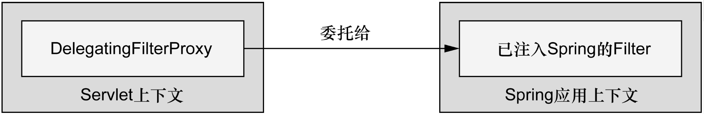

# 保护 Web 应用

## Spring Security 简介

### 理解 Spring Security 的模块

Spring Security 有11个模块：

| 模块                     | 描述                                                         |
| ------------------------ | ------------------------------------------------------------ |
| ACL                      | 支持通过访问控制列表（access control list，ACL）为域对象提供安全性 |
| 切面（Aspects）          | 一个很小的模块，当使用 Spring Security 注解时，会使用基于 AspectJ 的切面，而不是使用标准的 Spring AOP |
| CAS客户端 （CAS Client） | 提供与Jasig 的中心认证服务（Central Authentication Service， CAS）进行集成的功能 |
| 配置 （Configuration）   | 包含通过 XML 和 Java 配置 Spring Security 的功能支持核心（Core） 提供 Spring Security基本库 |
| 加密 （Cryptography）    | 提供了加密和密码编码的功能                                   |
| LDAP                     | 支持基于 LDAP 进行认证                                       |
| OpenID                   | 支持使用 OpenID 进行集中式认证                               |
| Remoting                 | 提供了对 Spring Remoting 的支持                              |
| 标签库（Tag Library）    | Spring Security 的 JSP 标签库                                |
| Web                      | 提供了 Spring Security 基于 Filter 的 Web 安全性支持         |

### 过滤 Web 请求

Spring Security 借助一系列 Servlet Filter 来提供各种安全性功能。

DelegatingFilterProxy 是一个特殊的 Servlet Filter，它本身所做的工作并不多。只是将工作委托给一个 javax.servlet.Filter 实现类，这个实现类作为一个注册在 Spring 应用的上下文中



Java配置方式：

```java
import org.springframwork.security.web.context.AbstractSecurityWebApplicationInitializer;

public class SecurityWebInitializer extends AbstractSecurityWebApplicationInitializer{
}
```

AbstractSecurityWebApplicationInitializer 实现了 WebApplicationInitializer，因此 Spring 会发现它，并用它在 Web 容器中注册 DelegatingFilterProxy。尽管我们可以重载它的 appendFilters() 或 insertFilters() 方法来注册自己选择的 Filter，但是要注册 DelegatingFilterProxy 的话，我们并不需要重载任何方法。

配置完成后，它会拦截发往应用中的请求，并将请求委托给 ID 为 springSecurityFilterChain bean。springSecurityFilterChain 本身是另一个特殊的 Filter，它也被称为FilterChain-Proxy。它可以链接任意一个或多个其他的 Filter。Spring Security 依赖一系列 Servlet Filter 来提供不同的安全特性。

### 编写简单的安全性配置

启用 Web 安全性功能的最简单配置

```
@Configuration
@EnableWebSecurity
public class SecurityConfig extends WebSecurityConfigurerAdapter {
}
```

@EnableWebSecurity 注解将会启用 Web 安全功能。

如果是使用 Spring MVC 开发的，那么就应该考虑使用 @EnableWeb-MvcSecurity 替代;

通过重载 WebSecurityConfigurerAdapter 的三个 configure() 方法来配置 Web 安全性

| 方法                                    | 描述                                        |
| --------------------------------------- | ------------------------------------------- |
| configure(WebSecurity)                  | 通过重载，配置 Spring Security 的 Filter 链 |
| configure(HttpSecurity)                 | 通过重载，配置如何通过拦截器保护请求        |
| configure(AuthenticationManagerBuilder) | 通过重载，配置 user-detail 服务             |

默认的 configure(HttpSecurity) 实际上等同于如下所示：

```java
protected void configure(HttpSecurity http) throws Exception {
  http
    .authorizeRequests()
    .anyRequest().authorized()
    .and()
    .formLogin()
    .and()
    .httpBasic();
}
```

这个简单的默认配置指定了该如何保护 HTTP 请求，以及客户端认证用户的方案。通过调用 authorizeRequests() 和 anyRequest().authenticated() 就会要求所有进入应用的 HTTP 请求都要进行认证。它也配置 Spring Security 支持基于表单的登录以及 HTTP Basic 方式的认证。

## 选择查询用户详细信息的服务

### 使用基于内存的用户存储

```java
@Configuration
@EnableWebMvcSecurity
public class SecurityConfig extends WebSecurityConfigurerAdapter {
  
  @Override
  protected void configure(AuthenticationManagerBuilder auth) throws Exception {
    auth
      .inMemoryAuthentication()
      .withUser("user").password("password").roles("USER");
  }
}
```

通过简单地调用 inMemoryAuthentication() 就能启用内存用户存储。

调用 withUser() 方法为内存用户存储添加新的用户，这个方法的参数是 username。withUser() 方法返回的是UserDetailsManager-Configurer.UserDetailsBuilder，这个对象提供了多个进一步配置用户的方法，包括设置用户密码的 password() 方法以及为给定用户授予一个或多个角色权限的 roles() 方法。

roles() 方法是 authorities() 方法的简写形式。roles() 方法所给定的值都会添加一个“ROLE_”前缀，并将其作为权限授予给用户。

### 基于数据库表进行认证

用户数据通常会存储在关系型数据库中，并通过 JDBC 进行访问。为了配置 Spring Security 使用以 JDBC 为支撑的用户存储，可以使用 jdbc-Authentication() 方法，所需的最少配置如下所示：

```java
@Autowired
	DataSource dataSource;
@Override
protected void configure(AuthenticationManagerBuilder auth) throws Exception {
  auth
    .jdbcAuthentication()
    .dataSource(dataSource);
}
```

通过调用`usersByUsernameQuery(SQL语句)和authoritiesByUsernameQuery(SQL语句)`进行验证

使用转码后的密码可指定密码转码器：`.passwordEncoder(new StandardPasswordEnconder("123456"));`

**passwordEncoder()** 方法可以接受 Spring Security 中 PasswordEncoder 接口的任意实现。Spring Security 的加密模块包括 了三个这样的实现：BCryptPasswordEncoder、NoOpPasswordEncoder 和  StandardPasswordEncoder。

### 基于 LDAP 进行认证

可以使用 ldapAuthentication() 方法。这个方法在功能上类似于 jdbcAuthentication()，只不过是 LDAP 版本。如下的 configure() 方法展现了 LDAP 认证的简单配置：

```java
@Override
protected void configure(AuthenticationManagerBuilder auth) throws Exception {
  auth
    .ldapAuthentication()
    .userSearchFilter("{uid={0}}")
    .groupSearchFilter("member={0}");
}
```

方法 userSearchFilter() 和 groupSearchFilter() 用来为基础 LDAP 查询提供过滤条件，它们分别用于搜索用户和组。默认情况下，对于用户和组的基础查询都是空的，也就是表明搜索会在 LDAP 层级结构的根开始。但是可以通过指定查询基础来改变这个默认行为：

```java
@Override
protected void configure(AuthenticationManagerBuilder auth) throws Exception {
  auth
    .ldapAuthentication()
    .userSearchBase("ou=people");
    .userSearchFilter("{uid={0}}")
    .groupSearchBase("ou=groups");
    .groupSearchFilter("member={0}");
}
```

**配置密码比对**

基于 LDAP 进行认证的默认策略是进行绑定操作，直接通过 LDAP 服务器认证用户。另一种可选的方式是进行比对操作。这涉及将输入的密码发送到 LDAP 目录上，并要求服务器将这个密码和用户的密码进行比对。因为比对是在 LDAP 服务器内完成的，实际的密码能保持私密。 如果你希望通过密码比对进行认证，可以通过声明 passwordCompare() 方法来实现：

```java
@Override
protected void configure(AuthenticationManagerBuilder auth) throws Exception {
  auth
    .ldapAuthentication()
    .userSearchBase("ou=people");
    .userSearchFilter("{uid={0}}")
    .groupSearchBase("ou=groups");
    .groupSearchFilter("member={0}")
    .passwordCompare();
}
```

默认情况下，在登录表单中提供的密码将会与用户的 LDAP 条目中的 userPassword 属性进行比对。如果密码被保存在不同的属性中，可以通过 passwordAttribute() 方法来声明密码属性的名称：

```java
@Override
protected void configure(AuthenticationManagerBuilder auth) throws Exception {
  auth
    .ldapAuthentication()
    .userSearchBase("ou=people");
    .userSearchFilter("{uid={0}}")
    .groupSearchBase("ou=groups");
    .groupSearchFilter("member={0}")
    .passwordCompare()
    .passwordEncoder(new Md5PasswordEncoder())
    .passwordAttribute("passcode");
}
```

在本例中，指定了要与给定密码进行比对的是“passcode”属性。另外，还可以指定密码转码器。在进行服务器端密码比对时，有一点非常好，那就是实际的密码在服务器端是私密的。但是进行尝试的密码还是需要通过线路传输到 LDAP 服务器上，这可能会被黑客所拦截。为了避免这一点，我们可以通过调用 passwordEncoder() 方法指定加密策略。

### 配置自定义的用户服务

在这种情况下，需要提供一个自定义的 UserDetailsService 接口实现。 UserDetailsService 接口非常简单：

所需要做的就是实现 loadUserByUsername() 方法，根据给定的用户名来查找用户。loadUserByUsername() 方法会返回代表给定用户的 UserDetails 对象。

```java
public class SpitterUserService(SpitterRepository spitterRepository) {
  
  private final SpitterRepository spitterRepository;
  
  public SpitterUserService(SpitterRepository spitterRepository){
    this.spitterRepository = spitterRepository;
  }
  
  @Override
  public UserDetails loadUserByUsername(String username) throws UsernameNotFoundException {
    Spitter spitter = spitterRepository.findByUsername(username);
    if (spitter != null) {
      List<GrantedAuthority> authorities = new ArrayList<>();
      authorities.add(new SimpleGrantedAuthority("ROLE_SPITTER"));
    }
    
    return new User(
      spitter.getUsername(),
      spitter.getPassword(),
      authorities);
  }
  throw new UsernameNotFoundException(
    "User '" + username + "' not found.");
}
```

通过 userDetailsService() 方法将其设置到安全配置中：

```java
@Autowired
SpitterRepository spitterRepository;

@Override
protected void configure(AuthenticationManagerBuilder auth) throws Exception {
  auth
    .userDetailsService(new SpitterUserService(spitterRepository));
}
```

## 拦截请求

对每个请求进行细粒度安全性控制的关键在于重载 configure(HttpSecurity) 方法。如下的代码片段展现了重载的 configure(HttpSecurity) 方法，它为不同的 URL 路径有选择地应用安全性：

```java
@Override
protected void configure(HttpSecurity http) throws Exception {
  http
    .authorizeRequests()
    .antMatchers("/spitters/me").authenticated()
    .antMatchers(HttpMethod.POST, "/spittles").authenticated()
    .anyRequest().permitAll();
}
```

可以在配置中通过调用 csrf().disable() 禁用 Spring Security 的 CSRF 防护功能， 如下所示：

```java
@Override
protected void configure(HttpSecurity http) throws Exception {
  http
    ...
    .csrf()
    .disable();
}
```

禁用 CSRF 防护功能通常来讲并不是一个好主意。如果这样做的话，那么应用就会面临 CSRF 攻击的风险。